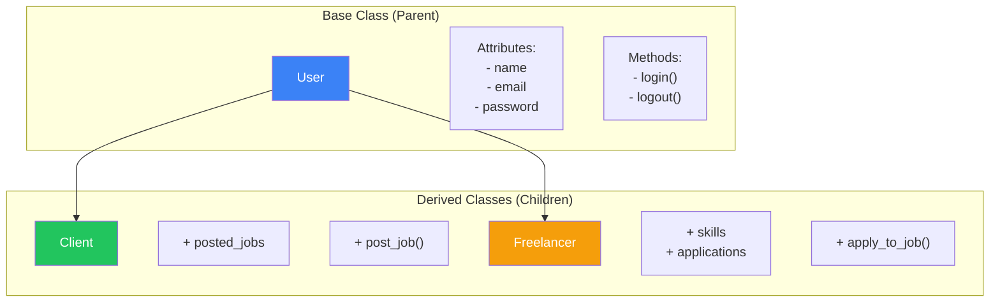
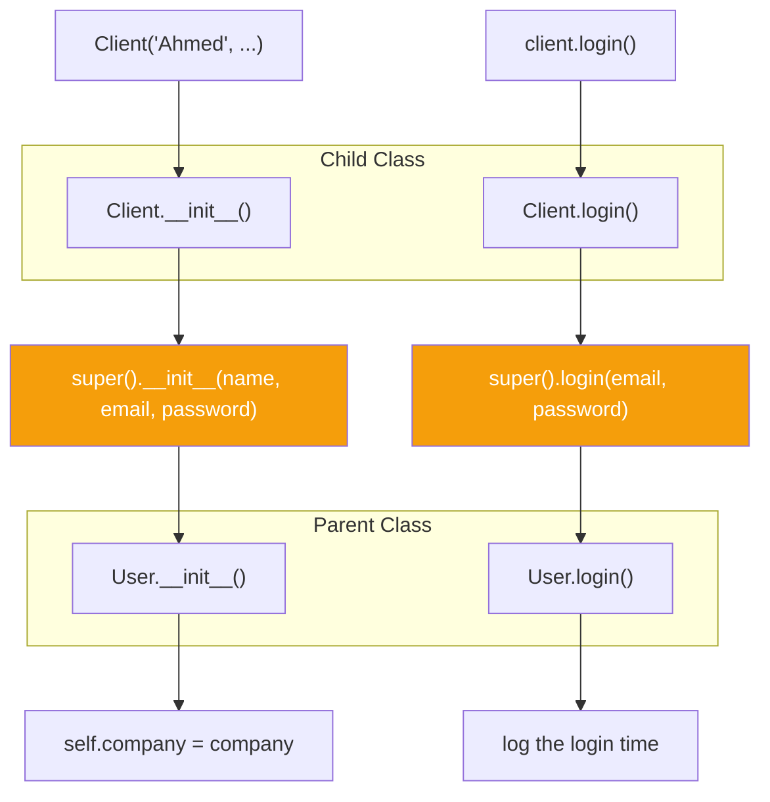
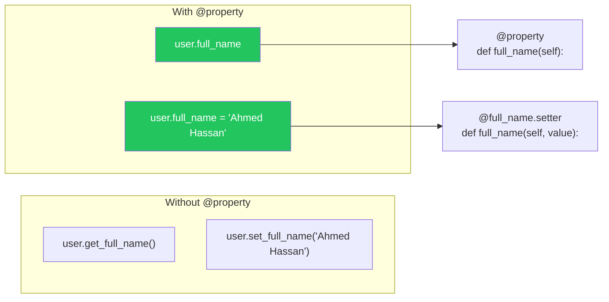
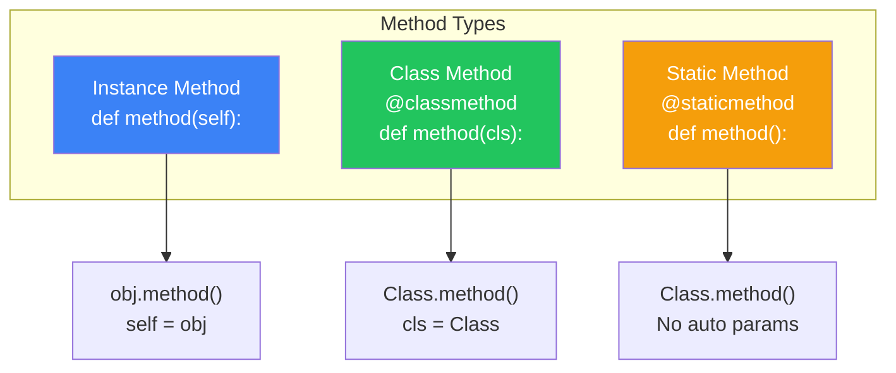

# الفصل صفر-ثمانية — OOP Advanced: الوراثة والـ Properties والـ Methods المتقدمة

> **المتطلبات:** [[07-OOP-Basics]] — لازم تكون فاهم Classes و Objects، `__init__` و `self`، Instance Methods، Class Attributes، و `__str__`/`__repr__`. الفصل ده هيبني فوقهم عشان يقدملك المفاهيم المتقدمة في OOP.

---

## البداية — مشكلة تكرار الكود بين الـ Classes

تخيّل معايا إنك بتبني نظام HireLink. عندك نوعين من المستخدمين: **Client** (بينشر وظايف) و **Freelancer** (بيقدم على وظايف). الاتنين عندهم `name`, `email`, `password`. الاتنين بيقدروا يسجلوا دخول.

الطريقة الساذجة: تعمل classين منفصلين:

```python
class Client:
    def __init__(self, name, email, password):
        self.name = name
        self.email = email
        self.password = password
        self.posted_jobs = []
    
    def login(self, email, password):
        return self.email == email and self.password == password
    
    def post_job(self, job):
        self.posted_jobs.append(job)

class Freelancer:
    def __init__(self, name, email, password):
        self.name = name
        self.email = email
        self.password = password
        self.skills = []
        self.applications = []
    
    def login(self, email, password):
        return self.email == email and self.password == password
    
    def apply_to_job(self, job):
        self.applications.append(job)
```

المشاكل:
1. **تكرار الكود:** `__init__` و `login` مكررين في الـ classين.
2. **صعوبة الصيانة:** لو عايز تغير طريقة الـ login (تضيف hashing مثلاً)، هتعدل في كل class.
3. **مفيش علاقة:** مفيش حاجة بتقول إن `Client` و `Freelancer` الاتنين `User`.

الحل: **Inheritance (الوراثة)**. بتعمل class أساسي (`User`) فيه كل الحاجات المشتركة، والـ classes التانية (`Client`, `Freelancer`) **ترث** منه.

النهارده هنتعلم Inheritance، Method Overriding، `super()`، `@property`، والـ Class Methods.

---

## [[01-Inheritance-Basics]] — الوراثة: إعادة استخدام الكود بشكل هرمي

### 🧠 الشرح النظري

**Inheritance (الوراثة)** هي آلية بتسمح لـ Class (اسمه **Child** أو **Subclass**) إنه **يرث** attributes و methods من Class تاني (اسمه **Parent** أو **Superclass**). الـ Child بيقدر يضيف attributes و methods جديدة، أو يعدل على اللي ورثها.

**التركيب:**
```python
class Parent:
    def parent_method(self):
        print("From parent")

class Child(Parent):  # Child inherits from Parent
    def child_method(self):
        print("From child")
```

**ليه الوراثة؟**
- **DRY (Don't Repeat Yourself):** الكود المشترك بيتكتب مرة واحدة في الـ Parent.
- **Extensibility:** تقدر تبني على الـ Parent من غير ما تلمسه.
- **Polymorphism:** تقدر تتعامل مع objects من classes مختلفة بنفس الطريقة (لأنهم كلهم من نفس الـ Parent).

**مصطلحات:**
- **Superclass / Parent / Base Class:** الـ class اللي بيرث منه.
- **Subclass / Child / Derived Class:** الـ class اللي بيعمل inherit.
- **IS-A Relationship:** `Client` IS-A `User`. `Freelancer` IS-A `User`.

تخيّل الوراثة زي **شجرة العائلة**:
- **Parent (User):** الصفات المشتركة بين كل أفراد العيلة (الاسم، لون العين).
- **Child (Client):** وارث الصفات المشتركة + عنده صفاته الخاصة (شركته، منصبه).
- **Child (Freelancer):** وارث الصفات المشتركة + عنده صفاته الخاصة (مهاراته، شهاداته).

### 📊 Visualization



### 💻 Micro-Example

```python
class User:
    def __init__(self, name, email, password):
        self.name = name
        self.email = email
        self.password = password
        self.is_active = True
    
    def login(self, email, password):
        if self.email == email and self.password == password:
            print(f"{self.name} logged in successfully.")
            return True
        print("Login failed.")
        return False
    
    def logout(self):
        print(f"{self.name} logged out.")

class Client(User):
    def __init__(self, name, email, password, company):
        super().__init__(name, email, password)  # Call parent's __init__
        self.company = company
        self.posted_jobs = []
    
    def post_job(self, title, budget):
        job = {"title": title, "budget": budget, "client": self.name}
        self.posted_jobs.append(job)
        print(f"Job '{title}' posted by {self.name} from {self.company}.")
        return job

class Freelancer(User):
    def __init__(self, name, email, password, skills=None):
        super().__init__(name, email, password)
        self.skills = skills or []
        self.applications = []
    
    def apply_to_job(self, job):
        self.applications.append(job)
        print(f"{self.name} applied to '{job['title']}'.")

client = Client("Ahmed", "ahmed@company.com", "pass123", "TechCorp")
freelancer = Freelancer("Sara", "sara@freelance.com", "pass456", ["Python", "Django"])

client.login("ahmed@company.com", "pass123")
job = client.post_job("Backend Developer", 5000)
freelancer.apply_to_job(job)
```
<details>
<summary><b>📋 مثال إضافي: حيوانات</b></summary>

```python
class Animal:
    def __init__(self, name):
        self.name = name
    
    def speak(self):
        pass  # Abstract method

class Dog(Animal):
    def speak(self):
        return f"{self.name} says Woof!"

class Cat(Animal):
    def speak(self):
        return f"{self.name} says Meow!"

animals = [Dog("Rex"), Cat("Whiskers"), Dog("Buddy")]
for animal in animals:
    print(animal.speak())
```
</details>

---

## [[02-Method-Overriding-And-Super]] — تعديل السلوك: Override و `super()`

### 🧠 الشرح النظري

الـ Child class مش بس بيرث من الـ Parent — ده كمان يقدر **يعدل** على الـ methods اللي ورثها. ده اسمه **Method Overriding**.

**Method Overriding:**
لما تعرف method في الـ Child بنفس اسم method في الـ Parent، الـ Child method هي اللي هتتنادي (حتى لو اتنادت من reference نوعه Parent). ده بيسمحلك تخصص سلوك الـ Child.

**`super()`:**
كتير وأنت بتـ override method، هتحتاج تنادي الـ Parent method برضه (عشان تعمل الشغل الأساسي وبعدين تضيف عليه). `super()` بترجع reference للـ Parent class.

**الاستخدام الشائع:**
- **`__init__`:** `super().__init__(...)` — تخلي الـ Parent يعمل initialization للـ attributes الأساسية.
- **أي Method:** `super().method_name()` — تنادي نسخة الـ Parent من الـ method.

تخيّل Override زي **تعديل وصفة أكل**:
- **الوصفة الأصلية (Parent):** طريقة عمل البيتزا.
- **وصفة ابنك (Child override):** نفس الطريقة، لكن بتحط جبنة إضافية.
- **`super()`:** "اعمل البيتزا بالطريقة الأصلية الأول، وبعدين أنا هضيف الجبنة الإضافية".

### 📊 Visualization



### 💻 Micro-Example

```python
class User:
    def __init__(self, name, email):
        self.name = name
        self.email = email
        self.created_at = "2024-01-01"
    
    def get_info(self):
        return f"{self.name} ({self.email})"
    
    def login(self):
        print(f"{self.name} logged in.")
        return True

class Client(User):
    def __init__(self, name, email, company):
        super().__init__(name, email)  # Call parent __init__
        self.company = company
        self.vip_status = False
    
    def get_info(self):
        # Override and extend parent method
        base_info = super().get_info()
        return f"{base_info} - {self.company}"
    
    def login(self):
        # Override to add extra behavior
        result = super().login()  # Call parent login
        if result:
            print(f"Login recorded for client {self.name}")
        return result

class Admin(User):
    def __init__(self, name, email, access_level):
        super().__init__(name, email)
        self.access_level = access_level
    
    def get_info(self):
        return f"ADMIN: {super().get_info()} (Level {self.access_level})"

client = Client("Ahmed", "ahmed@corp.com", "TechCorp")
admin = Admin("Sara", "sara@admin.com", 5)

print(client.get_info())
print(admin.get_info())
client.login()
```
<details>
<summary><b>📋 مثال إضافي: أشكال هندسية</b></summary>

```python
class Shape:
    def __init__(self, color):
        self.color = color
    
    def area(self):
        return 0
    
    def describe(self):
        return f"A {self.color} shape with area {self.area():.2f}"

class Rectangle(Shape):
    def __init__(self, color, width, height):
        super().__init__(color)
        self.width = width
        self.height = height
    
    def area(self):
        return self.width * self.height

class Circle(Shape):
    def __init__(self, color, radius):
        super().__init__(color)
        self.radius = radius
    
    def area(self):
        return 3.14159 * self.radius ** 2

shapes = [
    Rectangle("red", 5, 3),
    Circle("blue", 4),
    Rectangle("green", 2, 8),
]

for shape in shapes:
    print(shape.describe())
```
</details>

---

## [[03-Property-Decorator]] — `@property`: Getters و Setters بالأسلوب الـ Pythonic

### 🧠 الشرح النظري

في لغات زي Java، بتعمل private attributes وبتوصل لها بـ getters و setters (`getName()`, `setName()`). Python بتقدم طريقة أنضف: **`@property`**.

**`@property`:**
بيخلي method تتصرف كأنها attribute. بدل ما تنادي `user.get_full_name()`، بتكتب `user.full_name`.

**`@name.setter`:**
بيخليك تتحكم في إزاي الـ attribute بيتحط. بيسمحلك تضيف validation أو logic.

**ليه نستخدم `@property`؟**
- **Clean API:** `user.full_name` أنضف من `user.get_full_name()`.
- **Encapsulation:** تقدر تخبي تفاصيل الحساب ورا attribute بسيط.
- **Validation:** تقدر تمنع قيم غير صحيحة من غير ما تعمل setter method منفصل.
- **Backward Compatibility:** لو بدأت بـ public attribute (`user.name`) وعايز تضيف validation بعدين، `@property` بيسمحلك تعمل ده من غير ما تكسر الكود اللي بيستخدم `user.name`.

تخيّل `@property` زي **بواب ذكي**:
- **Getter (`@property`):** البواب بيفتحلك الباب ويوديك جوا (يرجع القيمة).
- **Setter (`@name.setter`):** البواب بيتأكد من هويتك قبل ما يسيبك تدخل (validation). لو مش تمام، ميدخلكش.

### 📊 Visualization



### 💻 Micro-Example

```python
class User:
    def __init__(self, first_name, last_name, age):
        self.first_name = first_name
        self.last_name = last_name
        self._age = None  # Private backing store
        self.age = age    # Triggers setter
    
    @property
    def full_name(self):
        return f"{self.first_name} {self.last_name}"
    
    @full_name.setter
    def full_name(self, value):
        parts = value.split()
        if len(parts) >= 2:
            self.first_name = parts[0]
            self.last_name = " ".join(parts[1:])
        else:
            raise ValueError("Full name must have at least first and last name")
    
    @property
    def age(self):
        return self._age
    
    @age.setter
    def age(self, value):
        if value < 0:
            raise ValueError("Age cannot be negative")
        if value > 150:
            raise ValueError("Age seems unrealistic")
        self._age = value
    
    @property
    def is_adult(self):
        return self.age >= 18

user = User("Ahmed", "Hassan", 28)
print(user.full_name)  # Ahmed Hassan (like an attribute)

user.full_name = "Sara Ali"  # Uses setter
print(user.first_name)  # Sara
print(user.last_name)   # Ali
print(user.full_name)   # Sara Ali

print(f"Is adult? {user.is_adult}")  # Computed property

try:
    user.age = -5
except ValueError as e:
    print(f"Error: {e}")
```
<details>
<summary><b>📋 مثال إضافي: Temperature Converter</b></summary>

```python
class Temperature:
    def __init__(self, celsius=0):
        self._celsius = celsius
    
    @property
    def celsius(self):
        return self._celsius
    
    @celsius.setter
    def celsius(self, value):
        if value < -273.15:
            raise ValueError("Temperature below absolute zero!")
        self._celsius = value
    
    @property
    def fahrenheit(self):
        return (self._celsius * 9/5) + 32
    
    @fahrenheit.setter
    def fahrenheit(self, value):
        self.celsius = (value - 32) * 5/9  # Uses celsius setter for validation
    
    @property
    def kelvin(self):
        return self._celsius + 273.15

temp = Temperature(25)
print(f"Celsius: {temp.celsius}°C")
print(f"Fahrenheit: {temp.fahrenheit}°F")
print(f"Kelvin: {temp.kelvin}K")

temp.fahrenheit = 100
print(f"\nAfter setting 100°F:")
print(f"Celsius: {temp.celsius:.1f}°C")
print(f"Fahrenheit: {temp.fahrenheit}°F")
```
</details>

---

## [[04-Classmethod-And-Staticmethod]] — `@classmethod` و `@staticmethod`

### 🧠 الشرح النظري

في Python، في 3 أنواع من الـ methods:

**1. Instance Methods:**
- أول parameter `self`.
- بتشتغل على instance محددة.
- `def method(self, ...):`

**2. Class Methods (`@classmethod`):**
- أول parameter `cls` (الـ class نفسه).
- بتشتغل على الـ class، مش على instance.
- **الاستخدامات:** Alternative constructors (`from_string()`), Factory methods, تعديل class attributes.

**3. Static Methods (`@staticmethod`):**
- مفيش لا `self` ولا `cls`.
- Function عادية في الـ class namespace.
- **الاستخدامات:** Utility functions ليها علاقة بالـ class لكن مش محتاجة state.

**الفرق بينهم:**
- **Instance Method:** `obj.method()` — `self` = `obj`.
- **Class Method:** `Class.method()` أو `obj.method()` — `cls` = `Class`.
- **Static Method:** `Class.method()` أو `obj.method()` — مفيش parameters تلقائية.

تخيّل مصنع عربيات:
- **Instance Method:** "شغل العربية دي" (`car.start()`).
- **Class Method:** "اصنع عربية من مواصفات" (`Car.from_specs(specs)`) أو "غير اسم المصنع" (`Car.set_factory_name()`).
- **Static Method:** "احسب ضريبة المبيعات" (`Car.calculate_tax(price)`) — ليها علاقة بالعربية، لكن مش محتاجة عربية معينة.

### 📊 Visualization



### 💻 Micro-Example

```python
class Job:
    platform = "HireLink"
    total_jobs = 0
    
    def __init__(self, title, budget):
        self.title = title
        self.budget = budget
        Job.total_jobs += 1
    
    # Instance method - operates on specific job
    def describe(self):
        return f"{self.title} (${self.budget}) on {Job.platform}"
    
    # Class method - alternative constructor
    @classmethod
    def from_string(cls, job_string):
        title, budget_str = job_string.split(",")
        return cls(title.strip(), int(budget_str.strip()))
    
    # Class method - modify class state
    @classmethod
    def set_platform(cls, new_platform):
        cls.platform = new_platform
    
    # Class method - factory
    @classmethod
    def create_internship(cls, title):
        return cls(f"Intern: {title}", 1000)
    
    # Static method - utility function
    @staticmethod
    def is_valid_budget(budget):
        return budget > 0
    
    # Static method - doesn't need class or instance
    @staticmethod
    def calculate_fee(budget):
        return budget * 0.05  # 5% platform fee

job1 = Job("Backend Developer", 5000)
print(job1.describe())

job2 = Job.from_string("Frontend Developer, 4000")
print(job2.describe())

intern_job = Job.create_internship("Marketing")
print(intern_job.describe())

print(f"Is 1000 valid? {Job.is_valid_budget(1000)}")
print(f"Is -100 valid? {Job.is_valid_budget(-100)}")

print(f"Fee for ${5000}: ${Job.calculate_fee(5000)}")

Job.set_platform("HireLink Pro")
print(job1.describe())  # Now says "HireLink Pro"

print(f"Total jobs created: {Job.total_jobs}")
```
<details>
<summary><b>📋 مثال إضافي: Date Utilities</b></summary>

```python
from datetime import date

class DateHelper:
    @staticmethod
    def is_weekend(check_date):
        return check_date.weekday() >= 5
    
    @staticmethod
    def days_between(date1, date2):
        return abs((date2 - date1).days)
    
    @classmethod
    def from_ymd(cls, year, month, day):
        return date(year, month, day)
    
    @classmethod
    def today_plus_days(cls, days):
        return date.today() + timedelta(days=days)

print(DateHelper.is_weekend(date(2024, 1, 20)))  # Saturday -> True
print(DateHelper.days_between(date(2024, 1, 1), date(2024, 1, 10)))  # 9

d = DateHelper.from_ymd(2024, 12, 25)
print(f"Christmas: {d}")
```
</details>

---

## 🛠️ Progressive Exercise 08 — نظام HireLink مصغر

**المهمة:** ابني نظام HireLink مصغر باستخدام OOP متقدم.

**المطلوب تعريف الـ Classes التالية:**

**1. `User` Class (Base Class):**
- Attributes: `username`, `email`, `_password` (private), `joined_at` (يتولد تلقائياً).
- Properties:
  - `password` (getter يرجع `"****"`، setter يتأكد إن الطول >= 6).
- Methods:
  - `check_password(raw_password)` — ترجع `True` لو كلمة المرور صح.
  - `get_profile()` — ترجع dict بمعلومات المستخدم.
- Class Methods:
  - `from_dict(data)` — يعمل User من dictionary.
- Static Methods:
  - `validate_email(email)` — تتأكد من صحة شكل الـ email.
- `__str__` و `__repr__`.

**2. `Client` Class (ترث من `User`):**
- Extra Attributes: `company`, `verified` (default `False`).
- Extra Methods:
  - `post_job(title, budget)` — ترجع `Job` object (شوف تحت).
  - `get_profile()` — override عشان تضيف `company` و `verified`.

**3. `Freelancer` Class (ترث من `User`):**
- Extra Attributes: `skills` (list), `hourly_rate`.
- Extra Methods:
  - `add_skill(skill)`.
  - `apply_to_job(job)` — ترجع `Application` object.
  - `get_profile()` — override عشان تضيف `skills` و `hourly_rate`.

**4. `Job` Class:**
- Attributes: `title`, `budget`, `client` (Client object), `status` (default `"open"`), `created_at`.
- Methods:
  - `close()` — تغير الـ status لـ `"closed"`.
- `__str__`: `"[OPEN] Backend Developer ($5000) - posted by Ahmed"`.

**5. `Application` Class:**
- Attributes: `job` (Job object), `freelancer` (Freelancer object), `cover_letter`, `status` (default `"pending"`).
- Methods:
  - `accept()` — تغير status لـ `"accepted"` وتقفل الـ job.
  - `reject()` — تغير status لـ `"rejected"`.

**6. اختبر النظام:**
- اعمل Client و Freelancer.
- Client ينشر Job.
- Freelancer يقدم على الـ Job.
- Client يقبل الـ Application.
- اطبع حالة كل حاجة.

**🎯 جرب بنفسك:** افتح أي Python environment واكتب الحل. لو اتعطلت، الحل تحت.


<details>
<summary><b>✨ اضغط هنا عشان تشوف الحل</b></summary>

```python
# PE-08: HireLink Mini System

from datetime import datetime
import re

class User:
    def __init__(self, username, email, password):
        self.username = username
        self.email = email
        self._password = None
        self.password = password  # Triggers setter
        self.joined_at = datetime.now()
    
    @property
    def password(self):
        return "****"
    
    @password.setter
    def password(self, value):
        if len(value) < 6:
            raise ValueError("Password must be at least 6 characters")
        self._password = value
    
    def check_password(self, raw_password):
        return self._password == raw_password
    
    def get_profile(self):
        return {
            "username": self.username,
            "email": self.email,
            "joined_at": self.joined_at.strftime("%Y-%m-%d")
        }
    
    @classmethod
    def from_dict(cls, data):
        return cls(data["username"], data["email"], data["password"])
    
    @staticmethod
    def validate_email(email):
        pattern = r'^[\w\.-]+@[\w\.-]+\.\w+$'
        return re.match(pattern, email) is not None
    
    def __str__(self):
        return f"{self.username} ({self.email})"
    
    def __repr__(self):
        return f"User(username='{self.username}', email='{self.email}')"

class Client(User):
    def __init__(self, username, email, password, company):
        super().__init__(username, email, password)
        self.company = company
        self.verified = False
        self.posted_jobs = []
    
    def post_job(self, title, budget):
        job = Job(title, budget, self)
        self.posted_jobs.append(job)
        print(f"✅ Job '{title}' posted by {self.username} from {self.company}")
        return job
    
    def get_profile(self):
        profile = super().get_profile()
        profile.update({
            "type": "client",
            "company": self.company,
            "verified": self.verified,
            "jobs_posted": len(self.posted_jobs)
        })
        return profile
    
    def __str__(self):
        return f"{super().__str__()} - {self.company}"

class Freelancer(User):
    def __init__(self, username, email, password, skills=None, hourly_rate=0):
        super().__init__(username, email, password)
        self.skills = skills or []
        self.hourly_rate = hourly_rate
        self.applications = []
    
    def add_skill(self, skill):
        if skill not in self.skills:
            self.skills.append(skill)
            print(f"➕ {self.username} added skill: {skill}")
    
    def apply_to_job(self, job, cover_letter=""):
        application = Application(job, self, cover_letter)
        self.applications.append(application)
        print(f"📝 {self.username} applied to '{job.title}'")
        return application
    
    def get_profile(self):
        profile = super().get_profile()
        profile.update({
            "type": "freelancer",
            "skills": self.skills,
            "hourly_rate": self.hourly_rate,
            "applications": len(self.applications)
        })
        return profile

class Job:
    def __init__(self, title, budget, client):
        self.title = title
        self.budget = budget
        self.client = client
        self.status = "open"
        self.created_at = datetime.now()
        self.applications = []
    
    def close(self):
        self.status = "closed"
        print(f"🔒 Job '{self.title}' closed.")
    
    def add_application(self, application):
        self.applications.append(application)
    
    def __str__(self):
        status_icon = "🟢" if self.status == "open" else "🔴"
        return f"{status_icon} [{self.status.upper()}] {self.title} (${self.budget}) - posted by {self.client.username}"

class Application:
    def __init__(self, job, freelancer, cover_letter=""):
        self.job = job
        self.freelancer = freelancer
        self.cover_letter = cover_letter
        self.status = "pending"
        self.submitted_at = datetime.now()
        job.add_application(self)
    
    def accept(self):
        self.status = "accepted"
        self.job.close()
        print(f"✅ Application from {self.freelancer.username} for '{self.job.title}' ACCEPTED!")
    
    def reject(self):
        self.status = "rejected"
        print(f"❌ Application from {self.freelancer.username} for '{self.job.title}' rejected.")
    
    def __str__(self):
        return f"Application: {self.freelancer.username} -> {self.job.title} [{self.status}]"

# ============= Test the System =============
print("=" * 60)
print("🎯 HireLink Mini System")
print("=" * 60)

# Create users
print("\n--- Creating Users ---")
client = Client("ahmed_dev", "ahmed@techcorp.com", "pass123", "TechCorp")
freelancer1 = Freelancer("sara_py", "sara@freelance.com", "pass456", ["Python", "Django"], 50)
freelancer2 = Freelancer("omar_js", "omar@freelance.com", "pass789", ["React", "Node.js"], 45)

freelancer1.add_skill("DRF")
freelancer1.add_skill("PostgreSQL")

print(f"\nClient: {client}")
print(f"Freelancer 1: {freelancer1}")
print(f"Freelancer 2: {freelancer2}")

# Validate email
print(f"\n--- Email Validation ---")
print(f"Is 'ahmed@techcorp.com' valid? {User.validate_email('ahmed@techcorp.com')}")
print(f"Is 'invalid-email' valid? {User.validate_email('invalid-email')}")

# Post jobs
print("\n--- Posting Jobs ---")
job1 = client.post_job("Backend Developer (Python/Django)", 5000)
job2 = client.post_job("Frontend Developer (React)", 4000)

print(f"\nJob 1: {job1}")
print(f"Job 2: {job2}")

# Apply to jobs
print("\n--- Applying to Jobs ---")
app1 = freelancer1.apply_to_job(job1, "I have 5 years of Django experience.")
app2 = freelancer2.apply_to_job(job2, "I'm a React expert with 3 years experience.")
app3 = freelancer1.apply_to_job(job2, "I also know some React.")  # Applying to second job

# View applications
print(f"\n--- Applications for {job1.title} ---")
for app in job1.applications:
    print(f"  - {app}")

print(f"\n--- Applications for {job2.title} ---")
for app in job2.applications:
    print(f"  - {app}")

# Accept application
print("\n--- Accepting Application ---")
app1.accept()

# Try to apply to closed job
print("\n--- Applying to Closed Job ---")
app4 = freelancer2.apply_to_job(job1, "Late application")  # Will apply but job is closed

# View profiles
print("\n--- User Profiles ---")
print(f"Client Profile: {client.get_profile()}")
print(f"Freelancer Profile: {freelancer1.get_profile()}")

# Test password
print("\n--- Password Test ---")
print(f"Client password (masked): {client.password}")
print(f"Check correct password: {client.check_password('pass123')}")
print(f"Check wrong password: {client.check_password('wrong')}")

# Test from_dict
print("\n--- Creating User from Dictionary ---")
user_data = {"username": "new_user", "email": "new@hirelink.com", "password": "newpass123"}
new_user = User.from_dict(user_data)
print(f"Created: {new_user}")

print("\n" + "=" * 60)
print("✅ System test completed!")
print("=" * 60)
```
</details>

---

## 📝 خلاصة الدرس

- **Inheritance (الوراثة):** `class Child(Parent):` — الـ Child يرث attributes و methods من Parent. بيقلل التكرار وبيسمح بالتخصص.
- **Method Overriding:** تعرف method في الـ Child بنفس اسم الـ Parent. الـ Child method هي اللي هتتنادي.
- **`super()`:** بتنادي method الـ Parent. `super().__init__()` ضروري في `__init__` بتاع الـ Child.
- **`@property`:** بيخلي method تتصرف كـ attribute. `@name.setter` للتحكم في التعديل. بيسمح بـ validation و computed properties.
- **`@classmethod`:** أول parameter `cls`. للـ alternative constructors (`from_string()`) و factories.
- **`@staticmethod`:** مفيش auto parameters. للـ utility functions المرتبطة بالـ class.
- **IS-A Relationship:** Inheritance بيمثل "Child IS-A Parent". `Client` IS-A `User`.

---

*Next → [[09-Error-Handling-And-Debugging]] — عرفنا إزاي نبني نظام OOP معقد. دلوقتي هنتعلم إزاي نتعامل مع الأخطاء (Exceptions) بشكل احترافي: `try/except/else/finally`، raising exceptions، custom exceptions، وأساسيات الـ debugging. وهنحل PE-09: تعديل نظام HireLink عشان يتعامل مع الأخطاء.*