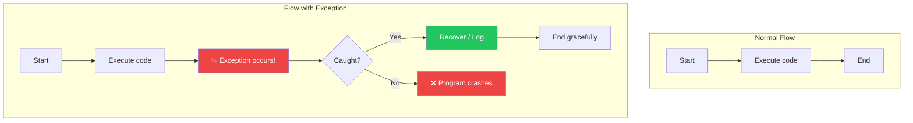
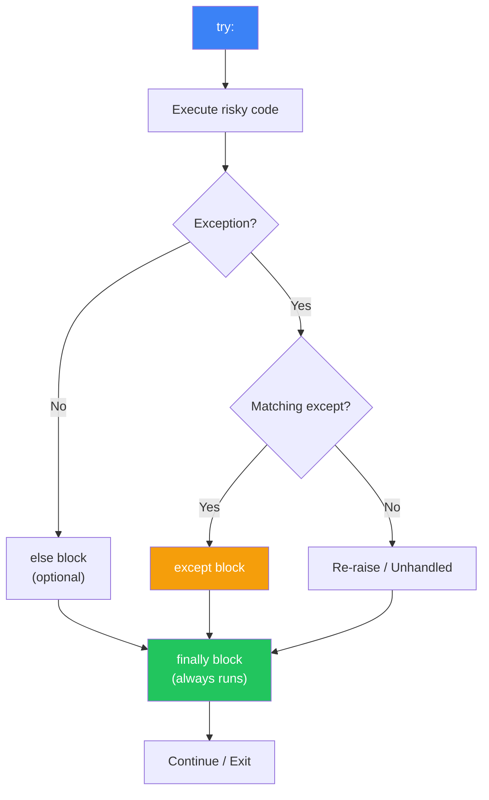
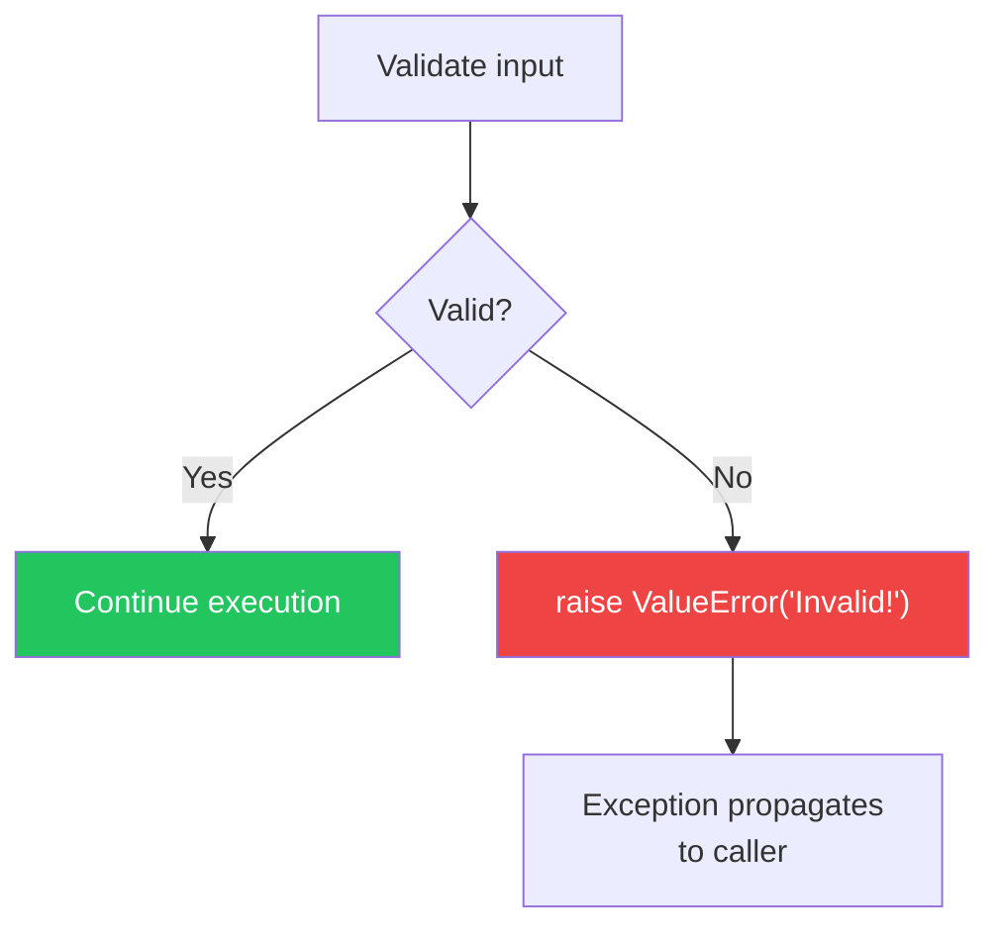
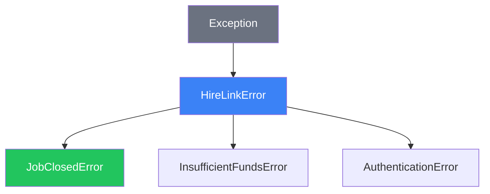
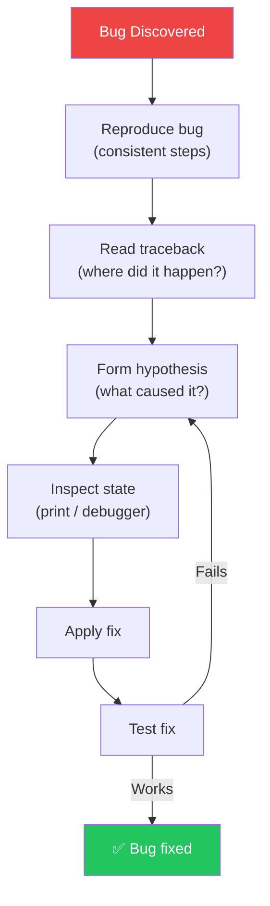

#  Error Handling والـ Debugging: إزاي تخلي كودك صامد

> **المتطلبات:** [[08-OOP-Advanced]] — لازم تكون فاهم Classes، Inheritance، Properties، و Class Methods. الفصل ده هيوريك إزاي تتعامل مع الأخطاء بشكل احترافي عشان كودك ميكسرش ويتعامل مع المواقف غير المتوقعة.

---

## البداية — البرامج بتكسر

تخيّل معايا إنك كاتب نظام HireLink المصغر (PE-08) وكل حاجة شغالة تمام. المستخدم بيدخل بيانات، والـ API بتستقبلها، والدنيا تمام.

وفجأة:
- المستخدم دخل `budget` بـ `"five thousand"` بدل `5000`.
- المستخدم حاول يعمل `apply_to_job()` على Job متقفلة.
- الملف اللي بتحاول تقراه مش موجود.
- اتصال الـ database قطع في نص العملية.

البرنامج هيعمل إيه؟ **هيقع ويطلع Traceback مخيف** (أو أسوأ: هيسكت ويسيب الدنيا في حالة مش consistent).

الحل: **Error Handling (معالجة الأخطاء)**. بدل ما تخلي البرنامج يقع، إنت بتتوقع الأماكن اللي ممكن يحصل فيها خطأ، وبتتعامل معاها بشكل لائق: رسالة مفهومة للمستخدم، محاولة إصلاح الوضع، أو على الأقل تسجيل الخطأ من غير ما البرنامج كله يموت.

النهارده هنتعلم: أنواع الـ Errors، إزاي تمسكها بـ `try/except`، إزاي ترمي Errors بنفسك (`raise`)، إزاي تعمل Custom Exceptions، وأساسيات الـ Debugging.

---

## [[01-Exceptions-Basics]] — إيه هي الـ Exceptions؟

### 🧠 الشرح النظري

الـ Exception هو **إشارة** بإن فيه حاجة غلط حصلت أثناء تنفيذ البرنامج. لما Python تواجه حاجة مش عارفة تتعامل معاها، **بترمي Exception**. لو محدش مسك الـ Exception ده، البرنامج **بيقع** (crash).

**أنواع الأخطاء:**
- **Syntax Errors:** أخطاء في كتابة الكود نفسه. Python مش هتنفذ البرنامج أصلاً. مثال: نسيان `:` بعد `if`.
- **Runtime Errors (Exceptions):** أخطاء بتحصل **أثناء** تنفيذ البرنامج. مثال: قسمة على صفر، فتح ملف مش موجود، الوصول لـ index مش موجود في list.

**أمثلة شائعة:**
- **`ZeroDivisionError`:** `10 / 0`
- **`TypeError`:** `"5" + 5`
- **`ValueError`:** `int("five")`
- **`FileNotFoundError`:** `open("nonexistent.txt")`
- **`IndexError`:** `my_list[100]`
- **`KeyError`:** `my_dict["nonexistent_key"]`
- **`AttributeError`:** `"hello".nonexistent_method()`

**الـ Traceback:**
لما Exception بيحصل، Python بتطبع **Traceback** — قائمة بالـ functions اللي كانت بتنادي على بعض لما الخطأ حصل. ده دليل عشان تعرف فين المشكلة.

تخيّل Exceptions زي **لمبات التحذير في تابلو السيارة**:
- **Syntax Error:** العربية مش هتدور أصلاً (المفتاح مش شغال).
- **ZeroDivisionError:** لمبة "Check Engine" — حاجة غلط حصلت والماتور هيقف لو اتعاملتش معاها.
- **FileNotFoundError:** لمبة البنزين — "الملف اللي بتدور عليه مش موجود".
- **IndexError:** لمبة "الباب مفتوح" — بتحاول توصل لحاجة مش موجودة.

### 📊 Visualization



### 💻 Micro-Example

```python
# These will raise exceptions (uncomment to test)

# print(10 / 0)                    # ZeroDivisionError
# print(int("five"))               # ValueError
# print([1, 2, 3][10])             # IndexError
# print({"a": 1}["b"])             # KeyError
# open("nonexistent_file.txt")     # FileNotFoundError
# "hello".nonexistent()            # AttributeError

# Traceback example
def function_a():
    return 10 / 0

def function_b():
    return function_a()

def function_c():
    return function_b()

# function_c()  # Traceback shows: function_c -> function_b -> function_a -> error
```
<details>
<summary><b>📋 مثال إضافي: قراءة Traceback</b></summary>

```python
def calculate_average(numbers):
    total = sum(numbers)
    return total / len(numbers)

def get_student_grades(student_dict, student_name):
    grades = student_dict[student_name]
    return calculate_average(grades)

students = {
    "Ahmed": [85, 90, 78],
    "Sara": [92, 88, 95],
    "Omar": []  # Empty grades list!
}

# This will raise ZeroDivisionError because Omar has no grades
# avg = get_student_grades(students, "Omar")
# Traceback will show:
#   File "test.py", line X, in get_student_grades -> return calculate_average(grades)
#   File "test.py", line Y, in calculate_average -> return total / len(numbers)
# ZeroDivisionError: division by zero
```
</details>

---

## [[02-Try-Except]] — `try/except`: إزاي تمسك الـ Exception

### 🧠 الشرح النظري

عشان تمنع البرنامج من إنه يقع، بتحط الكود اللي ممكن يرمي Exception جوا **`try` block**. وبعدين بتحدد إيه اللي يحصل لو Exception معين حصل في **`except` block**.

**التركيب الأساسي:**
```python
try:
    # كود ممكن يرمي Exception
    result = 10 / 0
except ZeroDivisionError:
    # اتعامل مع الخطأ
    print("You can't divide by zero!")
```

**مسك أنواع متعددة:**
```python
try:
    value = int(user_input)
    result = 100 / value
except ValueError:
    print("Please enter a valid number.")
except ZeroDivisionError:
    print("Cannot divide by zero.")
except Exception as e:  # Catch any other exception
    print(f"Something else went wrong: {e}")
```

**`else` و `finally`:**
- **`else`:** بيتنفذ **لو مفيش Exception حصل** في الـ `try`.
- **`finally`:** بيتنفذ **دايماً** — سواء حصل Exception أو لأ. مثالي لتنظيف الموارد (قفل ملفات، قفل database connections).

**الوصول للـ Exception Object:**
`except ExceptionType as e:` — `e` هو الـ exception object. تقدر تطبعه أو تسجله.

تخيّل `try/except` زي **شبكة أمان تحت الأرجوحة**:
- **`try`:** وأنت بتتمرن على الأرجوحة (كود خطر).
- **`except`:** شبكة الأمان — لو وقعت، الشبكة هتمسكك (بدل ما تنزل على الأرض).
- **`else`:** لو كملت التمرين من غير ما تقع، هتروح تلعب حاجة تانية.
- **`finally`:** سواء وقعت أو لأ، هتروح تغسل إيديك (تنظيف).

### 📊 Visualization



### 💻 Micro-Example

```python
def safe_divide():
    try:
        num1 = int(input("Enter numerator: "))
        num2 = int(input("Enter denominator: "))
        result = num1 / num2
    except ValueError as e:
        print(f"Invalid number: {e}")
    except ZeroDivisionError:
        print("Cannot divide by zero!")
    else:
        print(f"Result: {result}")
    finally:
        print("Calculation attempt finished.\n")

safe_divide()
safe_divide()
```
<details>
<summary><b>📋 مثال إضافي: قراءة ملف بأمان</b></summary>

```python
def read_file_safely(filename):
    try:
        with open(filename, "r", encoding="utf-8") as f:
            content = f.read()
    except FileNotFoundError:
        print(f"Error: File '{filename}' not found.")
        return None
    except PermissionError:
        print(f"Error: No permission to read '{filename}'.")
        return None
    except Exception as e:
        print(f"Unexpected error reading file: {e}")
        return None
    else:
        print(f"File '{filename}' read successfully.")
        return content
    finally:
        print("File read attempt completed.")

content = read_file_safely("existing_file.txt")
if content:
    print(f"Content length: {len(content)} characters")

read_file_safely("nonexistent.txt")
```
</details>

---

## [[03-Raising-Exceptions]] — `raise`: إنت كمان تقدر ترمي Exceptions

### 🧠 الشرح النظري

مش بس Python اللي بتعرف ترمي Exceptions. إنت كمان تقدر ترمي Exceptions بنفسك باستخدام `raise`. ده مفيد لما تكون عايز تمنع حاجة مش صح من إنها تحصل.

**التركيب:**
```python
if something_wrong:
    raise ValueError("This is not allowed because...")
```

**ليه ترمي Exception بنفسك؟**
- **Validation:** تتأكد إن الـ input صحيح قبل ما تكمل. `if age < 0: raise ValueError("Age cannot be negative")`.
- **Enforce Constraints:** تمنع استخدام method في حالة غلط. `if job.status != "open": raise RuntimeError("Cannot apply to closed job")`.
- **Abstract Methods:** ترمي `NotImplementedError` لو الـ child class لازم يعمل override للـ method.

**إعادة رمي Exception:**
أحياناً بتمسك Exception، تعمل حاجة (زي logging)، وبعدين ترميه تاني عشان الـ caller يتعامل معاه:
```python
try:
    something()
except SomeError as e:
    log_error(e)
    raise  # Re-raise the same exception
```

تخيّل `raise` زي **حكم في ماتش**:
- اللاعب (الكود) بيعمل حركة غلط.
- الحكم (إنت) بيوقف اللعب ويصفر (يرمي Exception).
- "خطأ! اللاعب لمس الكرة بإيده!" (الـ error message).

### 📊 Visualization



### 💻 Micro-Example

```python
def set_age(age):
    if not isinstance(age, int):
        raise TypeError("Age must be an integer")
    if age < 0:
        raise ValueError("Age cannot be negative")
    if age > 150:
        raise ValueError(f"Age {age} seems unrealistic")
    print(f"Age set to {age}")

def create_username(name):
    if not name:
        raise ValueError("Name cannot be empty")
    if len(name) < 3:
        raise ValueError("Username must be at least 3 characters")
    return name.lower().replace(" ", "_")

try:
    set_age(25)
    set_age(-5)  # This will raise ValueError
except (TypeError, ValueError) as e:
    print(f"Error setting age: {e}")

try:
    username = create_username("Ah")
except ValueError as e:
    print(f"Error creating username: {e}")
```
<details>
<summary><b>📋 مثال إضافي: إعادة رمي Exception</b></summary>

```python
import logging

def process_payment(amount):
    if amount <= 0:
        raise ValueError("Payment amount must be positive")
    print(f"Processing payment of ${amount}")
    return True

def checkout(cart_total):
    try:
        process_payment(cart_total)
    except ValueError as e:
        print(f"Payment failed: {e}")
        # Log the error
        logging.error(f"Checkout failed for amount {cart_total}: {e}")
        # Re-raise so caller knows
        raise

try:
    checkout(100)
    checkout(-50)  # This will fail and re-raise
except ValueError:
    print("Checkout could not be completed.")
```
</details>

---

## [[04-Custom-Exceptions]] — Custom Exceptions: أخطاء خاصة بتطبيقك

### 🧠 الشرح النظري

الـ built-in Exceptions كويسة، لكن أحياناً عايز نوع خطأ خاص بتطبيقك. ده بيسهل الـ debugging وبيخلي الكود أوضح.

**إزاي تعمل Custom Exception:**
مجرد ما تعمل class بيرث من `Exception` (أو أي Exception class تانية).

```python
class HireLinkError(Exception):
    """Base exception for all HireLink errors."""
    pass

class JobClosedError(HireLinkError):
    """Raised when trying to apply to a closed job."""
    pass

class InsufficientFundsError(HireLinkError):
    """Raised when client doesn't have enough balance."""
    pass
```

**ليه Custom Exceptions؟**
- **وضوح:** `except JobClosedError` أوضح من `except ValueError`.
- **تجميع:** كل أخطاء تطبيقك ترث من `HireLinkError`. تقدر تمسك `HireLinkError` وتمسك كل أخطاء التطبيق مرة واحدة.
- **بيانات إضافية:** تقدر تضيف attributes للـ custom exception.

تخيّل Custom Exceptions زي **أقسام المستشفى**:
- **`Exception`:** المستشفى كله.
- **`HireLinkError`:** قسم الطوارئ.
- **`JobClosedError`:** غرفة العمليات.
- **`InsufficientFundsError`:** غرفة الأشعة.

لما توصل حالة، بتتروح للقسم المناسب.

### 📊 Visualization



### 💻 Micro-Example

```python
class HireLinkError(Exception):
    """Base exception for HireLink."""
    def __init__(self, message, code=None):
        super().__init__(message)
        self.code = code

class JobError(HireLinkError):
    """Base for job-related errors."""
    pass

class JobNotFoundError(JobError):
    """Raised when job doesn't exist."""
    pass

class JobClosedError(JobError):
    """Raised when trying to modify a closed job."""
    pass

class ApplicationError(HireLinkError):
    """Raised when application is invalid."""
    pass

def apply_to_job(job_id, job_status):
    jobs_db = {1: "open", 2: "closed"}
    
    if job_id not in jobs_db:
        raise JobNotFoundError(f"Job {job_id} not found", code="JOB_404")
    
    if jobs_db[job_id] != "open":
        raise JobClosedError(f"Job {job_id} is closed", code="JOB_CLOSED")
    
    print(f"Applied to job {job_id} successfully.")

try:
    apply_to_job(1, "open")
    apply_to_job(3, "open")  # Will raise JobNotFoundError
except JobNotFoundError as e:
    print(f"Error [{e.code}]: {e}")
except JobClosedError as e:
    print(f"Error [{e.code}]: {e}")
except HireLinkError as e:
    print(f"General HireLink error: {e}")
```
<details>
<summary><b>📋 مثال إضافي: ValidationError مخصصة</b></summary>

```python
class ValidationError(Exception):
    def __init__(self, field, message):
        self.field = field
        self.message = message
        super().__init__(f"{field}: {message}")

class User:
    def __init__(self, email, age):
        self.validate_email(email)
        self.validate_age(age)
        self.email = email
        self.age = age
    
    @staticmethod
    def validate_email(email):
        if "@" not in email:
            raise ValidationError("email", "Must contain @")
    
    @staticmethod
    def validate_age(age):
        if age < 18:
            raise ValidationError("age", "Must be at least 18")

try:
    user = User("invalid-email", 16)
except ValidationError as e:
    print(f"Validation failed for {e.field}: {e.message}")
```
</details>

---

## [[05-Debugging-Basics]] — Debugging: إزاي تلاقي المشكلة وتصلحها

### 🧠 الشرح النظري

الـ Debugging هو عملية **تحديد** و **إصلاح** الأخطاء في الكود. هو مهارة أساسية لازم كل مبرمج يتقنها.

**أدوات الـ Debugging:**

**1. `print()` Debugging:**
أبسط طريقة. بتحط `print` في أماكن مختلفة عشان تشوف قيم المتغيرات ومسار التنفيذ.
```python
print(f"DEBUG: x = {x}, y = {y}")
```
- **المميزات:** سهل، مش محتاج أدوات.
- **العيوب:** بيلوث الكود، ممكن تنسى تشيله.

**2. `logging` Module:**
بديل متقدم لـ `print`. بتقدر تتحكم في مستوى الرسائل (DEBUG, INFO, WARNING, ERROR) وتوجهها لملف.

**3. `pdb` (Python Debugger):**
أداة interactive بتسمحلك توقف الكود عند نقطة معينة وتفحص حالة البرنامج سطر سطر.
```python
import pdb
pdb.set_trace()  # Code stops here
```

**4. IDE Debugger (VS Code, PyCharm):**
أقوى أداة. بتحط **Breakpoints** في الـ IDE، وتشغل البرنامج في debug mode. تقدر تشوف كل المتغيرات، تتابع التنفيذ سطر سطر، وتجرب أوامر في الـ console.

**استراتيجيات الـ Debugging:**
- **شوف الـ Traceback:** أول حاجة — فين الخطأ حصل؟
- **Reproduce the Bug:** خلي الخطأ يحصل بشكل ثابت عشان تقدر تفحصه.
- **Divide and Conquer:** قسم الكود وضيق دايرة البحث.
- **Rubber Duck Debugging:** اشرح الكود لبطّة مطاطية (أو زميل). غالباً هتلاقي المشكلة وأنت بتشرحها.

تخيّل Debugging زي **التحقيق في جريمة**:
- **`print`:** كاميرات المراقبة — بتسجل اللي حصل.
- **`pdb` / Breakpoints:** التحقيق الميداني — بتوقف المشتبه فيه وتسأله أسئلة.
- **Traceback:** تقرير الطب الشرعي — بيقولك سبب الوفاة وفين حصلت.

### 📊 Visualization



### 💻 Micro-Example

```python
import logging

# Configure logging
logging.basicConfig(
    level=logging.DEBUG,
    format='%(asctime)s - %(levelname)s - %(message)s'
)

def calculate_average(numbers):
    logging.debug(f"calculate_average called with: {numbers}")
    if not numbers:
        logging.warning("Empty list provided")
        return 0
    
    total = sum(numbers)
    logging.debug(f"Sum: {total}")
    
    count = len(numbers)
    logging.debug(f"Count: {count}")
    
    average = total / count
    logging.info(f"Average calculated: {average}")
    return average

def process_grades(student_grades):
    results = {}
    for student, grades in student_grades.items():
        try:
            avg = calculate_average(grades)
            results[student] = avg
        except Exception as e:
            logging.error(f"Failed to process {student}: {e}")
            results[student] = None
    return results

grades = {
    "Ahmed": [85, 90, 78],
    "Sara": [92, 88, 95],
    "Omar": [],  # Empty list
    "Layla": "not a list",  # Will cause error
}

results = process_grades(grades)
print(f"Results: {results}")

# To use pdb:
# import pdb
# pdb.set_trace()  # Add this line where you want to pause
# Then use commands: n (next), s (step), c (continue), p variable (print)
```
<details>
<summary><b>📋 مثال إضافي: استخدام pdb</b></summary>

```python
# Uncomment to try pdb
# import pdb

def buggy_function(x, y):
    # pdb.set_trace()  # Code will pause here
    result = x + y
    result = result * 2
    result = result / 0  # Oops! Division by zero
    return result

# buggy_function(5, 3)

# In pdb:
# n - execute next line
# p x - print value of x
# p result - print value of result
# c - continue execution (will crash)
# q - quit debugger
```
</details>

---

## 🛠️ Progressive Exercise 09 — HireLink مع Error Handling

**المهمة:** خد نظام HireLink المصغر من PE-08 وأضف عليه Error Handling شامل.

**المطلوب:**

**1. عرف Custom Exceptions:**
- `HireLinkError` (Base exception).
- `ValidationError` (للتحقق من البيانات).
- `JobClosedError` (لما تحاول تقدم على Job متقفلة).
- `AlreadyAppliedError` (لما نفس الـ Freelancer يحاول يقدم مرتين).

**2. عدل الـ Classes عشان تستخدم الـ Custom Exceptions:**
- `User`: الـ `password` setter يرمي `ValidationError` لو كلمة المرور قصيرة.
- `User.validate_email`: يرمي `ValidationError` لو الـ email مش صحيح.
- `Client.post_job`: يرمي `ValidationError` لو الـ budget سالب أو صفر.
- `Freelancer.apply_to_job`: يرمي `JobClosedError` لو الـ job مش مفتوحة، و `AlreadyAppliedError` لو الـ freelancer قدم قبل كده.
- `Application.accept`: يرمي `JobClosedError` لو الـ job مش مفتوحة.

**3. استخدم `try/except` في الـ main code:**
- جرب عمليات مختلفة، وامسك الـ exceptions، واطبع رسائل مفهومة للمستخدم.

**4. أضف Logging:**
- سجل الأخطاء في ملف `hirelink.log`.

**🎯 جرب بنفسك:** افتح أي Python environment واكتب الحل. لو اتعطلت، الحل تحت.


<details>
<summary><b>✨ اضغط هنا عشان تشوف الحل</b></summary>

```python
# PE-09: HireLink with Error Handling

from datetime import datetime
import re
import logging

# Configure logging
logging.basicConfig(
    filename='hirelink.log',
    level=logging.INFO,
    format='%(asctime)s - %(name)s - %(levelname)s - %(message)s'
)
logger = logging.getLogger('hirelink')

# ============= Custom Exceptions =============
class HireLinkError(Exception):
    """Base exception for all HireLink errors."""
    def __init__(self, message, code=None):
        self.message = message
        self.code = code
        super().__init__(message)

class ValidationError(HireLinkError):
    """Raised when data validation fails."""
    def __init__(self, field, message):
        self.field = field
        super().__init__(f"{field}: {message}", code="VALIDATION_ERROR")

class JobClosedError(HireLinkError):
    """Raised when trying to interact with a closed job."""
    def __init__(self, job_title):
        super().__init__(f"Job '{job_title}' is closed", code="JOB_CLOSED")

class AlreadyAppliedError(HireLinkError):
    """Raised when freelancer tries to apply twice."""
    def __init__(self, freelancer_name, job_title):
        super().__init__(
            f"{freelancer_name} already applied to '{job_title}'",
            code="ALREADY_APPLIED"
        )

class AuthenticationError(HireLinkError):
    """Raised when login fails."""
    def __init__(self):
        super().__init__("Invalid email or password", code="AUTH_FAILED")

# ============= User Class =============
class User:
    def __init__(self, username, email, password):
        self.validate_email(email)
        self.username = username
        self.email = email
        self._password = None
        self.password = password
        self.joined_at = datetime.now()
        logger.info(f"User created: {username} ({email})")
    
    @property
    def password(self):
        return "****"
    
    @password.setter
    def password(self, value):
        if len(value) < 6:
            raise ValidationError("password", "Must be at least 6 characters")
        self._password = value
    
    def check_password(self, raw_password):
        return self._password == raw_password
    
    def login(self, email, password):
        if self.email != email or not self.check_password(password):
            raise AuthenticationError()
        logger.info(f"User {self.username} logged in")
        return True
    
    @staticmethod
    def validate_email(email):
        pattern = r'^[\w\.-]+@[\w\.-]+\.\w+$'
        if not re.match(pattern, email):
            raise ValidationError("email", "Invalid email format")
        return True
    
    def get_profile(self):
        return {
            "username": self.username,
            "email": self.email,
            "joined_at": self.joined_at.strftime("%Y-%m-%d")
        }
    
    def __str__(self):
        return f"{self.username} ({self.email})"

# ============= Client Class =============
class Client(User):
    def __init__(self, username, email, password, company):
        super().__init__(username, email, password)
        self.company = company
        self.verified = False
        self.posted_jobs = []
    
    def post_job(self, title, budget):
        if budget <= 0:
            raise ValidationError("budget", "Budget must be positive")
        
        job = Job(title, budget, self)
        self.posted_jobs.append(job)
        logger.info(f"Client {self.username} posted job: '{title}' (${budget})")
        print(f"✅ Job '{title}' posted by {self.username}")
        return job
    
    def get_profile(self):
        profile = super().get_profile()
        profile.update({
            "type": "client",
            "company": self.company,
            "verified": self.verified,
            "jobs_posted": len(self.posted_jobs)
        })
        return profile

# ============= Freelancer Class =============
class Freelancer(User):
    def __init__(self, username, email, password, skills=None, hourly_rate=0):
        super().__init__(username, email, password)
        self.skills = skills or []
        self.hourly_rate = hourly_rate
        self.applications = []
    
    def add_skill(self, skill):
        if skill not in self.skills:
            self.skills.append(skill)
            print(f"➕ {self.username} added skill: {skill}")
    
    def apply_to_job(self, job, cover_letter=""):
        if job.status != "open":
            raise JobClosedError(job.title)
        
        # Check if already applied
        for app in self.applications:
            if app.job == job:
                raise AlreadyAppliedError(self.username, job.title)
        
        application = Application(job, self, cover_letter)
        self.applications.append(application)
        logger.info(f"Freelancer {self.username} applied to '{job.title}'")
        print(f"📝 {self.username} applied to '{job.title}'")
        return application
    
    def get_profile(self):
        profile = super().get_profile()
        profile.update({
            "type": "freelancer",
            "skills": self.skills,
            "hourly_rate": self.hourly_rate,
            "applications": len(self.applications)
        })
        return profile

# ============= Job Class =============
class Job:
    def __init__(self, title, budget, client):
        self.title = title
        self.budget = budget
        self.client = client
        self.status = "open"
        self.created_at = datetime.now()
        self.applications = []
    
    def close(self):
        self.status = "closed"
        logger.info(f"Job '{self.title}' closed")
        print(f"🔒 Job '{self.title}' closed.")
    
    def add_application(self, application):
        self.applications.append(application)
    
    def __str__(self):
        status_icon = "🟢" if self.status == "open" else "🔴"
        return f"{status_icon} [{self.status.upper()}] {self.title} (${self.budget})"

# ============= Application Class =============
class Application:
    def __init__(self, job, freelancer, cover_letter=""):
        self.job = job
        self.freelancer = freelancer
        self.cover_letter = cover_letter
        self.status = "pending"
        self.submitted_at = datetime.now()
        job.add_application(self)
    
    def accept(self):
        if self.job.status != "open":
            raise JobClosedError(self.job.title)
        
        self.status = "accepted"
        self.job.close()
        logger.info(f"Application from {self.freelancer.username} accepted for '{self.job.title}'")
        print(f"✅ Application from {self.freelancer.username} ACCEPTED!")
    
    def reject(self):
        self.status = "rejected"
        print(f"❌ Application from {self.freelancer.username} rejected.")
    
    def __str__(self):
        return f"Application: {self.freelancer.username} -> {self.job.title} [{self.status}]"

# ============= Main Program with Error Handling =============
def main():
    print("=" * 60)
    print("🎯 HireLink with Error Handling")
    print("=" * 60)
    
    try:
        # Create users with validation
        print("\n--- Creating Users ---")
        try:
            client = Client("ahmed_dev", "ahmed@techcorp.com", "pass123", "TechCorp")
        except ValidationError as e:
            print(f"❌ Failed to create client: {e}")
            return
        
        try:
            freelancer = Freelancer("sara_py", "sara@freelance.com", "pass456", 
                                   ["Python", "Django"], 50)
        except ValidationError as e:
            print(f"❌ Failed to create freelancer: {e}")
            return
        
        # Test invalid user creation
        print("\n--- Testing Invalid User Creation ---")
        try:
            invalid_user = User("test", "invalid-email", "123")
        except ValidationError as e:
            print(f"❌ Validation failed: {e.field} - {e.message}")
        
        try:
            invalid_user2 = User("test", "test@email.com", "123")
        except ValidationError as e:
            print(f"❌ Validation failed: {e.field} - {e.message}")
        
        # Login
        print("\n--- Login ---")
        try:
            client.login("ahmed@techcorp.com", "pass123")
        except AuthenticationError as e:
            print(f"❌ Login failed: {e}")
        
        try:
            client.login("wrong@email.com", "wrongpass")
        except AuthenticationError as e:
            print(f"❌ Login failed: {e}")
        
        # Post jobs
        print("\n--- Posting Jobs ---")
        try:
            job1 = client.post_job("Backend Developer", 5000)
        except ValidationError as e:
            print(f"❌ Failed to post job: {e.field} - {e.message}")
        
        try:
            job2 = client.post_job("Invalid Job", -100)
        except ValidationError as e:
            print(f"❌ Failed to post job: {e.field} - {e.message}")
        
        # Apply to jobs
        print("\n--- Applying to Jobs ---")
        try:
            app1 = freelancer.apply_to_job(job1, "I'm perfect for this role!")
        except HireLinkError as e:
            print(f"❌ Application failed [{e.code}]: {e}")
        
        # Try to apply again (should fail)
        try:
            app2 = freelancer.apply_to_job(job1, "Second application")
        except AlreadyAppliedError as e:
            print(f"❌ Application failed [{e.code}]: {e}")
        
        # Accept application
        print("\n--- Accepting Application ---")
        try:
            app1.accept()
        except HireLinkError as e:
            print(f"❌ Accept failed [{e.code}]: {e}")
        
        # Try to apply to closed job
        print("\n--- Applying to Closed Job ---")
        try:
            app3 = freelancer.apply_to_job(job1, "Too late!")
        except JobClosedError as e:
            print(f"❌ Application failed [{e.code}]: {e}")
        
        # Display profiles
        print("\n--- User Profiles ---")
        print(f"Client: {client.get_profile()}")
        print(f"Freelancer: {freelancer.get_profile()}")
        
    except Exception as e:
        logger.error(f"Unexpected error: {e}", exc_info=True)
        print(f"❌ An unexpected error occurred: {e}")
    
    finally:
        print("\n" + "=" * 60)
        print("✅ Program completed (check hirelink.log for details)")
        print("=" * 60)

if __name__ == "__main__":
    main()
```
</details>

---

## 📝 خلاصة الدرس

- **Exceptions:** إشارات بإن فيه خطأ. `ZeroDivisionError`, `ValueError`, `TypeError`, `KeyError`, `IndexError`.
- **`try/except/else/finally`:** `try` = كود خطر. `except` = اتعامل مع الخطأ. `else` = مفيش خطأ. `finally` = نفذ دايمًا (تنظيف).
- **`raise`:** ترمي Exception بنفسك للتحقق من صحة المدخلات أو فرض القيود.
- **Custom Exceptions:** اعمل class بيرث من `Exception`. بيخلي الكود أوضح ويسهل الـ debugging.
- **Debugging:** `print()` بسيط، `logging` أفضل، `pdb` / IDE Debugger الأقوى. اقرا الـ traceback، استنسخ الخطأ، قسم المشكلة.
- **Logging:** استخدم `logging` بدل `print`. مستويات: `DEBUG`, `INFO`, `WARNING`, `ERROR`. وجهها لملف للمراجعة.

---

*Next → [[10-Modules-And-Packages]] — عرفنا إزاي نتعامل مع الأخطاء. دلوقتي هنتعلم إزاي ننظم الكود بتاعنا في **Modules** و **Packages** عشان المشروع يكبر ويبقى منظم. وهنحل PE-10: تحويل نظام HireLink لـ Modules منفصلة.*