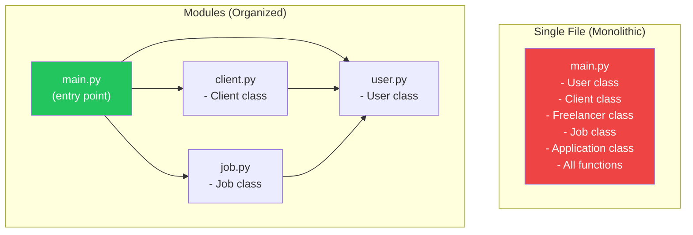
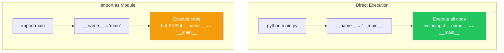
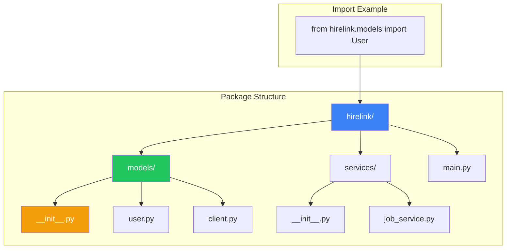
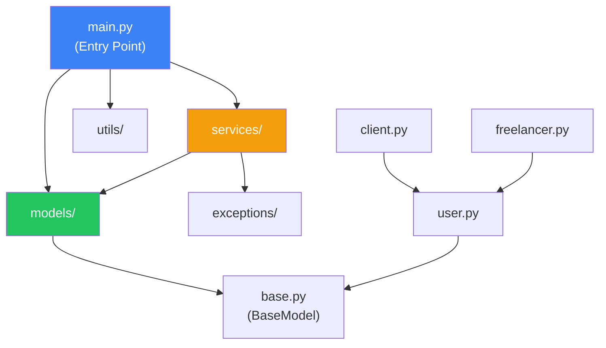

# الفصل صفر-عشرة — Modules والـ Packages: تنظيم المشاريع الكبيرة

> **المتطلبات:** [[09-Error-Handling-And-Debugging]] — لازم تكون فاهم إزاي تتعامل مع Exceptions وتبني Custom Exceptions. الفصل ده هيوريك إزاي تكسر الكود بتاعك لـ **Modules** و **Packages** عشان المشروع يبقى منظم وقابل للصيانة.

---

## البداية — مشكلة الملف الواحد اللي لا ينتهي

تخيّل معايا إنك كملت نظام HireLink (PE-09). الكود بتاعك ٥٠٠ سطر في ملف واحد (`main.py`). كل Classes في نفس الملف. الدنيا شغالة.

بعد شهر، عايز تضيف ميزة جديدة (نظام مراسلات). هتضيف ٢٠٠ سطر تاني. الملف بقى ٧٠٠ سطر. بقى صعب تلاقي أي حاجة. لو عدلت في `User` class، ممكن تكسر حاجة في `Job` class من غير ما تاخد بالك.

المشكلة: **كل حاجة في ملف واحد**.

الحل: **Modules و Packages**.
- **Module:** ملف Python واحد (`.py`). فيه Classes و Functions مرتبطة ببعض.
- **Package:** Folder فيه Modules. بيتيح تنظيم هرمي.

النهارده هنتعلم: إزاي نعمل Modules، إزاي نستوردها (`import`)، إزاي ننظمها في Packages، وإزاي نحول مشروعنا من ملف واحد لـ Structure احترافي.

---

## [[01-Modules-Basics]] — الـ Modules: تقسيم الكود لملفات

### 🧠 الشرح النظري

الـ Module هو ببساطة **ملف Python** (`.py`). أي ملف Python هو Module. الـ Module بيحتوي على:
- Functions
- Classes
- Variables
- كود قابل للتنفيذ

**ليه نستخدم Modules؟**
- **تنظيم:** بدل ملف واحد ضخم، تقسم الكود لملفات صغيرة كل واحد ليه مسؤولية محددة.
- **Reusability:** تقدر تستخدم نفس الـ Module في مشاريع مختلفة.
- **Namespace:** الـ Module بيعمل namespace منفصل. `user.py` و `job.py` ممكن يكون فيهم `create()` function من غير ما يتعارضوا.
- **صيانة أسهل:** لما تعدل في `models/user.py`، عارف إن التغيير هيأثر على حاجات المستخدمين بس.

**إزاي نعمل Module؟**
مجرد ما تحفظ الكود في ملف `.py` — ده Module.

**إزاي نستخدم Module؟**
باستخدام `import`.

تخيّل الـ Module زي **درج في مكتب**:
- **المكتب:** المشروع كله.
- **الدرج (Module):** درج "الفواتير" — كل حاجة تخص الفواتير في الدرج ده.
- **الـ import:** إنك تفتح الدرج وتاخد الورقة اللي عايزها.

### 📊 Visualization



### 💻 Micro-Example

```python
# ============= File: user.py =============
class User:
    def __init__(self, name):
        self.name = name
    
    def greet(self):
        return f"Hello, I'm {self.name}"

def create_admin():
    return User("Admin")

# ============= File: main.py =============
import user

# Use the module
u = user.User("Ahmed")
print(u.greet())

admin = user.create_admin()
print(admin.greet())

# Alternative import styles
from user import User  # Import specific class
u2 = User("Sara")

from user import create_admin as make_admin  # Import with alias
admin2 = make_admin()

import user as u  # Import module with alias
u3 = u.User("Omar")
```
<details>
<summary><b>📋 مثال إضافي: Module للـ Math Operations</b></summary>

```python
# ============= File: math_utils.py =============
PI = 3.14159

def add(a, b):
    return a + b

def multiply(a, b):
    return a * b

def circle_area(radius):
    return PI * radius ** 2

# ============= File: calculator.py =============
import math_utils

print(math_utils.add(5, 3))
print(math_utils.multiply(4, 7))
print(math_utils.circle_area(5))

from math_utils import PI, circle_area
print(f"PI = {PI}")
print(f"Area = {circle_area(3)}")
```
</details>

---

## [[02-Import-Internals]] — `import`: إزاي Python بتلاقي الـ Modules

### 🧠 الشرح النظري

لما تكتب `import user`، Python بتبحث عن الـ Module `user` في أماكن محددة بالترتيب:

1. **Current Directory:** المكان اللي فيه السكريبت اللي شغلته.
2. **PYTHONPATH:** متغير بيئة فيه مسارات إضافية.
3. **Standard Library:** الـ built-in modules (زي `math`, `os`, `sys`).
4. **Site-Packages:** المكان اللي بتتحط فيه المكتبات الخارجية (`pip install`).

**طب لو عايز تعرف Python بتدور فين؟**
```python
import sys
print(sys.path)
```

**`__name__` و `"__main__"`:**
كل Module عنده متغير `__name__`. لما تشغل ملف Python مباشرةً (`python main.py`)، `__name__` بيبقى `"__main__"`. لو الملف اتستورد كـ Module (`import user`)، `__name__` بيبقى اسم الملف (`"user"`).

**ليه ده مهم؟**
عشان تحط كود في الـ Module يتنفذ **بس** لو الملف اتشغل مباشرةً، مش لما يتستورد.

```python
if __name__ == "__main__":
    print("This runs only when executed directly")
    test_user()
```

تخيّل `__name__` زي **بطاقة هوية**:
- لما تكون في بيتك (`python main.py`): هويتك "صاحب البيت" (`__main__`).
- لما تزور حد (`import user`): هويتك "ضيف" (`user`).

الكود اللي في `if __name__ == "__main__":` بيتنفذ بس لو إنت صاحب البيت.

### 📊 Visualization



### 💻 Micro-Example

```python
# ============= File: greetings.py =============
print(f"greetings.py __name__: {__name__}")

def say_hello(name):
    return f"Hello, {name}!"

def say_goodbye(name):
    return f"Goodbye, {name}!"

if __name__ == "__main__":
    # This runs ONLY when greetings.py is executed directly
    print("Testing greetings module:")
    print(say_hello("Ahmed"))
    print(say_goodbye("Ahmed"))

# ============= File: main.py =============
import greetings

print("In main.py:")
print(greetings.say_hello("Sara"))
# The test code in greetings.py will NOT run
```
<details>
<summary><b>📋 مثال إضافي: Module مع Tests</b></summary>

```python
# ============= File: calculator.py =============
def add(a, b):
    return a + b

def subtract(a, b):
    return a - b

def multiply(a, b):
    return a * b

def divide(a, b):
    if b == 0:
        raise ValueError("Cannot divide by zero")
    return a / b

if __name__ == "__main__":
    # Test the module
    print("Running tests...")
    assert add(2, 3) == 5
    assert subtract(5, 2) == 3
    assert multiply(4, 3) == 12
    assert divide(10, 2) == 5
    print("All tests passed!")
```
</details>

---

## [[03-Packages]] — Packages: تنظيم الـ Modules في Folders

### 🧠 الشرح النظري

الـ Package هو **Folder** بيحتوي على Modules. عشان Folder يبقى Package، لازم يحتوي على ملف `__init__.py` (ممكن يكون فاضي). ده بيخلي Python تعرف إن الـ folder ده Package.

**الـ Structure:**
```
hirelink/
├── __init__.py
├── models/
│   ├── __init__.py
│   ├── user.py
│   ├── client.py
│   └── freelancer.py
├── services/
│   ├── __init__.py
│   ├── job_service.py
│   └── application_service.py
├── exceptions/
│   ├── __init__.py
│   └── custom_exceptions.py
└── main.py
```

**إزاي تستورد من Package:**
```python
# Absolute import (recommended)
from hirelink.models.user import User
from hirelink.services.job_service import create_job

# Relative import (inside the package)
from .user import User
from ..exceptions.custom_exceptions import HireLinkError
```

**`__init__.py`:**
الملف ده بيتنفذ لما الـ Package يتستورد. تقدر تحطه فاضي، أو تحط فيه imports عشان تسهل استخدام الـ package:
```python
# hirelink/models/__init__.py
from .user import User
from .client import Client
from .freelancer import Freelancer

# Now you can do:
# from hirelink.models import User, Client, Freelancer
```

تخيّل الـ Package زي **قسم في شركة**:
- **الشركة:** المشروع (`hirelink/`).
- **القسم:** Package (`models/`).
- **المكتب:** Module (`user.py`).
- **`__init__.py`:** موظف الاستقبال — بيقولك مين في القسم ومين تقدر تقابله.

### 📊 Visualization



### 💻 Micro-Example

```python
# ============= Directory Structure =============
# myapp/
# ├── __init__.py
# ├── models/
# │   ├── __init__.py
# │   ├── user.py
# │   └── product.py
# └── main.py

# ============= File: myapp/models/__init__.py =============
from .user import User
from .product import Product

__all__ = ['User', 'Product']  # Controls what 'from myapp.models import *' imports

# ============= File: myapp/models/user.py =============
class User:
    def __init__(self, name):
        self.name = name

# ============= File: myapp/models/product.py =============
class Product:
    def __init__(self, name, price):
        self.name = name
        self.price = price

# ============= File: myapp/main.py =============
# Absolute imports
from myapp.models.user import User
from myapp.models.product import Product

# Shorter import (thanks to __init__.py)
from myapp.models import User, Product

user = User("Ahmed")
product = Product("Laptop", 800)
```
<details>
<summary><b>📋 مثال إضافي: Package مع Relative Imports</b></summary>

```python
# ============= File: hirelink/models/base.py =============
from datetime import datetime

class BaseModel:
    def __init__(self):
        self.created_at = datetime.now()

# ============= File: hirelink/models/user.py =============
from .base import BaseModel  # Relative import

class User(BaseModel):
    def __init__(self, name):
        super().__init__()
        self.name = name

# ============= File: hirelink/services/auth.py =============
from ..models.user import User  # Relative import (go up one level)

def authenticate(username, password):
    # ... authentication logic
    return User(username)
```
</details>

---

## [[04-Structuring-Project]] — تنظيم المشروع: من الفوضى للنظام

### 🧠 الشرح النظري

بعد ما اتعلمنا Modules و Packages، نقدر ننظم مشروعنا بشكل احترافي. ده بيسهل علينا وعلى أي حد تاني يشتغل على المشروع.

**Structure مقترح لمشروع HireLink:**
```
hirelink/
├── __init__.py
├── main.py                    # Entry point
├── models/
│   ├── __init__.py
│   ├── base.py                # BaseModel (shared attributes)
│   ├── user.py                # User class
│   ├── client.py              # Client class
│   ├── freelancer.py          # Freelancer class
│   ├── job.py                 # Job class
│   └── application.py         # Application class
├── services/
│   ├── __init__.py
│   ├── auth_service.py        # Login, register
│   ├── job_service.py         # Post, search jobs
│   └── application_service.py # Apply, accept applications
├── exceptions/
│   ├── __init__.py
│   └── custom_exceptions.py   # All custom exceptions
├── utils/
│   ├── __init__.py
│   ├── validators.py          # Email validation, etc.
│   └── logger.py              # Logging configuration
└── tests/
    ├── __init__.py
    ├── test_user.py
    ├── test_job.py
    └── test_application.py
```

**مبادئ التنظيم:**
- **Separation of Concerns:** كل Folder ليه مسؤولية واحدة.
- **`models/`:** الـ Classes اللي بتمثل البيانات.
- **`services/`:** الـ Business logic.
- **`exceptions/`:** الـ Custom exceptions.
- **`utils/`:** الـ Helper functions.
- **`tests/`:** الـ Unit tests.

تخيّل تنظيم المشروع زي **تنظيم شركة**:
- **`models/`:** قسم الموارد البشرية — بيحتفظ ببيانات الموظفين.
- **`services/`:** قسم العمليات — بينفذ الشغل.
- **`exceptions/`:** قسم الشكاوى — بيتعامل مع المشاكل.
- **`utils/`:** قسم الـ IT — أدوات مساعدة للكل.
- **`main.py`:** المدير — بينسق بين الأقسام.

### 📊 Visualization



### 💻 Micro-Example

```python
# ============= File: hirelink/models/base.py =============
from datetime import datetime

class BaseModel:
    def __init__(self):
        self.created_at = datetime.now()
        self.updated_at = datetime.now()
    
    def to_dict(self):
        return {k: v for k, v in self.__dict__.items() if not k.startswith('_')}

# ============= File: hirelink/exceptions/custom_exceptions.py =============
class HireLinkError(Exception):
    pass

class ValidationError(HireLinkError):
    pass

# ============= File: hirelink/utils/validators.py =============
import re

def validate_email(email):
    pattern = r'^[\w\.-]+@[\w\.-]+\.\w+$'
    return re.match(pattern, email) is not None

# ============= File: hirelink/models/user.py =============
from .base import BaseModel
from ..exceptions.custom_exceptions import ValidationError
from ..utils.validators import validate_email

class User(BaseModel):
    def __init__(self, username, email):
        super().__init__()
        if not validate_email(email):
            raise ValidationError(f"Invalid email: {email}")
        self.username = username
        self.email = email

# ============= File: hirelink/main.py =============
from hirelink.models.user import User
from hirelink.models.client import Client

def main():
    try:
        user = User("ahmed", "ahmed@example.com")
        print(f"User created: {user.username}")
    except Exception as e:
        print(f"Error: {e}")

if __name__ == "__main__":
    main()
```

---

## 🛠️ Progressive Exercise 10 — تحويل HireLink لـ Modules

**المهمة:** خد نظام HireLink من PE-09 ونظمه في Modules و Packages بالـ structure ده:

```
hirelink/
├── __init__.py
├── main.py
├── models/
│   ├── __init__.py
│   ├── user.py          # User class
│   ├── client.py        # Client class
│   ├── freelancer.py    # Freelancer class
│   ├── job.py           # Job class
│   └── application.py   # Application class
├── exceptions/
│   ├── __init__.py
│   └── custom.py        # All custom exceptions
└── utils/
    ├── __init__.py
    └── logger.py        # Logging configuration
```

**المطلوب:**
1. وزع الـ Classes على الملفات المناسبة.
2. استخدم `__init__.py` عشان تسهل الـ imports.
3. في `main.py`، استورد الـ Classes من الـ Package واستخدمهم بنفس منطق PE-09.
4. تأكد إن الكود لسه شغال بعد التنظيم.

**🎯 جرب بنفسك:** افتح أي Python environment واكتب الحل. لو اتعطلت، الحل تحت.


<details>
<summary><b>✨ اضغط هنا عشان تشوف الحل</b></summary>

```python
# ============= Directory Structure =============
# hirelink/
# ├── __init__.py
# ├── main.py
# ├── models/
# │   ├── __init__.py
# │   ├── user.py
# │   ├── client.py
# │   ├── freelancer.py
# │   ├── job.py
# │   └── application.py
# ├── exceptions/
# │   ├── __init__.py
# │   └── custom.py
# └── utils/
#     ├── __init__.py
#     └── logger.py

# ============= File: hirelink/exceptions/__init__.py =============
from .custom import (
    HireLinkError,
    ValidationError,
    JobClosedError,
    AlreadyAppliedError,
    AuthenticationError
)

# ============= File: hirelink/exceptions/custom.py =============
class HireLinkError(Exception):
    def __init__(self, message, code=None):
        self.message = message
        self.code = code
        super().__init__(message)

class ValidationError(HireLinkError):
    def __init__(self, field, message):
        self.field = field
        super().__init__(f"{field}: {message}", code="VALIDATION_ERROR")

class JobClosedError(HireLinkError):
    def __init__(self, job_title):
        super().__init__(f"Job '{job_title}' is closed", code="JOB_CLOSED")

class AlreadyAppliedError(HireLinkError):
    def __init__(self, freelancer_name, job_title):
        super().__init__(
            f"{freelancer_name} already applied to '{job_title}'",
            code="ALREADY_APPLIED"
        )

class AuthenticationError(HireLinkError):
    def __init__(self):
        super().__init__("Invalid email or password", code="AUTH_FAILED")

# ============= File: hirelink/utils/__init__.py =============
from .logger import setup_logger, get_logger

# ============= File: hirelink/utils/logger.py =============
import logging

def setup_logger(name='hirelink', log_file='hirelink.log', level=logging.INFO):
    logger = logging.getLogger(name)
    logger.setLevel(level)
    
    file_handler = logging.FileHandler(log_file)
    file_handler.setFormatter(
        logging.Formatter('%(asctime)s - %(name)s - %(levelname)s - %(message)s')
    )
    
    logger.addHandler(file_handler)
    return logger

def get_logger(name='hirelink'):
    return logging.getLogger(name)

# ============= File: hirelink/models/__init__.py =============
from .user import User
from .client import Client
from .freelancer import Freelancer
from .job import Job
from .application import Application

# ============= File: hirelink/models/user.py =============
from datetime import datetime
import re
from ..exceptions import ValidationError

class User:
    def __init__(self, username, email, password):
        self.validate_email(email)
        self.username = username
        self.email = email
        self._password = None
        self.password = password
        self.joined_at = datetime.now()
    
    @property
    def password(self):
        return "****"
    
    @password.setter
    def password(self, value):
        if len(value) < 6:
            raise ValidationError("password", "Must be at least 6 characters")
        self._password = value
    
    def check_password(self, raw_password):
        return self._password == raw_password
    
    @staticmethod
    def validate_email(email):
        pattern = r'^[\w\.-]+@[\w\.-]+\.\w+$'
        if not re.match(pattern, email):
            raise ValidationError("email", "Invalid email format")
        return True
    
    def get_profile(self):
        return {
            "username": self.username,
            "email": self.email,
            "joined_at": self.joined_at.strftime("%Y-%m-%d")
        }
    
    def __str__(self):
        return f"{self.username} ({self.email})"

# ============= File: hirelink/models/client.py =============
from .user import User
from .job import Job
from ..exceptions import ValidationError
from ..utils import get_logger

logger = get_logger()

class Client(User):
    def __init__(self, username, email, password, company):
        super().__init__(username, email, password)
        self.company = company
        self.verified = False
        self.posted_jobs = []
    
    def post_job(self, title, budget):
        if budget <= 0:
            raise ValidationError("budget", "Budget must be positive")
        
        job = Job(title, budget, self)
        self.posted_jobs.append(job)
        logger.info(f"Client {self.username} posted job: '{title}' (${budget})")
        print(f"✅ Job '{title}' posted by {self.username}")
        return job
    
    def get_profile(self):
        profile = super().get_profile()
        profile.update({
            "type": "client",
            "company": self.company,
            "verified": self.verified,
            "jobs_posted": len(self.posted_jobs)
        })
        return profile

# ============= File: hirelink/models/freelancer.py =============
from .user import User
from .application import Application
from ..exceptions import JobClosedError, AlreadyAppliedError
from ..utils import get_logger

logger = get_logger()

class Freelancer(User):
    def __init__(self, username, email, password, skills=None, hourly_rate=0):
        super().__init__(username, email, password)
        self.skills = skills or []
        self.hourly_rate = hourly_rate
        self.applications = []
    
    def add_skill(self, skill):
        if skill not in self.skills:
            self.skills.append(skill)
            print(f"➕ {self.username} added skill: {skill}")
    
    def apply_to_job(self, job, cover_letter=""):
        if job.status != "open":
            raise JobClosedError(job.title)
        
        for app in self.applications:
            if app.job == job:
                raise AlreadyAppliedError(self.username, job.title)
        
        application = Application(job, self, cover_letter)
        self.applications.append(application)
        logger.info(f"Freelancer {self.username} applied to '{job.title}'")
        print(f"📝 {self.username} applied to '{job.title}'")
        return application
    
    def get_profile(self):
        profile = super().get_profile()
        profile.update({
            "type": "freelancer",
            "skills": self.skills,
            "hourly_rate": self.hourly_rate,
            "applications": len(self.applications)
        })
        return profile

# ============= File: hirelink/models/job.py =============
from datetime import datetime
from ..utils import get_logger

logger = get_logger()

class Job:
    def __init__(self, title, budget, client):
        self.title = title
        self.budget = budget
        self.client = client
        self.status = "open"
        self.created_at = datetime.now()
        self.applications = []
    
    def close(self):
        self.status = "closed"
        logger.info(f"Job '{self.title}' closed")
        print(f"🔒 Job '{self.title}' closed.")
    
    def add_application(self, application):
        self.applications.append(application)
    
    def __str__(self):
        status_icon = "🟢" if self.status == "open" else "🔴"
        return f"{status_icon} [{self.status.upper()}] {self.title} (${self.budget})"

# ============= File: hirelink/models/application.py =============
from datetime import datetime
from ..exceptions import JobClosedError
from ..utils import get_logger

logger = get_logger()

class Application:
    def __init__(self, job, freelancer, cover_letter=""):
        self.job = job
        self.freelancer = freelancer
        self.cover_letter = cover_letter
        self.status = "pending"
        self.submitted_at = datetime.now()
        job.add_application(self)
    
    def accept(self):
        if self.job.status != "open":
            raise JobClosedError(self.job.title)
        
        self.status = "accepted"
        self.job.close()
        logger.info(f"Application from {self.freelancer.username} accepted for '{self.job.title}'")
        print(f"✅ Application from {self.freelancer.username} ACCEPTED!")
    
    def reject(self):
        self.status = "rejected"
        print(f"❌ Application from {self.freelancer.username} rejected.")
    
    def __str__(self):
        return f"Application: {self.freelancer.username} -> {self.job.title} [{self.status}]"

# ============= File: hirelink/__init__.py =============
from .models import User, Client, Freelancer, Job, Application
from .exceptions import (
    HireLinkError, ValidationError, JobClosedError,
    AlreadyAppliedError, AuthenticationError
)
from .utils import setup_logger, get_logger

# ============= File: hirelink/main.py =============
from hirelink import Client, Freelancer, setup_logger
from hirelink.exceptions import HireLinkError, ValidationError

def main():
    # Setup logger
    logger = setup_logger()
    logger.info("HireLink system started")
    
    print("=" * 60)
    print("🎯 HireLink with Modules and Packages")
    print("=" * 60)
    
    try:
        print("\n--- Creating Users ---")
        client = Client("ahmed_dev", "ahmed@techcorp.com", "pass123", "TechCorp")
        freelancer = Freelancer("sara_py", "sara@freelance.com", "pass456", 
                               ["Python", "Django"], 50)
        
        print("\n--- Posting Job ---")
        job = client.post_job("Backend Developer", 5000)
        
        print("\n--- Applying to Job ---")
        app = freelancer.apply_to_job(job, "I'm perfect for this!")
        
        print("\n--- Accepting Application ---")
        app.accept()
        
        print("\n--- Profiles ---")
        print(f"Client: {client.get_profile()}")
        print(f"Freelancer: {freelancer.get_profile()}")
        
    except HireLinkError as e:
        print(f"❌ HireLink error [{e.code}]: {e}")
        logger.error(f"HireLink error: {e}")
    except Exception as e:
        print(f"❌ Unexpected error: {e}")
        logger.error(f"Unexpected error: {e}", exc_info=True)
    
    print("\n" + "=" * 60)
    print("✅ Program completed (check hirelink.log)")
    print("=" * 60)

if __name__ == "__main__":
    main()
```

**لتشغيل النظام:**
```bash
# Make sure you're in the parent directory of 'hirelink'
python -m hirelink.main
```
</details>

---

## 📝 خلاصة الدرس

- **Module:** ملف Python (`.py`). بيحتوي على Functions, Classes, Variables. `import module_name`.
- **`__name__`:** `"__main__"` لما الملف يتنفذ مباشرةً. اسم الملف لما يتستورد. `if __name__ == "__main__":` لتشغيل كود بس في حالة التنفيذ المباشر.
- **Package:** Folder فيه `__init__.py`. بينظم الـ Modules. `from package.module import Class`.
- **Absolute vs Relative Imports:** Absolute: `from hirelink.models.user import User`. Relative: `from .user import User` (جوا الـ package).
- **`__init__.py`:** بيتنفذ لما الـ package يتستورد. ممكن يكون فاضي أو فيه imports لتسهيل الاستخدام.
- **Project Structure:** `models/` (البيانات), `services/` (المنطق), `exceptions/` (الأخطاء), `utils/` (مساعدات), `tests/` (اختبارات). الفصل ده بيسهل الصيانة والتوسع.

---

*Next → [[11-Virtual-Environments-And-PIP]] — عرفنا إزاي ننظم مشروعنا في Packages. دلوقتي هنتعلم إزاي نعزل المشروع في **Virtual Environment**، نستخدم **pip** لتثبيت مكتبات خارجية، ونعمل `requirements.txt`. وهنحل PE-11: تشغيل HireLink في virtual environment واستخدام مكتبة `requests`.*