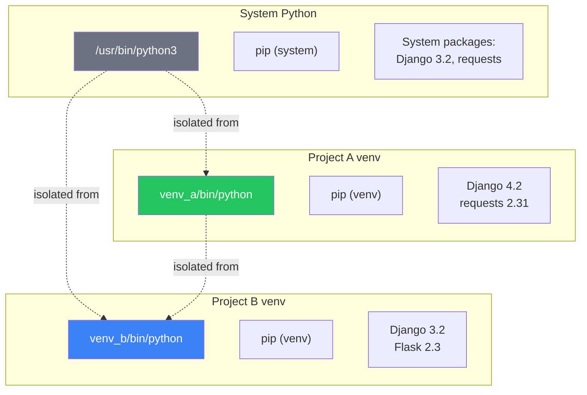
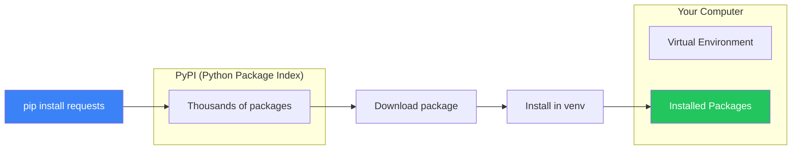
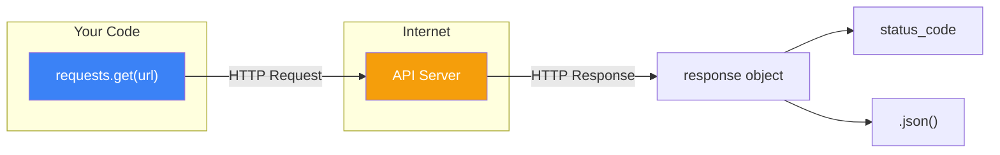
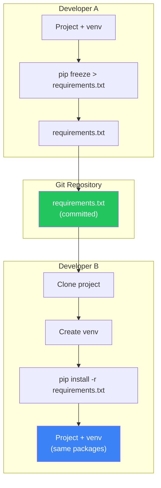

#  Virtual Environments والـ PIP: إدارة المكتبات والمشاريع

> **المتطلبات:** [[10-Modules-And-Packages]] — لازم تكون فاهم إزاي تنظم مشروعك في Modules و Packages. الفصل ده هيوريك إزاي تدير **المكتبات الخارجية** وتستخدم **Virtual Environments** عشان تعزل مشاريعك عن بعض.

---

## البداية — مشكلة تضارب الإصدارات

تخيّل معايا إنك شغال على مشروعين في نفس الوقت:

- **المشروع A (HireLink):** محتاج Django 4.2.
- **المشروع B (قديم):** محتاج Django 3.2.

لو ثبت Django 4.2 على جهازك كله، المشروع B هيقع. لو ثبت Django 3.2، المشروع A مش هيشتغل. إنت محتاج **تعزل** المشروعين عن بعض.

المشكلة التانية: إنت عايز تشارك مشروعك مع فريق. إزاي تخليهم يثبتوا نفس المكتبات بنفس الإصدارات اللي إنت شغال بيها؟

الحلول:
1. **Virtual Environment:** بيئة معزولة لكل مشروع. كل مشروع ليه مكتباته الخاصة.
2. **pip:** أداة إدارة المكتبات في Python. بتثبت، تحدث، وتشيل المكتبات.
3. **requirements.txt:** ملف بيحتوي على كل المكتبات وإصداراتها. أي حد ياخد المشروع يعرف يثبتهم بأمر واحد.

النهارده هنتعلم: إزاي نعمل Virtual Environment، نستخدم pip، نثبت مكتبات خارجية (زي `requests`)، ونعمل `requirements.txt`.

---

## [[01-Virtual-Environments]] — Virtual Environment: بيئة معزولة لكل مشروع

### 🧠 الشرح النظري

الـ **Virtual Environment** (أو `venv`) هو Folder بيحتوي على نسخة **معزولة** من Python و pip. كل مكتبة بتثبتها جوا الـ venv بتبقى محصورة في المشروع ده فقط. مش بتأثر على المشاريع التانية ولا على Python النظام.

**إزاي بيشتغل؟**
لما تنشط الـ venv، الـ terminal بتاعك بيغير الـ `PATH` عشان يشاور على Python و pip اللي جوا الـ venv بدل اللي على النظام.

**الأوامر الأساسية:**

| النظام | الأمر |
|---|---|
| **إنشاء venv** | `python -m venv myenv` |
| **تنشيط (Windows)** | `myenv\Scripts\activate` |
| **تنشيط (Mac/Linux)** | `source myenv/bin/activate` |
| **إلغاء التنشيط** | `deactivate` |
| **حذف venv** | امسح الـ folder |

**ليه نستخدم venv؟**
- **عزل:** كل مشروع ليه مكتباته الخاصة. مفيش تضارب إصدارات.
- **نظافة:** مكتبات المشروع مش بتتلخبط مع مكتبات النظام.
- **Portability:** تقدر تشارك المشروع وأي حد يعمل venv ويثبت نفس المكتبات.
- **Security:** مش محتاج صلاحيات admin عشان تثبت مكتبات.

تخيّل الـ venv زي **مطبخ خاص في شقتك**:
- **Python النظام:** مطعم كبير — أي حد بيطبخ فيه.
- **الـ venv:** مطبخ شقتك — إنت اللي بتطبخ فيه، بأدواتك الخاصة، ووصفاتك الخاصة. اللي بتعمله في مطبخك مش بيأثر على المطعم.

### 📊 Visualization



### 💻 Micro-Example

```bash
# ============= Terminal Commands =============

# 1. Create a virtual environment
python -m venv hirelink_env

# 2. Activate it
# On Windows:
hirelink_env\Scripts\activate

# On Mac/Linux:
source hirelink_env/bin/activate

# 3. Your terminal prompt changes to show the venv
# (hirelink_env) C:\Users\Ahmed\project>

# 4. Check which Python is being used
which python  # Mac/Linux
where python  # Windows
# Should show path inside hirelink_env

# 5. Install packages (only in this venv)
pip install requests

# 6. Deactivate when done
deactivate
```
<details>
<summary><b>📋 مثال إضافي: فحص الـ venv</b></summary>

```python
# Run this after activating your venv
import sys
print(f"Python executable: {sys.executable}")
print(f"Python version: {sys.version}")
print(f"Site packages: {sys.path}")

# You should see paths inside your venv folder
```
</details>

---

## [[02-PIP-Basics]] — pip: مدير الحزم في Python

### 🧠 الشرح النظري

**pip** هو أداة إدارة المكتبات (packages) في Python. بيسمحلك تثبت، تحدث، وتشيل مكتبات من **PyPI** (Python Package Index) — مستودع ضخم فيه آلاف المكتبات الجاهزة.

**الأوامر الأساسية:**

| الأمر | الوظيفة |
|---|---|
| `pip install package` | تثبيت مكتبة |
| `pip install package==1.2.3` | تثبيت إصدار محدد |
| `pip install package>=2.0` | تثبيت آخر إصدار أكبر من أو يساوي |
| `pip install --upgrade package` | تحديث مكتبة |
| `pip uninstall package` | إزالة مكتبة |
| `pip list` | عرض كل المكتبات المثبتة |
| `pip show package` | عرض تفاصيل مكتبة معينة |
| `pip freeze` | عرض المكتبات بصيغة `requirements.txt` |
| `pip install -r requirements.txt` | تثبيت كل المكتبات من ملف |

**إزاي pip بيشتغل؟**
لما تكتب `pip install requests`:
1. pip بيدور على `requests` في PyPI.
2. بينزل أحدث إصدار (أو الإصدار اللي حددته).
3. بيفك الضغط ويثبت المكتبة في الـ `site-packages` folder بتاع الـ Python (أو الـ venv لو منشط).
4. المكتبة بتبقى جاهزة للاستخدام (`import requests`).

**نصيحة:** دايمًا استخدم venv عشان متلخبطش مكتبات النظام.

تخيّل pip زي **متجر تطبيقات**:
- **PyPI:** المتجر كله (Google Play / App Store).
- **`pip install`:** إنك تنزل تطبيق من المتجر.
- **`pip list`:** التطبيقات المثبتة على جهازك.
- **`pip freeze`:** تعمل قائمة بالتطبيقات وإصداراتها عشان تشاركها مع صاحبك.

### 📊 Visualization



### 💻 Micro-Example

```bash
# ============= Terminal Commands =============

# Activate your venv first!

# Install a package
pip install requests

# Install specific version
pip install flask==2.3.0

# Install multiple packages
pip install numpy pandas matplotlib

# See what's installed
pip list

# See details about a package
pip show requests

# Upgrade a package
pip install --upgrade requests

# Uninstall
pip uninstall flask

# Save current packages to file
pip freeze > requirements.txt

# Install from requirements file
pip install -r requirements.txt
```

---

## [[03-Using-External-Libraries]] — استخدام مكتبة خارجية: `requests` مثالاً

### 🧠 الشرح النظري

بعد ما تثبت مكتبة بـ pip، تقدر تستخدمها في الكود بتاعك. هناخد `requests` كمثال — دي مكتبة قوية للتعامل مع HTTP requests (زي ما المتصفح بيعمل، لكن من الكود).

**ليه `requests`؟**
- أسهل بكتير من `urllib` (المكتبة المدمجة في Python).
- بتدعم كل أنواع الـ HTTP methods: GET, POST, PUT, DELETE.
- بتتعامل مع JSON تلقائياً.
- بتدعم الـ authentication، الـ sessions، والـ headers.

**الاستخدام الأساسي:**
```python
import requests

response = requests.get("https://api.example.com/data")
if response.status_code == 200:
    data = response.json()
    print(data)
```

**الـ HTTP Methods:**
- **GET:** تجيب بيانات. `requests.get(url)`.
- **POST:** تبعت بيانات (زي form). `requests.post(url, data={...})`.
- **PUT:** تعدل بيانات موجودة. `requests.put(url, json={...})`.
- **DELETE:** تحذف بيانات. `requests.delete(url)`.

تخيّل `requests` زي **ساعي بريد**:
- **GET:** "روح هاتلي الطرد من العنوان ده".
- **POST:** "خد الطرد ده ووصله للعنوان ده".
- **Response:** الساعي بيرجع ويقولك "وصلت" (status_code=200) أو "مش موجود" (404) أو "ممنوع" (403).

### 📊 Visualization



### 💻 Micro-Example

```python
import requests

# GET request
response = requests.get("https://api.github.com/users/octocat")
if response.status_code == 200:
    user_data = response.json()
    print(f"User: {user_data['login']}")
    print(f"Name: {user_data['name']}")
    print(f"Public repos: {user_data['public_repos']}")
else:
    print(f"Error: {response.status_code}")

# GET with parameters
response = requests.get(
    "https://api.github.com/search/repositories",
    params={"q": "language:python", "sort": "stars"}
)
if response.ok:
    data = response.json()
    print(f"\nTop Python repo: {data['items'][0]['full_name']}")

# POST request (example with a test API)
data = {"title": "Test Job", "body": "This is a test", "userId": 1}
response = requests.post("https://jsonplaceholder.typicode.com/posts", json=data)
if response.status_code == 201:
    print(f"\nCreated post with ID: {response.json()['id']}")

# Error handling
try:
    response = requests.get("https://httpbin.org/status/404")
    response.raise_for_status()  # Raises exception for 4xx/5xx
except requests.exceptions.RequestException as e:
    print(f"\nRequest failed: {e}")
```
<details>
<summary><b>📋 مثال إضافي: API Client بسيط</b></summary>

```python
import requests

class GitHubClient:
    BASE_URL = "https://api.github.com"
    
    def __init__(self, token=None):
        self.headers = {}
        if token:
            self.headers["Authorization"] = f"Bearer {token}"
    
    def get_user(self, username):
        url = f"{self.BASE_URL}/users/{username}"
        response = requests.get(url, headers=self.headers)
        response.raise_for_status()
        return response.json()
    
    def search_repos(self, query, max_results=5):
        url = f"{self.BASE_URL}/search/repositories"
        params = {"q": query, "per_page": max_results}
        response = requests.get(url, headers=self.headers, params=params)
        response.raise_for_status()
        return response.json()["items"]

client = GitHubClient()
repos = client.search_repos("language:python stars:>10000")
for repo in repos:
    print(f"⭐ {repo['stargazers_count']} - {repo['full_name']}")
```
</details>

---

## [[04-Requirements-File]] — `requirements.txt`: مشاركة بيئة المشروع

### 🧠 الشرح النظري

لما تخلص مشروع وعايز تشاركه مع فريق (أو ترفعه على GitHub)، مش هترفع الـ venv بتاعك (ده كبير وفيه ملفات system-specific). بدل كده، بتعمل **`requirements.txt`** — ملف نصي بسيط فيه كل المكتبات وإصداراتها.

**إزاي تعمله؟**
```bash
pip freeze > requirements.txt
```

الملف الناتج هيبقى شكله كده:
```
certifi==2024.2.2
charset-normalizer==3.3.2
idna==3.6
requests==2.31.0
urllib3==2.2.1
```

**إزاي تستخدمه؟**
أي حد ياخد المشروع، يعمل venv جديد، وينشطه، ويكتب:
```bash
pip install -r requirements.txt
```

ده هيثبت **نفس المكتبات بنفس الإصدارات** اللي إنت كنت شغال بيها.

**Best Practices:**
- **دايماً استخدم `requirements.txt`** في كل مشروع.
- حطه في Git (`git add requirements.txt`).
- **متحطش الـ venv folder في Git** (حطه في `.gitignore`).
- ممكن تعمل ملفات منفصلة: `requirements-dev.txt` لمكتبات التطوير، `requirements-prod.txt` للإنتاج.

تخيّل `requirements.txt` زي **وصفة طبخة**:
- **الوصفة:** `requirements.txt` (المقادير والإصدارات).
- **المطبخ:** الـ venv.
- **الطبخة:** المشروع.

لما تدي الوصفة لصاحبك، هو يقدر يعمل نفس الطبخة في مطبخه.

### 📊 Visualization



### 💻 Micro-Example

```bash
# ============= Terminal Commands =============

# 1. Create and activate venv
python -m venv venv
source venv/bin/activate  # or venv\Scripts\activate on Windows

# 2. Install packages you need
pip install requests flask python-decouple

# 3. Generate requirements.txt
pip freeze > requirements.txt

# 4. Look at the file
cat requirements.txt  # or type requirements.txt on Windows

# 5. Deactivate and delete venv (simulate fresh start)
deactivate
rm -rf venv  # or rmdir /s venv on Windows

# 6. Create fresh venv and install from requirements.txt
python -m venv venv
source venv/bin/activate
pip install -r requirements.txt

# 7. Verify packages are installed
pip list
```

---

## 🛠️ Progressive Exercise 11 — HireLink مع Virtual Environment ومكتبة `requests`

**المهمة:**
1. اعمل Virtual Environment جديد لمشروع HireLink.
2. ثبت مكتبة `requests` (وأي مكتبات تانية شايف إنك محتاجها).
3. أضف ميزة جديدة لـ HireLink: **Job Suggestions من API خارجي**.

**الميزة الجديدة:**
- استخدم [JSONPlaceholder](https://jsonplaceholder.typicode.com/) (API وهمي للاختبار).
- اعمل function `fetch_remote_jobs()` تجيب "وظايف" من `https://jsonplaceholder.typicode.com/posts` وتحولها لـ Job objects.
- أضفها للـ `Client` عشان يقدر "يستورد" وظايف من الـ API.
- اعمل `requirements.txt` للمشروع.

**🎯 جرب بنفسك:** افتح terminal واكتب الحل. لو اتعطلت، الحل تحت.


<details>
<summary><b>✨ اضغط هنا عشان تشوف الحل</b></summary>

```bash
# ============= Terminal Commands =============

# 1. Create and activate virtual environment
python -m venv hirelink_env

# On Windows:
hirelink_env\Scripts\activate

# On Mac/Linux:
source hirelink_env/bin/activate

# 2. Install required packages
pip install requests

# 3. Generate requirements.txt
pip freeze > requirements.txt

# requirements.txt will look like:
# certifi==2024.2.2
# charset-normalizer==3.3.2
# idna==3.6
# requests==2.31.0
# urllib3==2.2.1
```

```python
# ============= File: hirelink/services/job_importer.py =============
import requests
from ..models.job import Job
from ..exceptions import HireLinkError

class JobImporterError(HireLinkError):
    pass

def fetch_remote_jobs(client, limit=5):
    """
    Fetch remote jobs from JSONPlaceholder API and convert to Job objects.
    """
    url = "https://jsonplaceholder.typicode.com/posts"
    
    try:
        response = requests.get(url, timeout=5)
        response.raise_for_status()
    except requests.exceptions.Timeout:
        raise JobImporterError("Request timed out", code="TIMEOUT")
    except requests.exceptions.ConnectionError:
        raise JobImporterError("Failed to connect to API", code="CONNECTION_ERROR")
    except requests.exceptions.RequestException as e:
        raise JobImporterError(f"API request failed: {e}", code="API_ERROR")
    
    posts = response.json()[:limit]
    jobs = []
    
    for post in posts:
        # Create a Job from each post
        title = post['title'][:50]  # Truncate long titles
        budget = len(post['body']) * 10  # Fake budget based on body length
        
        job = Job(
            title=title,
            budget=budget,
            client=client
        )
        jobs.append(job)
    
    return jobs

def search_github_jobs(client, keyword="python", limit=5):
    """
    Search GitHub jobs (using public API) and convert to Job objects.
    """
    url = "https://jobs.github.com/positions.json"  # Note: This API may be deprecated
    # Alternative: use a mock API or different service
    
    # For demo, we'll use JSONPlaceholder with search params
    url = "https://jsonplaceholder.typicode.com/posts"
    
    try:
        response = requests.get(url, timeout=5)
        response.raise_for_status()
    except requests.exceptions.RequestException as e:
        raise JobImporterError(f"API request failed: {e}", code="API_ERROR")
    
    posts = response.json()
    
    # Filter posts containing the keyword
    filtered = [p for p in posts if keyword.lower() in p['title'].lower()][:limit]
    
    jobs = []
    for post in filtered:
        job = Job(
            title=f"[GitHub] {post['title'][:40]}",
            budget=500 + (len(post['body']) % 10) * 100,
            client=client
        )
        jobs.append(job)
    
    return jobs
```

```python
# ============= Updated: hirelink/models/client.py =============
from .user import User
from .job import Job
from ..exceptions import ValidationError
from ..utils import get_logger

logger = get_logger()

class Client(User):
    def __init__(self, username, email, password, company):
        super().__init__(username, email, password)
        self.company = company
        self.verified = False
        self.posted_jobs = []
    
    def post_job(self, title, budget):
        if budget <= 0:
            raise ValidationError("budget", "Budget must be positive")
        
        job = Job(title, budget, self)
        self.posted_jobs.append(job)
        logger.info(f"Client {self.username} posted job: '{title}' (${budget})")
        print(f"✅ Job '{title}' posted by {self.username}")
        return job
    
    def import_remote_jobs(self, limit=5):
        """Import jobs from remote API."""
        from ..services.job_importer import fetch_remote_jobs, JobImporterError
        
        try:
            print(f"\n🌐 Fetching {limit} remote jobs...")
            remote_jobs = fetch_remote_jobs(self, limit)
            
            for job in remote_jobs:
                self.posted_jobs.append(job)
                print(f"   📥 Imported: {job.title} (${job.budget})")
            
            logger.info(f"Client {self.username} imported {len(remote_jobs)} remote jobs")
            print(f"✅ Successfully imported {len(remote_jobs)} jobs!")
            
        except JobImporterError as e:
            print(f"❌ Failed to import jobs [{e.code}]: {e}")
            logger.error(f"Job import failed: {e}")
    
    def get_profile(self):
        profile = super().get_profile()
        profile.update({
            "type": "client",
            "company": self.company,
            "verified": self.verified,
            "jobs_posted": len(self.posted_jobs)
        })
        return profile
```

```python
# ============= Updated: hirelink/main.py =============
from hirelink import Client, Freelancer, setup_logger
from hirelink.exceptions import HireLinkError

def main():
    # Setup logger
    logger = setup_logger()
    logger.info("HireLink system started")
    
    print("=" * 60)
    print("🎯 HireLink with Virtual Environment & Remote API")
    print("=" * 60)
    
    try:
        print("\n--- Creating Users ---")
        client = Client("ahmed_dev", "ahmed@techcorp.com", "pass123", "TechCorp")
        freelancer = Freelancer("sara_py", "sara@freelance.com", "pass456", 
                               ["Python", "Django"], 50)
        
        print("\n--- Posting Manual Job ---")
        job1 = client.post_job("Backend Developer", 5000)
        
        print("\n--- Importing Remote Jobs ---")
        client.import_remote_jobs(limit=3)
        
        print(f"\n--- Client Profile ---")
        print(f"Total jobs posted: {len(client.posted_jobs)}")
        for i, job in enumerate(client.posted_jobs, 1):
            print(f"  {i}. {job}")
        
        print("\n--- Applying to Remote Job ---")
        if len(client.posted_jobs) > 1:
            remote_job = client.posted_jobs[1]  # First imported job
            app = freelancer.apply_to_job(remote_job, "Interested in this remote position!")
            print(f"   Application status: {app.status}")
        
    except HireLinkError as e:
        print(f"❌ HireLink error [{e.code}]: {e}")
        logger.error(f"HireLink error: {e}")
    except Exception as e:
        print(f"❌ Unexpected error: {e}")
        logger.error(f"Unexpected error: {e}", exc_info=True)
    
    print("\n" + "=" * 60)
    print("✅ Program completed (check hirelink.log)")
    print("=" * 60)

if __name__ == "__main__":
    main()
```

```python
# ============= File: .gitignore =============
# Virtual Environment
venv/
env/
hirelink_env/
ENV/

# Python cache
__pycache__/
*.pyc

# Logs
*.log

# IDE
.vscode/
.idea/

# Environment variables
.env
```

```bash
# ============= Project Structure After PE-11 =============
# hirelink_project/
# ├── .gitignore
# ├── requirements.txt
# ├── hirelink/
# │   ├── __init__.py
# │   ├── main.py
# │   ├── models/
# │   │   ├── __init__.py
# │   │   ├── user.py
# │   │   ├── client.py
# │   │   ├── freelancer.py
# │   │   ├── job.py
# │   │   └── application.py
# │   ├── services/
# │   │   ├── __init__.py
# │   │   └── job_importer.py
# │   ├── exceptions/
# │   │   ├── __init__.py
# │   │   └── custom.py
# │   └── utils/
# │       ├── __init__.py
# │       └── logger.py
# └── hirelink_env/  (not in Git)
```

**لتشغيل المشروع من البداية على جهاز جديد:**
```bash
# 1. Clone the repository
git clone <repository-url>
cd hirelink_project

# 2. Create virtual environment
python -m venv hirelink_env

# 3. Activate it
# Windows: hirelink_env\Scripts\activate
# Mac/Linux: source hirelink_env/bin/activate

# 4. Install dependencies
pip install -r requirements.txt

# 5. Run the project
python -m hirelink.main
```
</details>

---

## 📝 خلاصة الدرس

- **Virtual Environment (`venv`):** بيئة Python معزولة. `python -m venv env`. تنشيط: `source env/bin/activate` (Mac/Linux) أو `env\Scripts\activate` (Windows). إلغاء: `deactivate`.
- **pip:** مدير الحزم. `pip install package`, `pip uninstall package`, `pip list`, `pip freeze`.
- **مكتبة `requests`:** للتعامل مع HTTP requests. `requests.get(url)`, `response.json()`, `response.raise_for_status()`.
- **`requirements.txt`:** ملف بكل المكتبات وإصداراتها. `pip freeze > requirements.txt`. `pip install -r requirements.txt`.
- **`.gitignore`:** استبعاد الـ venv والملفات المؤقتة من Git.

---

*Next → [[12-30-Interview-Questions]] — خلصنا Phase 0! دلوقتي معاك ٣٠ سؤال إنترفيو (مع إجاباتها) في أساسيات Python و OOP والـ modules والـ virtual environments. الأسئلة اللي هتسألها في أي إنترفيو Junior Python Developer.*