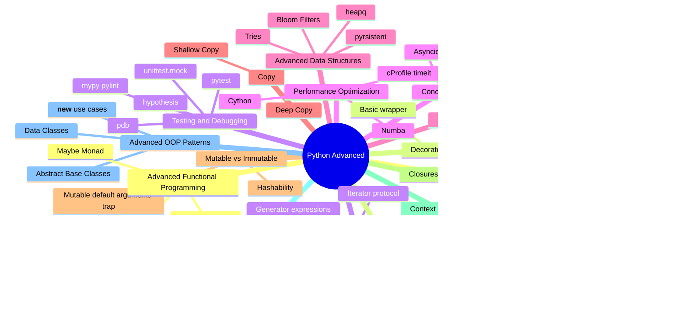

# الفصل الإضافي — Python Advanced: الحاجات اللي بتفرق بين "عارف بايثون" و"محترف بايثون"

> **المتطلبات:** [[Python Cheat Sheet - InterviewBit]] — لازم تكون مراجع الأساسيات (data types, lists, dicts, comprehensions, exceptions) قبل ما تدخل هنا، لأننا هنبني فوقها مباشرة.

---

## البداية — ليه الشيت اللي عندك مش كفاية؟

تخيّل معايا: انت في الإنترفيو، جاوبت صح على كل أسئلة الـ basics — الفرق بين list و tuple، إزاي تعمل loop، إزاي تعمل try/except. المحاور مبسوط، وبعدين يقولك:

> "طب قولّي، الـ GIL ده بيأثر إزاي على الـ multithreading؟"
> "إيه الفرق بين `@staticmethod` و `@classmethod`؟"
> "اكتب لي decorator بسيط يقيس وقت تنفيذ الفنكشن."

وهنا بيبقى الصمت... مش لأنك مش فاهم بايثون، لأن الحاجات دي مش "بايثون الأساسي" — دي **بايثون اللي بتفرق بين اللي درس الكورس واللي شغّال فعلاً**. أي انترفيو "دسم" بيدخل في المنطقة دي بالذات، لأنها بتكشف هل انت فاهم إزاي اللغة شغالة من جوه، ولا حافظ syntax بس.

> بدل ما تتفاجئ بيهم في الإنترفيو بكرا — إحنا هنمشيهم مع بعض دلوقتي، واحد واحد.

---

## [[OOP]] — الكلاسات مش مجرد `class` وخلاص

### تخيّل الكلاس بيت، والـ object شقة فيه

الكلاس هو المخطط الهندسي (blueprint)، والـ object هو الشقة الفعلية اللي اتبنت بناءً على المخطط ده. تقدر تعمل ألف شقة من نفس المخطط، كل واحدة عندها بياناتها الخاصة (state) لكن بتتبني بنفس الطريقة.

```python
class SalesAgent:
    company = "Inbox Sales Copilot"  # class attribute, shared across all objects

    def __init__(self, name, deals):
        self.name = name    # instance attribute, unique to each object
        self.deals = deals

agent1 = SalesAgent("Mohamed", 5)
agent2 = SalesAgent("Nagy", 3)
print(agent1.company, agent2.company)  # same value, because it's a class attribute
```

### `__init__` مش الـ constructor الحقيقي — `__new__` هو

النقطة اللي بتلخبط ناس كتير: بايثون بتعمل خطوتين مش خطوة واحدة لما تعمل object جديد:

```
SalesAgent("Mohamed", 5)
         ↓
   __new__()  <- this is what actually allocates the object in memory
         ↓
   __init__() <- this just initializes the values after the object is created
```

`__new__` نادراً ما تحتاجه إلا في حالات خاصة زي الـ Singleton pattern أو لما بترث من نوع immutable زي `str` أو `tuple`.

> **نصيحة الخبراء:** لو المحاور سألك "إيه الفرق بين `__new__` و `__init__`" وانت جاوبت "زي بعض" — ده بيبين إنك حافظ مش فاهم. `__new__` بيرجع الـ object، `__init__` بياخده ويظبطه.

---

### Magic Methods — إزاي تخلي الـ object بتاعك "يتصرف" زي أنواع بايثون الأصلية

```python
class Deal:
    def __init__(self, name, value):
        self.name = name
        self.value = value

    def __repr__(self):
        # this is what gets printed when you do print(deal) or type it in the console
        return f"Deal({self.name}, {self.value})"

    def __eq__(self, other):
        # defines how Python compares two objects using ==
        return self.value == other.value

    def __add__(self, other):
        # makes + work between two objects of your custom type
        return Deal("Combined", self.value + other.value)

d1 = Deal("Contract A", 1000)
d2 = Deal("Contract B", 2000)
print(d1 + d2)  # Deal(Combined, 3000)
```

| Method | بيتفعّل لما... |
|---|---|
| `__str__` | تعمل `print(obj)` أو `str(obj)` |
| `__repr__` | تكتب اسم المتغير في الـ console (debugging) |
| `__eq__` | تستخدم `==` |
| `__len__` | تستخدم `len(obj)` |
| `__getitem__` | تستخدم `obj[0]` |
| `__call__` | تستخدم `obj()` — تخلي الـ object نفسه "قابل للاستدعاء" زي الفنكشن |

> ده من أهم الأسئلة اللي بتتسأل عشان تشوف هل فاهم إن كل حاجة في بايثون هي object، وإن الـ operators زي `+` و `==` هي فعلياً method calls متخفية.

---

### `@staticmethod` vs `@classmethod` vs Instance Method

المصدر الأساسي للّخبطة. خليك معايا في الفرق العملي:

```python
class Deal:
    total_deals = 0

    def __init__(self, value):
        self.value = value
        Deal.total_deals += 1

    def show(self):
        # Instance method: takes self, operates on a specific object
        print(f"Deal value: {self.value}")

    @classmethod
    def from_dict(cls, data):
        # Classmethod: takes cls (the class itself) instead of self
        # commonly used as an "alternative constructor"
        return cls(data["value"])

    @staticmethod
    def is_valid(value):
        # Staticmethod: takes neither self nor cls
        # a regular function that logically belongs to the class
        return value > 0
```

| | Instance Method | `@classmethod` | `@staticmethod` |
|---|---|---|---|
| بياخد | `self` | `cls` | لا حاجة |
| بيوصل لـ | data الخاصة بالـ object | attributes الكلاس نفسه | ولا حاجة |
| بيتستخدم لـ | العمليات اللي محتاجة الـ instance | alternative constructors | helper functions منطقياً تابعة للكلاس |

> **مثال حقيقي:** `datetime.now()` هي classmethod — بترجعلك instance جديد بطريقة بديلة عن `datetime()` العادي.

---

### Inheritance و الـ MRO (Method Resolution Order) — سؤال السنيورز المفضّل

```python
class Base:
    def greet(self):
        return "Base"

class Left(Base):
    def greet(self):
        return "Left"

class Right(Base):
    def greet(self):
        return "Right"

class Child(Left, Right):
    pass

c = Child()
print(c.greet())        # "Left" <- looks up Left first
print(Child.mro())      # [Child, Left, Right, Base, object]
```

المشكلة دي اسمها **Diamond Problem** — لما كلاس بيرث من اتنين ورثوا من نفس الأب، بايثون محتاجة نظام واضح تقرر بيه مين تسأل الأول. بايثون بتستخدم خوارزمية اسمها **C3 Linearization** عشان تبني الترتيب ده، وتقدر تشوفه بنفسك بـ `.mro()` أو `.__mro__`.

```
        Base
       /    \
    Left    Right
       \    /
       Child
```

> ⚠️ **انتبه:** لو المحاور سألك "هيتنفذ إيه لو عندك تعارض في الـ multiple inheritance؟" الإجابة الصح مش "بايثون بتختار عشوائي" — الإجابة إن فيه ترتيب محدد ومنطقي اسمه MRO وبيتحسب بـ C3 linearization.

---

## ✅ Checkpoint سريع — OOP

**س: إيه الفرق بين `__new__` و `__init__`؟**
> `__new__` هو اللي فعلياً بيعمل allocate للـ object في الميموري ويرجّعه، و`__init__` بياخد الـ object ده بعد ما اتعمل ويهيّئ الـ attributes بتاعته. `__new__` بيتنفذ الأول.

**س: امتى تستخدم `@classmethod` بدل `@staticmethod`؟**
> تستخدم `classmethod` لما محتاج توصل للكلاس نفسه (زي alternative constructors)، وتستخدم `staticmethod` لما الفنكشن مش محتاج يوصل لا للـ instance ولا للكلاس، وبس منطقياً بينتمي للكلاس ده.

**س: إيه هو الـ MRO وليه مهم؟**
> هو الترتيب اللي بايثون بتتبعه لما تدور على method في hierarchy فيها multiple inheritance. مهم عشان يحل مشكلة الـ Diamond Problem، ومبني على خوارزمية C3 Linearization.

---

## [[Decorators]] — الوظيفة اللي بتلبس وظيفة تانية "جاكيت"

### المشكلة اللي الديكوريتور بيحلها

تخيّل عندك عشرة functions، وعايز تضيف "طباعة log قبل وبعد كل واحدة فيهم" — من غير ما تعدّل جوه كل function. هتعمل إيه؟ تنسخ نفس الكود جوه كل واحدة؟ ده بالظبط اللي الـ decorator بيحله.

```python
def log_decorator(func):
    def wrapper(*args, **kwargs):
        print(f"Before {func.__name__}")
        result = func(*args, **kwargs)   # the original function actually runs here, inside the wrapper
        print(f"After {func.__name__}")
        return result
    return wrapper

@log_decorator
def process_deal(value):
    return value * 2

process_deal(100)
# Before process_deal
# After process_deal
```

> **بمعنى آخر:** `@log_decorator` فوق `process_deal` هو اختصار لـ:
> `process_deal = log_decorator(process_deal)`

### تخيّل الديكوريتور "علبة هدية"

الفنكشن الأصلي جواها زي هو بالظبط، بس انت لفيته بورق هدية (logic إضافي) قبل ما يوصل للمستخدم. الفنكشن نفسه معملوش أي تعديل.

```
process_deal(100)
      ↓
تنادي wrapper() بدل process_deal مباشرة
      ↓
تطبع "Before"
      ↓
تنفذ الفنكشن الأصلي جوه
      ↓
تطبع "After"
      ↓
ترجع النتيجة ✅
```

### Decorator بياخد Arguments — درجة صعوبة أعلى

```python
def retry(times):
    # this is a function that returns a decorator, not a decorator itself
    def decorator(func):
        def wrapper(*args, **kwargs):
            for attempt in range(times):
                try:
                    return func(*args, **kwargs)
                except Exception as e:
                    print(f"Attempt {attempt + 1} failed: {e}")
            raise Exception("All attempts failed")
        return wrapper
    return decorator

@retry(times=3)
def fetch_gmail_thread(thread_id):
    # if it fails, it will retry 3 times before raising an exception
    ...
```

> **نصيحة الخبراء:** لو حسيت الديكوريتور اللي بياخد arguments لخبطك، افتكر القاعدة: **3 مستويات من الـ functions** — الأول بياخد الـ arguments بتاعة الديكوريتور، التاني بياخد الفنكشن نفسه، التالت هو اللي بيتنفذ فعلياً.

### `functools.wraps` — التفصيلة اللي الجونيورز بينسوها

```python
from functools import wraps

def log_decorator(func):
    @wraps(func)  # without this, func.__name__ becomes "wrapper" instead of the real name
    def wrapper(*args, **kwargs):
        return func(*args, **kwargs)
    return wrapper
```

### `functools.lru_cache` — Decorator جاهز للـ Memoization

```python
from functools import lru_cache

@lru_cache(maxsize=128)
def fibonacci(n):
    if n < 2:
        return n
    return fibonacci(n - 1) + fibonacci(n - 2)
# any call with the same input returns straight from the cache without recomputing
```

---

## ✅ Checkpoint سريع — Decorators

**س: إيه هو الديكوريتور وليه بنستخدمه؟**
> فنكشن بياخد فنكشن تاني كـ argument، وبيرجع فنكشن جديد بيضيف سلوك إضافي قبل أو بعد تنفيذ الأصلي، من غير ما يعدّل كوده. بيتستخدم كتير في logging, authentication, caching, timing.

**س: اكتب decorator بسيط يحسب وقت تنفيذ فنكشن.**
> ```python
> import time
> from functools import wraps
>
> def timer(func):
>     @wraps(func)
>     def wrapper(*args, **kwargs):
>         start = time.time()
>         result = func(*args, **kwargs)
>         print(f"{func.__name__} took {time.time() - start:.4f}s")
>         return result
>     return wrapper
> ```

**س: إيه أكبر غلطة الجونيورز بيعملوها في الديكوريتورز؟**
> بينسوا `functools.wraps`، فيخسروا الـ metadata الأصلية بتاعة الفنكشن (زي `__name__` و `__doc__`) — وده بيبوّظ الـ debugging والـ introspection.

---

## [[Generators و Iterators]] — إزاي تتعامل مع بيانات أكبر من الرام

### تخيّل معايا: عندك ملف حجمه 10 جيجا، والرام بتاعتك 8 جيجا بس

لو عملت `list` فيه كل البيانات، البرنامج هيكراش. الحل: **ما تحمّلش كل حاجة مرة واحدة — حمّل عنصر واحد بس، اشتغل عليه، وارميه، وكرر.**

```python
def read_large_file(path):
    with open(path) as f:
        for line in f:
            yield line   # returns one line at a time, never loads the whole file into RAM
```

### الفرق بين Iterator و Generator

| | Iterator | Generator |
|---|---|---|
| إزاي بيتعمل | كلاس فيها `__iter__` و `__next__` | فنكشن فيها `yield` |
| الكود | أطول ومحتاج boilerplate | قصير ومباشر |
| كل generator هو | — | iterator (بس مش العكس) |

```python
# Iterator the long way (as a class)
class CountUp:
    def __init__(self, limit):
        self.limit = limit
        self.current = 0

    def __iter__(self):
        return self

    def __next__(self):
        if self.current >= self.limit:
            raise StopIteration
        self.current += 1
        return self.current

# the exact same thing, but as a generator
def count_up(limit):
    current = 0
    while current < limit:
        current += 1
        yield current
```

> **بمعنى آخر:** الـ generator هو اختصار بايثون الرسمي عشان متكتبش كلاس iterator كامل كل مرة.

### `yield` مش زي `return` خالص

```
الفنكشن العادي: return
      ↓
بيتنفذ لحد آخر سطر
      ↓
بيرجع النتيجة النهائية
      ↓
الفنكشن بيخلص خالص ❌

الـ Generator: yield
      ↓
بيتوقف عند yield
      ↓
بيرجع القيمة دي بس
      ↓
لما تنادي next() تاني
      ↓
بيكمل من نفس المكان اللي وقف فيه (حالته محفوظة) ✅
```

### Generator Expression — نسخة الـ list comprehension المُقتصدة في الرام

```python
squares_list = [i**2 for i in range(1000000)]   # loads all one million numbers into RAM right now
squares_gen  = (i**2 for i in range(1000000))   # computes each number only when you ask for it
```

---

## ✅ Checkpoint سريع — Generators

**س: امتى تستخدم generator بدل list؟**
> لما البيانات كبيرة جداً أو ملهاش نهاية معروفة (زي stream)، أو لما مش محتاج كل القيم في نفس الوقت — الـ generator بيوفر رام لأنه بيحسب كل قيمة وقت الطلب بس (lazy evaluation).

**س: إزاي الـ generator بيحتفظ بحالته بين كل استدعاء؟**
> بايثون بتحفظ الـ execution state بتاع الفنكشن (مكان الوقوف، قيم المتغيرات المحلية) في الذاكرة، وكل ما تنادي `next()` بيكمل من نفس النقطة بدل ما يبدأ من الأول.

---

## [[GIL و الـ Concurrency]] — أشهر سؤال في أي انترفيو بايثون

### تخيّل معايا: مطبخ فيه شيف واحد بس، مهما زودت عدد الأوردرات

الـ **GIL (Global Interpreter Lock)** هو قفل (mutex) موجود في CPython (النسخة الرسمية من بايثون) بيمنع أكتر من thread واحد إنه ينفذ Python bytecode في نفس اللحظة بالظبط — حتى لو عندك بروسيسور بـ 8 cores.

```
Thread 1 عايز ينفذ كود بايثون
      ↓
بياخد الـ GIL (القفل)
      ↓
Thread 2 و 3 بينتظروا (حتى لو فاضيين على cores تانية)
      ↓
Thread 1 يخلص أو يستنى I/O
      ↓
يسيب القفل
      ↓
Thread تاني ياخده وينفذ ✅
```

### طب ليه بايثون عاملة كده؟

الـ GIL موجود عشان يبسّط الـ memory management (بالتحديد reference counting) ويخلي التعامل مع C extensions أسهل وأأمن. الميزة دي جت بثمن: **مفيش true parallelism للكود اللي CPU-bound.**

### إمتى الـ GIL بيبقى مشكلة، وإمتى لأ؟

| نوع الشغلانة | مثال | الـ GIL بيأثر؟ |
|---|---|---|
| **I/O-bound** | API calls, قراءة ملفات, database queries | لأ — الـ thread بتسيب الـ GIL وهي مستنية الـ I/O، فـ threading مفيد هنا |
| **CPU-bound** | حسابات رياضية ضخمة, image processing | أيوه — الـ threads بتقف في الطابور على بعض، مفيش استفادة حقيقية |

```python
import threading
import multiprocessing

# Threading is useful here (I/O-bound)
def fetch_email(thread_id):
    response = requests.get(f"/gmail/{thread_id}")  # waiting on the network
    return response

# Multiprocessing is useful here (CPU-bound) - each process has its own Python interpreter and its own separate GIL
def heavy_computation(data):
    return sum(x**2 for x in data)

with multiprocessing.Pool(4) as pool:
    results = pool.map(heavy_computation, chunks_of_data)
```

> **نصيحة الخبراء:** لو المحاور سألك "إزاي تسرّع كود CPU-heavy في بايثون؟" ماتقولش "استخدم threading" — دي غلطة كلاسيكية. الإجابة الصح: `multiprocessing` (كل process معاها GIL منفصل، فبتشتغل فعلياً على cores مختلفة بالتوازي).

### Asyncio — الحل التالت للـ I/O-bound

`asyncio` بيدّيك concurrency من غير ما يستخدم threads أصلاً — كله بيشتغل على thread واحد، لكن بيتنقل بين المهام وقت الانتظار (زي انتظار response من API) بدل ما يقعد يستنى فاضي.

```python
import asyncio

async def fetch_thread(thread_id):
    await asyncio.sleep(1)  # yields control to another task while it waits
    return f"Thread {thread_id} fetched"

async def main():
    results = await asyncio.gather(
        fetch_thread(1), fetch_thread(2), fetch_thread(3)
    )
    print(results)

asyncio.run(main())
```

| | Threading | Multiprocessing | Asyncio |
|---|---|---|---|
| مناسب لـ | I/O-bound (بسيط) | CPU-bound | I/O-bound (كثافة عالية من المهام) |
| الـ GIL بيأثر؟ | أيوه، لكن مش مشكلة (I/O بيسيب القفل) | لأ، كل process معاها GIL خاص | مش وارد أصلاً — thread واحد |
| overhead | متوسط | عالي (كل process ليها ذاكرة منفصلة) | منخفض جداً |

---

## ✅ Checkpoint سريع — GIL & Concurrency

**س: إيه هو الـ GIL بالظبط؟**
> Mutex في CPython بيضمن إن thread واحد بس ينفذ Python bytecode في أي لحظة، حتى لو عندك أكتر من core. بيبسّط memory management بس بيقيّد الـ true parallelism.

**س: إزاي تسرّع عملية حسابية تقيلة في بايثون؟**
> بـ `multiprocessing` مش `threading` — لأن كل process في الـ multiprocessing معاها Python interpreter و GIL منفصلين، فبتشتغل فعلياً بالتوازي على cores مختلفة.

**س: ليه threading لسه مفيد رغم الـ GIL؟**
> لأن في المهام الـ I/O-bound (زي API calls أو قراءة ملفات)، الـ thread بتسيب الـ GIL وهي مستنية الـ I/O يخلص، فتحصل استفادة حقيقية من التبديل بين المهام.

---

## [[Memory Management]] — إزاي بايثون بتنضّف وراها

### Reference Counting — العدّاد اللي بيتابع كل object

كل object في بايثون معاه عدّاد بيتابع كام حاجة بتشاور عليه. لما العدّاد يوصل صفر، بايثون بتفضي الذاكرة تلقائياً.

```python
import sys

a = SalesAgent("Mohamed", 5)
print(sys.getrefcount(a))  # number of references to a

b = a  # the refcount just went up by one, because b now points to the same object
del a  # the refcount goes down by one, but the object still exists because b still points to it
```

### طب ليه محتاجين Garbage Collector كمان لو عندنا Reference Counting؟

المشكلة: **Circular References** — لما اتنين objects بيشاوروا على بعض، العدّاد بتاعهم مش هيوصل صفر أبداً حتى لو محدش تاني بيستخدمهم.

```python
class Node:
    def __init__(self):
        self.next = None

a = Node()
b = Node()
a.next = b  # a points to b
b.next = a  # b points to a <- a closed cycle, refcount can never reach zero
```

هنا بيدخل الـ **Generational Garbage Collector** (module اسمه `gc`)، بيفحص دورياً عشان يلاقي الدوائر المقفولة دي ويفضّيها.

```python
import gc
print(gc.get_count())  # (gen0, gen1, gen2) <- number of objects in each generation
```

### `__slots__` — لما تحتاج تقلل استهلاك الرام

كل object افتراضياً بيستخدم `__dict__` عشان يخزّن الـ attributes بتاعته، وده بياخد رام زيادة. لو عندك ملايين الـ objects من نفس الكلاس، `__slots__` بيوفّر حجم كبير.

```python
class Point:
    __slots__ = ('x', 'y')  # prevents creating a __dict__, and fixes the allowed attributes in advance
    def __init__(self, x, y):
        self.x = x
        self.y = y
```

---

## [[Shallow Copy vs Deep Copy]] — الفخ الأشهر في المقابلات

### تخيّل معايا: عندك ملف Excel، وعملتله "Save As" نسخة تانية

لو الملف فيه شيت واحد بس، النسخة الجديدة مستقلة تماماً. بس لو الملف فيه link لملف تاني جواه (زي embedded object)، النسخة الجديدة والقديمة هيفضلوا بيشاوروا على *نفس* الملف الداخلي ده — تعديل واحد بيأثر على التاني.

```python
import copy

original = [[1, 2], [3, 4]]

shallow = copy.copy(original)      # shallow copy: new outer list, but the inner lists are still shared
deep = copy.deepcopy(original)     # full copy: everything inside got copied independently

original[0][0] = 99

print(shallow)  # [[99, 2], [3, 4]] <- affected! because the inner list is shared
print(deep)     # [[1, 2], [3, 4]]  <- not affected at all
```

```
Shallow Copy:
original ──┐
            +--> [inner_list_1, inner_list_2]  <- the exact same objects
shallow  ──┘

Deep Copy:
original ──► [inner_list_1, inner_list_2]
deep     --> [inner_list_1_copy, inner_list_2_copy]  <- brand new objects
```

> ⚠️ **انتبه:** لو الليست بتاعتك فيها عناصر immutable بس (أرقام، strings)، الـ shallow copy هتكفي وهتبقى أسرع. المشكلة بتظهر بس لما يكون فيه nested mutable objects (lists جوه lists، dicts جوه dicts).

---

## [[Mutable vs Immutable]] — ليه مش أي حاجة تقدر تبقى مفتاح Dictionary

### الفرق الجوهري

| Mutable (قابل للتعديل) | Immutable (ثابت) |
|---|---|
| `list`, `dict`, `set` | `str`, `int`, `float`, `tuple`, `frozenset` |
| ممكن تتعدّل بعد الإنشاء | لو عايز تغيّرها، بتتعمل نسخة جديدة |
| مش hashable (غالباً) | hashable (غالباً) |

```python
# not allowed - can't use a list as a dictionary key
lookup = {[1, 2]: "coordinate"}
# TypeError: unhashable type: 'list'

# fine - tuple works, because it's immutable
lookup = {(1, 2): "coordinate"}
```

> **ليه بالظبط؟** الـ dictionary بيحتاج الـ key يبقى ليها **hash value ثابت** طول الوقت عشان تقدر تلاقيها بسرعة في الـ hash table. لو الـ key عبارة عن list وقابلة للتعديل، الـ hash بتاعها ممكن يتغيّر بعد ما تضيفها، وده هيبوّظ كل نظام البحث.

### الفخ الكلاسيكي — Mutable Default Arguments

```python
# a very common mistake
def add_deal(deal, deals_list=[]):
    deals_list.append(deal)
    return deals_list

print(add_deal("Deal A"))  # ['Deal A']
print(add_deal("Deal B"))  # ['Deal A', 'Deal B'] <- !! not ['Deal B'] as expected

# the correct way
def add_deal(deal, deals_list=None):
    if deals_list is None:
        deals_list = []
    deals_list.append(deal)
    return deals_list
```

> بايثون بتعمل الـ default argument مرة واحدة بس وقت تعريف الفنكشن، مش كل استدعاء — فلو كان mutable، هيفضل نفس الـ object بيتراكم عليه بين كل الاستدعاءات.

---

## [[Closures]] — الفنكشن اللي "فاكرة" بيئتها

### تخيّل معايا: فنكشن رجعتله فنكشن تاني، والتاني ده "متفكرش" المتغيرات بتاعت الأول

```python
def make_multiplier(factor):
    def multiplier(number):
        return number * factor   # factor isn't defined here, but it's "remembered" from the outer function
    return multiplier

double = make_multiplier(2)
triple = make_multiplier(3)

print(double(5))  # 10
print(triple(5))  # 15
```

الفنكشن `multiplier` بيتفكر قيمة `factor` حتى بعد ما `make_multiplier` خلصت تنفيذها تماماً — ده اسمه **closure**، وهو الأساس اللي مبني عليه الـ decorators.

> **بمعنى آخر:** الـ closure بيحصل لما فنكشن داخلية بتستخدم متغير من الفنكشن الخارجية اللي فيها، والفنكشن الخارجية بترجّع الفنكشن الداخلية دي. بايثون بتحتفظ بالمتغير في الذاكرة عشان الفنكشن الداخلية لسه محتاجاه.

---

## [[Context Managers]] — إيه اللي بيحصل فعلياً وراء `with`

### مش بس `open()` — تقدر تعمل واحد بنفسك

```python
class DatabaseConnection:
    def __enter__(self):
        # runs when you enter the with block
        print("Opening connection")
        self.conn = "fake_connection"
        return self.conn

    def __exit__(self, exc_type, exc_value, traceback):
        # always runs when you leave the with block, even if an exception happened
        print("Closing connection")
        # returning True here would suppress the exception; False lets it propagate normally

with DatabaseConnection() as conn:
    print(f"Using {conn}")
# Opening connection
# Using fake_connection
# Closing connection <- runs even if an error happened inside the with block
```

```
دخول with
   ↓
__enter__() بيتنفذ
   ↓
كود الـ block بيتنفذ
   ↓
حصل exception؟ ─── أيوه ──► __exit__() بيتنفذ برضه (cleanup مضمون)
   │
  لأ
   ↓
__exit__() بيتنفذ عادي
```

> **نصيحة الخبراء:** الـ context manager هو الحل الرسمي لأي حاجة محتاجة "setup ثم cleanup مضمون" — فتح ملفات، database connections، locks. الميزة الحقيقية إن الـ cleanup مضمون **حتى لو حصل exception** — ده اللي بيفرقه عن مجرد كتابة `.close()` عادي في آخر الكود.

### نسخة أبسط بـ `contextlib`

```python
from contextlib import contextmanager

@contextmanager
def db_connection():
    print("Opening connection")
    yield "fake_connection"   # everything before yield acts like __enter__, everything after (if any) like __exit__
    print("Closing connection")

with db_connection() as conn:
    print(f"Using {conn}")
```

---

## [[Metaprogramming]] — الكود اللي بيكتب أو بيتحكم في كود تاني

### تخيّل معايا: مصنع بيصنع مصانع

الكلاس العادي بيصنع objects. الـ **metaclass** بيصنع classes نفسها. يعني لو الكلاس هو "المصنع اللي بيطلّع منتجات"، الـ metaclass هو "المصنع اللي بيطلّع مصانع". غريبة؟ آه، لكنها أداة قوية جداً في الـ frameworks الكبيرة (Django ORM مبني عليها، مثلاً).

```python
class UppercaseMeta(type):
    def __new__(mcs, name, bases, namespace):
        # any attribute defined without a leading underscore gets its name uppercased
        uppercase_namespace = {
            (key.upper() if not key.startswith("__") else key): value
            for key, value in namespace.items()
        }
        return super().__new__(mcs, name, bases, uppercase_namespace)

class Config(metaclass=UppercaseMeta):
    debug = True
    version = "1.0"

print(Config.DEBUG)   # True   <- the attribute name got rewritten at class-creation time
```

> **بمعنى آخر:** كل كلاس في بايثون هو أصلاً instance من `type` (اللي هي الـ metaclass الافتراضية). لما تكتب `class Config(metaclass=UppercaseMeta)`، انت بتقول لبايثون "متستخدمش `type` عشان تبني الكلاس ده، استخدم `UppercaseMeta` بتاعتي".

### Descriptors — التحكم الكامل في الـ attribute access

```python
class PositiveNumber:
    def __set_name__(self, owner, name):
        self.name = "_" + name

    def __get__(self, instance, owner):
        return getattr(instance, self.name, 0)

    def __set__(self, instance, value):
        if value < 0:
            raise ValueError(f"{self.name} must be positive")
        setattr(instance, self.name, value)

class Deal:
    value = PositiveNumber()   # descriptor manages every read/write of .value

    def __init__(self, value):
        self.value = value

d = Deal(500)
print(d.value)     # 500
d.value = -10       # ValueError: _value must be positive
```

> ده بالظبط اللي `@property` بيعمله من تحت — الـ property نفسها implementation جاهزة لـ descriptor. لو فاهم descriptors، فاهم إزاي `property`, `@classmethod`, و `@staticmethod` كلهم شغالين من جوه.

### `getattr`, `setattr`, `hasattr` — الوصول الديناميكي للـ attributes

```python
class Deal:
    def __init__(self, value):
        self.value = value

d = Deal(300)

field_name = "value"   # comes from user input, a config file, an API payload, etc.
print(getattr(d, field_name))          # 300 - reads d.value without hardcoding the name
setattr(d, field_name, 999)            # writes d.value = 999
print(hasattr(d, "nonexistent_field")) # False
```

> **نصيحة الخبراء:** الوصول الديناميكي ده هو الأساس اللي بيبني عليه أي framework بيعمل serialization (زي Pydantic أو DRF) — بيلف على أسماء الحقول جاياه من الـ schema، ويقرا/يكتب القيم من غير ما يعرف أسماءها مسبقاً وقت الكتابة.

---

## ✅ Checkpoint سريع — Metaprogramming

**س: إيه الفرق بين class و metaclass؟**
> الكلاس هو blueprint بيصنع objects. الـ metaclass هو blueprint بيصنع classes. كل كلاس في بايثون هو أصلاً instance من metaclass اسمها `type` بشكل افتراضي.

**س: إيه هو الـ descriptor واستخدامه الحقيقي؟**
> كلاس فيها أي من `__get__`, `__set__`, أو `__delete__`، وبتتحكم في إزاي attribute معينة بتتقرأ أو بتتكتب على كلاس تاني. `@property` نفسها implementation جاهزة لـ descriptor.

---

## [[Advanced OOP Patterns]] — أدوات الـ senior في التصميم

### Abstract Base Classes — إجبار الكلاسات الوارثة على الالتزام بعقد

```python
from abc import ABC, abstractmethod

class PaymentProvider(ABC):
    @abstractmethod
    def charge(self, amount):
        ...    # every subclass MUST implement this, or it can't be instantiated

class StripeProvider(PaymentProvider):
    def charge(self, amount):
        return f"Charged {amount} via Stripe"

provider = PaymentProvider()   # TypeError: Can't instantiate abstract class
stripe = StripeProvider()      # works fine
```

> **بمعنى آخر:** الـ `abc` module بيديك ضمان وقت الـ import، مش وقت الـ runtime بعد ما التطبيق يبقى شغال. لو حد نسي يعمل `implement` لـ method مطلوبة، البرنامج مش هيشتغل من الأول — ده أحسن من إنه يكراش في نص العملية عند العميل.

### Data Classes — أسلوب OOP مختصر لتخزين البيانات

```python
from dataclasses import dataclass, field

@dataclass
class Deal:
    name: str
    value: int
    tags: list = field(default_factory=list)   # avoids the mutable-default-argument trap

d1 = Deal("Contract A", 1000)
d2 = Deal("Contract A", 1000)
print(d1 == d2)   # True  <- dataclass auto-generates __eq__ based on the fields
print(d1)         # Deal(name='Contract A', value=1000, tags=[])  <- auto-generated __repr__
```

> بايثون بتولّد `__init__`, `__repr__`, و `__eq__` أوتوماتيك من غير ما تكتبهم بإيدك — ده بيوفر عليك عشرات الأسطر اللي كنت هتكتبها في كلاس عادي.

### Practical Use Cases for `__new__`

```python
class Singleton:
    _instance = None

    def __new__(cls, *args, **kwargs):
        if cls._instance is None:
            # __new__ decides WHETHER a new object gets created at all
            cls._instance = super().__new__(cls)
        return cls._instance

a = Singleton()
b = Singleton()
print(a is b)   # True <- same exact object in memory
```

> `__new__` مفيد جداً في: Singleton pattern، الوراثة من أنواع immutable (زي `str`, `tuple`)، وأي حالة بتحتاج تتحكم في "هل الـ object هيتعمل أصلاً ولا لأ" قبل ما `__init__` تشتغل.

---

## ✅ Checkpoint سريع — Advanced OOP Patterns

**س: إيه الفايدة الحقيقية من Abstract Base Class؟**
> بتجبر أي كلاس وارث إنه يعمل implement لكل الـ methods المعلّمة بـ `@abstractmethod`، وبتمنعك من إنك تعمل instance من الكلاس الأصلي نفسه — الغلطة بتظهر وقت التشغيل الأول، مش بعد ما التطبيق يبقى في الإنتاج.

**س: `@dataclass` بيوفر عليك إيه بالظبط؟**
> بيولّد `__init__`, `__repr__`, و `__eq__` أوتوماتيك بناءً على الحقول اللي انت معرّفها، من غير ما تكتب أي من الـ boilerplate ده بإيدك.

---

## [[Advanced Functional Programming]] — التعامل مع الفنكشنز كأنها قيم

### Memoization أعمق من `lru_cache`

`lru_cache` بيتعامل مع كل الـ inputs بنفس الطريقة، لكن لو محتاج تحكم أدق (زي: كاش على مدة زمنية، أو كاش على جزء من الـ arguments بس)، بتكتب memoization يدوي:

```python
def memoize_with_ttl(ttl_seconds):
    def decorator(func):
        cache = {}
        def wrapper(*args):
            import time
            now = time.time()
            if args in cache and now - cache[args][1] < ttl_seconds:
                return cache[args][0]   # cache hit within the allowed time window
            result = func(*args)
            cache[args] = (result, now)
            return result
        return wrapper
    return decorator

@memoize_with_ttl(ttl_seconds=60)
def fetch_deal_price(deal_id):
    print("Hitting the database...")
    return 42

fetch_deal_price(1)  # Hitting the database... -> 42
fetch_deal_price(1)  # returns 42 straight from cache, no print
```

### Lazy Evaluation — Generators و itertools

```python
import itertools

# infinite sequence - never fully computed, only pulled as needed
counter = itertools.count(start=1)
first_five = list(itertools.islice(counter, 5))
print(first_five)   # [1, 2, 3, 4, 5]

# chains multiple iterables without building a combined list in memory
combined = itertools.chain([1, 2], [3, 4], [5, 6])
print(list(combined))   # [1, 2, 3, 4, 5, 6]
```

### Monads (Maybe / Either Pattern) — التعامل الآمن مع القيم اللي ممكن تفشل

بايثون معندهاش monads جاهزة زي Haskell، لكن الفكرة سهلة التقليد — بدل ما ترمي exception أو ترجع `None` وتخلي كل حد يتعامل معاها لوحده، بترجع "علبة" بتوضح صراحة إن فيه قيمة أو فيه فشل:

```python
class Maybe:
    def __init__(self, value=None):
        self.value = value

    @staticmethod
    def of(value):
        return Maybe(value)

    def map(self, func):
        if self.value is None:
            return Maybe(None)   # nothing to do, propagate the "empty" state
        return Maybe(func(self.value))

    def get_or_default(self, default):
        return self.value if self.value is not None else default

result = (
    Maybe.of(lookup_deal(deal_id))   # might return None
    .map(lambda deal: deal["value"])
    .map(lambda value: value * 1.1)
    .get_or_default(0)
)
```

> **بمعنى آخر:** الفايدة إنك مش بتحتاج `if deal is not None: if deal["value"] is not None: ...` سلسلة طويلة من الـ checks — الـ `.map()` بتتولى الحالة دي أوتوماتيك.

### Trampolining — حل مشكلة الـ recursion limit

بايثون معندهاش tail-call optimization، فلو عندك recursion عميقة جداً هتاخد `RecursionError`. الـ trampoline بيحوّل الـ recursion لـ loop بيبقى بيرجع فنكشن بدل ما ينادي نفسه مباشرة:

```python
def trampoline(func, *args):
    result = func(*args)
    while callable(result):
        result = result()   # keep "bouncing" instead of growing the call stack
    return result

def factorial(n, accumulator=1):
    if n <= 1:
        return accumulator
    return lambda: factorial(n - 1, n * accumulator)   # returns a function, not a direct call

print(trampoline(factorial, 10000))   # works fine, no RecursionError
```

---

## ✅ Checkpoint سريع — Advanced Functional Programming

**س: إيه الفايدة من الـ generators في lazy evaluation؟**
> بيحسبوا القيمة وقت ما تتطلب بس، مش كلها مقدماً — ده بيخلي التعامل مع sequences لا نهائية أو ضخمة ممكن من غير ما تفجّر الرام.

**س: إزاي بتحل مشكلة الـ RecursionError في recursion عميقة جداً؟**
> بـ trampoline pattern — بدل ما الفنكشن ينادي نفسه مباشرة (وده بيراكم الـ call stack)، بيرجع فنكشن تاني (`lambda`)، ولوب خارجي بينفذها واحدة واحدة، فالـ stack بيفضل ثابت.

---

## [[Security Considerations]] — الحاجات اللي لازم تاخدها بجدية في الإنتاج

### Input Validation — `pydantic`

```python
from pydantic import BaseModel, EmailStr, field_validator

class DealInput(BaseModel):
    name: str
    value: int
    contact_email: EmailStr

    @field_validator("value")
    @classmethod
    def value_must_be_positive(cls, v):
        if v <= 0:
            raise ValueError("value must be positive")
        return v

deal = DealInput(name="Contract A", value=1000, contact_email="a@b.com")
# invalid input raises pydantic.ValidationError automatically before it touches your business logic
```

> **نصيحة الخبراء:** أي بيانات جاية من مصدر خارجي (API request، form، ملف مرفوع) لازم تتفلتر بـ schema صريح زي `pydantic` أو `marshmallow` قبل ما تلمس الـ database أو الـ business logic — ماتثقش أبداً في شكل البيانات الجاية من بره.

### Secure String Handling — `secrets` بدل `random`

```python
import secrets

# never use the random module for tokens, passwords, or security-sensitive values
api_key = secrets.token_hex(32)
otp_code = secrets.randbelow(1000000)
```

> `random` مصمم للمحاكاة والألعاب، مش عشوائيته ضعيفة أمنياً وممكن تتوقّع لو حد عرف الـ seed. `secrets` بيستخدم مصدر عشوائية آمن على مستوى نظام التشغيل، وده الصح لأي حاجة أمنية.

### Code Injection Prevention

```python
# NEVER build SQL by string concatenation - this is a textbook SQL injection hole
query = f"SELECT * FROM deals WHERE name = '{user_input}'"   # dangerous

# use parameterized queries instead - the driver escapes the value for you
cursor.execute("SELECT * FROM deals WHERE name = %s", (user_input,))
```

> نفس المبدأ بينطبق على `eval()` و `exec()` مع مدخلات المستخدم — لو استخدمتهم مع أي حاجة جاية من بره، انت فاتح الباب لتنفيذ كود عشوائي على السيرفر بتاعك.

### SSL/TLS Configuration

```python
import requests

# never disable certificate verification in production
requests.get("https://api.example.com", verify=True)   # correct - default and safe

requests.get("https://api.example.com", verify=False)   # dangerous - accepts any certificate, opens door to man-in-the-middle attacks
```

---

## ✅ Checkpoint سريع — Security

**س: ليه بنستخدم `pydantic` أو `marshmallow` بدل ما نتحقق يدوياً من البيانات؟**
> بيديك schema صريح ومركزي بيرفض أي بيانات مش مطابقة له تلقائياً قبل ما توصل للـ business logic، بدل ما تكتب `if` statements متفرقة وسهل تنسى واحدة منها.

**س: ليه ماينفعش تستخدم `random` للـ tokens الأمنية؟**
> لأن `random` بيستخدم pseudo-random generator ممكن يتوقّع لو حد عرف الـ internal state بتاعه. `secrets` بيستخدم مصدر عشوائية من نظام التشغيل مصمم خصيصاً للأمان.

---

## [[Testing and Debugging]] — إزاي تثبت إن الكود شغال فعلاً

### Pytest — الأساس

```python
# test_deals.py
def add_deal(deals, name):
    deals.append(name)
    return deals

def test_add_deal():
    deals = []
    result = add_deal(deals, "Contract A")
    assert result == ["Contract A"]

def test_add_deal_multiple():
    deals = ["Existing"]
    result = add_deal(deals, "New")
    assert "New" in result
    assert len(result) == 2
```

```bash
pytest test_deals.py -v
```

### Property-Based Testing — `hypothesis`

بدل ما تكتب test cases محددة يدوياً، `hypothesis` بيولّد مئات الـ inputs العشوائية ويدور على الحالات اللي بتكسر الكود:

```python
from hypothesis import given, strategies as st

@given(st.lists(st.integers()))
def test_sort_is_idempotent(numbers):
    # sorting an already-sorted list should give the exact same result
    assert sorted(sorted(numbers)) == sorted(numbers)
```

### Mocking — `unittest.mock`

```python
from unittest.mock import patch

def fetch_deal_from_api(deal_id):
    import requests
    return requests.get(f"/deals/{deal_id}").json()

@patch("requests.get")
def test_fetch_deal(mock_get):
    mock_get.return_value.json.return_value = {"id": 1, "value": 500}
    result = fetch_deal_from_api(1)
    assert result["value"] == 500
    # test never actually hits the network - the real request is replaced entirely
```

> **بمعنى آخر:** الـ mocking بيخليك تختبر الكود اللي بيتعامل مع API خارجية أو database من غير ما فعلياً تنادي الـ API أو تلمس الـ database الحقيقية — الاختبار بيبقى أسرع وثابت.

### Debugging — `pdb`

```python
def process_deal(value):
    import pdb; pdb.set_trace()   # execution pauses here, drops you into an interactive debugger
    return value * 2
```

### Static Analysis — `mypy`, `pylint`

```python
def add(a: int, b: int) -> int:
    return a + b

add("hello", 5)   # mypy catches this BEFORE runtime: incompatible type "str"
```

---

## ✅ Checkpoint سريع — Testing and Debugging

**س: إيه الفرق بين unit test عادي و property-based testing؟**
> الـ unit test العادي بتحدد inputs معينة يدوياً وتتحقق من الـ output. الـ property-based testing (زي `hypothesis`) بيولّد مئات الـ inputs العشوائية أوتوماتيك ويدور على أي حالة بتكسر خاصية عامة انت حددتها.

**س: ليه بنستخدم mocking في الاختبارات؟**
> عشان نعزل الكود اللي بنختبره عن أي dependency خارجية (API، database، file system) — الاختبار بيبقى أسرع، ثابت النتيجة، ومش محتاج اتصال إنترنت أو بيانات حقيقية.

---

## [[Performance Optimization]] — الكود الشغال مش كفاية، لازم يكون سريع

### Caching — `functools.lru_cache`

راجع قسم [[Decorators]] فوق — ده أسرع طريقة تحسّن أداء فنكشن pure (نفس الـ input بيرجع نفس الـ output دايماً).

### Profiling — `cProfile` و `timeit`

```python
import cProfile

def slow_function():
    return sum(i**2 for i in range(1000000))

cProfile.run("slow_function()")   # prints exactly which calls ate the most time
```

```python
import timeit

# measures how long a small snippet takes, averaged over many repetitions
duration = timeit.timeit("sum(range(1000))", number=10000)
print(duration)
```

> **نصيحة الخبراء:** ماتحسّنش أداء كود من غير ما تعمل profile الأول. حدسك عن "الجزء البطيء" غالباً غلط — الـ profiler بيوريك الحقيقة بالأرقام.

### Cython — كتابة C extensions

```python
# deal_math.pyx  (compiled ahead of time, not interpreted like regular .py)
def fast_sum(int n):
    cdef int i
    cdef long total = 0
    for i in range(n):
        total += i
    return total
```

> الكود ده بيتترجم لـ C ثم لـ machine code، فبيشتغل أسرع بكتير من نفس الكود بالبايثون العادي، مفيد جداً في العمليات الحسابية الثقيلة اللي `numpy` مش كافية ليها.

### Just-In-Time Compilation — `Numba`

```python
from numba import jit

@jit(nopython=True)
def fast_sum(n):
    total = 0
    for i in range(n):
        total += i**2
    return total

# first call compiles the function to machine code, later calls run at near-C speed
```

---

## ✅ Checkpoint سريع — Performance Optimization

**س: إيه أول خطوة قبل أي تحسين أداء؟**
> الـ profiling — تستخدم `cProfile` أو `timeit` عشان تعرف الجزء الفعلي اللي بياخد الوقت، بدل ما تخمّن وتضيع وقتك في تحسين حاجة مش هي المشكلة الحقيقية.

**س: امتى تستخدم Numba بدل Cython؟**
> `Numba` أسهل وأسرع في التطبيق — بس تحط `@jit` فوق الفنكشن العادية بتاعتك، من غير ما تكتب ملف `.pyx` منفصل ولا تعمل compile يدوي. مناسب جداً للعمليات الرقمية والـ loops الحسابية.

---

## [[Advanced Data Structures]] — لما الـ list والـ dict مش كفاية

### Heap Queues — `heapq`

```python
import heapq

deals = []
heapq.heappush(deals, (5, "Contract A"))    # (priority, item)
heapq.heappush(deals, (1, "Contract B"))
heapq.heappush(deals, (3, "Contract C"))

print(heapq.heappop(deals))   # (1, 'Contract B')  <- always pops the smallest priority first
```

> مفيد جداً لأي حاجة محتاجة "أعلى/أقل أولوية" بسرعة — زي priority queues, scheduling systems, أو Dijkstra's algorithm.

### Tries — Prefix Trees

```python
class TrieNode:
    def __init__(self):
        self.children = {}
        self.is_end_of_word = False

class Trie:
    def __init__(self):
        self.root = TrieNode()

    def insert(self, word):
        node = self.root
        for char in word:
            node = node.children.setdefault(char, TrieNode())
        node.is_end_of_word = True

    def starts_with(self, prefix):
        node = self.root
        for char in prefix:
            if char not in node.children:
                return False
            node = node.children[char]
        return True

trie = Trie()
trie.insert("sales")
trie.insert("salesforce")
print(trie.starts_with("sale"))   # True - fast prefix lookup regardless of dictionary size
```

> مفيد جداً في autocomplete وسيرش سريع على prefixes — بدل ما تلف على كل الكلمات، بتنزل مستوى مستوى في الشجرة.

### Bloom Filters — Probabilistic Data Structure

```python
# simplified concept - a real implementation uses multiple hash functions
class SimpleBloomFilter:
    def __init__(self, size=100):
        self.size = size
        self.bits = [0] * size

    def _hashes(self, item):
        return [hash(item + str(i)) % self.size for i in range(3)]

    def add(self, item):
        for h in self._hashes(item):
            self.bits[h] = 1

    def might_contain(self, item):
        # if ANY bit is 0, the item is definitely NOT in the set
        # if ALL bits are 1, the item is PROBABLY in the set (small false-positive chance)
        return all(self.bits[h] for h in self._hashes(item))
```

> بيوفر رام هائل مقارنة بـ `set` عادي، لأنه مش بيخزّن العناصر نفسها — بس بيقولك "أكيد لأ" أو "غالباً أيوه". مفيد لما عندك ملايين العناصر ومش محتاج دقة 100%، زي فلترة الـ spam أو الـ URL caches.

### Persistent Data Structures — `pyrsistent`

```python
from pyrsistent import pvector

original = pvector([1, 2, 3])
updated = original.append(4)

print(original)   # pvector([1, 2, 3])     <- unchanged
print(updated)     # pvector([1, 2, 3, 4]) <- new version, original untouched
```

> كل تعديل بيرجع نسخة جديدة من غير ما يعدّل الأصلية — ده بيخلي الكود آمن جداً في بيئات الـ concurrency، لأن مفيش object بيتغير تحت إيدك وانت شغال عليه.

---

## ✅ Checkpoint سريع — Advanced Data Structures

**س: امتى تستخدم `heapq` بدل `sorted()` عادي؟**
> لما محتاج تضيف وتشيل عناصر باستمرار وتحتاج دايماً أقل/أعلى قيمة بسرعة (O(log n))، مش عايز تعيد ترتيب الليست كلها في كل مرة زي `sorted()`.

**س: إيه الفرق الأساسي بين Bloom Filter و `set` عادي؟**
> الـ `set` بيخزّن العناصر فعلياً وبيديك إجابة دقيقة 100%. الـ Bloom Filter بيخزّن representation مضغوطة جداً (bits بس)، فبياخد رام أقل بكتير، لكن ممكن يقولك "موجود" بالغلط أحياناً (false positive) — مبيقولش أبداً "مش موجود" بالغلط.

---

## 🗺️ خريطة Python Advanced كاملة



---

## ✅ Checkpoint نهائي — أسئلة متوقعة بكرا

**س: إيه الفرق بين shallow copy و deep copy؟**
> Shallow copy بتعمل object خارجي جديد لكن الـ nested objects جواه لسه بتشاور على نفس الأصلية. Deep copy بتنسخ كل حاجة بالكامل، حتى الـ nested objects، فمفيش أي مشاركة بين النسخة والأصل.

**س: ليه بيبقى فيه closure؟**
> لما فنكشن داخلية بتستخدم متغير من فنكشن خارجية بترجّعها، بايثون بتحتفظ بالمتغير ده في الذاكرة عشان الفنكشن الداخلية لسه محتاجاه حتى بعد ما الخارجية خلصت تنفيذها.

**س: إزاي الـ context manager بيضمن الـ cleanup حتى لو حصل error؟**
> لأن `__exit__` بيتنفذ دايماً بعد الـ with block، سواء الكود جواه اتنفذ عادي أو حصل فيه exception — بايثون بتضمن استدعاء `__exit__` في الحالتين.

**س: إيه أكبر فخ في الـ mutable default arguments؟**
> إن بايثون بتنشئ الـ default value مرة واحدة بس وقت تعريف الفنكشن، مش كل استدعاء. لو الـ default كان mutable (زي list)، هيفضل نفس الـ object بيتراكم عليه بين كل الاستدعاءات، وده سلوك غير متوقع للمبرمج.

**س: إيه الفرق بين `is` و `==`؟**
> `==` بتقارن القيمة (بتنادي `__eq__`)، و `is` بتقارن الـ identity — يعني هل الاتنين فعلياً نفس الـ object في الذاكرة (نفس الـ `id()`).

---

## 🫒 زتونة الإنترفيو

> **"بايثون لغة سهلة السطح، لكن عمقها الحقيقي بيظهر في التفاصيل: إزاي الـ GIL بيتحكم في التنفيذ، إزاي الـ reference counting والـ garbage collector بيديروا الذاكرة، وإزاي مفاهيم زي الـ decorators والـ closures والـ context managers كلها مبنية على فكرة واحدة — إن الفنكشنز في بايثون هي objects من الدرجة الأولى تقدر تتمرر وترجع وتتلف حواليها. لما بفهم الفرق بين mutable و immutable، وليه الـ shallow copy مش زي الـ deep copy، وإمتى أستخدم threading بدل multiprocessing — بقدر أكتب كود مش بس شغال، لكن كود واعي بالأداء وبمصادر الميموري."**

---

*بالتوفيق بكرا في الإنترفيو — راجع الملف ده مع الـ InterviewBit cheat sheet، وركّز خصوصاً على: GIL، Decorators، MRO، Shallow/Deep Copy — دول أكتر حاجات بتتسأل في الانترفيوهات "الدسمة".*

---

## 📚 مصادر إضافية للمذاكرة

استخدم اللينكات دي عشان تعمّق أكتر في الموضوعات اللي فيها فيديوهات متاحة:

**Generators, Iterators and Iterables**
- https://www.youtube.com/playlist?list=PLVD668hvYHIuqIQfBC-KkCmB2aQBQDKI3
- https://www.youtube.com/watch?v=fMp9wu4DzIk&t=269s
- https://www.youtube.com/watch?v=JLg8fJ9iczc

**PipENV**
- https://youtu.be/cU6Fqy-K5IA?si=JNJL8PqShj_OfCvx

**Pydantic**
- https://www.youtube.com/playlist?list=PLFnYYJPbaC_nbOsfOjuzZplbXniYAOrZB

**Python Asyncio, Multi-Threading, و GIL**
- https://www.youtube.com/playlist?list=PLFnYYJPbaC_nQcUDcvLxXo4kfsVxZbTws
- https://www.youtube.com/watch?v=yaTr5M5YCNU
- https://www.youtube.com/watch?v=dTVCNJ5dYxI&t=792s

**Data Classes وOOP**
- https://youtu.be/BVgsLUh2jfA?si=Ji1xwXdUG3nNkH2I
- https://youtu.be/HJkY_Bbiqcc?si=eyqLFv1QHsGR4Uxs
