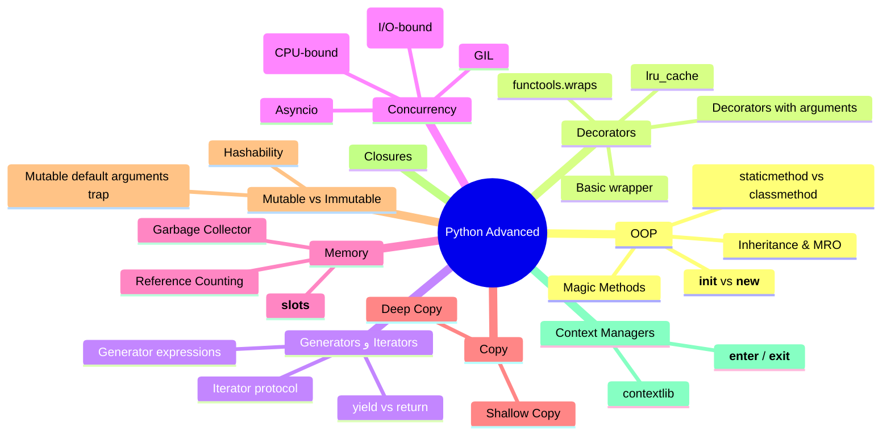

# الفصل الإضافي — Python Advanced: الحاجات اللي بتفرق بين "عارف بايثون" و"محترف بايثون"

> **المتطلبات:** [[Python Cheat Sheet - InterviewBit]] — لازم تكون مراجع الأساسيات (data types, lists, dicts, comprehensions, exceptions) قبل ما تدخل هنا، لأننا هنبني فوقها مباشرة.

---

## البداية — ليه الشيت اللي عندك مش كفاية؟

تخيّل معايا: انت في الإنترفيو، جاوبت صح على كل أسئلة الـ basics — الفرق بين list و tuple، إزاي تعمل loop، إزاي تعمل try/except. المحاور مبسوط، وبعدين يقولك:

> "طب قولّي، الـ GIL ده بيأثر إزاي على الـ multithreading؟"
> "إيه الفرق بين `@staticmethod` و `@classmethod`؟"
> "اكتب لي decorator بسيط يقيس وقت تنفيذ الفنكشن."

وهنا بيبقى الصمت... مش لأنك مش فاهم بايثون، لأن الحاجات دي مش "بايثون الأساسي" — دي **بايثون اللي بتفرق بين اللي درس الكورس واللي شغّال فعلاً**. أي انترفيو "دسم" بيدخل في المنطقة دي بالذات، لأنها بتكشف هل انت فاهم إزاي اللغة شغالة من جوه، ولا حافظ syntax بس.

> بدل ما تتفاجئ بيهم في الإنترفيو بكرا — إحنا هنمشيهم مع بعض دلوقتي، واحد واحد.

---

## [[OOP]] — الكلاسات مش مجرد `class` وخلاص

### تخيّل الكلاس بيت، والـ object شقة فيه

الكلاس هو المخطط الهندسي (blueprint)، والـ object هو الشقة الفعلية اللي اتبنت بناءً على المخطط ده. تقدر تعمل ألف شقة من نفس المخطط، كل واحدة عندها بياناتها الخاصة (state) لكن بتتبني بنفس الطريقة.

```python
class SalesAgent:
    company = "Inbox Sales Copilot"  # ← class attribute، مشترك بين كل الـ objects

    def __init__(self, name, deals):
        self.name = name    # ← instance attribute، خاص بكل object لوحده
        self.deals = deals

agent1 = SalesAgent("Mohamed", 5)
agent2 = SalesAgent("Nagy", 3)
print(agent1.company, agent2.company)  # نفس القيمة، لأنها class attribute
```

### `__init__` مش الـ constructor الحقيقي — `__new__` هو

النقطة اللي بتلخبط ناس كتير: بايثون بتعمل خطوتين مش خطوة واحدة لما تعمل object جديد:

```
SalesAgent("Mohamed", 5)
         ↓
   __new__()  ← ده اللي فعلياً بيعمل allocate للـ object في الميموري
         ↓
   __init__() ← ده بس بيهيّئ (initialize) القيم بعد ما الـ object اتعمل
```

`__new__` نادراً ما تحتاجه إلا في حالات خاصة زي الـ Singleton pattern أو لما بترث من نوع immutable زي `str` أو `tuple`.

> **نصيحة الخبراء:** لو المحاور سألك "إيه الفرق بين `__new__` و `__init__`" وانت جاوبت "زي بعض" — ده بيبين إنك حافظ مش فاهم. `__new__` بيرجع الـ object، `__init__` بياخده ويظبطه.

---

### Magic Methods — إزاي تخلي الـ object بتاعك "يتصرف" زي أنواع بايثون الأصلية

```python
class Deal:
    def __init__(self, name, value):
        self.name = name
        self.value = value

    def __repr__(self):
        # ← ده اللي بيتطبع لما تعمل print(deal) أو تكتبه في الـ console
        return f"Deal({self.name}, {self.value})"

    def __eq__(self, other):
        # ← بيحدد إزاي بايثون تقارن بين اتنين objects بـ ==
        return self.value == other.value

    def __add__(self, other):
        # ← بيخلي + تشتغل بين اتنين objects من نوعك
        return Deal("Combined", self.value + other.value)

d1 = Deal("Contract A", 1000)
d2 = Deal("Contract B", 2000)
print(d1 + d2)  # Deal(Combined, 3000)
```

| Method | بيتفعّل لما... |
|---|---|
| `__str__` | تعمل `print(obj)` أو `str(obj)` |
| `__repr__` | تكتب اسم المتغير في الـ console (debugging) |
| `__eq__` | تستخدم `==` |
| `__len__` | تستخدم `len(obj)` |
| `__getitem__` | تستخدم `obj[0]` |
| `__call__` | تستخدم `obj()` — تخلي الـ object نفسه "قابل للاستدعاء" زي الفنكشن |

> ده من أهم الأسئلة اللي بتتسأل عشان تشوف هل فاهم إن كل حاجة في بايثون هي object، وإن الـ operators زي `+` و `==` هي فعلياً method calls متخفية.

---

### `@staticmethod` vs `@classmethod` vs Instance Method

المصدر الأساسي للّخبطة. خليك معايا في الفرق العملي:

```python
class Deal:
    total_deals = 0

    def __init__(self, value):
        self.value = value
        Deal.total_deals += 1

    def show(self):
        # ← Instance method: بياخد self، بيشتغل على object معين
        print(f"Deal value: {self.value}")

    @classmethod
    def from_dict(cls, data):
        # ← Classmethod: بياخد cls (الكلاس نفسه) مش self
        # بيستخدم غالباً كـ "alternative constructor"
        return cls(data["value"])

    @staticmethod
    def is_valid(value):
        # ← Staticmethod: مبياخدش لا self ولا cls
        # ده فنكشن عادي بس منطقياً بينتمي للكلاس
        return value > 0
```

| | Instance Method | `@classmethod` | `@staticmethod` |
|---|---|---|---|
| بياخد | `self` | `cls` | لا حاجة |
| بيوصل لـ | data الخاصة بالـ object | attributes الكلاس نفسه | ولا حاجة |
| بيتستخدم لـ | العمليات اللي محتاجة الـ instance | alternative constructors | helper functions منطقياً تابعة للكلاس |

> **مثال حقيقي:** `datetime.now()` هي classmethod — بترجعلك instance جديد بطريقة بديلة عن `datetime()` العادي.

---

### Inheritance و الـ MRO (Method Resolution Order) — سؤال السنيورز المفضّل

```python
class Base:
    def greet(self):
        return "Base"

class Left(Base):
    def greet(self):
        return "Left"

class Right(Base):
    def greet(self):
        return "Right"

class Child(Left, Right):
    pass

c = Child()
print(c.greet())        # "Left" ← بيدور على Left الأول
print(Child.mro())      # [Child, Left, Right, Base, object]
```

المشكلة دي اسمها **Diamond Problem** — لما كلاس بيرث من اتنين ورثوا من نفس الأب، بايثون محتاجة نظام واضح تقرر بيه مين تسأل الأول. بايثون بتستخدم خوارزمية اسمها **C3 Linearization** عشان تبني الترتيب ده، وتقدر تشوفه بنفسك بـ `.mro()` أو `.__mro__`.

```
        Base
       /    \
    Left    Right
       \    /
       Child
```

> ⚠️ **انتبه:** لو المحاور سألك "هيتنفذ إيه لو عندك تعارض في الـ multiple inheritance؟" الإجابة الصح مش "بايثون بتختار عشوائي" — الإجابة إن فيه ترتيب محدد ومنطقي اسمه MRO وبيتحسب بـ C3 linearization.

---

## ✅ Checkpoint سريع — OOP

**س: إيه الفرق بين `__new__` و `__init__`؟**
> `__new__` هو اللي فعلياً بيعمل allocate للـ object في الميموري ويرجّعه، و`__init__` بياخد الـ object ده بعد ما اتعمل ويهيّئ الـ attributes بتاعته. `__new__` بيتنفذ الأول.

**س: امتى تستخدم `@classmethod` بدل `@staticmethod`؟**
> تستخدم `classmethod` لما محتاج توصل للكلاس نفسه (زي alternative constructors)، وتستخدم `staticmethod` لما الفنكشن مش محتاج يوصل لا للـ instance ولا للكلاس، وبس منطقياً بينتمي للكلاس ده.

**س: إيه هو الـ MRO وليه مهم؟**
> هو الترتيب اللي بايثون بتتبعه لما تدور على method في hierarchy فيها multiple inheritance. مهم عشان يحل مشكلة الـ Diamond Problem، ومبني على خوارزمية C3 Linearization.

---

## [[Decorators]] — الوظيفة اللي بتلبس وظيفة تانية "جاكيت"

### المشكلة اللي الديكوريتور بيحلها

تخيّل عندك عشرة functions، وعايز تضيف "طباعة log قبل وبعد كل واحدة فيهم" — من غير ما تعدّل جوه كل function. هتعمل إيه؟ تنسخ نفس الكود جوه كل واحدة؟ ده بالظبط اللي الـ decorator بيحله.

```python
def log_decorator(func):
    def wrapper(*args, **kwargs):
        print(f"Before {func.__name__}")
        result = func(*args, **kwargs)   # ← الفنكشن الأصلي بيتنفذ هنا جوه الـ wrapper
        print(f"After {func.__name__}")
        return result
    return wrapper

@log_decorator
def process_deal(value):
    return value * 2

process_deal(100)
# Before process_deal
# After process_deal
```

> **بمعنى آخر:** `@log_decorator` فوق `process_deal` هو اختصار لـ:
> `process_deal = log_decorator(process_deal)`

### تخيّل الديكوريتور "علبة هدية"

الفنكشن الأصلي جواها زي هو بالظبط، بس انت لفيته بورق هدية (logic إضافي) قبل ما يوصل للمستخدم. الفنكشن نفسه معملوش أي تعديل.

```
process_deal(100)
      ↓
تنادي wrapper() بدل process_deal مباشرة
      ↓
تطبع "Before"
      ↓
تنفذ الفنكشن الأصلي جوه
      ↓
تطبع "After"
      ↓
ترجع النتيجة ✅
```

### Decorator بياخد Arguments — درجة صعوبة أعلى

```python
def retry(times):
    # ← ده فنكشن بيرجع decorator، مش decorator نفسه
    def decorator(func):
        def wrapper(*args, **kwargs):
            for attempt in range(times):
                try:
                    return func(*args, **kwargs)
                except Exception as e:
                    print(f"Attempt {attempt + 1} failed: {e}")
            raise Exception("All attempts failed")
        return wrapper
    return decorator

@retry(times=3)
def fetch_gmail_thread(thread_id):
    # ← لو فشلت، هتتحاول 3 مرات قبل ما ترفع exception
    ...
```

> **نصيحة الخبراء:** لو حسيت الديكوريتور اللي بياخد arguments لخبطك، افتكر القاعدة: **3 مستويات من الـ functions** — الأول بياخد الـ arguments بتاعة الديكوريتور، التاني بياخد الفنكشن نفسه، التالت هو اللي بيتنفذ فعلياً.

### `functools.wraps` — التفصيلة اللي الجونيورز بينسوها

```python
from functools import wraps

def log_decorator(func):
    @wraps(func)  # ← من غيرها، func.__name__ هيبقى "wrapper" مش الاسم الحقيقي
    def wrapper(*args, **kwargs):
        return func(*args, **kwargs)
    return wrapper
```

### `functools.lru_cache` — Decorator جاهز للـ Memoization

```python
from functools import lru_cache

@lru_cache(maxsize=128)
def fibonacci(n):
    if n < 2:
        return n
    return fibonacci(n - 1) + fibonacci(n - 2)
# ← أي استدعاء بنفس الـ input هيرجع من الـ cache مباشرة من غير ما يتحسب تاني
```

---

## ✅ Checkpoint سريع — Decorators

**س: إيه هو الديكوريتور وليه بنستخدمه؟**
> فنكشن بياخد فنكشن تاني كـ argument، وبيرجع فنكشن جديد بيضيف سلوك إضافي قبل أو بعد تنفيذ الأصلي، من غير ما يعدّل كوده. بيتستخدم كتير في logging, authentication, caching, timing.

**س: اكتب decorator بسيط يحسب وقت تنفيذ فنكشن.**
> ```python
> import time
> from functools import wraps
>
> def timer(func):
>     @wraps(func)
>     def wrapper(*args, **kwargs):
>         start = time.time()
>         result = func(*args, **kwargs)
>         print(f"{func.__name__} took {time.time() - start:.4f}s")
>         return result
>     return wrapper
> ```

**س: إيه أكبر غلطة الجونيورز بيعملوها في الديكوريتورز؟**
> بينسوا `functools.wraps`، فيخسروا الـ metadata الأصلية بتاعة الفنكشن (زي `__name__` و `__doc__`) — وده بيبوّظ الـ debugging والـ introspection.

---

## [[Generators و Iterators]] — إزاي تتعامل مع بيانات أكبر من الرام

### تخيّل معايا: عندك ملف حجمه 10 جيجا، والرام بتاعتك 8 جيجا بس

لو عملت `list` فيه كل البيانات، البرنامج هيكراش. الحل: **ما تحمّلش كل حاجة مرة واحدة — حمّل عنصر واحد بس، اشتغل عليه، وارميه، وكرر.**

```python
def read_large_file(path):
    with open(path) as f:
        for line in f:
            yield line   # ← بيرجع سطر واحد بس في المرة، مبيحملش الملف كله في الرام
```

### الفرق بين Iterator و Generator

| | Iterator | Generator |
|---|---|---|
| إزاي بيتعمل | كلاس فيها `__iter__` و `__next__` | فنكشن فيها `yield` |
| الكود | أطول ومحتاج boilerplate | قصير ومباشر |
| كل generator هو | — | iterator (بس مش العكس) |

```python
# Iterator بالطريقة الطويلة (كلاس)
class CountUp:
    def __init__(self, limit):
        self.limit = limit
        self.current = 0

    def __iter__(self):
        return self

    def __next__(self):
        if self.current >= self.limit:
            raise StopIteration
        self.current += 1
        return self.current

# نفس الحاجة بالضبط بس generator
def count_up(limit):
    current = 0
    while current < limit:
        current += 1
        yield current
```

> **بمعنى آخر:** الـ generator هو اختصار بايثون الرسمي عشان متكتبش كلاس iterator كامل كل مرة.

### `yield` مش زي `return` خالص

```
الفنكشن العادي: return
      ↓
بيتنفذ لحد آخر سطر
      ↓
بيرجع النتيجة النهائية
      ↓
الفنكشن بيخلص خالص ❌

الـ Generator: yield
      ↓
بيتوقف عند yield
      ↓
بيرجع القيمة دي بس
      ↓
لما تنادي next() تاني
      ↓
بيكمل من نفس المكان اللي وقف فيه (حالته محفوظة) ✅
```

### Generator Expression — نسخة الـ list comprehension المُقتصدة في الرام

```python
squares_list = [i**2 for i in range(1000000)]   # ← بيحمل كل المليون رقم في الرام دلوقتي
squares_gen  = (i**2 for i in range(1000000))   # ← بيحسب كل رقم وقت ما تطلبه بس
```

---

## ✅ Checkpoint سريع — Generators

**س: امتى تستخدم generator بدل list؟**
> لما البيانات كبيرة جداً أو ملهاش نهاية معروفة (زي stream)، أو لما مش محتاج كل القيم في نفس الوقت — الـ generator بيوفر رام لأنه بيحسب كل قيمة وقت الطلب بس (lazy evaluation).

**س: إزاي الـ generator بيحتفظ بحالته بين كل استدعاء؟**
> بايثون بتحفظ الـ execution state بتاع الفنكشن (مكان الوقوف، قيم المتغيرات المحلية) في الذاكرة، وكل ما تنادي `next()` بيكمل من نفس النقطة بدل ما يبدأ من الأول.

---

## [[GIL و الـ Concurrency]] — أشهر سؤال في أي انترفيو بايثون

### تخيّل معايا: مطبخ فيه شيف واحد بس، مهما زودت عدد الأوردرات

الـ **GIL (Global Interpreter Lock)** هو قفل (mutex) موجود في CPython (النسخة الرسمية من بايثون) بيمنع أكتر من thread واحد إنه ينفذ Python bytecode في نفس اللحظة بالظبط — حتى لو عندك بروسيسور بـ 8 cores.

```
Thread 1 عايز ينفذ كود بايثون
      ↓
بياخد الـ GIL (القفل)
      ↓
Thread 2 و 3 بينتظروا (حتى لو فاضيين على cores تانية)
      ↓
Thread 1 يخلص أو يستنى I/O
      ↓
يسيب القفل
      ↓
Thread تاني ياخده وينفذ ✅
```

### طب ليه بايثون عاملة كده؟

الـ GIL موجود عشان يبسّط الـ memory management (بالتحديد reference counting) ويخلي التعامل مع C extensions أسهل وأأمن. الميزة دي جت بثمن: **مفيش true parallelism للكود اللي CPU-bound.**

### إمتى الـ GIL بيبقى مشكلة، وإمتى لأ؟

| نوع الشغلانة | مثال | الـ GIL بيأثر؟ |
|---|---|---|
| **I/O-bound** | API calls, قراءة ملفات, database queries | لأ — الـ thread بتسيب الـ GIL وهي مستنية الـ I/O، فـ threading مفيد هنا |
| **CPU-bound** | حسابات رياضية ضخمة, image processing | أيوه — الـ threads بتقف في الطابور على بعض، مفيش استفادة حقيقية |

```python
import threading
import multiprocessing

# ✅ Threading مفيد هنا (I/O-bound)
def fetch_email(thread_id):
    response = requests.get(f"/gmail/{thread_id}")  # بينتظر الشبكة
    return response

# ✅ Multiprocessing مفيد هنا (CPU-bound) — كل process ليها الـ Python interpreter بتاعها، ومعاها GIL منفصل
def heavy_computation(data):
    return sum(x**2 for x in data)

with multiprocessing.Pool(4) as pool:
    results = pool.map(heavy_computation, chunks_of_data)
```

> **نصيحة الخبراء:** لو المحاور سألك "إزاي تسرّع كود CPU-heavy في بايثون؟" ماتقولش "استخدم threading" — دي غلطة كلاسيكية. الإجابة الصح: `multiprocessing` (كل process معاها GIL منفصل، فبتشتغل فعلياً على cores مختلفة بالتوازي).

### Asyncio — الحل التالت للـ I/O-bound

`asyncio` بيدّيك concurrency من غير ما يستخدم threads أصلاً — كله بيشتغل على thread واحد، لكن بيتنقل بين المهام وقت الانتظار (زي انتظار response من API) بدل ما يقعد يستنى فاضي.

```python
import asyncio

async def fetch_thread(thread_id):
    await asyncio.sleep(1)  # ← بيسيب المكان لمهمة تانية تشتغل وهو مستني
    return f"Thread {thread_id} fetched"

async def main():
    results = await asyncio.gather(
        fetch_thread(1), fetch_thread(2), fetch_thread(3)
    )
    print(results)

asyncio.run(main())
```

| | Threading | Multiprocessing | Asyncio |
|---|---|---|---|
| مناسب لـ | I/O-bound (بسيط) | CPU-bound | I/O-bound (كثافة عالية من المهام) |
| الـ GIL بيأثر؟ | أيوه، لكن مش مشكلة (I/O بيسيب القفل) | لأ، كل process معاها GIL خاص | مش وارد أصلاً — thread واحد |
| overhead | متوسط | عالي (كل process ليها ذاكرة منفصلة) | منخفض جداً |

---

## ✅ Checkpoint سريع — GIL & Concurrency

**س: إيه هو الـ GIL بالظبط؟**
> Mutex في CPython بيضمن إن thread واحد بس ينفذ Python bytecode في أي لحظة، حتى لو عندك أكتر من core. بيبسّط memory management بس بيقيّد الـ true parallelism.

**س: إزاي تسرّع عملية حسابية تقيلة في بايثون؟**
> بـ `multiprocessing` مش `threading` — لأن كل process في الـ multiprocessing معاها Python interpreter و GIL منفصلين، فبتشتغل فعلياً بالتوازي على cores مختلفة.

**س: ليه threading لسه مفيد رغم الـ GIL؟**
> لأن في المهام الـ I/O-bound (زي API calls أو قراءة ملفات)، الـ thread بتسيب الـ GIL وهي مستنية الـ I/O يخلص، فتحصل استفادة حقيقية من التبديل بين المهام.

---

## [[Memory Management]] — إزاي بايثون بتنضّف وراها

### Reference Counting — العدّاد اللي بيتابع كل object

كل object في بايثون معاه عدّاد بيتابع كام حاجة بتشاور عليه. لما العدّاد يوصل صفر، بايثون بتفضي الذاكرة تلقائياً.

```python
import sys

a = SalesAgent("Mohamed", 5)
print(sys.getrefcount(a))  # عدد الإشارات لـ a

b = a  # ← دلوقتي العدّاد زاد واحد، لأن b كمان بتشاور على نفس الـ object
del a  # ← العدّاد نقص واحد، لكن الـ object لسه موجود لأن b لسه بتشاور عليه
```

### طب ليه محتاجين Garbage Collector كمان لو عندنا Reference Counting؟

المشكلة: **Circular References** — لما اتنين objects بيشاوروا على بعض، العدّاد بتاعهم مش هيوصل صفر أبداً حتى لو محدش تاني بيستخدمهم.

```python
class Node:
    def __init__(self):
        self.next = None

a = Node()
b = Node()
a.next = b  # a بتشاور على b
b.next = a  # b بتشاور على a ← دورة مقفولة، مفيش طريقة توصل refcount لصفر
```

هنا بيدخل الـ **Generational Garbage Collector** (module اسمه `gc`)، بيفحص دورياً عشان يلاقي الدوائر المقفولة دي ويفضّيها.

```python
import gc
print(gc.get_count())  # (gen0, gen1, gen2) ← عدد الـ objects في كل جيل
```

### `__slots__` — لما تحتاج تقلل استهلاك الرام

كل object افتراضياً بيستخدم `__dict__` عشان يخزّن الـ attributes بتاعته، وده بياخد رام زيادة. لو عندك ملايين الـ objects من نفس الكلاس، `__slots__` بيوفّر حجم كبير.

```python
class Point:
    __slots__ = ('x', 'y')  # ← بيمنع إنشاء __dict__، وبيحدد الـ attributes مسبقاً بس
    def __init__(self, x, y):
        self.x = x
        self.y = y
```

---

## [[Shallow Copy vs Deep Copy]] — الفخ الأشهر في المقابلات

### تخيّل معايا: عندك ملف Excel، وعملتله "Save As" نسخة تانية

لو الملف فيه شيت واحد بس، النسخة الجديدة مستقلة تماماً. بس لو الملف فيه link لملف تاني جواه (زي embedded object)، النسخة الجديدة والقديمة هيفضلوا بيشاوروا على *نفس* الملف الداخلي ده — تعديل واحد بيأثر على التاني.

```python
import copy

original = [[1, 2], [3, 4]]

shallow = copy.copy(original)      # ← نسخة سطحية: الـ outer list جديدة، لكن الـ inner lists لسه نفسها
deep = copy.deepcopy(original)     # ← نسخة كاملة: كل حاجة جواها اتنسخت لوحدها

original[0][0] = 99

print(shallow)  # [[99, 2], [3, 4]] ← اتأثرت! لأن الـ inner list مشتركة
print(deep)     # [[1, 2], [3, 4]]  ← ماتأثرتش خالص
```

```
Shallow Copy:
original ──┐
            ├──► [inner_list_1, inner_list_2]  ← نفس الـ objects بالظبط
shallow  ──┘

Deep Copy:
original ──► [inner_list_1, inner_list_2]
deep     ──► [inner_list_1_copy, inner_list_2_copy]  ← objects جديدة تماماً
```

> ⚠️ **انتبه:** لو الليست بتاعتك فيها عناصر immutable بس (أرقام، strings)، الـ shallow copy هتكفي وهتبقى أسرع. المشكلة بتظهر بس لما يكون فيه nested mutable objects (lists جوه lists، dicts جوه dicts).

---

## [[Mutable vs Immutable]] — ليه مش أي حاجة تقدر تبقى مفتاح Dictionary

### الفرق الجوهري

| Mutable (قابل للتعديل) | Immutable (ثابت) |
|---|---|
| `list`, `dict`, `set` | `str`, `int`, `float`, `tuple`, `frozenset` |
| ممكن تتعدّل بعد الإنشاء | لو عايز تغيّرها، بتتعمل نسخة جديدة |
| مش hashable (غالباً) | hashable (غالباً) |

```python
# ❌ مينفعش تستخدم list كـ dictionary key
lookup = {[1, 2]: "coordinate"}
# TypeError: unhashable type: 'list'

# ✅ tuple تمام، لأنه immutable
lookup = {(1, 2): "coordinate"}
```

> **ليه بالظبط؟** الـ dictionary بيحتاج الـ key يبقى ليها **hash value ثابت** طول الوقت عشان تقدر تلاقيها بسرعة في الـ hash table. لو الـ key عبارة عن list وقابلة للتعديل، الـ hash بتاعها ممكن يتغيّر بعد ما تضيفها، وده هيبوّظ كل نظام البحث.

### الفخ الكلاسيكي — Mutable Default Arguments

```python
# ❌ الغلط الشائع جداً
def add_deal(deal, deals_list=[]):
    deals_list.append(deal)
    return deals_list

print(add_deal("Deal A"))  # ['Deal A']
print(add_deal("Deal B"))  # ['Deal A', 'Deal B'] ← !! مش ['Deal B'] زي المتوقع

# ✅ الصح
def add_deal(deal, deals_list=None):
    if deals_list is None:
        deals_list = []
    deals_list.append(deal)
    return deals_list
```

> بايثون بتعمل الـ default argument مرة واحدة بس وقت تعريف الفنكشن، مش كل استدعاء — فلو كان mutable، هيفضل نفس الـ object بيتراكم عليه بين كل الاستدعاءات.

---

## [[Closures]] — الفنكشن اللي "فاكرة" بيئتها

### تخيّل معايا: فنكشن رجعتله فنكشن تاني، والتاني ده "متفكرش" المتغيرات بتاعت الأول

```python
def make_multiplier(factor):
    def multiplier(number):
        return number * factor   # ← factor مش موجود هنا، لكنه "متفكر" من الفنكشن الأب
    return multiplier

double = make_multiplier(2)
triple = make_multiplier(3)

print(double(5))  # 10
print(triple(5))  # 15
```

الفنكشن `multiplier` بيتفكر قيمة `factor` حتى بعد ما `make_multiplier` خلصت تنفيذها تماماً — ده اسمه **closure**، وهو الأساس اللي مبني عليه الـ decorators.

> **بمعنى آخر:** الـ closure بيحصل لما فنكشن داخلية بتستخدم متغير من الفنكشن الخارجية اللي فيها، والفنكشن الخارجية بترجّع الفنكشن الداخلية دي. بايثون بتحتفظ بالمتغير في الذاكرة عشان الفنكشن الداخلية لسه محتاجاه.

---

## [[Context Managers]] — إيه اللي بيحصل فعلياً وراء `with`

### مش بس `open()` — تقدر تعمل واحد بنفسك

```python
class DatabaseConnection:
    def __enter__(self):
        # ← بيتنفذ لما تدخل الـ with block
        print("Opening connection")
        self.conn = "fake_connection"
        return self.conn

    def __exit__(self, exc_type, exc_value, traceback):
        # ← بيتنفذ دايماً لما تخرج من الـ with block، حتى لو حصل exception
        print("Closing connection")
        # لو رجّعت True هنا، بايثون هتكتم الـ exception؛ False هتخليها تتنشر عادي

with DatabaseConnection() as conn:
    print(f"Using {conn}")
# Opening connection
# Using fake_connection
# Closing connection ← بتتنفذ حتى لو حصل error جوه الـ with block
```

```
دخول with
   ↓
__enter__() بيتنفذ
   ↓
كود الـ block بيتنفذ
   ↓
حصل exception؟ ─── أيوه ──► __exit__() بيتنفذ برضه (cleanup مضمون)
   │
  لأ
   ↓
__exit__() بيتنفذ عادي
```

> **نصيحة الخبراء:** الـ context manager هو الحل الرسمي لأي حاجة محتاجة "setup ثم cleanup مضمون" — فتح ملفات، database connections، locks. الميزة الحقيقية إن الـ cleanup مضمون **حتى لو حصل exception** — ده اللي بيفرقه عن مجرد كتابة `.close()` عادي في آخر الكود.

### نسخة أبسط بـ `contextlib`

```python
from contextlib import contextmanager

@contextmanager
def db_connection():
    print("Opening connection")
    yield "fake_connection"   # ← اللي قبل yield زي __enter__، واللي بعدها (لو فيه) زي __exit__
    print("Closing connection")

with db_connection() as conn:
    print(f"Using {conn}")
```

---

## 🗺️ خريطة Python Advanced كاملة



---

## ✅ Checkpoint نهائي — أسئلة متوقعة بكرا

**س: إيه الفرق بين shallow copy و deep copy؟**
> Shallow copy بتعمل object خارجي جديد لكن الـ nested objects جواه لسه بتشاور على نفس الأصلية. Deep copy بتنسخ كل حاجة بالكامل، حتى الـ nested objects، فمفيش أي مشاركة بين النسخة والأصل.

**س: ليه بيبقى فيه closure؟**
> لما فنكشن داخلية بتستخدم متغير من فنكشن خارجية بترجّعها، بايثون بتحتفظ بالمتغير ده في الذاكرة عشان الفنكشن الداخلية لسه محتاجاه حتى بعد ما الخارجية خلصت تنفيذها.

**س: إزاي الـ context manager بيضمن الـ cleanup حتى لو حصل error؟**
> لأن `__exit__` بيتنفذ دايماً بعد الـ with block، سواء الكود جواه اتنفذ عادي أو حصل فيه exception — بايثون بتضمن استدعاء `__exit__` في الحالتين.

**س: إيه أكبر فخ في الـ mutable default arguments؟**
> إن بايثون بتنشئ الـ default value مرة واحدة بس وقت تعريف الفنكشن، مش كل استدعاء. لو الـ default كان mutable (زي list)، هيفضل نفس الـ object بيتراكم عليه بين كل الاستدعاءات، وده سلوك غير متوقع للمبرمج.

**س: إيه الفرق بين `is` و `==`؟**
> `==` بتقارن القيمة (بتنادي `__eq__`)، و `is` بتقارن الـ identity — يعني هل الاتنين فعلياً نفس الـ object في الذاكرة (نفس الـ `id()`).

---

## 🫒 زتونة الإنترفيو

> **"بايثون لغة سهلة السطح، لكن عمقها الحقيقي بيظهر في التفاصيل: إزاي الـ GIL بيتحكم في التنفيذ، إزاي الـ reference counting والـ garbage collector بيديروا الذاكرة، وإزاي مفاهيم زي الـ decorators والـ closures والـ context managers كلها مبنية على فكرة واحدة — إن الفنكشنز في بايثون هي objects من الدرجة الأولى تقدر تتمرر وترجع وتتلف حواليها. لما بفهم الفرق بين mutable و immutable، وليه الـ shallow copy مش زي الـ deep copy، وإمتى أستخدم threading بدل multiprocessing — بقدر أكتب كود مش بس شغال، لكن كود واعي بالأداء وبمصادر الميموري."**

---

*بالتوفيق بكرا في الإنترفيو — راجع الملف ده مع الـ InterviewBit cheat sheet، وركّز خصوصاً على: GIL، Decorators، MRO، Shallow/Deep Copy — دول أكتر حاجات بتتسأل في الانترفيوهات "الدسمة".*
