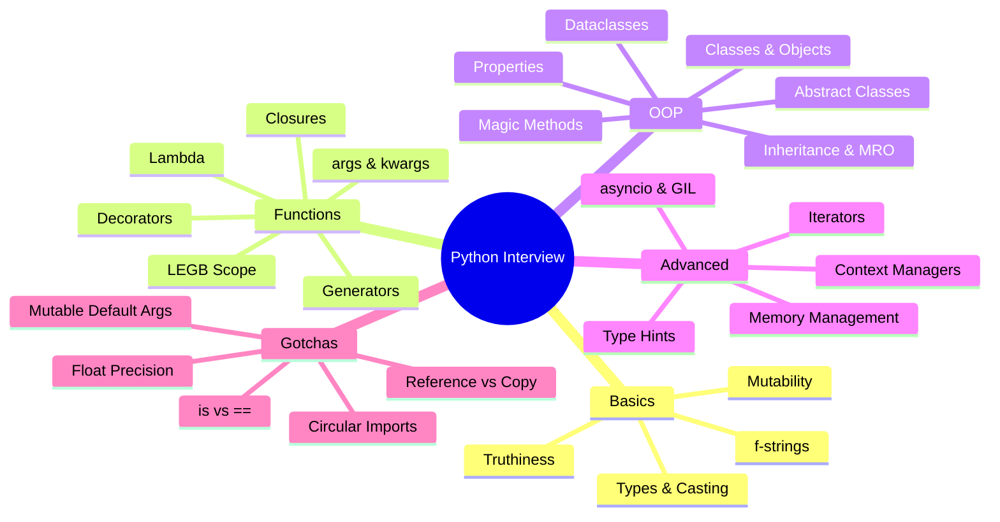

---
tags:
  - python
  - interview
  - revision
  - backend
created: 2026-04-23
status: complete
questions_count: 60
---

# 🐍 Python — من الصفر للإنترفيو | 60 سؤال وجواب

> كل سؤال هنا اتصمم عشان يغطي فكرة كاملة، مش بس تحفظ الإجابة.  
> الهدف إنك تفهم الـ **"ليه"** قبل الـ **"إيه"**.

---

## 🗂️ فهرس المواضيع

| الباب | الأسئلة |
|---|---|
| [[#🔹 الأساسيات — Variables & Types]] | Q01 → Q10 |
| [[#🔹 Control Flow & Functions]] | Q11 → Q20 |
| [[#🔹 OOP — الكائنات والكلاسات]] | Q21 → Q33 |
| [[#🔹 Advanced Python]] | Q34 → Q46 |
| [[#🔹 أسئلة Tricky & Gotchas]] | Q47 → Q60 |

---

## 🔹 الأساسيات — Variables & Types

---

### Q01 — إيه الفرق بين `int`, `float`, `str`, `bool` في Python؟

**الجواب:**
دي الـ **built-in primitive types** في Python.

```python
x = 10          # int — أرقام صحيحة بدون حدود (مش زي Java!)
y = 3.14        # float — أرقام عشرية (double precision)
name = "Ali"    # str — نص، immutable
is_dev = True   # bool — True أو False فقط، وهو subclass من int!

# ← لاحظ الحاجة دي الغريبة:
print(True + True)   # → 2  ← لأن True == 1 في Python
print(False + 5)     # → 5  ← لأن False == 0
```

> [!tip] نصيحة الإنترفيو
> لو سألوك "إيه الفرق بين `bool` وغيره؟" قولهم إن `bool` في Python هو subclass من `int`، وده غالباً بيدهشهم.

---

### Q02 — إيه معنى إن Python "Dynamically Typed"؟

**الجواب:**
يعني مش بتحدد نوع المتغير وقت الكتابة — Python بيحدده وقت التشغيل.

```python
x = 10       # ← Python شاف إن 10 هو int
x = "hello"  # ← نفس المتغير، بقى string — ومفيش مشكلة!
x = [1, 2]   # ← دلوقتي list

# بالظبط زي إنك بتشيل أوضة وتحطها براحتك
# الـ variable مجرد label بيوصل لـ object في الـ memory
```

> [!warning] انتبه
> Dynamic typing مش معناه "مفيش types". Python strongly typed — يعني مينفعش تعمل `"5" + 5` من غير ما تعمل convert.

---

### Q03 — إيه الفرق بين Mutable و Immutable؟

**الجواب:**
الـ **Immutable** objects مينفعش تتغير بعد ما اتعملوا. الـ **Mutable** تتغير.

```python
# ── Immutable ──────────────────────────
s = "hello"
s[0] = "H"    # ← TypeError! الـ string مش بيتغير

t = (1, 2, 3)
t[0] = 99     # ← TypeError! الـ tuple مش بيتغير

# ── Mutable ────────────────────────────
lst = [1, 2, 3]
lst[0] = 99   # ✅ شغال، الـ list بتتغير

d = {"name": "Ali"}
d["age"] = 25  # ✅ شغال، الـ dict بيتغير
```

| Immutable | Mutable |
|---|---|
| `int`, `float`, `str` | `list` |
| `tuple`, `bool` | `dict`, `set` |
| `frozenset` | custom objects |

> [!tip] نصيحة الإنترفيو
> السؤال الأشهر: "ليه الـ tuple immutable؟" — الجواب: عشان يبقى hashable وتقدر تستخدمه كـ dictionary key، وكمان أسرع من الـ list في الـ memory.

---

### Q04 — إيه الفرق بين `list`, `tuple`, `set`, `dict`؟

**الجواب:**

```python
lst   = [1, 2, 2, 3]          # ← ordered, mutable, allows duplicates
tpl   = (1, 2, 2, 3)          # ← ordered, immutable, allows duplicates
st    = {1, 2, 2, 3}          # ← unordered, mutable, NO duplicates → {1,2,3}
dct   = {"name": "Ali", "age": 25}  # ← key-value pairs, ordered (Python 3.7+)
```

| | Ordered | Mutable | Duplicates | Index |
|---|---|---|---|---|
| list | ✅ | ✅ | ✅ | ✅ |
| tuple | ✅ | ❌ | ✅ | ✅ |
| set | ❌ | ✅ | ❌ | ❌ |
| dict | ✅ (3.7+) | ✅ | keys: ❌ | by key |

---

### Q05 — إيه هو الـ `None` وامتى بستخدمه؟

**الجواب:**
الـ `None` هو الـ **null** في Python — object وحيد من نوع `NoneType`.

```python
def greet(name=None):     # ← default value لو مش عارف القيمة
    if name is None:      # ← لازم تستخدم 'is' مش '=='
        return "Hello, stranger!"
    return f"Hello, {name}!"

result = greet()
print(result)  # → Hello, stranger!

# ← فنكشن مش بترجع حاجة → بترجع None تلقائياً
def do_nothing():
    pass

print(do_nothing())  # → None
```

> [!warning] انتبه
> دايماً استخدم `is None` أو `is not None` مش `== None`. ده ليس بس Pythonic — ده أصح لأن `is` بيقارن الـ identity مش الـ value.

---

### Q06 — إزاي الـ f-strings بتشتغل وإيه مميزاتها؟

**الجواب:**
الـ f-strings (Python 3.6+) بتخليك تحط expressions جوا الـ string مباشرة.

```python
name = "Sara"
age = 22

# الطريقة القديمة — format()
msg1 = "اسمي {} وعندي {} سنة".format(name, age)

# الطريقة الأحسن — f-string
msg2 = f"اسمي {name} وعندي {age} سنة"

# ← تقدر تحط expressions كاملة جوا!
price = 150
msg3 = f"السعر بعد الخصم: {price * 0.9:.2f} جنيه"  # ← format بـ 2 decimal

# ← Python 3.8+ الـ = debugging trick
x = 42
print(f"{x = }")  # → x = 42  ← بيطبع اسم المتغير وقيمته
```

---

### Q07 — إيه الفرق بين `//`, `/`, `%`, `**`؟

**الجواب:**

```python
10 / 3    # → 3.333...  ← True division — دايماً float
10 // 3   # → 3         ← Floor division — بياخد الجزء الصحيح
10 % 3    # → 1         ← Modulo — الباقي من القسمة
2 ** 10   # → 1024      ← Exponentiation — أسرع من pow() للأرقام البسيطة

# ← الـ // بيعمل floor مش truncate!
-7 // 2   # → -4  ← مش -3! لأن floor(-3.5) = -4
-7 % 2    # → 1   ← مش -1! Python بيضمن إن الـ % دايماً نفس إشارة المقسوم عليه
```

> [!tip] نصيحة الإنترفيو
> سؤال كلاسيكي: "إيه ناتج `-7 // 2`؟" — كتير ناس بيقولوا -3 والإجابة الصح -4.

---

### Q08 — إزاي Python بيتعامل مع الـ Strings؟ وإيه أهم الـ methods؟

**الجواب:**

```python
s = "  Hello, Python World!  "

s.strip()           # → "Hello, Python World!"  ← شيل المسافات
s.lower()           # → "  hello, python world!  "
s.upper()           # → "  HELLO, PYTHON WORLD!  "
s.replace("Python", "Beautiful")  # → استبدال
s.split(", ")       # → ["  Hello", "Python World!  "]
s.startswith("  He") # → True
s.find("Python")    # → 8  ← index أول ظهور، -1 لو مش موجود

# ── الـ Slicing ──────────────────────────
s = "Hello"
s[1:4]   # → "ell"   ← من index 1 لـ 3
s[::-1]  # → "olleH" ← عكس الـ string كامل
s[::2]   # → "Hlo"   ← كل خطوتين
```

---

### Q09 — إيه هو الـ Type Casting وإزاي بيشتغل؟

**الجواب:**

```python
# ── Explicit Casting ─────────────────────
int("42")       # → 42
int(3.9)        # → 3    ← مش بيعمل round، بيشيل الكسر!
float("3.14")   # → 3.14
str(100)        # → "100"
bool(0)         # → False
bool("hello")   # → True  ← أي string غير فارغ → True
list((1, 2, 3)) # → [1, 2, 3]
tuple([1, 2, 3])# → (1, 2, 3)

# ── Implicit Casting (Python بيعملها لوحده) ───
result = 5 + 2.0  # → 7.0  ← int + float = float تلقائياً
```

---

### Q10 — إيه الـ Truthiness في Python؟

**الجواب:**
كل قيمة في Python إما "truthy" أو "falsy" حتى لو مش `bool`.

```python
# ── Falsy values ── (بتتعامل كـ False في الـ if)
bool(0)         # False
bool(0.0)       # False
bool("")        # False  ← string فارغ
bool([])        # False  ← list فارغة
bool({})        # False  ← dict فارغ
bool(None)      # False
bool(set())     # False

# ── Truthy values ── (أي حاجة تانية)
bool(1)         # True
bool(-1)        # True  ← حتى الأرقام السالبة!
bool("0")       # True  ← string فيه "0" مش نفس int 0
bool([0])       # True  ← list فيها عنصر واحد حتى لو 0
```

```python
# ← استخدام عملي
data = []
if not data:
    print("القايمة فاضية!")  # ← أوضح وأسرع من len(data) == 0
```

---

## 🔹 Control Flow & Functions

---

### Q11 — إيه الفرق بين `break`, `continue`, `pass`؟

**الجواب:**

```python
# break ← وقّف الـ loop كلها
for i in range(10):
    if i == 5:
        break       # ← خرجنا من الـ loop عند 5
    print(i)        # → 0 1 2 3 4

# continue ← تخطّى الـ iteration دي وكمّل
for i in range(6):
    if i == 3:
        continue    # ← تخطّى 3 وكمّل
    print(i)        # → 0 1 2 4 5

# pass ← لا تعمل حاجة (placeholder)
def todo_function():
    pass            # ← لازم أكتبها دلوقتي بس هكملها بعدين

class EmptyClass:
    pass            # ← class فاضية بدون أي method
```

---

### Q12 — إيه الفرق بين `*args` و `**kwargs`؟

**الجواب:**
دول بيخلوا الـ function تاخد عدد غير محدد من الـ arguments.

```python
# *args ← بياخد أي عدد من الـ positional arguments كـ tuple
def sum_all(*args):
    print(type(args))   # → <class 'tuple'>
    return sum(args)

sum_all(1, 2, 3, 4, 5)  # → 15


# **kwargs ← بياخد أي عدد من الـ keyword arguments كـ dict
def greet(**kwargs):
    print(type(kwargs))  # → <class 'dict'>
    for key, value in kwargs.items():
        print(f"{key}: {value}")

greet(name="Ali", age=25, city="Cairo")


# ← ممكن تجمعهم مع بعض (بالترتيب ده بالظبط!)
def full_example(normal, *args, **kwargs):
    print(f"Normal: {normal}")
    print(f"Args: {args}")
    print(f"Kwargs: {kwargs}")

full_example("hello", 1, 2, 3, name="Sara", age=22)
```

---

### Q13 — إيه هو الـ Lambda Function وامتى تستخدمه؟

**الجواب:**
الـ Lambda هو function بسيطة في سطر واحد — بدون اسم.

```python
# Function عادية
def square(x):
    return x ** 2

# Lambda مكافئة
square = lambda x: x ** 2

# ← الاستخدام الحقيقي: مع sorted, map, filter
students = [
    {"name": "Ali", "grade": 85},
    {"name": "Sara", "grade": 92},
    {"name": "Omar", "grade": 78},
]

# ترتيب حسب الـ grade
sorted_students = sorted(students, key=lambda s: s["grade"], reverse=True)

# ← مش محتاج تعمل def كاملة لمجرد سطر واحد
```

> [!tip] نصيحة الإنترفيو
> لو سألوك "امتى تستخدم lambda؟" — الجواب: لما الـ function صغيرة وبستخدمها مرة واحدة في مكان معين. لو محتاج تستخدمها في أكتر من مكان → اعمل `def` عادي.

---

### Q14 — إيه الـ LEGB Rule في Python؟

**الجواب:**
LEGB بيحدد الترتيب اللي Python بيدور فيه على المتغير:

```
L → Local     ← جوا الـ function الحالية
E → Enclosing ← الـ function اللي بتحيط بيها (nested functions)
G → Global    ← مستوى الـ module
B → Built-in  ← Python نفسه (print, len, range...)
```

```python
x = "global"   # ← Global

def outer():
    x = "enclosing"   # ← Enclosing

    def inner():
        x = "local"   # ← Local
        print(x)      # → "local"  ← بياخد الأقرب

    inner()
    print(x)          # → "enclosing"

outer()
print(x)              # → "global"
```

```python
# ← عشان تعدّل على Global variable من جوا function
count = 0

def increment():
    global count   # ← بدون ده هيعمل count جديدة Local
    count += 1

increment()
print(count)  # → 1
```

---

### Q15 — إيه هي الـ Closures؟

**الجواب:**
الـ Closure هي function بتتذكر الـ variables اللي كانت في scope بتاعها حتى بعد ما الـ scope ده اتخلص.

```python
def make_multiplier(factor):
    # ← factor موجودة في الـ Enclosing scope

    def multiplier(number):
        return number * factor   # ← multiplier بتتذكر factor!
    
    return multiplier            # ← بنرجع الـ function نفسها

double = make_multiplier(2)     # ← factor = 2 اتحفظت
triple = make_multiplier(3)     # ← factor = 3 اتحفظت

print(double(5))  # → 10
print(triple(5))  # → 15

# ← لو عملنا del make_multiplier، double لسه شغالة!
```

> [!note]
> الـ Closure هي الأساس اللي الـ Decorators بُنيت عليه. افهمها كويس.

---

### Q16 — إيه هو الـ Decorator وإزاي بيشتغل؟

**الجواب:**
الـ Decorator هو function بتـ"wrap" function تانية وتضيف عليها behavior من غير ما تغير الـ code الأصلي.

```python
# ← تخيّل عندك مطعم، والـ decorator هو الـ packaging
# الأكل (function) مش بيتغير، بس بتضيف علبة وشنطة (decorator)

def log_call(func):
    def wrapper(*args, **kwargs):
        print(f"📞 بتستدعي: {func.__name__}")   # ← قبل الـ function
        result = func(*args, **kwargs)
        print(f"✅ خلصت: {func.__name__}")       # ← بعد الـ function
        return result
    return wrapper


@log_call                        # ← ده syntax sugar لـ: greet = log_call(greet)
def greet(name):
    print(f"أهلاً {name}!")


greet("Ali")
# → 📞 بتستدعي: greet
# → أهلاً Ali!
# → ✅ خلصت: greet
```

```python
# ── Decorator مع functools.wraps (الطريقة الصح) ──
from functools import wraps

def log_call(func):
    @wraps(func)               # ← بيحافظ على اسم وـ docstring الـ function الأصلية
    def wrapper(*args, **kwargs):
        print(f"Calling {func.__name__}")
        return func(*args, **kwargs)
    return wrapper
```

---

### Q17 — إيه هو الـ Generator وإيه الفرق بينه وبين List Comprehension؟

**الجواب:**
الـ Generator بيعمل الـ values "واحدة واحدة عند الطلب" بدل ما يحسبهم كلهم في الأول.

```python
# ── List Comprehension ── بيحسب كل حاجة في الأول ويحطها في الـ memory
squares_list = [x**2 for x in range(1_000_000)]  # ← 8MB في الـ memory!

# ── Generator Expression ── بيعمل حاجة واحدة كل مرة بتطلبها
squares_gen = (x**2 for x in range(1_000_000))   # ← بس bytes في الـ memory!

# ── Generator Function بـ yield ──
def count_up(limit):
    n = 0
    while n < limit:
        yield n     # ← بدل return، بيـ"pause" ويرجع القيمة
        n += 1      # ← بيكمّل من هنا في المرة الجاية

gen = count_up(5)
print(next(gen))  # → 0
print(next(gen))  # → 1
# أو:
for num in count_up(5):
    print(num)    # → 0 1 2 3 4
```

> [!tip] نصيحة الإنترفيو
> "امتى تستخدم Generator؟" — لما بتتعامل مع بيانات كبيرة جداً (ملفات ضخمة، streams، infinite sequences).

---

### Q18 — إيه هو الـ List / Dict / Set Comprehension؟

**الجواب:**

```python
numbers = [1, 2, 3, 4, 5, 6, 7, 8, 9, 10]

# ── List Comprehension ──────────────────────────
squares    = [x**2 for x in numbers]
evens      = [x for x in numbers if x % 2 == 0]
even_sq    = [x**2 for x in numbers if x % 2 == 0]

# ── Dict Comprehension ──────────────────────────
sq_dict    = {x: x**2 for x in numbers}
# → {1: 1, 2: 4, 3: 9, ...}

# ── Set Comprehension ───────────────────────────
unique_rem = {x % 3 for x in numbers}
# → {0, 1, 2}

# ── Nested Comprehension ────────────────────────
matrix = [[1, 2, 3], [4, 5, 6], [7, 8, 9]]
flat   = [num for row in matrix for num in row]
# → [1, 2, 3, 4, 5, 6, 7, 8, 9]
```

---

### Q19 — إيه الفرق بين `map()`, `filter()`, `reduce()`؟

**الجواب:**

```python
from functools import reduce

numbers = [1, 2, 3, 4, 5]

# map() ← طبّق function على كل عنصر
doubled = list(map(lambda x: x * 2, numbers))
# → [2, 4, 6, 8, 10]

# filter() ← خلّي العناصر اللي الـ condition بتاعتها True بس
evens = list(filter(lambda x: x % 2 == 0, numbers))
# → [2, 4]

# reduce() ← "اجمع" كل العناصر في قيمة واحدة
total = reduce(lambda acc, x: acc + x, numbers)
# → 15  (1+2+3+4+5)

# ← في Python الحديث، غالباً الـ comprehensions أوضح من map/filter
doubled_comp = [x * 2 for x in numbers]
evens_comp   = [x for x in numbers if x % 2 == 0]
```

---

### Q20 — إزاي الـ `enumerate()` و`zip()` بيشتغلوا؟

**الجواب:**

```python
# enumerate() ← بيديك الـ index والـ value مع بعض
fruits = ["apple", "banana", "cherry"]

for i, fruit in enumerate(fruits):
    print(f"{i}: {fruit}")
# → 0: apple / 1: banana / 2: cherry

for i, fruit in enumerate(fruits, start=1):  # ← ابدأ من 1
    print(f"{i}: {fruit}")


# zip() ← بيربط قوايم مع بعض زي السوستة
names  = ["Ali", "Sara", "Omar"]
grades = [85, 92, 78]

for name, grade in zip(names, grades):
    print(f"{name}: {grade}")

# ← تحويل لـ dict بضربة واحدة
grade_dict = dict(zip(names, grades))
# → {"Ali": 85, "Sara": 92, "Omar": 78}
```

---

## 🔹 OOP — الكائنات والكلاسات

---

### Q21 — إيه الفرق بين الـ Class والـ Object؟

**الجواب:**
الـ Class هو القالب (البلوبرينت). الـ Object هو الـ instance اللي اتعمل منه.

```python
# ← تخيّل الـ Class هو عقد الشقة، والـ Object هو الشقة الفعلية

class Car:
    def __init__(self, brand, model):
        self.brand = brand
        self.model = model
    
    def info(self):
        return f"{self.brand} {self.model}"

# ── Objects (instances) ──
car1 = Car("Toyota", "Corolla")    # ← object 1
car2 = Car("Honda", "Civic")       # ← object 2

print(car1.info())   # → Toyota Corolla
print(car2.info())   # → Honda Civic

# ← كل object عنده instance variables خاصة بيه
print(car1.brand)    # → Toyota
print(car2.brand)    # → Honda
```

---

### Q22 — إيه دور الـ `__init__` والـ `self`؟

**الجواب:**

```python
class Person:
    def __init__(self, name, age):
        # ← self هو الـ object نفسه اللي بيتعمل دلوقتي
        # ← __init__ مش constructor، هو initializer — الـ object بيتعمل قبله
        self.name = name    # ← instance variable خاص بكل object
        self.age = age

    def greet(self):
        # ← self لازم يبقى أول parameter في كل method
        return f"أهلاً، أنا {self.name} وعندي {self.age} سنة"


p = Person("Ali", 25)
# ← Python بتعمل ده:  Person.__init__(p, "Ali", 25)
# ← إنت مش بتكتب الـ self لما بتستدعي، Python بيضيفه تلقائياً

print(p.greet())  # → أهلاً، أنا Ali وعندي 25 سنة
```

---

### Q23 — إيه هو الـ Inheritance وإزاي بيشتغل؟

**الجواب:**

```python
class Animal:
    def __init__(self, name):
        self.name = name
    
    def speak(self):
        return "..."
    
    def __str__(self):
        return f"Animal: {self.name}"


class Dog(Animal):         # ← Dog وارثة من Animal
    def speak(self):       # ← Method Overriding
        return "Woof!"


class Cat(Animal):
    def speak(self):
        return "Meow!"


dog = Dog("Rex")
cat = Cat("Mimi")

print(dog.speak())   # → Woof!
print(cat.speak())   # → Meow!
print(dog.name)      # → Rex  ← ورثت من Animal

# ← isinstance() بيتحقق من النوع مع الوراثة
print(isinstance(dog, Dog))     # → True
print(isinstance(dog, Animal))  # → True!  ← Dog هي Animal
print(isinstance(dog, Cat))     # → False
```

---

### Q24 — إيه دور `super()` وامتى بستخدمه؟

**الجواب:**
`super()` بيخليك تستدعي الـ method بتاعة الـ parent class من جوا الـ child.

```python
class Employee:
    def __init__(self, name, salary):
        self.name = name
        self.salary = salary
    
    def info(self):
        return f"{self.name} — Salary: {self.salary}"


class Manager(Employee):
    def __init__(self, name, salary, department):
        super().__init__(name, salary)   # ← استدعي init الـ parent أول
        self.department = department     # ← بعدين أضف اللي جديد
    
    def info(self):
        base = super().info()            # ← جيب info الـ parent
        return f"{base} — Dept: {self.department}"


m = Manager("Sara", 15000, "Engineering")
print(m.info())
# → Sara — Salary: 15000 — Dept: Engineering
```

---

### Q25 — إيه هي الـ Magic Methods (Dunder Methods)؟

**الجواب:**
دول methods بتبدأ وبتخلص بـ `__` — Python بيستدعيهم تلقائياً في مواقف معينة.

```python
class Vector:
    def __init__(self, x, y):
        self.x = x
        self.y = y
    
    def __str__(self):
        return f"Vector({self.x}, {self.y})"     # ← لما بتعمل print()
    
    def __repr__(self):
        return f"Vector(x={self.x}, y={self.y})" # ← للـ debugging

    def __add__(self, other):
        return Vector(self.x + other.x, self.y + other.y)  # ← v1 + v2
    
    def __len__(self):
        return 2                                  # ← len(v)
    
    def __eq__(self, other):
        return self.x == other.x and self.y == other.y     # ← v1 == v2
    
    def __contains__(self, item):
        return item in (self.x, self.y)           # ← 5 in v


v1 = Vector(1, 2)
v2 = Vector(3, 4)

print(v1)        # → Vector(1, 2)
print(v1 + v2)   # → Vector(4, 6)
print(len(v1))   # → 2
print(v1 == v1)  # → True
print(1 in v1)   # → True
```

---

### Q26 — إيه الفرق بين `@property`, `@classmethod`, `@staticmethod`؟

**الجواب:**

```python
class Circle:
    PI = 3.14159   # ← Class variable

    def __init__(self, radius):
        self._radius = radius        # ← underscore = protected

    @property
    def radius(self):
        return self._radius          # ← getter — بتوصله كـ attribute مش method

    @radius.setter
    def radius(self, value):
        if value < 0:
            raise ValueError("Radius can't be negative!")
        self._radius = value

    @property
    def area(self):
        return Circle.PI * self._radius ** 2   # ← computed property، مفيش setter

    @classmethod
    def from_diameter(cls, diameter):
        return cls(diameter / 2)     # ← alternative constructor — بياخد cls مش self

    @staticmethod
    def is_valid_radius(r):
        return r > 0                 # ← utility function، مش محتاج instance أو class


c = Circle(5)
print(c.radius)        # → 5       ← property كـ attribute
print(c.area)          # → 78.53...
c.radius = 10          # → setter
c.radius = -1          # → ValueError!

c2 = Circle.from_diameter(20)  # → radius = 10
print(Circle.is_valid_radius(5))  # → True
```

---

### Q27 — إيه هو الـ Encapsulation في Python؟

**الجواب:**

```python
class BankAccount:
    def __init__(self, owner, balance):
        self.owner = owner              # ← Public   — أي حد يوصله
        self._account_type = "savings"  # ← Protected — اتفاقية، مش قانون
        self.__balance = balance        # ← Private   — Python بيغير اسمه فعلاً!

    def deposit(self, amount):
        if amount > 0:
            self.__balance += amount

    def get_balance(self):
        return self.__balance           # ← نوفر getter بدل الـ direct access


acc = BankAccount("Ali", 1000)
print(acc.owner)           # ✅ شغال
print(acc._account_type)   # ✅ شغال بس "بالإدب" متعملش ده
# print(acc.__balance)     # ❌ AttributeError!

# ← بس Python مش بيحذفه، بيغير اسمه بس (Name Mangling)
print(acc._BankAccount__balance)  # → 1000  ← ممكن توصله بالطريقة دي
```

> [!tip] نصيحة الإنترفيو
> Python مفيش فيها private فعلي زي Java — الـ `__` بس بيعمل "name mangling". الـ `_` هو convention بس يعني "don't touch unless you know what you're doing".

---

### Q28 — إيه هو الـ MRO (Method Resolution Order) في Multiple Inheritance؟

**الجواب:**

```python
class A:
    def hello(self):
        return "A"

class B(A):
    def hello(self):
        return "B"

class C(A):
    def hello(self):
        return "C"

class D(B, C):   # ← Multiple Inheritance
    pass


d = D()
print(d.hello())        # → "B"  ← مش "A" ومش "C"!

# ← ليه؟ عشان الـ MRO بيتبع خوارزمية C3 Linearization
print(D.__mro__)
# → (D, B, C, A, object)
# بيدور من الشمال للـ right في الـ inheritance list
```

---

### Q29 — إيه هي الـ Abstract Classes وامتى بستخدمها؟

**الجواب:**

```python
from abc import ABC, abstractmethod

class Shape(ABC):              # ← مش ممكن تعمل instance منها مباشرة
    @abstractmethod
    def area(self):            # ← كل class وارثة لازم تعمل الـ method دي
        pass
    
    @abstractmethod
    def perimeter(self):
        pass
    
    def describe(self):        # ← method عادية ممكن تورثها
        return f"Area: {self.area():.2f}"


class Rectangle(Shape):
    def __init__(self, w, h):
        self.w = w
        self.h = h
    
    def area(self):
        return self.w * self.h
    
    def perimeter(self):
        return 2 * (self.w + self.h)


# Shape()        # ← TypeError! Can't instantiate abstract class
r = Rectangle(4, 5)
print(r.describe())   # → Area: 20.00
```

---

### Q30 — إيه الفرق بين Composition و Inheritance؟

**الجواب:**

```
Inheritance = "IS-A" relationship   ← Dog IS-A Animal
Composition = "HAS-A" relationship  ← Car HAS-A Engine
```

```python
# ── Inheritance (IS-A) ──────────────────────────
class Vehicle:
    def start(self): return "Vroom"

class Car(Vehicle):   # Car IS-A Vehicle ✅
    pass


# ── Composition (HAS-A) ─────────────────────────
class Engine:
    def start(self): return "Engine started"

class Car:            # Car HAS-A Engine ✅
    def __init__(self):
        self.engine = Engine()   # ← composition

    def drive(self):
        return self.engine.start()
```

> [!tip] نصيحة الإنترفيو
> "Favor Composition over Inheritance" — ده مبدأ مشهور. Composition أكثر flexibility لأنك ممكن تغير الـ components وقت الـ runtime، بينما الـ Inheritance ثابتة في وقت الكتابة.

---

### Q31 — إيه هي الـ Dataclasses وليه بستخدمها؟

**الجواب:**

```python
from dataclasses import dataclass, field

# ── بدون dataclass — كتير كلام ──────────────────
class PointOld:
    def __init__(self, x, y):
        self.x = x
        self.y = y
    def __repr__(self):
        return f"Point(x={self.x}, y={self.y})"
    def __eq__(self, other):
        return self.x == other.x and self.y == other.y


# ── مع dataclass — نظيف ومختصر ─────────────────
@dataclass
class Point:
    x: float
    y: float

# ← بيعملك __init__, __repr__, __eq__ تلقائياً!
p1 = Point(1.0, 2.0)
p2 = Point(1.0, 2.0)
print(p1)        # → Point(x=1.0, y=2.0)
print(p1 == p2)  # → True


# ← مع default values وـ frozen (immutable)
@dataclass(frozen=True)
class Config:
    host: str = "localhost"
    port: int = 8000
    tags: list = field(default_factory=list)   # ← مش ممكن تكتب tags: list = []
```

---

### Q32 — إيه هو الـ `__slots__` وليه مهم؟

**الجواب:**

```python
# ← بدون __slots__: كل object عنده __dict__ → memory overhead
class Point:
    def __init__(self, x, y):
        self.x = x
        self.y = y

# ← مع __slots__: Python بيحجز memory ثابت للـ attributes دول بس
class PointSlotted:
    __slots__ = ['x', 'y']   # ← حدّد الـ attributes المسموح بيها

    def __init__(self, x, y):
        self.x = x
        self.y = y

p = PointSlotted(1, 2)
# p.z = 3  # ← AttributeError! مش ممكن تضيف attributes تانية

# ← فايده: بسرعة أكبر وـ memory أقل في الـ large-scale applications
```

---

### Q33 — إيه الفرق بين `__str__` و `__repr__`؟

**الجواب:**

```python
class Temperature:
    def __init__(self, celsius):
        self.celsius = celsius
    
    def __str__(self):
        # ← للمستخدم العادي — بيتطبع مع print()
        return f"{self.celsius}°C"
    
    def __repr__(self):
        # ← للـ developer — بيتطبع في الـ console/debugger
        return f"Temperature(celsius={self.celsius})"


t = Temperature(100)
print(t)         # → 100°C            ← __str__ اتاستخدم
print(repr(t))   # → Temperature(celsius=100)  ← __repr__ اتاستخدم
```

> [!tip] القاعدة
> `__repr__` المفروض يكون كافي إنك تعمل `eval(repr(obj))` وترجع للـ object الأصلي. `__str__` للعرض الجميل للمستخدم.

---

## 🔹 Advanced Python

---

### Q34 — إزاي بتتعامل مع الـ Exceptions صح؟

**الجواب:**

```python
# ── try / except / else / finally ──────────────
def divide(a, b):
    try:
        result = a / b                # ← الكود اللي ممكن يـ raise exception
    except ZeroDivisionError as e:
        print(f"❌ مينفعش تقسم على صفر: {e}")
        return None
    except TypeError as e:
        print(f"❌ نوع البيانات غلط: {e}")
        return None
    else:
        print("✅ العملية نجحت")      # ← بس لو مفيش exception
        return result
    finally:
        print("🔚 خلصنا")            # ← دايماً بتتشغل سواء في exception أو لأ

# ── Raise Exception ─────────────────────────────
def set_age(age):
    if age < 0 or age > 150:
        raise ValueError(f"عمر غير منطقي: {age}")
    return age

# ── Custom Exception ────────────────────────────
class InsufficientFundsError(Exception):
    def __init__(self, amount, balance):
        self.amount = amount
        self.balance = balance
        super().__init__(f"حاول يسحب {amount} والرصيد {balance} بس")
```

---

### Q35 — إيه هو الـ Context Manager والـ `with` statement؟

**الجواب:**

```python
# ← بدون with: لازم تفكر في الـ cleanup
f = open("file.txt", "r")
try:
    data = f.read()
finally:
    f.close()    # ← لازم دايماً تقفله حتى لو في error

# ← مع with: أتوماتيك (هو اللي بيعمل __exit__ عند نهاية الـ block)
with open("file.txt", "r") as f:
    data = f.read()
# ← الـ file اتقفل تلقائياً هنا، حتى لو في exception


# ── اعمل Context Manager بتاعك ──────────────────
from contextlib import contextmanager

@contextmanager
def timer():
    import time
    start = time.time()
    yield                          # ← هنا بيتشغل الكود اللي جوا الـ with
    end = time.time()
    print(f"استغرق: {end - start:.3f} ثانية")

with timer():
    result = sum(range(1_000_000))
# → استغرق: 0.045 ثانية
```

---

### Q36 — إيه الفرق بين `deepcopy` و `copy`؟

**الجواب:**

```python
import copy

original = [[1, 2], [3, 4]]

# ── Shallow Copy ← بيعمل object جديد بس الـ nested objects نفسها
shallow = copy.copy(original)       # أو: original[:]  أو: list(original)
shallow[0].append(99)               # ← غيّرنا في الـ nested list
print(original)  # → [[1, 2, 99], [3, 4]]  ← الأصلي اتأثر!

# ── Deep Copy ← بيعمل نسخة كاملة من كل حاجة
original2 = [[1, 2], [3, 4]]
deep = copy.deepcopy(original2)
deep[0].append(99)
print(original2) # → [[1, 2], [3, 4]]  ← الأصلي مش اتأثر ✅
```

```
Shallow Copy:
┌─────────┐        ┌──────────┐
│ original│──────→ │ [1, 2]   │
└─────────┘   ↗    └──────────┘
┌─────────┐  /
│ shallow │─/
└─────────┘

Deep Copy:
┌─────────┐        ┌──────────┐
│ original│──────→ │ [1, 2]   │
└─────────┘
┌─────────┐        ┌──────────┐
│ deep    │──────→ │ [1, 2]   │  ← نسخة منفصلة تماماً
└─────────┘
```

---

### Q37 — إيه هو الـ Iterator وإيه الفرق بينه وبين الـ Iterable؟

**الجواب:**

```python
# ── Iterable ← أي object ممكن تعمله loop عليه
# بيعمل __iter__() ترجع Iterator

# ── Iterator ← بيعمل __iter__() و__next__()
# بيرجع العناصر واحدة واحدة

numbers = [1, 2, 3]   # ← Iterable (list)
it = iter(numbers)     # ← Iterator

print(next(it))  # → 1
print(next(it))  # → 2
print(next(it))  # → 3
# next(it)       # → StopIteration!

# ── اعمل Iterator بتاعك ──────────────────────────
class Countdown:
    def __init__(self, start):
        self.current = start
    
    def __iter__(self):
        return self           # ← ممكن يرجع نفسه أو iterator جديد
    
    def __next__(self):
        if self.current <= 0:
            raise StopIteration
        self.current -= 1
        return self.current + 1

for n in Countdown(5):
    print(n)   # → 5 4 3 2 1
```

---

### Q38 — إيه هي الـ Type Hints وليه مهمة؟

**الجواب:**

```python
# ← Python مش بتـ enforce الـ type hints وقت الـ runtime
# بس بتساعد الـ IDE والـ tools زي mypy

def greet(name: str, times: int = 1) -> str:
    return (f"أهلاً {name}! " * times).strip()

# ── Modern Type Hints (Python 3.10+) ──────────────
def process(data: list[int] | None) -> dict[str, int]:
    if data is None:
        return {}
    return {"sum": sum(data), "count": len(data)}

# ── قبل 3.10 ──────────────────────────────────────
from typing import List, Dict, Optional, Union, Tuple

def old_style(data: Optional[List[int]]) -> Dict[str, int]:
    ...
```

---

### Q39 — إيه هو الـ Walrus Operator `:=` ؟

**الجواب:**
الـ Walrus Operator (Python 3.8+) بيخليك تعمل assignment جوا expression.

```python
# ── المشكلة القديمة ──────────────────────────────
data = get_data()
if data:
    process(data)

# ── مع الـ Walrus ────────────────────────────────
if data := get_data():   # ← assign وـ check في نفس الوقت
    process(data)


# ── في loops ─────────────────────────────────────
import re
text = "Phone: 01234567890"

# القديم:
match = re.search(r'\d+', text)
if match:
    print(match.group())

# مع walrus:
if match := re.search(r'\d+', text):
    print(match.group())   # → 01234567890


# ── مع while ─────────────────────────────────────
while chunk := file.read(1024):   # ← اقرأ واتحقق في سطر واحد
    process(chunk)
```

---

### Q40 — إيه هو الـ GIL وليه موجود في Python؟

**الجواب:**
الـ **GIL (Global Interpreter Lock)** هو lock بيضمن إن thread واحد بس بيشغّل Python bytecode في أي وقت معين.

```
Thread 1: ──█████──────────────████──
Thread 2: ──────────█████─────────────
                    ↑
              GIL بيتبادل بين الـ threads
```

```python
# ← الـ GIL موجود عشان CPython بتستخدم Reference Counting للـ memory
# ولو أكتر من thread شغّل في نفس الوقت → race condition على الـ reference count

# ← Threading في Python مفيد لـ I/O-bound tasks (شبكة، قراءة ملفات)
import threading

# ← مش مفيد لـ CPU-bound tasks (حسابات ضخمة)
# ← الحل لـ CPU-bound: multiprocessing (كل process عندها GIL منفصل)
import multiprocessing
```

> [!tip] نصيحة الإنترفيو
> "الـ GIL مش مشكلة لو بتعمل web server (I/O bound) — بس لو بتعمل ML أو video processing → استخدم multiprocessing أو Cython أو NumPy اللي بيـ release الـ GIL".

---

### Q41 — إيه الفرق بين `threading` و `multiprocessing` و `asyncio`؟

**الجواب:**

| | threading | multiprocessing | asyncio |
|---|---|---|---|
| الـ GIL | محدود بيه | مش محدود | مش محدود |
| مناسب لـ | I/O bound | CPU bound | I/O bound |
| Overhead | خفيف | ثقيل (process جديد) | خفيف جداً |
| Complexity | متوسط | أعلى | متوسط |

```python
# asyncio ← single-threaded, event loop
import asyncio

async def fetch_data(url):
    await asyncio.sleep(1)      # ← mocking network delay
    return f"data from {url}"

async def main():
    results = await asyncio.gather(
        fetch_data("url1"),
        fetch_data("url2"),
        fetch_data("url3"),
    )
    print(results)   # ← خلص في 1 ثانية مش 3!

asyncio.run(main())
```

---

### Q42 — إيه هو الـ `functools` وأهم حاجات فيه؟

**الجواب:**

```python
from functools import wraps, partial, lru_cache, reduce

# ── lru_cache ← بيحفظ نتيجة الـ function (memoization)
@lru_cache(maxsize=128)
def fibonacci(n):
    if n < 2:
        return n
    return fibonacci(n - 1) + fibonacci(n - 2)

fibonacci(50)    # ← سريع جداً بسبب الـ caching


# ── partial ← بيعمل function جديدة مع args محددة مسبقاً
def power(base, exp):
    return base ** exp

square = partial(power, exp=2)   # ← exp دايماً 2
cube   = partial(power, exp=3)

print(square(5))  # → 25
print(cube(3))    # → 27


# ── wraps ← في الـ decorators (شوف Q16)
```

---

### Q43 — إيه هو الـ `__name__ == "__main__"`؟

**الجواب:**

```python
# file: calculator.py

def add(a, b):
    return a + b

def test():
    print("Running tests...")
    assert add(2, 3) == 5

# ← لما Python بيشغّل الـ file ده مباشرة: __name__ == "__main__"
# ← لما file تاني يعمل: import calculator ← __name__ == "calculator"

if __name__ == "__main__":
    test()   # ← هيتشغل بس لو شغّلنا calculator.py مباشرة
             # ← مش هيتشغل لو حد عمل import من calculator


# ← الفايدة: تقدر تكتب tests وـ demos جوا الـ module نفسه
# من غير ما يتشغلوا عند الـ import
```

---

### Q44 — إيه هو الـ Virtual Environment وليه بنستخدمه؟

**الجواب:**

```bash
# المشكلة: لو Project A محتاج requests==2.28 و Project B محتاج requests==2.31
# لو نصّبتهم globally → conflict!

# الحل: كل project عنده بيئة معزولة (Virtual Environment)

# إنشاء venv
python -m venv venv

# تفعيل (Windows)
venv\Scripts\activate

# تفعيل (Mac/Linux)
source venv/bin/activate

# تثبيت packages
pip install requests

# حفظ الـ dependencies
pip freeze > requirements.txt

# تنصيب من requirements
pip install -r requirements.txt

# إيقاف الـ venv
deactivate
```

---

### Q45 — إيه الفرق بين `is` و `==`؟

**الجواب:**

```python
# == ← بيقارن الـ VALUE (القيمة)
# is ← بيقارن الـ IDENTITY (هل نفس الـ object في الـ memory؟)

a = [1, 2, 3]
b = [1, 2, 3]
c = a           # ← c بيشاور على نفس الـ object

print(a == b)   # → True  ← نفس القيمة
print(a is b)   # → False ← objects مختلفة في الـ memory
print(a is c)   # → True  ← نفس الـ object!

# ← Python بـ "intern" الأرقام الصغيرة والـ strings القصيرة
x = 256
y = 256
print(x is y)   # → True  ← Python بيشاور على نفس الـ object (optimization)

x = 257
y = 257
print(x is y)   # → False ← objects مختلفة (فوق حد الـ interning)
```

> [!warning] انتبه
> دايماً استخدم `is` مع `None`, `True`, `False` بس. للباقي استخدم `==`.

---

### Q46 — إيه هي الـ Modules والـ Packages؟

**الجواب:**

```
Module  ← أي .py file
Package ← folder فيه __init__.py

myproject/
├── main.py
├── utils.py              ← module
└── services/             ← package
    ├── __init__.py       ← بيخلي الـ folder يبقى package
    ├── auth.py
    └── database.py
```

```python
# ── Import styles ──────────────────────────────
import utils                      # ← import الـ module كله
from utils import helper_func     # ← import function معينة
from utils import helper_func as hf  # ← مع alias
from services import auth         # ← import من package
from services.auth import login   # ← import function من sub-module

# ── الـ __init__.py ──────────────────────────────
# في services/__init__.py:
from .auth import login, logout   # ← بيخلي الاستخدام أبسط
# فبعدين تقدر تقول:
from services import login        # ← بدل from services.auth import login
```

---

## 🔹 أسئلة Tricky & Gotchas

---

### Q47 — إيه هي المشكلة مع الـ Mutable Default Arguments؟

**الجواب:**
ده من أشهر الـ gotchas في Python!

```python
# ← المشكلة: الـ default argument بيتعمل مرة واحدة فقط وقت تعريف الـ function
def add_item(item, lst=[]):   # ← نفس الـ list object في كل مرة!
    lst.append(item)
    return lst

print(add_item("a"))  # → ["a"]
print(add_item("b"))  # → ["a", "b"]  ← مش ["b"]!!!
print(add_item("c"))  # → ["a", "b", "c"]  ← بيتراكم!

# ── الحل الصح ─────────────────────────────────
def add_item_fixed(item, lst=None):   # ← None كـ default
    if lst is None:
        lst = []                       # ← بيعمل list جديدة في كل call
    lst.append(item)
    return lst
```

> [!warning] قاعدة ذهبية
> دايماً استخدم `None` كـ default argument للـ mutable types (list, dict, set).

---

### Q48 — إيه اللي بيحصل في الكود ده؟

```python
x = [1, 2, 3]
y = x
y.append(4)
print(x)
```

**الجواب:**

```python
x = [1, 2, 3]
y = x          # ← y مش نسخة! y بيشاور على نفس الـ list

y.append(4)    # ← غيّرت الـ list اللي x وy بيشاوروا عليها

print(x)       # → [1, 2, 3, 4]  ← x اتغيرت!

# ── الحل لو عايز نسخة مستقلة ──────────────────
y = x.copy()    # shallow copy
y = x[:]        # shallow copy
y = list(x)     # shallow copy
# أو:
import copy
y = copy.deepcopy(x)  # deep copy
```

---

### Q49 — إيه الناتج؟ وليه؟

```python
print(0.1 + 0.2 == 0.3)
```

**الجواب:**

```python
print(0.1 + 0.2 == 0.3)   # → False !!

print(0.1 + 0.2)           # → 0.30000000000000004

# ← ليه؟ لأن الـ floating point representation في الـ binary مش exact
# 0.1 و 0.2 مش ممكن يتمثلوا بالظبط في binary (زي 1/3 في decimal)

# ── الحل ─────────────────────────────────────
import math
print(math.isclose(0.1 + 0.2, 0.3))   # → True ✅

# أو:
print(round(0.1 + 0.2, 10) == round(0.3, 10))  # → True
```

---

### Q50 — إيه الفرق بين `sorted()` و `.sort()`؟

**الجواب:**

```python
numbers = [3, 1, 4, 1, 5, 9, 2, 6]

# .sort() ← بيغير الـ list في مكانها (in-place)، بترجع None
numbers.sort()
print(numbers)       # → [1, 1, 2, 3, 4, 5, 6, 9]  ← الأصلي اتغير

# sorted() ← بيرجع list جديدة، الأصلي ما اتغيرش
original = [3, 1, 4, 1, 5]
new_list = sorted(original, reverse=True)
print(original)   # → [3, 1, 4, 1, 5]  ← ما اتغيرش
print(new_list)   # → [5, 4, 3, 1, 1]

# ← sorted() بتشتغل مع أي iterable، مش بس lists
print(sorted("hello"))     # → ['e', 'h', 'l', 'l', 'o']
print(sorted({3, 1, 2}))   # → [1, 2, 3]
```

---

### Q51 — إيه الناتج؟

```python
def func():
    return 1, 2, 3

result = func()
print(type(result))
```

**الجواب:**

```python
def func():
    return 1, 2, 3   # ← Python بيشوف ده tuple تلقائياً

result = func()
print(type(result))  # → <class 'tuple'>
print(result)        # → (1, 2, 3)

# ← Tuple Unpacking
a, b, c = func()
print(a, b, c)       # → 1 2 3

# ← Extended Unpacking
first, *rest = func()
print(first)  # → 1
print(rest)   # → [2, 3]
```

---

### Q52 — إيه هو الـ `*` و `**` في الـ unpacking؟

**الجواب:**

```python
# ── List/Tuple Unpacking ──────────────────────
a, *b, c = [1, 2, 3, 4, 5]
print(a)   # → 1
print(b)   # → [2, 3, 4]
print(c)   # → 5

# ── Merge lists/dicts ─────────────────────────
list1 = [1, 2, 3]
list2 = [4, 5, 6]
merged = [*list1, *list2]        # → [1, 2, 3, 4, 5, 6]

dict1 = {"a": 1, "b": 2}
dict2 = {"b": 99, "c": 3}
merged_dict = {**dict1, **dict2} # → {"a": 1, "b": 99, "c": 3}
# ← dict2 بيـ override لو في keys مكررة

# ── Pass list as function args ────────────────
def add(x, y, z):
    return x + y + z

nums = [1, 2, 3]
print(add(*nums))    # → 6
```

---

### Q53 — إزاي تعمل Singleton في Python؟

**الجواب:**

```python
# Singleton = class بتضمن إن instance واحد بس يتعمل منها

class Singleton:
    _instance = None           # ← class variable

    def __new__(cls):
        if cls._instance is None:
            cls._instance = super().__new__(cls)
        return cls._instance   # ← دايماً بترجع نفس الـ object

s1 = Singleton()
s2 = Singleton()
print(s1 is s2)    # → True! نفس الـ object

# ── بـ Decorator ─────────────────────────────
def singleton(cls):
    instances = {}
    def get_instance(*args, **kwargs):
        if cls not in instances:
            instances[cls] = cls(*args, **kwargs)
        return instances[cls]
    return get_instance

@singleton
class Database:
    pass
```

---

### Q54 — إيه الفرق بين `__new__` و `__init__`؟

**الجواب:**

```python
class MyClass:
    def __new__(cls, *args, **kwargs):
        print("1. __new__ ← بيعمل الـ object في الـ memory")
        instance = super().__new__(cls)   # ← الـ object بيتعمل هنا فعلاً
        return instance
    
    def __init__(self, value):
        print("2. __init__ ← بيـ initialize الـ object اللي اتعمل")
        self.value = value


obj = MyClass(42)
# → 1. __new__ ← بيعمل الـ object في الـ memory
# → 2. __init__ ← بيـ initialize الـ object اللي اتعمل
```

```
__new__  → بيبني الأوضة
__init__ → بيفرشها ويحط الأثاث
```

---

### Q55 — إيه هي الـ Descriptors؟

**الجواب:**
الـ Descriptor هو object بيتحكم في الـ attribute access. الـ `@property` نفسها built على Descriptors!

```python
class Validator:
    def __set_name__(self, owner, name):
        self.name = name             # ← اسم الـ attribute

    def __get__(self, obj, objtype=None):
        if obj is None:
            return self
        return obj.__dict__.get(self.name)

    def __set__(self, obj, value):
        if not isinstance(value, int) or value < 0:
            raise ValueError(f"{self.name} لازم يكون integer موجب!")
        obj.__dict__[self.name] = value


class Product:
    price    = Validator()   # ← الـ Descriptor بيتطبق على أي attribute بتعمله
    quantity = Validator()

    def __init__(self, price, quantity):
        self.price = price
        self.quantity = quantity


p = Product(100, 5)
# p.price = -10  # → ValueError!
```

---

### Q56 — إيه الفرق بين Pickling و JSON Serialization؟

**الجواب:**

```python
import json
import pickle

data = {"name": "Ali", "scores": [95, 87, 91]}

# ── JSON ← human-readable, cross-language, يشتغل مع basic types بس ──
json_str = json.dumps(data)          # → string
json.dump(data, open("f.json", "w")) # → file
back = json.loads(json_str)          # → dict

# ── Pickle ← binary, Python-only, يشتغل مع أي Python object ──
pickle_bytes = pickle.dumps(data)          # → bytes
pickle.dump(data, open("f.pkl", "wb"))     # → file
back = pickle.loads(pickle_bytes)          # → dict

# ← ممكن تـ pickle custom objects, functions, حتى lambdas!
import pickle
squared = lambda x: x**2
p = pickle.dumps(squared)
```

> [!warning] انتبه
> **لا تعمل** `pickle.loads()` على بيانات من مصدر مش موثوق — ممكن ينفّذ كود خطير!

---

### Q57 — إيه هو الـ Memory Management في Python؟

**الجواب:**

```python
# Python بيستخدم Reference Counting + Garbage Collector

import sys
import gc

x = [1, 2, 3]
print(sys.getrefcount(x))   # → 2 (الـ x نفسه + argument للـ getrefcount)

y = x
print(sys.getrefcount(x))   # → 3

del y
print(sys.getrefcount(x))   # → 2

# ── Circular References ──────────────────────────
class Node:
    def __init__(self, value):
        self.value = value
        self.next = None

a = Node(1)
b = Node(2)
a.next = b    # a → b
b.next = a    # b → a  ← Circular reference!

# Reference count لـ a وـ b مش بيوصل لـ 0 حتى لو مفيش حد بيشاور عليهم
# ← الـ Garbage Collector (gc module) بيكشفهم ويشيلهم
gc.collect()
```

---

### Q58 — إيه هو الـ `__slots__` effect على الـ Inheritance؟

**الجواب:**

```python
class Base:
    __slots__ = ['x']

class Child(Base):
    __slots__ = ['y']   # ← لازم تعرّف slots الـ child لوحده

c = Child()
c.x = 1   # ← ورثها من Base
c.y = 2   # ← بتاعتها
# c.z = 3 # ← AttributeError!

# ← لو Child معملتش __slots__، هيعمل __dict__ تلقائياً
# وتقدر تضيف attributes إيه ما كان — يعني فايدة slots اتضيعت
```

---

### Q59 — إيه هو الـ `__call__`؟

**الجواب:**
`__call__` بيخلي الـ object يتعامل كـ function — تقدر "تستدعيه"!

```python
class Multiplier:
    def __init__(self, factor):
        self.factor = factor
    
    def __call__(self, value):
        return value * self.factor


double = Multiplier(2)    # ← object عادي
print(double(5))          # → 10  ← بس اتستدعى زي function!
print(callable(double))   # → True


# ← الاستخدام الحقيقي: في الـ ML frameworks (PyTorch layers)
# كل layer بتاعة PyTorch بتعمل __call__ وجواها بتستدعي forward()
```

---

### Q60 — إيه أهم الفروق بين Python 2 وPython 3؟

**الجواب:**

| الموضوع | Python 2 | Python 3 |
|---|---|---|
| print | `print "hello"` | `print("hello")` |
| Division | `5 / 2 = 2` (integer) | `5 / 2 = 2.5` (float) |
| Unicode | ASCII بـ default | Unicode بـ default |
| `range()` | بيرجع list | بيرجع iterator |
| `input()` | بيرجع string أو eval | بيرجع string بس |
| f-strings | مش موجودة | ✅ Python 3.6+ |
| Type hints | مش موجودة | ✅ Python 3.5+ |
| async/await | مش موجودة | ✅ Python 3.5+ |
| Walrus `:=` | مش موجود | ✅ Python 3.8+ |
| Support | ❌ انتهى 2020 | ✅ |

```python
# ── أكثر حاجة بتفرق في كود قديم ──────────────────
# Python 2:
print "Hello"          # لا أقواس
5 / 2                  # = 2
xrange(10)             # بدل range

# Python 3:
print("Hello")         # أقواس إجبارية
5 / 2                  # = 2.5
range(10)              # iterator مش list
```

---

## 🫒 زتونة الإنترفيو

لو فاهم الـ 60 سؤال دول كويس، إنت غطّيت:
- **الـ Type System** — إزاي Python بتفكر في الـ data
- **الـ Memory Model** — references, mutability, copying
- **الـ Execution Model** — scope, closures, decorators, generators
- **الـ OOP بجد** — مش بس تكتب class، إنك تفهم الـ dunder methods والـ descriptors
- **الـ Concurrency** — GIL, threading, asyncio والفرق بينهم
- **الـ Gotchas** — اللي بتوقع فيها كل مرة لو مش صاحي

الإنترفيوهات Python مش بتسأل عن حاجات صعبة — بتسأل عن الـ **basics بعمق**. اللي بيعدي هو اللي يقدر يشرح ليه الكود بيتصرف بطريقة معينة، مش بس اللي يعرف الإجابة.

---

## 🗺️ Mindmap



---

*آخر تحديث: 2026-04-23*
