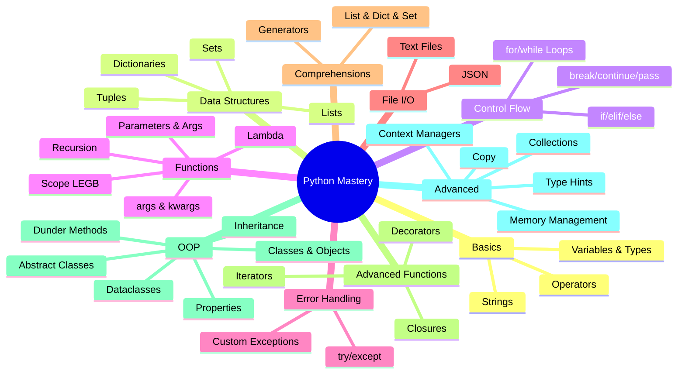

---
tags:
  - python
  - revision
  - basics
  - comprehensive
created: 2026-04-23
status: complete
---

# 🐍 مراجعة Python الشاملة — من الصفر للنهاية

> الملف ده مش كتاب تقراه — هو جلسة مذاكرة مع صاحبك اللي بيعرف Python كويس.
> كل حاجة مرتبة بالترتيب — كل concept بتبني على اللي قبلها.
> الكود كومنتاته بالإنجليزي، الشرح بالمصري.

---

## 📋 فهرس

- [[#🔷 الجزء الأول — Python بتشتغل إزاي؟]]
- [[#🔷 الجزء الثاني — Variables والـ Data Types]]
- [[#🔷 الجزء الثالث — Operators]]
- [[#🔷 الجزء الرابع — Strings بالتفصيل]]
- [[#🔷 الجزء الخامس — Lists]]
- [[#🔷 الجزء السادس — Tuples]]
- [[#🔷 الجزء السابع — Sets]]
- [[#🔷 الجزء الثامن — Dictionaries]]
- [[#🔷 الجزء التاسع — Control Flow]]
- [[#🔷 الجزء العاشر — Loops]]
- [[#🔷 الجزء الحادي عشر — Functions الأساسيات]]
- [[#🔷 الجزء الثاني عشر — Functions المتقدمة]]
- [[#🔷 الجزء الثالث عشر — Lambda و Recursion]]
- [[#🔷 الجزء الرابع عشر — Error Handling]]
- [[#🔷 الجزء الخامس عشر — File I/O]]
- [[#🔷 الجزء السادس عشر — Modules و Packages]]
- [[#🔷 الجزء السابع عشر — Comprehensions]]
- [[#🔷 الجزء الثامن عشر — Closures و Decorators]]
- [[#🔷 الجزء التاسع عشر — Generators و Iterators]]
- [[#🔷 الجزء العشرون — OOP الأساسيات]]
- [[#🔷 الجزء الحادي والعشرون — OOP الوراثة]]
- [[#🔷 الجزء الثاني والعشرون — Dunder Methods]]
- [[#🔷 الجزء الثالث والعشرون — Properties و Encapsulation]]
- [[#🔷 الجزء الرابع والعشرون — Class Methods و Static Methods]]
- [[#🔷 الجزء الخامس والعشرون — Abstract Classes]]
- [[#🔷 الجزء السادس والعشرون — Multiple Inheritance و MRO]]
- [[#🔷 الجزء السابع والعشرون — Dataclasses]]
- [[#🔷 الجزء الثامن والعشرون — Advanced Topics]]

---

## 🔷 الجزء الأول — Python بتشتغل إزاي؟

### الفكرة الأساسية

تخيّل معايا إنك بتكلم حد بلغة هو مش بيفهمها — لازم تيجي ترجمان في النص. ده بالظبط اللي Python بتعمله.

إنت بتكتب كود بلغة Python (high-level — قريبة من الإنجليزي)، وجهاز الكومبيوتر بيفهم بس machine code (صفر وواحد). في النص في حاجة اسمها **CPython Interpreter** — هو اللي بياخد كودك ويحوله لـ **bytecode**، وبعدين بيشغّل الـ bytecode ده على الـ machine.

```
Python Code (.py)
      ↓
  CPython Interpreter
      ↓
  Bytecode (.pyc)
      ↓
  Python Virtual Machine (PVM)
      ↓
  التنفيذ الفعلي على الجهاز
```

### Python: Interpreted مش Compiled

في لغات زي C أو Java، الكود بيتترجم كله مرة واحدة قبل ما يشتغل (compiled). Python بتترجم وتشغّل **سطر بسطر** (interpreted). ده معناه:
- لو في error في السطر 10، الـ 9 سطور الأول هيتشغلوا الأول
- مفيش ملف تنفيذي منفصل — الـ interpreter نفسه هو اللي بيشغّل

### Dynamic Typing

Python مش محتاج تقوله نوع المتغير — هو بيحدده وقت التشغيل.

```python
x = 10        # Python sees: int
x = "hello"   # Python sees: str — same variable, different type, no problem
x = [1, 2, 3] # Python sees: list
```

ده اسمه **Dynamic Typing** — بالظبط زي التاجر اللي بيشيل أي بضاعة في نفس الكيس، مش محدد للكيس نوع واحد.

> [!note] لاحظ
> Dynamic Typing مش معناه "مفيش types". Python **Strongly Typed** — يعني مش ممكن تجمع string وnumber من غير ما تعمل تحويل.

---

## 🔷 الجزء الثاني — Variables والـ Data Types

### إيه هو الـ Variable؟

الـ Variable مش صندوق بيحفظ قيمة — ده مفهوم غلط شائع. في Python، الـ Variable هو **label (تيكيت)** بيشاور على object في الـ memory. الـ object هو اللي فيه القيمة الفعلية.

```python
x = 42
# What happens:
# 1. Python creates an int object with value 42 in memory
# 2. Python creates a label "x" that points to that object
# x itself holds nothing — it just points

y = x
# Now both x and y point to the SAME object
# No copy was made

x = 100
# Python creates a NEW int object (100)
# x now points to the new object
# y still points to 42 — unchanged
```

### قواعد تسمية الـ Variables

```python
# ✅ Valid names
my_variable = 1
_private = 2
name2 = 3
camelCase = 4       # works but not Pythonic
CONSTANT_VALUE = 5  # convention for constants

# ❌ Invalid names
2name = 1      # SyntaxError: can't start with a digit
my-var = 2     # SyntaxError: hyphens not allowed (it's subtraction!)
class = 3      # SyntaxError: reserved keyword
```

> [!tip] الـ Convention في Python
> بنستخدم `snake_case` للمتغيرات والـ functions، و`PascalCase` للـ Classes، و`UPPER_SNAKE_CASE` للـ Constants.

### الـ Built-in Data Types

```python
# ─── Numeric Types ───────────────────────────────
age        = 25          # int — whole numbers, no size limit in Python!
price      = 99.99       # float — decimal numbers (64-bit double precision)
score      = 3 + 4j      # complex — real + imaginary (rare in daily use)

# ─── Text Type ───────────────────────────────────
name       = "Ali"       # str — immutable sequence of characters
multi_line = """
This is
a multi-line string
"""

# ─── Boolean Type ────────────────────────────────
is_active  = True        # bool — subclass of int! True==1, False==0
is_deleted = False

# ─── None Type ───────────────────────────────────
result     = None        # NoneType — Python's version of null/nil

# ─── Sequence Types ──────────────────────────────
my_list    = [1, 2, 3]       # list — ordered, mutable
my_tuple   = (1, 2, 3)       # tuple — ordered, immutable
my_range   = range(10)       # range — immutable sequence of numbers

# ─── Mapping Type ────────────────────────────────
my_dict    = {"name": "Ali", "age": 25}   # dict — key-value pairs

# ─── Set Types ───────────────────────────────────
my_set     = {1, 2, 3}       # set — unordered, no duplicates, mutable
my_frozenset = frozenset({1, 2, 3})       # frozenset — immutable set
```

### type() و isinstance()

```python
x = 42
print(type(x))           # → <class 'int'>
print(type(x) == int)    # → True

# isinstance() is better — works with inheritance too
print(isinstance(x, int))         # → True
print(isinstance(x, (int, float))) # → True — check against multiple types
print(isinstance(True, int))      # → True — because bool IS a subclass of int!
```

لاحظ الجزء ده: `isinstance(True, int)` بترجع `True`! ده لأن الـ `bool` في Python هو subclass من الـ `int`. يعني `True` هو `1` و`False` هو `0` فعلاً.

### Type Casting (تحويل الأنواع)

```python
# ─── Explicit Casting — إنت اللي بتقرر ───────────
int("42")          # → 42       — string to int
int(3.9)           # → 3        — float to int (truncates, does NOT round!)
int(True)          # → 1
float("3.14")      # → 3.14
float(5)           # → 5.0
str(100)           # → "100"
str(3.14)          # → "3.14"
bool(0)            # → False
bool("")           # → False
bool("hello")      # → True     — any non-empty string is truthy
bool([])           # → False    — empty list is falsy
bool([0])          # → True     — list with one element (even 0) is truthy
list("hello")      # → ['h', 'e', 'l', 'l', 'o']
list((1, 2, 3))    # → [1, 2, 3]
tuple([1, 2, 3])   # → (1, 2, 3)
set([1, 2, 2, 3])  # → {1, 2, 3} — removes duplicates

# ─── Implicit Casting — Python بيعملها لوحده ─────
result = 5 + 2.0   # → 7.0 — int + float = float automatically
result = True + 3  # → 4   — True becomes 1, then added to 3
```

### الـ Truthiness

ده مفهوم مهم جداً — كل قيمة في Python ليها "قيمة منطقية" حتى لو مش bool.

```python
# ─── Falsy values — بتتعامل كـ False في أي if ────
# False, 0, 0.0, 0j, "", [], (), {}, set(), None, range(0)

if not []:
    print("empty list is falsy!")   # → this prints

if not "":
    print("empty string is falsy!") # → this prints

# ─── Truthy — everything else ─────────────────────
if [0]:               # list with one element — truthy!
    print("truthy")   # → this prints

if "0":               # non-empty string — truthy!
    print("truthy")   # → this prints

# ─── Practical use ───────────────────────────────
data = []
if not data:          # cleaner than: if len(data) == 0:
    print("No data!")
```

---

## 🔷 الجزء الثالث — Operators

### Arithmetic Operators

```python
a, b = 17, 5

print(a + b)    # → 22   — addition
print(a - b)    # → 12   — subtraction
print(a * b)    # → 85   — multiplication
print(a / b)    # → 3.4  — true division — ALWAYS returns float
print(a // b)   # → 3    — floor division — integer part only
print(a % b)    # → 2    — modulo — remainder
print(a ** b)   # → 1419857 — exponentiation (17^5)

# ⚠️ Important: // does FLOOR, not truncate
print(-17 // 5)  # → -4  — NOT -3! floor(-3.4) = -4
print(-17 % 5)   # → 3   — NOT -2! Python modulo always has same sign as divisor
```

### Comparison Operators

```python
x, y = 10, 20

print(x == y)   # → False — equal value
print(x != y)   # → True  — not equal
print(x < y)    # → True  — less than
print(x > y)    # → False — greater than
print(x <= y)   # → True  — less than or equal
print(x >= y)   # → False — greater than or equal

# Python allows chaining comparisons — elegant!
age = 25
print(18 <= age < 65)   # → True — reads like math notation
print(1 < 2 < 3 < 4)    # → True
```

### Logical Operators

```python
# and — both must be True
print(True and True)    # → True
print(True and False)   # → False

# or — at least one must be True
print(True or False)    # → True
print(False or False)   # → False

# not — flips the value
print(not True)         # → False
print(not False)        # → True

# ─── Short-circuit evaluation — مهم جداً ──────────
# and: if first is False, second is NEVER evaluated
# or:  if first is True,  second is NEVER evaluated

x = 0
result = x != 0 and (10 / x > 1)  # safe! division never happens because x==0
print(result)   # → False

# ─── Practical short-circuit trick ────────────────
name = ""
display = name or "Anonymous"    # if name is falsy, use "Anonymous"
print(display)   # → "Anonymous"

name = "Ali"
display = name or "Anonymous"
print(display)   # → "Ali"
```

### Assignment Operators

```python
x = 10

x += 5    # same as: x = x + 5    → x is now 15
x -= 3    # same as: x = x - 3    → x is now 12
x *= 2    # same as: x = x * 2    → x is now 24
x //= 5   # same as: x = x // 5   → x is now 4
x **= 3   # same as: x = x ** 3   → x is now 64
x %= 10   # same as: x = x % 10   → x is now 4

# Multiple assignment — Python style
a, b = 1, 2
a, b = b, a   # swap values without a temp variable!
print(a, b)   # → 2 1
```

### Identity و Membership Operators

```python
# ─── Identity: is / is not ─────────────────────────
# Checks if two variables point to the SAME object in memory
a = [1, 2, 3]
b = [1, 2, 3]
c = a

print(a == b)    # → True  — same VALUE
print(a is b)    # → False — different OBJECTS in memory
print(a is c)    # → True  — same object (c points to a's object)

# Always use "is" with None, True, False
x = None
print(x is None)      # ✅ correct
print(x == None)      # works but not Pythonic (== can be overridden by __eq__)

# ─── Membership: in / not in ───────────────────────
fruits = ["apple", "banana", "cherry"]
print("apple" in fruits)       # → True
print("mango" not in fruits)   # → True

text = "Hello, Python!"
print("Python" in text)        # → True — works with strings too

my_dict = {"name": "Ali", "age": 25}
print("name" in my_dict)       # → True — checks KEYS only
print("Ali" in my_dict)        # → False — "Ali" is a value, not a key
```

### الـ Walrus Operator `:=` (Python 3.8+)

```python
# Old way: assign then check
data = get_some_data()
if data:
    process(data)

# Walrus way: assign AND check in one expression
if data := get_some_data():
    process(data)

# Very useful in while loops
import random
while (num := random.randint(1, 10)) != 7:   # keep going until we get 7
    print(f"Got {num}, not 7 yet...")
print(f"Finally got 7!")
```

---

## 🔷 الجزء الرابع — Strings بالتفصيل

### إيه هو الـ String؟

الـ String هو **immutable sequence of Unicode characters**. كلمة immutable دي مهمة — يعني بعد ما اتعمل الـ string، مينفعش تغير في حرف فيه.

تخيّل الـ string زي تذكرة مكتوبة بمداد — مينفعش تمسح وتغير، تعمل تذكرة جديدة.

```python
# ─── Creating strings ─────────────────────────────
s1 = 'single quotes'
s2 = "double quotes"         # same thing
s3 = """triple quotes
for multi-line strings"""
s4 = '''also triple quotes
works the same'''

# raw strings — backslashes are literal (useful for regex and paths)
path = r"C:\Users\Ali\Documents"   # r prefix = raw
print(path)   # → C:\Users\Ali\Documents  (no escape processing)

# ─── Immutability in action ───────────────────────
s = "hello"
# s[0] = "H"   # → TypeError: 'str' object does not support item assignment
# To "change" a string, you create a NEW one:
s = "H" + s[1:]   # → "Hello" — new string object
```

### String Indexing و Slicing

```python
s = "Python"
#    P  y  t  h  o  n
#    0  1  2  3  4  5   (positive indices)
#   -6 -5 -4 -3 -2 -1   (negative indices — count from end)

# ─── Indexing ─────────────────────────────────────
print(s[0])    # → 'P'  — first character
print(s[-1])   # → 'n'  — last character
print(s[-2])   # → 'o'  — second from end

# ─── Slicing: s[start:stop:step] ──────────────────
print(s[1:4])    # → 'yth'  — index 1, 2, 3 (stop is exclusive!)
print(s[:3])     # → 'Pyt'  — from beginning to index 2
print(s[3:])     # → 'hon'  — from index 3 to end
print(s[:])      # → 'Python' — full copy
print(s[::2])    # → 'Pto'  — every 2nd character
print(s[::-1])   # → 'nohtyP' — REVERSE the string (step=-1)
print(s[4:1:-1]) # → 'oht'  — from index 4 down to index 2

# Practice examples
text = "Hello, World!"
print(text[7:12])   # → 'World'
print(text[-6:-1])  # → 'World'
```

### String Methods

```python
s = "  Hello, Python World!  "

# ─── Case methods ─────────────────────────────────
print(s.lower())          # → "  hello, python world!  "
print(s.upper())          # → "  HELLO, PYTHON WORLD!  "
print(s.title())          # → "  Hello, Python World!  "
print(s.swapcase())       # → "  hELLO, pYTHON wORLD!  "
print(s.capitalize())     # → "  hello, python world!  " (only first char)

# ─── Whitespace methods ───────────────────────────
print(s.strip())          # → "Hello, Python World!"  — removes both sides
print(s.lstrip())         # → "Hello, Python World!  " — removes left only
print(s.rstrip())         # → "  Hello, Python World!" — removes right only

# ─── Search methods ───────────────────────────────
s2 = "Hello, Python World!"
print(s2.find("Python"))      # → 7   — index of first occurrence, -1 if not found
print(s2.index("Python"))     # → 7   — same but raises ValueError if not found
print(s2.count("l"))          # → 3   — count occurrences
print(s2.startswith("Hello")) # → True
print(s2.endswith("!"))       # → True
print("Python" in s2)         # → True — faster than find for just checking

# ─── Modification methods ─────────────────────────
print(s2.replace("Python", "Beautiful"))  # → "Hello, Beautiful World!"
print(s2.replace("l", "L", 2))  # → "HeLLo, Python World!" — replace first 2 only

# ─── Split and Join ───────────────────────────────
s3 = "apple,banana,cherry"
parts = s3.split(",")         # → ['apple', 'banana', 'cherry']
print(parts)

s4 = "hello world python"
words = s4.split()            # split on whitespace (any whitespace)
print(words)                  # → ['hello', 'world', 'python']

# join — reverse of split
print(", ".join(words))       # → "hello, world, python"
print("-".join(["a", "b", "c"]))  # → "a-b-c"

# ─── Check methods ────────────────────────────────
print("hello".isalpha())    # → True  — all letters
print("hello2".isalpha())   # → False
print("123".isdigit())      # → True  — all digits
print("  ".isspace())       # → True  — all whitespace
print("Hello World".istitle())  # → True
```

### String Formatting

```python
name = "Ali"
age = 25
score = 95.567

# ─── Method 1: % operator (old, avoid) ────────────
print("My name is %s and I am %d years old" % (name, age))

# ─── Method 2: .format() ──────────────────────────
print("My name is {} and I am {} years old".format(name, age))
print("My name is {0} and I am {1} years old".format(name, age))
print("My name is {name} and I am {age} years old".format(name=name, age=age))

# ─── Method 3: f-strings (Python 3.6+) ← USE THIS ─
print(f"My name is {name} and I am {age} years old")

# f-strings support EXPRESSIONS inside {}
print(f"Next year I'll be {age + 1}")
print(f"Score: {score:.2f}")         # → 95.57  (2 decimal places)
print(f"Name: {name!r}")             # → 'Ali'  (repr format)
print(f"Name: {name!s}")             # → Ali    (str format)
print(f"Name: {name!u}")             # uppercase (3.12+)

# Alignment and padding
print(f"{'left':<10}|")    # → 'left      |'  — left align in 10 chars
print(f"{'right':>10}|")   # → '     right|'  — right align
print(f"{'center':^10}|")  # → '  center  |'  — center align
print(f"{3.14159:.3f}")     # → '3.142'         — 3 decimal places
print(f"{1000000:,}")       # → '1,000,000'      — thousands separator
print(f"{255:b}")           # → '11111111'        — binary
print(f"{255:x}")           # → 'ff'              — hex
print(f"{255:08b}")         # → '11111111'        — zero-padded binary

# Python 3.8+ debugging trick
x = 42
print(f"{x = }")    # → x = 42  (prints name AND value)
```

---

## 🔷 الجزء الخامس — Lists

### إيه هي الـ List؟

الـ List هي أكثر الـ data structures استخدامًا في Python. تخيّلها زي **شنطة** — ممكن تحط فيها أي حاجة، وترتيبها مهم، وممكن تضيف وتشيل.

```python
# ─── Creating lists ───────────────────────────────
empty = []                          # empty list
numbers = [1, 2, 3, 4, 5]
mixed   = [1, "hello", 3.14, True, None]   # can mix types!
nested  = [[1, 2], [3, 4], [5, 6]]         # list of lists

# list() constructor
from_string = list("hello")         # → ['h', 'e', 'l', 'l', 'o']
from_range  = list(range(5))        # → [0, 1, 2, 3, 4]
from_tuple  = list((1, 2, 3))       # → [1, 2, 3]
```

### Indexing و Slicing

```python
fruits = ["apple", "banana", "cherry", "date", "elderberry"]

# ─── Indexing ─────────────────────────────────────
print(fruits[0])    # → "apple"
print(fruits[-1])   # → "elderberry"
print(fruits[-2])   # → "date"

# ─── Slicing ──────────────────────────────────────
print(fruits[1:3])    # → ["banana", "cherry"]
print(fruits[:2])     # → ["apple", "banana"]
print(fruits[2:])     # → ["cherry", "date", "elderberry"]
print(fruits[::2])    # → ["apple", "cherry", "elderberry"]
print(fruits[::-1])   # → reversed list

# ─── Modifying via index (lists ARE mutable) ──────
fruits[0] = "avocado"
print(fruits[0])   # → "avocado"

# ─── Modifying via slice ──────────────────────────
numbers = [1, 2, 3, 4, 5]
numbers[1:3] = [20, 30]      # replace elements at index 1 and 2
print(numbers)   # → [1, 20, 30, 4, 5]

numbers[1:3] = [99]          # replace 2 elements with 1
print(numbers)   # → [1, 99, 4, 5]
```

### List Methods

```python
fruits = ["apple", "banana"]

# ─── Adding elements ──────────────────────────────
fruits.append("cherry")        # adds to END — O(1)
print(fruits)   # → ["apple", "banana", "cherry"]

fruits.insert(1, "avocado")    # inserts at index 1 — O(n)
print(fruits)   # → ["apple", "avocado", "banana", "cherry"]

other = ["date", "elderberry"]
fruits.extend(other)            # adds all elements from another iterable
print(fruits)   # → ["apple", "avocado", "banana", "cherry", "date", "elderberry"]

# ─── Removing elements ────────────────────────────
fruits.remove("banana")         # removes FIRST occurrence by VALUE — raises ValueError if not found
print(fruits)

popped = fruits.pop()           # removes and RETURNS last element
print(popped)    # → "elderberry"

popped_at = fruits.pop(1)       # removes and returns element at index 1
print(popped_at) # → "avocado"

del fruits[0]                   # delete by index — no return value
# del fruits[1:3]               # delete a slice

fruits.clear()                  # removes ALL elements — list becomes []

# ─── Searching ────────────────────────────────────
nums = [3, 1, 4, 1, 5, 9, 2, 6, 5]
print(nums.index(5))     # → 4  — index of FIRST occurrence
print(nums.count(1))     # → 2  — how many times 1 appears
print(1 in nums)         # → True

# ─── Sorting ──────────────────────────────────────
nums.sort()                      # in-place sort — modifies original, returns None
print(nums)   # → [1, 1, 2, 3, 4, 5, 5, 6, 9]

nums.sort(reverse=True)
print(nums)   # → [9, 6, 5, 5, 4, 3, 2, 1, 1]

words = ["banana", "apple", "cherry"]
words.sort(key=len)              # sort by length
print(words)   # → ["apple", "banana", "cherry"]

words.sort(key=str.lower)        # sort case-insensitively
sorted_copy = sorted(words)      # returns NEW sorted list — original unchanged

nums.reverse()                   # in-place reverse — modifies original

# ─── Other useful methods ─────────────────────────
nums = [1, 2, 3]
copy = nums.copy()               # shallow copy — same as nums[:]
print(copy)   # → [1, 2, 3]

print(len(nums))   # → 3
print(min(nums))   # → 1
print(max(nums))   # → 3
print(sum(nums))   # → 6
```

### الـ List Unpacking

```python
# ─── Basic unpacking ──────────────────────────────
a, b, c = [1, 2, 3]
print(a, b, c)   # → 1 2 3

# ─── Extended unpacking with * ────────────────────
first, *rest = [1, 2, 3, 4, 5]
print(first)   # → 1
print(rest)    # → [2, 3, 4, 5]

*beginning, last = [1, 2, 3, 4, 5]
print(beginning)  # → [1, 2, 3, 4]
print(last)       # → 5

first, *middle, last = [1, 2, 3, 4, 5]
print(first)    # → 1
print(middle)   # → [2, 3, 4]
print(last)     # → 5

# ─── Swapping values ──────────────────────────────
x, y = 10, 20
x, y = y, x           # swap without temp variable!
print(x, y)   # → 20 10
```

---

## 🔷 الجزء السادس — Tuples

### إيه هو الـ Tuple؟

الـ Tuple زي الـ List بالظبط بس **immutable** — بعد ما اتعملت، مينفعش تتغير. تخيّلها زي **إيصال** — بعد ما اتطبع، مش ممكن تعدل عليه.

```python
# ─── Creating tuples ──────────────────────────────
empty     = ()
single    = (42,)        # IMPORTANT: the comma makes it a tuple, not the parens!
single2   = 42,          # same thing — parens are optional
coords    = (10, 20)
rgb       = (255, 128, 0)
mixed     = (1, "hello", 3.14, [1, 2])  # can contain mutable objects

# ─── The comma trap ───────────────────────────────
x = (42)      # this is NOT a tuple — it's just the number 42 in parentheses
y = (42,)     # THIS is a tuple with one element
print(type(x))   # → <class 'int'>
print(type(y))   # → <class 'tuple'>

# ─── Indexing and slicing — same as lists ─────────
t = (10, 20, 30, 40, 50)
print(t[1])     # → 20
print(t[-1])    # → 50
print(t[1:3])   # → (20, 30)
print(t[::-1])  # → (50, 40, 30, 20, 10)

# ─── Tuples are immutable ─────────────────────────
# t[0] = 99   # → TypeError: tuple object does not support item assignment

# But if a tuple contains a mutable object, that object CAN be changed
t2 = (1, [2, 3], 4)
t2[1].append(99)     # the LIST inside is mutable
print(t2)   # → (1, [2, 3, 99], 4)
```

### ليه نستخدم Tuple بدل List؟

```python
# 1. Tuples are faster — less memory, faster iteration
# 2. Tuples can be dictionary KEYS (lists can't — they're not hashable)
locations = {
    (30.0626, 31.2497): "Cairo",    # tuple as dict key ✅
    (48.8566, 2.3522):  "Paris",
}

# 3. Tuples signal "this data shouldn't change"
RGB_RED   = (255, 0, 0)    # convention: tuple = constant data
RGB_GREEN = (0, 255, 0)

# 4. Multiple return values from functions
def get_min_max(numbers):
    return min(numbers), max(numbers)   # returns a tuple

low, high = get_min_max([3, 1, 4, 1, 5, 9])
print(low, high)   # → 1 9

# 5. Named tuples — even better readability
from collections import namedtuple

Point = namedtuple("Point", ["x", "y"])
p = Point(10, 20)
print(p.x)          # → 10  — access by name
print(p.y)          # → 20
print(p[0])         # → 10  — still works like a regular tuple
print(p)            # → Point(x=10, y=20)  — nice repr
```

---

## 🔷 الجزء السابع — Sets

### إيه هو الـ Set؟

الـ Set هو collection بدون ترتيب وبدون duplicates. تخيّله زي **كيس الحجارة** — كل حجر unique، ومش مهم الترتيب، ومينفعش يتكرر نفس الحجر.

```python
# ─── Creating sets ────────────────────────────────
empty  = set()              # IMPORTANT: {} creates empty DICT, not set!
nums   = {1, 2, 3, 4, 5}
fruits = {"apple", "banana", "cherry"}
with_dups = {1, 2, 2, 3, 3, 3}    # duplicates automatically removed
print(with_dups)   # → {1, 2, 3}

from_list = set([1, 2, 2, 3, 4, 4, 5])   # great for removing duplicates
print(from_list)   # → {1, 2, 3, 4, 5}

# ─── Sets are unordered ───────────────────────────
# No indexing! s[0] → TypeError
# Order of elements is NOT guaranteed
```

### Set Methods

```python
s = {1, 2, 3, 4, 5}

# ─── Adding and removing ──────────────────────────
s.add(6)            # adds one element
print(s)   # → {1, 2, 3, 4, 5, 6}

s.add(3)            # already exists — no error, no duplicate
print(s)   # → {1, 2, 3, 4, 5, 6}  — unchanged

s.discard(10)       # removes if exists — NO error if not found
s.remove(6)         # removes — raises KeyError if not found

popped = s.pop()    # removes and returns ARBITRARY element (unordered!)
s.clear()           # removes all elements

# ─── Set Operations ───────────────────────────────
a = {1, 2, 3, 4, 5}
b = {4, 5, 6, 7, 8}

# Union — everything from both
print(a | b)              # → {1, 2, 3, 4, 5, 6, 7, 8}
print(a.union(b))         # same

# Intersection — only what's in BOTH
print(a & b)              # → {4, 5}
print(a.intersection(b))  # same

# Difference — in a but NOT in b
print(a - b)              # → {1, 2, 3}
print(a.difference(b))    # same

# Symmetric Difference — in one but NOT both
print(a ^ b)                       # → {1, 2, 3, 6, 7, 8}
print(a.symmetric_difference(b))   # same

# ─── Set comparisons ──────────────────────────────
small = {1, 2, 3}
big   = {1, 2, 3, 4, 5}

print(small.issubset(big))    # → True  — all of small is in big
print(big.issuperset(small))  # → True  — big contains all of small
print(small.isdisjoint({9, 10}))  # → True — no common elements

# ─── Main use case: removing duplicates ───────────
data = [1, 2, 2, 3, 3, 3, 4, 5, 5]
unique = list(set(data))   # fast deduplication (order not guaranteed)
print(unique)   # → [1, 2, 3, 4, 5]  (or similar unordered)
```

---

## 🔷 الجزء الثامن — Dictionaries

### إيه هو الـ Dictionary؟

الـ Dictionary هو collection من الـ **key-value pairs**. تخيّله زي **دفتر تليفون** — كل اسم (key) عنده رقم تليفون (value). بتدور بالاسم مش بالترتيب.

```python
# ─── Creating dictionaries ────────────────────────
empty = {}                       # empty dict
empty = dict()                   # same

person = {
    "name": "Ali",
    "age": 25,
    "city": "Cairo",
    "is_active": True
}

# dict() constructor with keyword arguments
config = dict(host="localhost", port=8000, debug=True)

# dict from list of tuples
keys_values = [("a", 1), ("b", 2), ("c", 3)]
d = dict(keys_values)   # → {"a": 1, "b": 2, "c": 3}
```

### Accessing و Modifying

```python
person = {"name": "Ali", "age": 25, "city": "Cairo"}

# ─── Accessing values ─────────────────────────────
print(person["name"])          # → "Ali"  — raises KeyError if key not found!
print(person.get("name"))      # → "Ali"  — returns None if not found (safe)
print(person.get("email", "N/A"))  # → "N/A" — default if not found

# ─── Modifying ────────────────────────────────────
person["age"] = 26             # update existing
person["email"] = "ali@example.com"  # add new key
print(person)

# ─── Removing ─────────────────────────────────────
del person["city"]             # delete — KeyError if not found
removed = person.pop("email")  # remove and return — KeyError if not found
removed = person.pop("phone", None)  # safe pop — returns None if not found
person.popitem()               # removes and returns LAST inserted pair (Python 3.7+)
person.clear()                 # removes everything
```

### Dictionary Methods

```python
student = {
    "name": "Sara",
    "grade": 92,
    "courses": ["Math", "CS", "Physics"]
}

# ─── Keys, Values, Items ──────────────────────────
print(student.keys())     # → dict_keys(['name', 'grade', 'courses'])
print(student.values())   # → dict_values(['Sara', 92, ['Math', 'CS', 'Physics']])
print(student.items())    # → dict_items([('name', 'Sara'), ('grade', 92), ...])

# Convert to lists if needed
keys_list = list(student.keys())

# ─── Iterating ────────────────────────────────────
for key in student:                   # iterates over keys
    print(key)

for key, value in student.items():    # iterate key-value pairs
    print(f"{key}: {value}")

# ─── update() ─────────────────────────────────────
student.update({"grade": 95, "city": "Cairo"})   # update/add multiple
print(student)

# ─── Merging dicts (Python 3.9+) ──────────────────
d1 = {"a": 1, "b": 2}
d2 = {"b": 99, "c": 3}
merged = d1 | d2          # → {"a": 1, "b": 99, "c": 3} — d2 overrides
d1 |= d2                  # in-place merge

# ─── setdefault() ─────────────────────────────────
d = {}
d.setdefault("count", 0)   # sets key to default ONLY IF key doesn't exist
d["count"] += 1            # safe to increment now

# ─── Checking membership ──────────────────────────
print("name" in student)        # → True  — checks KEYS
print("Sara" in student)        # → False — values not checked
print("Sara" in student.values())  # → True
```

### Nested Dictionaries

```python
# ─── Real-world structure ─────────────────────────
database = {
    "user_001": {
        "name": "Ali",
        "scores": [85, 90, 92],
        "address": {
            "city": "Cairo",
            "country": "Egypt"
        }
    },
    "user_002": {
        "name": "Sara",
        "scores": [95, 98, 91],
        "address": {
            "city": "Alexandria",
            "country": "Egypt"
        }
    }
}

# Accessing nested values
print(database["user_001"]["name"])                  # → "Ali"
print(database["user_001"]["address"]["city"])       # → "Cairo"
print(database["user_002"]["scores"][1])             # → 98
```

---

## 🔷 الجزء التاسع — Control Flow

### if / elif / else

```python
# ─── Basic if ─────────────────────────────────────
age = 20

if age >= 18:
    print("Adult")   # executes if condition is True

# ─── if/else ──────────────────────────────────────
if age >= 18:
    print("Adult")
else:
    print("Minor")

# ─── if/elif/else ─────────────────────────────────
score = 75

if score >= 90:
    grade = "A"
elif score >= 80:
    grade = "B"
elif score >= 70:
    grade = "C"
elif score >= 60:
    grade = "D"
else:
    grade = "F"

print(f"Grade: {grade}")   # → "Grade: C"
```

بالمصري: الـ Python بيتحقق من الشروط من فوق لأسفل — أول شرط `True` بينفّذ وبعدين يخرج. الباقي مش بيتشيك عليهم أصلاً.

```python
# ─── Nested if ────────────────────────────────────
x = 15

if x > 0:
    if x > 10:
        print("greater than 10")   # prints this
    else:
        print("between 1 and 10")
else:
    print("zero or negative")

# ─── Ternary expression (one-liner if/else) ───────
age = 20
status = "adult" if age >= 18 else "minor"   # value_if_true if condition else value_if_false
print(status)   # → "adult"

# Nested ternary (use sparingly — gets unreadable)
score = 75
grade = "A" if score >= 90 else "B" if score >= 80 else "C"
```

### match / case (Python 3.10+) — Structural Pattern Matching

```python
command = "quit"

match command:
    case "quit" | "exit":         # multiple patterns with |
        print("Exiting...")
    case "help":
        print("Available commands: quit, help, start")
    case "start":
        print("Starting...")
    case _:                        # default — like else
        print(f"Unknown command: {command}")

# ─── Matching with values ──────────────────────────
point = (0, 5)

match point:
    case (0, 0):
        print("Origin")
    case (0, y):                  # captures the y value
        print(f"On y-axis at {y}")
    case (x, 0):                  # captures the x value
        print(f"On x-axis at {x}")
    case (x, y):
        print(f"At ({x}, {y})")
```

---

## 🔷 الجزء العاشر — Loops

### for Loop

```python
# ─── Iterating over sequences ─────────────────────
fruits = ["apple", "banana", "cherry"]

for fruit in fruits:
    print(fruit)

# ─── Iterating over a string ──────────────────────
for char in "hello":
    print(char)   # prints h, e, l, l, o

# ─── range() ──────────────────────────────────────
for i in range(5):          # 0, 1, 2, 3, 4
    print(i)

for i in range(2, 8):       # 2, 3, 4, 5, 6, 7
    print(i)

for i in range(0, 20, 3):   # 0, 3, 6, 9, 12, 15, 18 (step=3)
    print(i)

for i in range(10, 0, -2):  # 10, 8, 6, 4, 2 (counting down)
    print(i)
```

### enumerate() و zip()

```python
# ─── enumerate() — gives index AND value ──────────
fruits = ["apple", "banana", "cherry"]

for i, fruit in enumerate(fruits):
    print(f"{i}: {fruit}")
# → 0: apple / 1: banana / 2: cherry

for i, fruit in enumerate(fruits, start=1):   # start index at 1
    print(f"{i}: {fruit}")
# → 1: apple / 2: banana / 3: cherry

# ─── zip() — combines multiple iterables ──────────
names  = ["Ali", "Sara", "Omar"]
grades = [85, 92, 78]
cities = ["Cairo", "Alex", "Giza"]

for name, grade, city in zip(names, grades, cities):
    print(f"{name}: {grade} — from {city}")

# zip stops at the shortest iterable
a = [1, 2, 3, 4, 5]
b = ["a", "b", "c"]
print(list(zip(a, b)))   # → [(1, 'a'), (2, 'b'), (3, 'c')]  — stops at 3!

# zip_longest if you want all elements
from itertools import zip_longest
print(list(zip_longest(a, b, fillvalue=None)))
# → [(1, 'a'), (2, 'b'), (3, 'c'), (4, None), (5, None)]

# ─── Convert to dict with zip ─────────────────────
grade_dict = dict(zip(names, grades))
print(grade_dict)   # → {"Ali": 85, "Sara": 92, "Omar": 78}
```

### while Loop

```python
# ─── Basic while ──────────────────────────────────
count = 0
while count < 5:
    print(count)    # 0 1 2 3 4
    count += 1      # don't forget to update! otherwise infinite loop

# ─── while True + break ───────────────────────────
while True:                                # infinite loop
    command = input("Enter command: ")
    if command == "quit":
        break                              # exit the loop
    print(f"You typed: {command}")

# ─── while with condition ─────────────────────────
total = 0
n = 1
while n <= 100:
    total += n
    n += 1
print(f"Sum 1 to 100: {total}")   # → 5050
```

### break, continue, pass

```python
# ─── break — exit loop immediately ───────────────
for i in range(10):
    if i == 5:
        break          # stops at 5
    print(i)           # → 0 1 2 3 4

# ─── continue — skip current iteration ───────────
for i in range(10):
    if i % 2 == 0:
        continue       # skip even numbers
    print(i)           # → 1 3 5 7 9

# ─── pass — do nothing (placeholder) ─────────────
for i in range(5):
    if i == 3:
        pass           # nothing happens, loop continues
    print(i)           # → 0 1 2 3 4

# pass is used for empty blocks that need a body
def not_implemented_yet():
    pass               # valid empty function

class EmptyClass:
    pass               # valid empty class
```

### for/while + else (Python Unique Feature!)

```python
# The else block runs when loop completes WITHOUT hitting break
for i in range(5):
    if i == 10:     # never true
        break
    print(i)
else:
    print("Loop finished normally!")   # → this prints

# Useful for search pattern
numbers = [1, 3, 5, 7, 9]
target = 6

for num in numbers:
    if num == target:
        print(f"Found {target}!")
        break
else:
    print(f"{target} not found!")   # → "6 not found!"
```

---

## 🔷 الجزء الحادي عشر — Functions الأساسيات

### إيه هي الـ Function؟

الـ Function هي block من الكود بتعمله اسم وبتستدعيه لما محتاجه. تخيّلها زي **وصفة طبخ** — بتكتبها مرة واحدة وبتطبخها أد ما عايز.

```python
# ─── Basic function ───────────────────────────────
def greet():
    print("Hello, World!")

greet()    # calling the function → Hello, World!
greet()    # can call multiple times

# ─── Function with parameters ─────────────────────
def greet_person(name):      # name is a PARAMETER (in definition)
    print(f"Hello, {name}!")

greet_person("Ali")          # "Ali" is an ARGUMENT (in call)
greet_person("Sara")

# ─── Function with return value ───────────────────
def add(a, b):
    return a + b             # returns a value

result = add(3, 4)           # capture the returned value
print(result)   # → 7

# A function WITHOUT return — returns None implicitly
def just_print(text):
    print(text)

x = just_print("hi")
print(x)   # → None
```

### Parameters و Arguments

```python
# ─── Positional arguments — order matters ─────────
def describe_person(name, age, city):
    print(f"{name} is {age} years old from {city}")

describe_person("Ali", 25, "Cairo")      # positional: order matters
describe_person(25, "Ali", "Cairo")      # WRONG order! — still runs but wrong output

# ─── Keyword arguments — order doesn't matter ─────
describe_person(age=25, city="Cairo", name="Ali")   # keyword: order free
describe_person("Ali", city="Cairo", age=25)        # mix: positional first

# ─── Default parameter values ─────────────────────
def greet(name, greeting="Hello"):   # greeting has a default
    print(f"{greeting}, {name}!")

greet("Ali")                 # → Hello, Ali!  (uses default)
greet("Ali", "Welcome")      # → Welcome, Ali!  (overrides default)
greet("Ali", greeting="Hey") # → Hey, Ali!  (keyword override)

# ─── Default args are evaluated ONCE at definition ─
def add_item(item, lst=[]):    # ⚠️ DANGER! lst is shared across calls!
    lst.append(item)
    return lst

print(add_item("a"))   # → ["a"]
print(add_item("b"))   # → ["a", "b"]  ← WRONG! not ["b"]!

# ✅ Correct pattern:
def add_item_safe(item, lst=None):
    if lst is None:
        lst = []               # create fresh list each call
    lst.append(item)
    return lst
```

### Multiple Return Values

```python
# Functions can return multiple values — Python packs them as a tuple
def min_max_avg(numbers):
    minimum = min(numbers)
    maximum = max(numbers)
    average = sum(numbers) / len(numbers)
    return minimum, maximum, average    # returns a tuple (min, max, avg)

# Unpack the returned tuple
low, high, avg = min_max_avg([3, 1, 4, 1, 5, 9, 2, 6])
print(f"Min: {low}, Max: {high}, Avg: {avg:.2f}")

# Or capture as a single tuple
stats = min_max_avg([3, 1, 4, 1, 5, 9])
print(stats)       # → (1, 9, 4.0)
print(stats[0])    # → 1
```

### Docstrings

```python
def calculate_area(radius):
    """
    Calculate the area of a circle.

    Args:
        radius (float): The radius of the circle. Must be positive.

    Returns:
        float: The area of the circle.

    Raises:
        ValueError: If radius is negative.

    Example:
        >>> calculate_area(5)
        78.53981633974483
    """
    if radius < 0:
        raise ValueError("Radius must be non-negative")
    return 3.14159265358979 * radius ** 2

help(calculate_area)        # prints the docstring
print(calculate_area.__doc__)  # access docstring directly
```

---

## 🔷 الجزء الثاني عشر — Functions المتقدمة

### *args و **kwargs

```python
# ─── *args — variable positional arguments ────────
# Collects extra positional args into a TUPLE
def sum_all(*args):
    print(type(args))    # → <class 'tuple'>
    print(args)          # → (1, 2, 3, 4, 5)
    return sum(args)

print(sum_all(1, 2, 3))         # → 6
print(sum_all(1, 2, 3, 4, 5))  # → 15
print(sum_all())                # → 0  — args is empty tuple ()

# ─── **kwargs — variable keyword arguments ────────
# Collects extra keyword args into a DICT
def print_info(**kwargs):
    print(type(kwargs))   # → <class 'dict'>
    for key, value in kwargs.items():
        print(f"  {key}: {value}")

print_info(name="Ali", age=25, city="Cairo")

# ─── Combining all parameter types ────────────────
# Order MUST be: positional, *args, keyword-only, **kwargs
def full_example(pos1, pos2, *args, keyword_only, **kwargs):
    print(f"pos1={pos1}, pos2={pos2}")
    print(f"args={args}")
    print(f"keyword_only={keyword_only}")
    print(f"kwargs={kwargs}")

full_example(1, 2, 3, 4, 5, keyword_only="required", extra1="a", extra2="b")

# ─── Unpacking into function calls ────────────────
def add(a, b, c):
    return a + b + c

numbers = [1, 2, 3]
print(add(*numbers))         # unpack list as positional args → 6

data = {"a": 1, "b": 2, "c": 3}
print(add(**data))           # unpack dict as keyword args → 6
```

### الـ Scope — LEGB Rule

```python
# Python searches for a name in this order: Local → Enclosing → Global → Built-in

x = "global"    # Global scope

def outer():
    x = "enclosing"   # Enclosing scope (for inner functions)

    def inner():
        x = "local"   # Local scope
        print(x)      # → "local"  — finds it locally first

    inner()
    print(x)          # → "enclosing"  — inner's local doesn't affect outer

outer()
print(x)              # → "global"  — unchanged

# ─── global keyword ───────────────────────────────
counter = 0

def increment():
    global counter       # tell Python to use the GLOBAL counter
    counter += 1         # without global: UnboundLocalError!

increment()
increment()
print(counter)   # → 2

# ─── nonlocal keyword (for nested functions) ──────
def make_counter():
    count = 0

    def increment():
        nonlocal count   # use the ENCLOSING count, not a new local
        count += 1
        return count

    return increment

counter = make_counter()
print(counter())   # → 1
print(counter())   # → 2
print(counter())   # → 3
```

---

## 🔷 الجزء الثالث عشر — Lambda و Recursion

### Lambda Functions

```python
# ─── Regular function vs Lambda ───────────────────
def square(x):
    return x ** 2

square_lambda = lambda x: x ** 2    # same thing in one line

# Lambda syntax: lambda parameters: expression (ONE expression only!)

# ─── Lambda with multiple parameters ──────────────
add = lambda a, b: a + b
print(add(3, 4))   # → 7

# ─── Lambda with conditional expression ───────────
classify = lambda x: "positive" if x > 0 else "negative" if x < 0 else "zero"
print(classify(5))    # → "positive"
print(classify(-3))   # → "negative"
print(classify(0))    # → "zero"

# ─── Real use: with sorted, map, filter ───────────
students = [
    {"name": "Ali", "grade": 85},
    {"name": "Sara", "grade": 92},
    {"name": "Omar", "grade": 78},
    {"name": "Mona", "grade": 92},
]

# Sort by grade descending, then by name alphabetically
sorted_students = sorted(students, key=lambda s: (-s["grade"], s["name"]))
for s in sorted_students:
    print(f"{s['name']}: {s['grade']}")

# ─── map() — apply function to all elements ───────
numbers = [1, 2, 3, 4, 5]
doubled = list(map(lambda x: x * 2, numbers))
print(doubled)   # → [2, 4, 6, 8, 10]

# ─── filter() — keep elements where function returns True ──
evens = list(filter(lambda x: x % 2 == 0, numbers))
print(evens)   # → [2, 4]

# ─── Note: list comprehensions are usually more readable ───
doubled = [x * 2 for x in numbers]         # cleaner than map
evens   = [x for x in numbers if x % 2 == 0]  # cleaner than filter
```

### Recursion

```python
# Recursion: a function that calls ITSELF
# Every recursive function needs:
# 1. Base case — condition to STOP
# 2. Recursive case — call with smaller input

# ─── Example 1: Factorial ─────────────────────────
def factorial(n):
    if n == 0 or n == 1:   # base case — stop here
        return 1
    return n * factorial(n - 1)   # recursive case

print(factorial(5))   # → 120
# How it works:
# factorial(5) = 5 * factorial(4)
# factorial(4) = 4 * factorial(3)
# factorial(3) = 3 * factorial(2)
# factorial(2) = 2 * factorial(1)
# factorial(1) = 1  ← base case!
# Then: 2*1=2, 3*2=6, 4*6=24, 5*24=120

# ─── Example 2: Fibonacci ─────────────────────────
def fibonacci(n):
    if n <= 1:          # base cases: fib(0)=0, fib(1)=1
        return n
    return fibonacci(n-1) + fibonacci(n-2)

print(fibonacci(10))   # → 55

# ─── Example 3: Directory tree (practical use) ────
import os

def list_files(path, indent=0):
    for item in os.listdir(path):
        full_path = os.path.join(path, item)
        print("  " * indent + item)
        if os.path.isdir(full_path):
            list_files(full_path, indent + 1)   # recurse into subdirectory

# list_files("my_project")

# ─── Python's recursion limit ─────────────────────
import sys
print(sys.getrecursionlimit())   # → 1000 by default
sys.setrecursionlimit(2000)      # can increase but be careful!
```

---

## 🔷 الجزء الرابع عشر — Error Handling

### إيه هو الـ Exception؟

الـ Exception هو حدث بيحصل لما الكود بيجيب غلطة. بدل ما البرنامج يوقف كله، ممكن تـ "catch" الـ exception وتتعامل معاه.

```python
# ─── Common exceptions ────────────────────────────
# ValueError      — right type, wrong value: int("hello")
# TypeError       — wrong type: 5 + "3"
# IndexError      — index out of range: [1,2,3][10]
# KeyError        — key not in dict: d["missing"]
# AttributeError  — object has no such attribute: "hi".nonexistent()
# ZeroDivisionError — dividing by zero: 5/0
# FileNotFoundError — file doesn't exist: open("missing.txt")
# NameError       — variable not defined: print(undefined_var)
# ImportError     — can't import module: import nonexistent_module
# StopIteration   — iterator is exhausted
# RecursionError  — maximum recursion depth exceeded
```

### try / except / else / finally

```python
# ─── Basic try/except ─────────────────────────────
try:
    x = int(input("Enter a number: "))
    result = 10 / x
    print(f"Result: {result}")
except ValueError:
    print("That's not a valid number!")
except ZeroDivisionError:
    print("Can't divide by zero!")

# ─── Multiple exceptions in one except ────────────
try:
    x = int(input("Enter a number: "))
    print(10 / x)
except (ValueError, ZeroDivisionError) as e:
    print(f"Error occurred: {e}")

# ─── Catching all exceptions ──────────────────────
try:
    risky_code()
except Exception as e:         # catches any exception (base class for most)
    print(f"Something went wrong: {e}")
    print(f"Error type: {type(e).__name__}")

# ─── else block — runs if NO exception ────────────
try:
    x = int("42")
    result = 10 / x
except ValueError:
    print("Not a number")
except ZeroDivisionError:
    print("Division by zero")
else:
    print(f"Success! Result is {result}")  # only runs if no exception occurred

# ─── finally block — ALWAYS runs ──────────────────
try:
    f = open("data.txt")
    data = f.read()
except FileNotFoundError:
    print("File not found!")
finally:
    print("This always runs — use for cleanup!")
    # f.close()  — close file whether or not exception occurred
```

### Raising Exceptions

```python
# ─── raise — trigger an exception yourself ────────
def set_age(age):
    if not isinstance(age, int):
        raise TypeError(f"Age must be an int, got {type(age).__name__}")
    if age < 0 or age > 150:
        raise ValueError(f"Age must be 0-150, got {age}")
    return age

# ─── Re-raising exceptions ────────────────────────
def process_data(data):
    try:
        result = risky_operation(data)
    except ValueError as e:
        print(f"Logging error: {e}")
        raise   # re-raise the same exception without losing traceback

# ─── Custom Exceptions ────────────────────────────
class AppError(Exception):
    """Base exception for our application."""
    pass

class InsufficientFundsError(AppError):
    def __init__(self, amount, balance):
        self.amount = amount
        self.balance = balance
        super().__init__(
            f"Cannot withdraw {amount}. Balance is only {balance}."
        )

class InvalidAccountError(AppError):
    pass

# Using custom exceptions
def withdraw(balance, amount):
    if amount <= 0:
        raise ValueError("Withdrawal amount must be positive")
    if amount > balance:
        raise InsufficientFundsError(amount, balance)
    return balance - amount

try:
    new_balance = withdraw(100, 150)
except InsufficientFundsError as e:
    print(f"Transaction failed: {e}")
    print(f"You tried to withdraw: {e.amount}")   # access custom attributes
except ValueError as e:
    print(f"Invalid amount: {e}")
```

---

## 🔷 الجزء الخامس عشر — File I/O

### إيه هو الـ File I/O؟

File I/O = قراءة وكتابة الملفات. تخيّله زي فتح دفتر — لازم تفتحه، تقرأ أو تكتب، وبعدين تقفله.

```python
# ─── File modes ───────────────────────────────────
# "r"  — read (default) — error if file doesn't exist
# "w"  — write — creates file if not exists, OVERWRITES if exists!
# "a"  — append — creates if not exists, adds to end if exists
# "x"  — create — error if file already exists
# "r+" — read and write
# "b"  — binary mode (add to others): "rb", "wb"

# ─── The old way (manual close) ───────────────────
f = open("notes.txt", "w")
f.write("Hello, World!\n")
f.write("Second line\n")
f.close()   # MUST close — releases the file

# ─── The right way: context manager ───────────────
with open("notes.txt", "w") as f:    # f is automatically closed after the block
    f.write("Hello, World!\n")
    f.write("Second line\n")
    f.writelines(["Line 3\n", "Line 4\n"])   # write multiple lines

# ─── Reading ──────────────────────────────────────
with open("notes.txt", "r") as f:
    content = f.read()         # reads ENTIRE file as one string
    print(content)

with open("notes.txt", "r") as f:
    first_line = f.readline()  # reads ONE line including \n
    print(repr(first_line))    # → 'Hello, World!\n'

with open("notes.txt", "r") as f:
    lines = f.readlines()      # reads ALL lines as a list
    print(lines)               # → ['Hello, World!\n', 'Second line\n', ...]

# ─── Best way to read line by line ────────────────
with open("notes.txt", "r") as f:
    for line in f:             # iterate directly — memory efficient!
        print(line.strip())    # strip() removes the trailing \n

# ─── Appending to existing file ───────────────────
with open("notes.txt", "a") as f:
    f.write("This line is added at the end!\n")

# ─── Checking if file exists ──────────────────────
import os
if os.path.exists("notes.txt"):
    print("File exists!")
    print(f"Size: {os.path.getsize('notes.txt')} bytes")
```

### JSON Files

```python
import json

# ─── Writing JSON ─────────────────────────────────
data = {
    "name": "Ali",
    "age": 25,
    "courses": ["Python", "Django", "React"],
    "address": {
        "city": "Cairo",
        "country": "Egypt"
    }
}

with open("data.json", "w") as f:
    json.dump(data, f, indent=2, ensure_ascii=False)   # indent for pretty print

# ─── Reading JSON ─────────────────────────────────
with open("data.json", "r") as f:
    loaded = json.load(f)

print(loaded["name"])           # → "Ali"
print(loaded["courses"][0])     # → "Python"

# ─── JSON string (not file) ───────────────────────
json_string = json.dumps(data, indent=2)   # dict → string
print(json_string)

back_to_dict = json.loads(json_string)     # string → dict
print(back_to_dict["age"])   # → 25

# ─── JSON with custom types ───────────────────────
from datetime import datetime

# json.dumps() can't handle datetime by default
data_with_date = {"created": datetime.now()}

# Solution: convert to string before saving
data_serializable = {"created": datetime.now().isoformat()}
json.dumps(data_serializable)   # works now
```

---

## 🔷 الجزء السادس عشر — Modules و Packages

### إيه هو الـ Module؟

أي `.py` file هو module! لما بتعمل `import`, Python بتبحث عن الـ file ده وبتشغله.

```python
# ─── Built-in modules ─────────────────────────────
import math

print(math.pi)           # → 3.141592653589793
print(math.sqrt(16))     # → 4.0
print(math.ceil(3.2))    # → 4
print(math.floor(3.9))   # → 3
print(math.pow(2, 10))   # → 1024.0
print(math.log(100, 10)) # → 2.0  — log base 10 of 100

import random
print(random.randint(1, 10))        # random int between 1 and 10 inclusive
print(random.random())              # random float 0.0 to 1.0
print(random.choice(["a", "b", "c"]))  # random element
items = [1, 2, 3, 4, 5]
random.shuffle(items)               # shuffle in place
print(random.sample(items, 3))      # 3 random unique elements

import os
print(os.getcwd())           # current working directory
print(os.listdir("."))       # list files in current directory
os.makedirs("new/dir", exist_ok=True)  # create directories
print(os.path.join("folder", "file.txt"))  # → "folder/file.txt"
print(os.path.exists("notes.txt"))  # True/False

import sys
print(sys.version)           # Python version
print(sys.argv)              # command line arguments
print(sys.path)              # where Python looks for modules

from datetime import datetime, date, timedelta
now = datetime.now()
print(now.strftime("%Y-%m-%d %H:%M:%S"))   # format datetime
print(datetime.strptime("2024-01-15", "%Y-%m-%d"))  # parse string to datetime
tomorrow = date.today() + timedelta(days=1)
print(tomorrow)
```

### Import Styles

```python
# ─── Full module import ───────────────────────────
import math
print(math.sqrt(16))       # must prefix with module name

# ─── Import specific names ────────────────────────
from math import sqrt, pi, ceil
print(sqrt(16))            # no prefix needed
print(pi)

# ─── Import with alias ────────────────────────────
import numpy as np         # convention for numpy
from datetime import datetime as dt

# ─── Import all (avoid this!) ─────────────────────
from math import *         # ⚠️ imports EVERYTHING — pollutes namespace, avoid!

# ─── Importing your own modules ───────────────────
# If you have a file: utils.py with a function: def helper():...
# In another file:
import utils
utils.helper()

from utils import helper
helper()
```

### الـ `__name__` Guard

```python
# Every Python file has a __name__ variable
# When run directly: __name__ == "__main__"
# When imported:     __name__ == "the_module_name"

# In math_utils.py:
def add(a, b):
    return a + b

def subtract(a, b):
    return a - b

if __name__ == "__main__":
    # This code runs ONLY when math_utils.py is executed directly
    # NOT when it's imported by another file
    print("Testing math_utils.py directly:")
    print(add(3, 4))      # → 7
    print(subtract(10, 4)) # → 6
```

### Packages

```python
# A package is a FOLDER with __init__.py
#
# myapp/
# ├── __init__.py        ← makes it a package
# ├── main.py
# ├── utils/
# │   ├── __init__.py
# │   ├── math_utils.py
# │   └── string_utils.py
# └── models/
#     ├── __init__.py
#     └── user.py

# Importing from packages
from myapp.utils import math_utils
from myapp.utils.math_utils import add
from myapp.models.user import User
```

---

## 🔷 الجزء السابع عشر — Comprehensions

### List Comprehension

```python
# ─── Basic syntax ─────────────────────────────────
# [expression for item in iterable]
# [expression for item in iterable if condition]

# Without comprehension:
squares = []
for x in range(10):
    squares.append(x ** 2)

# With comprehension:
squares = [x ** 2 for x in range(10)]
print(squares)   # → [0, 1, 4, 9, 16, 25, 36, 49, 64, 81]

# ─── With condition ───────────────────────────────
evens = [x for x in range(20) if x % 2 == 0]
print(evens)   # → [0, 2, 4, 6, 8, 10, 12, 14, 16, 18]

even_squares = [x**2 for x in range(10) if x % 2 == 0]
print(even_squares)   # → [0, 4, 16, 36, 64]

# ─── With if/else in expression (ternary) ─────────
labels = ["even" if x % 2 == 0 else "odd" for x in range(8)]
print(labels)   # → ['even', 'odd', 'even', 'odd', 'even', 'odd', 'even', 'odd']

# ─── Nested comprehension ─────────────────────────
matrix = [[1, 2, 3], [4, 5, 6], [7, 8, 9]]
flat = [num for row in matrix for num in row]   # flatten
print(flat)   # → [1, 2, 3, 4, 5, 6, 7, 8, 9]

# Multiplication table
table = [[i * j for j in range(1, 6)] for i in range(1, 6)]
for row in table:
    print(row)

# ─── Practical examples ───────────────────────────
words = ["  Hello  ", "  World  ", "  Python  "]
stripped = [w.strip() for w in words]   # strip whitespace from each

students = [
    {"name": "Ali", "grade": 85},
    {"name": "Sara", "grade": 92},
    {"name": "Omar", "grade": 55},
]
passed = [s["name"] for s in students if s["grade"] >= 60]
print(passed)   # → ["Ali", "Sara"]
```

### Dict Comprehension

```python
# {key_expr: value_expr for item in iterable}
# {key_expr: value_expr for item in iterable if condition}

# ─── Basic ────────────────────────────────────────
squares_dict = {x: x**2 for x in range(6)}
print(squares_dict)   # → {0: 0, 1: 1, 2: 4, 3: 9, 4: 16, 5: 25}

# ─── Inverting a dictionary ───────────────────────
original = {"a": 1, "b": 2, "c": 3}
inverted = {value: key for key, value in original.items()}
print(inverted)   # → {1: "a", 2: "b", 3: "c"}

# ─── Filtering a dictionary ───────────────────────
grades = {"Ali": 85, "Sara": 92, "Omar": 55, "Mona": 78}
passed = {name: grade for name, grade in grades.items() if grade >= 60}
print(passed)   # → {"Ali": 85, "Sara": 92, "Mona": 78}

# ─── Transform values ─────────────────────────────
prices = {"apple": 10, "banana": 5, "cherry": 20}
discounted = {item: price * 0.9 for item, price in prices.items()}
```

### Set Comprehension

```python
# {expression for item in iterable}

numbers = [1, 2, 2, 3, 3, 3, 4, 5, 5]
unique_squares = {x**2 for x in numbers}   # automatically removes duplicates!
print(unique_squares)   # → {1, 4, 9, 16, 25}  (unordered)

# Get unique lengths of words
words = ["hello", "world", "hi", "python", "hey"]
unique_lengths = {len(word) for word in words}
print(unique_lengths)   # → {2, 3, 5, 6}
```

### Generator Expression

```python
# (expression for item in iterable)
# Looks like list comprehension with () instead of []
# Key difference: LAZY — computes values one at a time when needed

# List comprehension — computes ALL values immediately
import sys
list_comp = [x**2 for x in range(1_000_000)]    # stores all in memory
gen_expr  = (x**2 for x in range(1_000_000))    # stores NOTHING in memory

print(sys.getsizeof(list_comp))   # → ~8 MB
print(sys.getsizeof(gen_expr))    # → ~112 bytes!

# Use generators when you only need to iterate once
total = sum(x**2 for x in range(1000))   # generator inside sum() — efficient!

# Generators are iterators — can only iterate ONCE
gen = (x**2 for x in range(5))
print(list(gen))    # → [0, 1, 4, 9, 16]
print(list(gen))    # → []  — exhausted! can't iterate again
```

---

## 🔷 الجزء الثامن عشر — Closures و Decorators

### Closures

```python
# A closure is a function that REMEMBERS variables from its enclosing scope
# even after that scope has finished executing.

def make_counter(start=0):
    count = start   # this variable lives in the ENCLOSING scope

    def increment(step=1):
        nonlocal count        # tell Python to use the ENCLOSING count
        count += step
        return count

    def reset():
        nonlocal count
        count = start

    def get():
        return count

    return increment, reset, get   # return multiple functions!

inc, rst, get = make_counter(10)
print(inc())     # → 11
print(inc())     # → 12
print(inc(5))    # → 17
print(get())     # → 17
rst()
print(get())     # → 10  — reset to start!

# ─── Practical example: discount calculator ───────
def make_discount(percentage):
    discount = percentage / 100   # captured in closure

    def apply(price):
        return price * (1 - discount)

    return apply

student_discount = make_discount(20)   # 20% off
vip_discount     = make_discount(40)   # 40% off

print(student_discount(100))   # → 80.0
print(vip_discount(100))       # → 60.0
print(student_discount(250))   # → 200.0
```

### Decorators

```python
# A decorator is a function that takes a function and returns a MODIFIED version
# It's built on closures

# ─── Understanding from scratch ───────────────────
def say_hello():
    print("Hello!")

# What if we want to add timing WITHOUT changing say_hello?
def add_timing(func):            # takes a function
    def wrapper():               # wraps it
        import time
        start = time.time()
        func()                   # calls the original
        end = time.time()
        print(f"Took {end - start:.4f}s")
    return wrapper               # returns modified version

say_hello = add_timing(say_hello)   # manually decorating
say_hello()   # now prints hello AND the timing

# ─── @decorator syntax — same thing, cleaner ──────
def add_timing(func):
    def wrapper(*args, **kwargs):      # accept any arguments
        import time
        start = time.time()
        result = func(*args, **kwargs) # pass arguments through
        end = time.time()
        print(f"{func.__name__} took {end - start:.4f}s")
        return result                  # return whatever the original returned
    return wrapper

@add_timing           # same as: greet = add_timing(greet)
def greet(name):
    print(f"Hello, {name}!")
    return f"greeted {name}"

result = greet("Ali")   # → Hello, Ali!  + timing

# ─── Preserving function identity with functools.wraps ──
from functools import wraps

def my_decorator(func):
    @wraps(func)       # copies __name__, __doc__, etc. from func to wrapper
    def wrapper(*args, **kwargs):
        print("Before")
        result = func(*args, **kwargs)
        print("After")
        return result
    return wrapper

@my_decorator
def say_hi():
    """This is say_hi's docstring."""
    print("Hi!")

print(say_hi.__name__)   # → "say_hi" (not "wrapper" — thanks to @wraps!)
print(say_hi.__doc__)    # → "This is say_hi's docstring."

# ─── Decorator with parameters ────────────────────
def repeat(n):                  # takes a parameter
    def decorator(func):        # returns a decorator
        @wraps(func)
        def wrapper(*args, **kwargs):
            for _ in range(n):
                result = func(*args, **kwargs)
            return result
        return wrapper
    return decorator             # returns a decorator

@repeat(3)               # same as: greet = repeat(3)(greet)
def greet(name):
    print(f"Hello, {name}!")

greet("Ali")   # → Hello, Ali! (printed 3 times)

# ─── Stacking decorators ──────────────────────────
@decorator_a   # applied SECOND
@decorator_b   # applied FIRST
def my_func():
    pass

# Same as: my_func = decorator_a(decorator_b(my_func))
```

---

## 🔷 الجزء التاسع عشر — Generators و Iterators

### Iterators

```python
# Iterable  — can be iterated: has __iter__() that returns an iterator
# Iterator  — does the iteration: has __next__() that returns next value

# Lists, tuples, strings, dicts, sets are ITERABLES but not iterators
# iter() converts an iterable to an iterator

my_list = [1, 2, 3]
my_iter = iter(my_list)    # convert to iterator

print(next(my_iter))   # → 1
print(next(my_iter))   # → 2
print(next(my_iter))   # → 3
# next(my_iter)        # → StopIteration! — iterator exhausted

# A for loop does this automatically:
# for item in my_list:  ←→  iter_obj = iter(my_list); while True: item = next(iter_obj)

# ─── Custom Iterator ──────────────────────────────
class EvenNumbers:
    """Iterator that yields even numbers up to a limit."""

    def __init__(self, limit):
        self.limit = limit
        self.current = 0

    def __iter__(self):
        return self       # an iterator returns itself

    def __next__(self):
        if self.current > self.limit:
            raise StopIteration    # signals end of iteration
        value = self.current
        self.current += 2
        return value

for num in EvenNumbers(10):
    print(num)   # → 0 2 4 6 8 10
```

### Generators

```python
# A generator function uses yield instead of return
# It returns a generator object — which IS an iterator
# Values are computed lazily — only when requested

# ─── Basic generator ──────────────────────────────
def count_up_to(limit):
    n = 1
    while n <= limit:
        yield n      # pause here, return n, resume on next()
        n += 1

gen = count_up_to(5)
print(next(gen))   # → 1
print(next(gen))   # → 2

for num in count_up_to(5):
    print(num)   # → 1 2 3 4 5

# ─── Generator vs list — memory difference ────────
def big_generator(n):
    for i in range(n):
        yield i * 2

gen = big_generator(1_000_000)    # creates nothing — just a generator object
# list would create 1M items in memory — generator creates 1 at a time

total = sum(big_generator(1_000_000))   # works efficiently!

# ─── Infinite generator ───────────────────────────
def fibonacci():
    a, b = 0, 1
    while True:            # infinite — but that's OK with generators!
        yield a
        a, b = b, a + b

fib = fibonacci()
for _ in range(10):
    print(next(fib))    # → 0 1 1 2 3 5 8 13 21 34

# ─── yield from ───────────────────────────────────
def chain(*iterables):
    for iterable in iterables:
        yield from iterable    # yields each item from sub-iterable

result = list(chain([1, 2], [3, 4], [5, 6]))
print(result)   # → [1, 2, 3, 4, 5, 6]

# ─── Practical: reading large file ────────────────
def read_large_file(filepath):
    with open(filepath) as f:
        for line in f:
            yield line.strip()   # yields one line at a time — memory efficient!

# for line in read_large_file("huge_log.txt"):
#     process(line)
```

---

## 🔷 الجزء العشرون — OOP الأساسيات

### إيه هو الـ OOP؟

OOP = Object-Oriented Programming. بدل ما تفكر في الكود كـ instructions، بتفكر في **objects** — كل object عنده **data** (attributes) و**behavior** (methods).

تخيّل إنك بتصمم لعبة. مش هتكتب functions منفصلة لكل حاجة — هتعمل objects: Player object، Enemy object، Weapon object. كل object بيعرف حاجاته وبيعرف يعمل إيه.

```python
# ─── Class definition ─────────────────────────────
class Dog:
    """Represents a dog."""

    # Class variable — shared by ALL instances
    species = "Canis lupus familiaris"

    def __init__(self, name, breed, age):
        # Instance variables — unique to each instance
        self.name = name
        self.breed = breed
        self.age = age
        self._tricks = []      # private by convention (single underscore)

    # Instance method — receives self (the specific instance)
    def bark(self):
        return f"{self.name} says: Woof!"

    def learn_trick(self, trick):
        self._tricks.append(trick)
        return f"{self.name} learned {trick}!"

    def show_tricks(self):
        if not self._tricks:
            return f"{self.name} knows no tricks yet."
        return f"{self.name} knows: {', '.join(self._tricks)}"

    def birthday(self):
        self.age += 1
        return f"Happy birthday {self.name}! Now {self.age} years old."

    def __str__(self):
        return f"{self.name} ({self.breed}, {self.age} years old)"

    def __repr__(self):
        return f"Dog(name={self.name!r}, breed={self.breed!r}, age={self.age})"

# ─── Creating instances ───────────────────────────
dog1 = Dog("Rex", "German Shepherd", 3)
dog2 = Dog("Mimi", "Poodle", 5)

# ─── Using the objects ────────────────────────────
print(dog1)                    # → Rex (German Shepherd, 3 years old)  — uses __str__
print(repr(dog2))              # → Dog(name='Mimi', breed='Poodle', age=5)  — uses __repr__
print(dog1.bark())             # → Rex says: Woof!
print(dog1.learn_trick("sit")) # → Rex learned sit!
print(dog1.learn_trick("paw")) # → Rex learned paw!
print(dog1.show_tricks())      # → Rex knows: sit, paw
print(dog2.show_tricks())      # → Mimi knows no tricks yet.

# ─── Class variable access ────────────────────────
print(Dog.species)             # access from class
print(dog1.species)            # access from instance — same value
print(dog1.species == dog2.species)  # → True — shared!

# Modifying class variable
Dog.species = "Dog"            # changes for ALL instances
dog1.species = "Special Dog"   # creates an INSTANCE variable — only for dog1!
print(dog1.species)            # → "Special Dog"
print(dog2.species)            # → "Dog"  — class variable
```

### Instance vs Class Variables

```python
class BankAccount:
    bank_name = "PyBank"       # class variable — same for all accounts
    interest_rate = 0.05       # class variable — can be changed globally
    _total_accounts = 0        # private class variable — track all accounts

    def __init__(self, owner, balance=0):
        self.owner = owner         # instance variable — unique per account
        self.balance = balance     # instance variable
        BankAccount._total_accounts += 1   # update class variable

    def deposit(self, amount):
        if amount <= 0:
            raise ValueError("Deposit must be positive")
        self.balance += amount
        return self.balance

    def withdraw(self, amount):
        if amount <= 0:
            raise ValueError("Withdrawal must be positive")
        if amount > self.balance:
            raise ValueError("Insufficient funds")
        self.balance -= amount
        return self.balance

    def apply_interest(self):
        interest = self.balance * BankAccount.interest_rate   # use class variable
        self.balance += interest
        return interest

    @classmethod
    def get_total_accounts(cls):
        return cls._total_accounts

    @classmethod
    def change_interest_rate(cls, new_rate):
        cls.interest_rate = new_rate   # changes for ALL accounts

    def __str__(self):
        return f"Account({self.owner}: {self.balance:.2f} EGP @ {BankAccount.bank_name})"


acc1 = BankAccount("Ali", 1000)
acc2 = BankAccount("Sara", 5000)

print(BankAccount.get_total_accounts())   # → 2

acc1.deposit(500)
acc1.apply_interest()
print(acc1)   # → Account(Ali: 1575.00 EGP @ PyBank)

BankAccount.change_interest_rate(0.10)   # change for everyone!
print(acc2.apply_interest())   # → 500.0  (5000 * 0.10)
```

---

## 🔷 الجزء الحادي والعشرون — OOP الوراثة

### Inheritance

```python
# Inheritance: Child class gets all attributes and methods of Parent class
# "IS-A" relationship: Dog IS AN Animal

class Animal:
    def __init__(self, name, sound):
        self.name = name
        self.sound = sound
        self.is_alive = True

    def make_sound(self):
        return f"{self.name} says {self.sound}!"

    def eat(self, food):
        return f"{self.name} is eating {food}."

    def sleep(self):
        return f"{self.name} is sleeping."

    def __str__(self):
        return f"{type(self).__name__}: {self.name}"


class Dog(Animal):
    def __init__(self, name, breed):
        super().__init__(name, "Woof")   # call parent __init__
        self.breed = breed               # add dog-specific attribute

    def fetch(self, item):               # dog-specific method
        return f"{self.name} fetches the {item}!"

    def make_sound(self):                # OVERRIDE parent method
        return f"{self.name} barks loudly: WOOF WOOF!"


class Cat(Animal):
    def __init__(self, name, indoor=True):
        super().__init__(name, "Meow")
        self.indoor = indoor

    def purr(self):
        return f"{self.name} purrs contentedly..."

    def make_sound(self):
        if self.indoor:
            return f"{self.name} meows softly: meow..."
        return f"{self.name} yowls: MEOOOW!"


class GuideDog(Dog):    # multi-level inheritance: GuideDog → Dog → Animal
    def __init__(self, name, breed, owner_name):
        super().__init__(name, breed)
        self.owner_name = owner_name

    def guide(self):
        return f"{self.name} carefully guides {self.owner_name}."


# ─── Usage ────────────────────────────────────────
dog  = Dog("Rex", "German Shepherd")
cat  = Cat("Whiskers", indoor=True)
gdog = GuideDog("Buddy", "Labrador", "Omar")

print(dog.make_sound())    # → Rex barks loudly: WOOF WOOF!  (overridden)
print(dog.eat("chicken"))  # → Rex is eating chicken.  (inherited from Animal)
print(dog.fetch("ball"))   # → Rex fetches the ball!   (Dog-specific)
print(cat.purr())          # → Whiskers purrs contentedly...
print(gdog.guide())        # → Buddy carefully guides Omar.
print(gdog.eat("kibble"))  # → Buddy is eating kibble.  (inherited from Animal!)

# ─── isinstance and issubclass ────────────────────
print(isinstance(dog, Dog))      # → True
print(isinstance(dog, Animal))   # → True!  — Dog IS-A Animal
print(isinstance(dog, Cat))      # → False
print(isinstance(gdog, Dog))     # → True   — GuideDog IS-A Dog
print(isinstance(gdog, Animal))  # → True   — GuideDog IS-A Animal too!

print(issubclass(Dog, Animal))   # → True
print(issubclass(Cat, Dog))      # → False
```

---

## 🔷 الجزء الثاني والعشرون — Dunder Methods

```python
class Vector:
    """2D Vector class demonstrating dunder methods."""

    def __init__(self, x, y):
        self.x = x
        self.y = y

    # ─── String representations ───────────────────
    def __str__(self):
        return f"({self.x}, {self.y})"      # for print() and str()

    def __repr__(self):
        return f"Vector({self.x}, {self.y})" # for repr() and debugging

    # ─── Arithmetic operators ─────────────────────
    def __add__(self, other):
        return Vector(self.x + other.x, self.y + other.y)   # v1 + v2

    def __sub__(self, other):
        return Vector(self.x - other.x, self.y - other.y)   # v1 - v2

    def __mul__(self, scalar):
        return Vector(self.x * scalar, self.y * scalar)      # v * 3

    def __rmul__(self, scalar):
        return self.__mul__(scalar)                          # 3 * v

    def __neg__(self):
        return Vector(-self.x, -self.y)                      # -v

    def __abs__(self):
        return (self.x**2 + self.y**2) ** 0.5               # abs(v) = magnitude

    # ─── Comparison operators ─────────────────────
    def __eq__(self, other):
        return self.x == other.x and self.y == other.y      # v1 == v2

    def __lt__(self, other):
        return abs(self) < abs(other)                        # v1 < v2

    def __le__(self, other):
        return abs(self) <= abs(other)

    # ─── Container-like behavior ──────────────────
    def __len__(self):
        return 2           # a 2D vector always has 2 components

    def __getitem__(self, index):
        if index == 0: return self.x
        if index == 1: return self.y
        raise IndexError("Vector index out of range")

    def __iter__(self):
        yield self.x       # makes Vector iterable
        yield self.y

    def __contains__(self, item):
        return item == self.x or item == self.y

    # ─── Boolean conversion ───────────────────────
    def __bool__(self):
        return self.x != 0 or self.y != 0   # zero vector is falsy

    # ─── Callable objects ─────────────────────────
    def __call__(self, scale):
        return Vector(self.x * scale, self.y * scale)   # v(3) = v * 3


v1 = Vector(3, 4)
v2 = Vector(1, 2)

print(v1)            # → (3, 4)
print(repr(v1))      # → Vector(3, 4)
print(v1 + v2)       # → (4, 6)
print(v1 - v2)       # → (2, 2)
print(v1 * 2)        # → (6, 8)
print(3 * v1)        # → (9, 12)
print(-v1)           # → (-3, -4)
print(abs(v1))       # → 5.0
print(v1 == Vector(3, 4))  # → True
print(len(v1))       # → 2
print(v1[0])         # → 3
print(list(v1))      # → [3, 4]  — iterable!
print(3 in v1)       # → True
print(bool(v1))      # → True
print(bool(Vector(0, 0)))  # → False
print(v1(2))         # → (6, 8)  — called like a function!

# sorting works because we defined __lt__
vectors = [Vector(3, 4), Vector(1, 1), Vector(5, 0)]
print(sorted(vectors))  # sorted by magnitude
```

---

## 🔷 الجزء الثالث والعشرون — Properties و Encapsulation

### Encapsulation

```python
class Temperature:
    def __init__(self, celsius):
        self._celsius = celsius    # protected by convention

    # ─── @property — getter ───────────────────────
    @property
    def celsius(self):
        return self._celsius

    # ─── @property.setter ─────────────────────────
    @celsius.setter
    def celsius(self, value):
        if value < -273.15:
            raise ValueError(f"Temperature below absolute zero: {value}")
        self._celsius = value

    # ─── Read-only property (no setter) ───────────
    @property
    def fahrenheit(self):
        return self._celsius * 9/5 + 32

    @property
    def kelvin(self):
        return self._celsius + 273.15

    # ─── @property.deleter ────────────────────────
    @celsius.deleter
    def celsius(self):
        print("Deleting temperature...")
        del self._celsius

    def __str__(self):
        return f"{self._celsius}°C / {self.fahrenheit:.1f}°F / {self.kelvin:.2f}K"


t = Temperature(100)
print(t)               # → 100°C / 212.0°F / 373.15K

t.celsius = 0          # uses setter — validates!
print(t.fahrenheit)    # → 32.0  — computed property, no storage

# t.celsius = -300     # → ValueError!
# t.fahrenheit = 100   # → AttributeError! — no setter defined

del t.celsius          # → "Deleting temperature..."
```

### Private Attributes و Name Mangling

```python
class SecureAccount:
    def __init__(self, owner, pin, balance):
        self.owner = owner              # public
        self._account_type = "savings"  # protected (convention only)
        self.__pin = pin                # private — Python mangles this name!
        self.__balance = balance        # private

    def check_pin(self, pin):
        return self.__pin == pin        # can access internally

    def get_balance(self, pin):
        if not self.check_pin(pin):
            raise PermissionError("Wrong PIN!")
        return self.__balance

    def deposit(self, amount, pin):
        if not self.check_pin(pin):
            raise PermissionError("Wrong PIN!")
        if amount <= 0:
            raise ValueError("Invalid amount")
        self.__balance += amount


acc = SecureAccount("Ali", "1234", 1000)

print(acc.owner)             # ✅ public
print(acc._account_type)     # ✅ works but you shouldn't (convention)
# print(acc.__pin)           # ❌ AttributeError!
# print(acc.__balance)       # ❌ AttributeError!

# Python mangles __name to _ClassName__name
print(acc._SecureAccount__pin)      # → "1234" — can access if you REALLY need to
print(acc._SecureAccount__balance)  # → 1000

print(acc.get_balance("1234"))   # → 1000  — proper access
acc.deposit(500, "1234")
print(acc.get_balance("1234"))   # → 1500
```

---

## 🔷 الجزء الرابع والعشرون — Class Methods و Static Methods

```python
class Date:
    def __init__(self, year, month, day):
        self.year = year
        self.month = month
        self.day = day

    # ─── Instance method — receives self ──────────
    def to_string(self):
        return f"{self.year}-{self.month:02d}-{self.day:02d}"

    def is_leap_year(self):
        y = self.year
        return y % 4 == 0 and (y % 100 != 0 or y % 400 == 0)

    # ─── Class method — receives cls ──────────────
    # Used for: alternative constructors, factory methods
    @classmethod
    def from_string(cls, date_string):
        """Alternative constructor: Date.from_string('2024-01-15')"""
        year, month, day = map(int, date_string.split("-"))
        return cls(year, month, day)   # cls = Date (or subclass)

    @classmethod
    def today(cls):
        """Alternative constructor: Date.today()"""
        from datetime import date
        d = date.today()
        return cls(d.year, d.month, d.day)

    # ─── Static method — receives nothing ─────────
    # A utility function that BELONGS to the class conceptually
    # but doesn't need access to instance OR class
    @staticmethod
    def is_valid_date(year, month, day):
        """Utility function — could be standalone, but belongs here logically."""
        if month < 1 or month > 12:
            return False
        max_days = [0, 31, 29, 31, 30, 31, 30, 31, 31, 30, 31, 30, 31]
        return 1 <= day <= max_days[month]

    @staticmethod
    def days_in_month(month, year):
        import calendar
        return calendar.monthrange(year, month)[1]

    def __str__(self):
        return self.to_string()

    def __repr__(self):
        return f"Date({self.year}, {self.month}, {self.day})"


# ─── Usage ────────────────────────────────────────
d1 = Date(2024, 3, 15)              # normal constructor
d2 = Date.from_string("2024-07-20") # alternative constructor
d3 = Date.today()                   # today's date

print(d1)                           # → "2024-03-15"
print(d2)                           # → "2024-07-20"
print(d1.is_leap_year())            # → True
print(Date.is_valid_date(2024, 13, 1))  # → False  — static, called on class
print(d1.is_valid_date(2024, 3, 31))    # → True   — can also call on instance
```

---

## 🔷 الجزء الخامس والعشرون — Abstract Classes

```python
from abc import ABC, abstractmethod

# Abstract class — cannot be instantiated directly
# Defines an INTERFACE that all subclasses MUST implement
class Shape(ABC):

    def __init__(self, color="white"):
        self.color = color

    @abstractmethod
    def area(self):
        """Calculate and return the area."""
        pass

    @abstractmethod
    def perimeter(self):
        """Calculate and return the perimeter."""
        pass

    # Concrete method — subclasses INHERIT this
    def describe(self):
        return (
            f"{type(self).__name__} | Color: {self.color} | "
            f"Area: {self.area():.2f} | Perimeter: {self.perimeter():.2f}"
        )

    def scale(self, factor):
        """Returns a scaled copy — but HOW? Let the subclass handle it."""
        raise NotImplementedError(f"{type(self).__name__} must implement scale()")


class Rectangle(Shape):
    def __init__(self, width, height, color="white"):
        super().__init__(color)
        self.width = width
        self.height = height

    def area(self):
        return self.width * self.height

    def perimeter(self):
        return 2 * (self.width + self.height)


class Circle(Shape):
    import math
    PI = math.pi

    def __init__(self, radius, color="white"):
        super().__init__(color)
        self.radius = radius

    def area(self):
        return self.PI * self.radius ** 2

    def perimeter(self):
        return 2 * self.PI * self.radius


class Triangle(Shape):
    def __init__(self, a, b, c, color="white"):
        super().__init__(color)
        if not self._is_valid(a, b, c):
            raise ValueError("Invalid triangle sides")
        self.a, self.b, self.c = a, b, c

    @staticmethod
    def _is_valid(a, b, c):
        return a + b > c and b + c > a and a + c > b

    def area(self):
        s = (self.a + self.b + self.c) / 2   # semi-perimeter
        return (s * (s-self.a) * (s-self.b) * (s-self.c)) ** 0.5

    def perimeter(self):
        return self.a + self.b + self.c


# ─── Usage ────────────────────────────────────────
# s = Shape()    # → TypeError! Can't instantiate abstract class Shape

shapes = [
    Rectangle(4, 5, "blue"),
    Circle(3, "red"),
    Triangle(3, 4, 5, "green"),
]

for shape in shapes:
    print(shape.describe())
    print(f"  Is a Shape? {isinstance(shape, Shape)}")
```

---

## 🔷 الجزء السادس والعشرون — Multiple Inheritance و MRO

```python
# Python supports multiple inheritance — a class can inherit from multiple parents

class Flyable:
    def fly(self):
        return f"{self.name} is flying!"

    def describe(self):
        return "I can fly"

class Swimmable:
    def swim(self):
        return f"{self.name} is swimming!"

    def describe(self):
        return "I can swim"

class Animal:
    def __init__(self, name):
        self.name = name

    def breathe(self):
        return f"{self.name} breathes."

    def describe(self):
        return "I am an animal"

class Duck(Animal, Flyable, Swimmable):
    def __init__(self, name):
        super().__init__(name)

    def quack(self):
        return f"{self.name}: Quack!"

# ─── MRO — Method Resolution Order ────────────────
# Python uses C3 linearization algorithm
# When multiple parents have the same method, MRO decides which runs

donald = Duck("Donald")
print(donald.fly())      # → Donald is flying!   (from Flyable)
print(donald.swim())     # → Donald is swimming! (from Swimmable)
print(donald.breathe())  # → Donald breathes.   (from Animal)
print(donald.quack())    # → Donald: Quack!      (from Duck)
print(donald.describe()) # → "I am an animal"   ← which one?!

# Python checks MRO order: Duck → Animal → Flyable → Swimmable → object
print(Duck.__mro__)
# → (<class 'Duck'>, <class 'Animal'>, <class 'Flyable'>, <class 'Swimmable'>, <class 'object'>)

# So describe() from Animal runs first (before Flyable and Swimmable)

# ─── super() in multiple inheritance ─────────────
class A:
    def hello(self):
        print("A.hello")
        super().hello() if hasattr(super(), 'hello') else None

class B(A):
    def hello(self):
        print("B.hello")
        super().hello()

class C(A):
    def hello(self):
        print("C.hello")
        super().hello()

class D(B, C):
    def hello(self):
        print("D.hello")
        super().hello()

D().hello()
# → D.hello
# → B.hello
# → C.hello
# → A.hello
# MRO: D → B → C → A → object
```

---

## 🔷 الجزء السابع والعشرون — Dataclasses

```python
from dataclasses import dataclass, field, KW_ONLY
from typing import ClassVar

# Without dataclass — lots of boilerplate
class PointOld:
    def __init__(self, x, y, z=0):
        self.x = x
        self.y = y
        self.z = z

    def __repr__(self):
        return f"Point(x={self.x}, y={self.y}, z={self.z})"

    def __eq__(self, other):
        return isinstance(other, PointOld) and self.x == other.x and self.y == other.y and self.z == other.z


# With @dataclass — Python generates __init__, __repr__, __eq__ automatically!
@dataclass
class Point:
    x: float
    y: float
    z: float = 0.0    # default value

p1 = Point(1.0, 2.0)
p2 = Point(1.0, 2.0)
p3 = Point(1.0, 2.0, 3.0)
print(p1)          # → Point(x=1.0, y=2.0, z=0.0)
print(p1 == p2)    # → True  — __eq__ compares all fields
print(p1 == p3)    # → False


# ─── More dataclass features ──────────────────────
@dataclass(order=True, frozen=True)   # frozen = immutable!
class Version:
    major: int
    minor: int
    patch: int = 0

    def __str__(self):
        return f"v{self.major}.{self.minor}.{self.patch}"

v1 = Version(1, 2, 3)
v2 = Version(2, 0, 0)
print(v1 < v2)     # → True  — order=True generates __lt__, __le__, etc.
print(sorted([v2, v1]))  # → [Version(1,2,3), Version(2,0,0)]
# v1.major = 99   # → FrozenInstanceError! — frozen=True

# ─── field() for complex defaults ─────────────────
@dataclass
class Student:
    name: str
    grade: int
    courses: list = field(default_factory=list)   # MUST use field() for mutable defaults!
    # courses: list = []   ← WRONG — shared across all instances (mutable default bug!)

    class_name: ClassVar[str] = "Python Class"    # class variable, not instance field

    def add_course(self, course):
        self.courses.append(course)

s1 = Student("Ali", 10)
s2 = Student("Sara", 11)
s1.add_course("Math")
print(s1.courses)   # → ["Math"]
print(s2.courses)   # → []  — independent! (thanks to default_factory)

# ─── post_init — runs after __init__ ──────────────
@dataclass
class Rectangle:
    width: float
    height: float
    area: float = field(init=False)   # computed, not in __init__

    def __post_init__(self):
        if self.width <= 0 or self.height <= 0:
            raise ValueError("Dimensions must be positive")
        self.area = self.width * self.height   # compute after init

r = Rectangle(4.0, 5.0)
print(r.area)   # → 20.0
```

---

## 🔷 الجزء الثامن والعشرون — Advanced Topics

### Type Hints

```python
# Type hints don't affect runtime — they're for readability and tools
# Python 3.10+ has cleaner syntax

# ─── Basic hints ──────────────────────────────────
def greet(name: str, times: int = 1) -> str:
    return (name + " ") * times

def add(a: int, b: int) -> int:
    return a + b

# ─── Collection hints ─────────────────────────────
def process(numbers: list[int]) -> dict[str, float]:
    return {
        "sum": sum(numbers),
        "avg": sum(numbers) / len(numbers)
    }

# ─── Optional and Union ───────────────────────────
def find_user(user_id: int) -> str | None:   # Python 3.10+
    pass

# Before 3.10:
from typing import Optional, Union, List, Dict
def find_user_old(user_id: int) -> Optional[str]:
    pass

# ─── Callable hints ───────────────────────────────
from typing import Callable
def apply(func: Callable[[int, int], int], a: int, b: int) -> int:
    return func(a, b)

# ─── TypeVar for generics ─────────────────────────
from typing import TypeVar
T = TypeVar('T')

def first(lst: list[T]) -> T:   # works for any type consistently
    return lst[0]

print(first([1, 2, 3]))        # → 1  (int)
print(first(["a", "b", "c"])) # → "a" (str)
```

### Context Managers

```python
# Context managers handle setup and cleanup automatically
# Implement __enter__ and __exit__

class DatabaseConnection:
    def __init__(self, host, port):
        self.host = host
        self.port = port
        self.connection = None

    def __enter__(self):
        print(f"Connecting to {self.host}:{self.port}...")
        self.connection = f"Connected to {self.host}"   # simulate connection
        return self.connection   # this becomes the 'as' variable

    def __exit__(self, exc_type, exc_val, exc_tb):
        print("Closing connection...")
        self.connection = None
        if exc_type:
            print(f"An error occurred: {exc_val}")
        return False   # False = don't suppress exceptions


with DatabaseConnection("localhost", 5432) as conn:
    print(f"Using: {conn}")
    # do database stuff here

# ─── Using contextlib.contextmanager ──────────────
from contextlib import contextmanager

@contextmanager
def managed_resource(name):
    print(f"Acquiring {name}")
    resource = {"name": name, "active": True}
    try:
        yield resource          # this is the "with block" — runs here
    except Exception as e:
        print(f"Error with {name}: {e}")
        raise
    finally:
        resource["active"] = False
        print(f"Releasing {name}")

with managed_resource("database") as res:
    print(f"Using resource: {res['name']}")
    # if exception here, finally still runs
```

### Shallow vs Deep Copy

```python
import copy

# ─── Assignment — no copy at all ──────────────────
a = [1, [2, 3], 4]
b = a               # b is just another name for the same list!
b[0] = 99
print(a)   # → [99, [2, 3], 4]  — a changed!

# ─── Shallow copy — copies the container, not nested objects ──
a = [1, [2, 3], 4]
b = a.copy()        # or: b = a[:]  or: b = list(a)  or: copy.copy(a)

b[0] = 99           # changes b's int — a unaffected
print(a)   # → [1, [2, 3], 4]  — OK!

b[1].append(99)     # changes the NESTED LIST — shared with a!
print(a)   # → [1, [2, 3, 99], 4]  — a was affected!

# ─── Deep copy — copies everything recursively ────
a = [1, [2, 3], {"key": [4, 5]}]
b = copy.deepcopy(a)   # completely independent copy

b[1].append(99)
b[2]["key"].append(99)
print(a)   # → [1, [2, 3], {"key": [4, 5]}]  — completely unaffected!
```

### is vs == (هامة جداً)

```python
# == checks VALUE equality (calls __eq__)
# is checks IDENTITY (same object in memory)

# ─── With lists ───────────────────────────────────
a = [1, 2, 3]
b = [1, 2, 3]
c = a

print(a == b)   # → True   — same value
print(a is b)   # → False  — different objects
print(a is c)   # → True   — same object!

# ─── Python's small object interning ──────────────
x = 256
y = 256
print(x is y)   # → True   — Python caches -5 to 256

x = 257
y = 257
print(x is y)   # → False  — above cache range (implementation detail!)

x = "hello"
y = "hello"
print(x is y)   # → True   — Python interns short strings

x = "hello world with spaces"
y = "hello world with spaces"
print(x is y)   # → maybe False — longer strings may not be interned

# ─── Rule of thumb ───────────────────────────────
# Use is ONLY for: None, True, False
# Use == for everything else

result = None
if result is None:    # ✅ correct
    print("no result")

if result == None:    # ⚠️ works but not Pythonic
    print("no result")
```

### Common Pitfalls — الأخطاء الشائعة

```python
# ─── 1. Mutable default argument ─────────────────
def bad_append(item, lst=[]):    # ⚠️ lst is created ONCE at definition time!
    lst.append(item)
    return lst

print(bad_append("a"))   # → ["a"]
print(bad_append("b"))   # → ["a", "b"]  ← WRONG!

def good_append(item, lst=None):   # ✅ correct
    if lst is None:
        lst = []
    lst.append(item)
    return lst

# ─── 2. Late binding in closures ─────────────────
functions = []
for i in range(5):
    functions.append(lambda: i)   # ⚠️ all lambdas capture the SAME i

print([f() for f in functions])   # → [4, 4, 4, 4, 4]  ← all return 4!
# Because i = 4 when the loop ends, and lambdas look up i at CALL time

# Fix: capture current value as default argument
functions = []
for i in range(5):
    functions.append(lambda x=i: x)   # ✅ captures current value

print([f() for f in functions])   # → [0, 1, 2, 3, 4]  ← correct!

# ─── 3. Modifying list while iterating ───────────
nums = [1, 2, 3, 4, 5]
# for n in nums:
#     if n % 2 == 0:
#         nums.remove(n)    # ⚠️ skips elements! iterator gets confused

# Fix: iterate over a copy
for n in nums[:]:   # or list(nums)
    if n % 2 == 0:
        nums.remove(n)   # safe — we're iterating the copy

# Or better: use a list comprehension
nums = [1, 2, 3, 4, 5]
odds = [n for n in nums if n % 2 != 0]   # ✅ cleanest approach

# ─── 4. Float comparison ─────────────────────────
print(0.1 + 0.2 == 0.3)   # → False!! (floating point precision)
print(0.1 + 0.2)           # → 0.30000000000000004

import math
print(math.isclose(0.1 + 0.2, 0.3))   # → True ✅ correct way to compare floats
print(round(0.1 + 0.2, 10) == 0.3)    # → True

# ─── 5. Chained assignment with mutables ─────────
a = b = []       # ⚠️ both a and b point to the SAME list!
a.append(1)
print(b)         # → [1]  ← b was also affected!

a = []           # ✅ create separate lists
b = []
```

### functools Module

```python
from functools import lru_cache, partial, reduce, cached_property

# ─── lru_cache — memoization ──────────────────────
@lru_cache(maxsize=128)   # caches up to 128 results
def fibonacci(n):
    if n < 2:
        return n
    return fibonacci(n-1) + fibonacci(n-2)

print(fibonacci(50))   # fast! without cache this would be extremely slow
print(fibonacci.cache_info())   # → CacheInfo(hits=48, misses=51, ...)
fibonacci.cache_clear()         # clear the cache

# ─── partial — fix some arguments ─────────────────
def power(base, exponent):
    return base ** exponent

square = partial(power, exponent=2)   # fix exponent to 2
cube   = partial(power, exponent=3)   # fix exponent to 3

print(square(5))   # → 25
print(cube(3))     # → 27

# Useful with map, filter, etc.
from functools import partial
double = partial(lambda x, n: x * n, n=2)
print(list(map(double, [1, 2, 3, 4, 5])))   # → [2, 4, 6, 8, 10]

# ─── reduce — fold a sequence into a single value ─
numbers = [1, 2, 3, 4, 5]
total = reduce(lambda acc, x: acc + x, numbers)   # 1+2+3+4+5 = 15
product = reduce(lambda acc, x: acc * x, numbers) # 1*2*3*4*5 = 120
print(total, product)   # → 15 120
```

### الـ `collections` Module

```python
from collections import Counter, defaultdict, OrderedDict, deque, namedtuple

# ─── Counter — count hashable objects ─────────────
text = "hello world"
char_count = Counter(text)
print(char_count)       # → Counter({'l': 3, 'o': 2, 'h': 1, 'e': 1, ...})
print(char_count['l'])  # → 3
print(char_count.most_common(3))  # → [('l', 3), ('o', 2), ('h', 1)]

words = ["apple", "banana", "apple", "cherry", "banana", "apple"]
word_count = Counter(words)
print(word_count.most_common(2))  # → [('apple', 3), ('banana', 2)]

# ─── defaultdict — dict with default values ───────
d = defaultdict(list)   # default value for missing keys is an empty list
d["fruits"].append("apple")    # no KeyError even though "fruits" didn't exist!
d["fruits"].append("banana")
d["veggies"].append("carrot")
print(d)   # → defaultdict(<class 'list'>, {'fruits': ['apple', 'banana'], 'veggies': ['carrot']})

d2 = defaultdict(int)    # default is 0
for char in "hello world":
    d2[char] += 1    # counts chars without checking if key exists

# ─── deque — double-ended queue ───────────────────
dq = deque([1, 2, 3])
dq.append(4)          # add to right
dq.appendleft(0)      # add to LEFT — O(1)! (list.insert(0,x) is O(n))
print(dq)   # → deque([0, 1, 2, 3, 4])

dq.pop()              # remove from right
dq.popleft()          # remove from LEFT — O(1)!

dq = deque([1, 2, 3, 4, 5], maxlen=3)   # max size!
dq.append(6)   # pushes out the oldest
print(dq)   # → deque([4, 5, 6], maxlen=3)

# ─── namedtuple ───────────────────────────────────
Point = namedtuple("Point", ["x", "y"])
p = Point(10, 20)
print(p.x, p.y)   # → 10 20  — access by name
print(p[0], p[1]) # → 10 20  — access by index
print(p)          # → Point(x=10, y=20)

# Unpack like regular tuple
x, y = p
print(x, y)   # → 10 20
```

### Memory Management

```python
import sys
import gc

# Python uses REFERENCE COUNTING — each object tracks how many references point to it
# When count reaches 0, object is deallocated

a = [1, 2, 3]
print(sys.getrefcount(a))   # → 2 (a itself + getrefcount argument)

b = a   # adds a reference
print(sys.getrefcount(a))   # → 3

del b   # removes a reference
print(sys.getrefcount(a))   # → 2

del a   # removes last reference → object is deallocated

# ─── Circular references ──────────────────────────
class Node:
    def __init__(self, data):
        self.data = data
        self.next = None

a = Node(1)
b = Node(2)
a.next = b   # a → b
b.next = a   # b → a  ← circular reference!

del a, b   # refcount doesn't reach 0! garbage collector handles this

# Python's garbage collector (gc module) detects and collects circular refs
gc.collect()   # manually trigger garbage collection
print(gc.garbage)   # list of uncollectable objects (usually empty)

# ─── Memory usage ─────────────────────────────────
import sys
print(sys.getsizeof([]))            # → 56 bytes (empty list)
print(sys.getsizeof([1, 2, 3]))     # → 88 bytes
print(sys.getsizeof({}))            # → 64 bytes
print(sys.getsizeof(""))            # → 49 bytes
print(sys.getsizeof("hello"))       # → 54 bytes
```

---

## 🫒 زتونة الختام

لو قرأت الملف ده كله وفهمت كل concept، إنت جاهز تبدأ المشاريع. إليك ملخص الـ flow:

```
الأساسيات (Variables, Types, Operators, Strings)
         ↓
Data Structures (Lists, Tuples, Sets, Dicts)
         ↓
Control Flow (if/elif/else, for, while)
         ↓
Functions (def, return, *args, **kwargs, Scope)
         ↓
Functional Tools (Lambda, Comprehensions, Generators)
         ↓
Error Handling + File I/O
         ↓
Modules + Packages
         ↓
OOP (Classes, Inheritance, Dunder Methods, Properties)
         ↓
Advanced (Decorators, Context Managers, Type Hints)
         ↓
🚀 المشاريع!
```

> [!tip] نصيحة قبل المشاريع
> مش لازم تحفظ كل ده — المهم تفهمه. لما تبدأ المشاريع وتعلق في حاجة، ارجع لهنا. الذاكرة بتيجي بالممارسة مش بالحفظ.

---



---
*آخر تحديث: 2026-04-23 | Python 3.10+*
