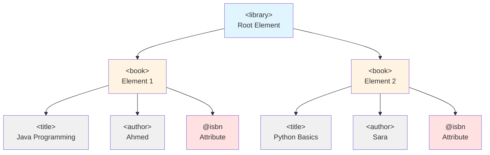
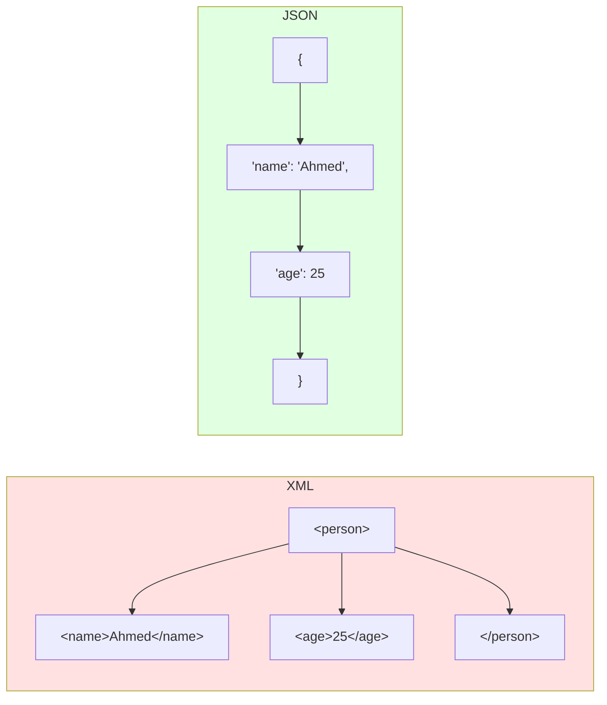
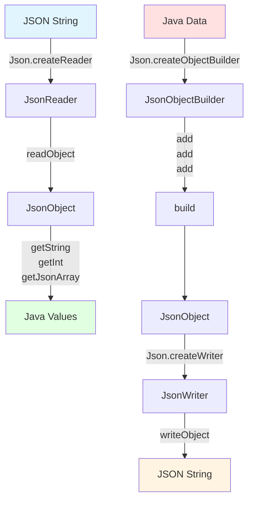
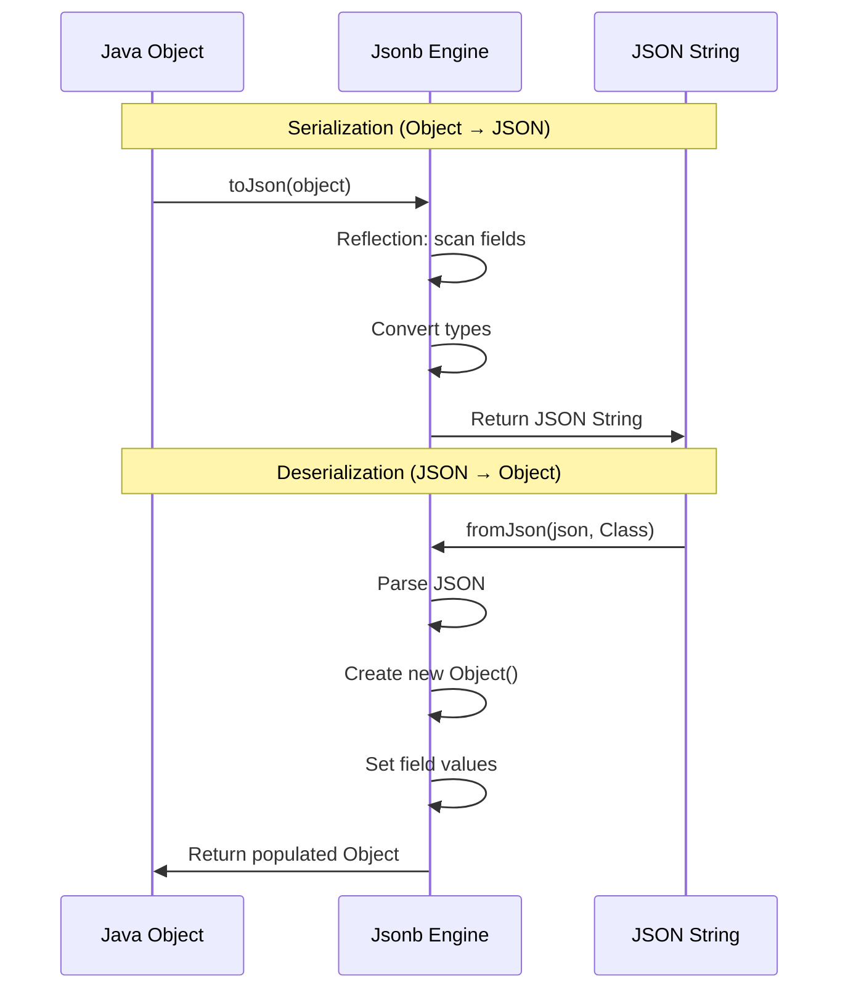
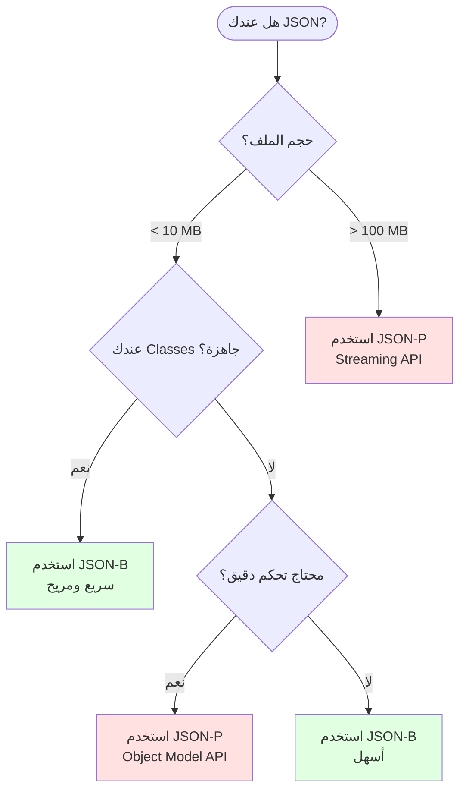

# 📚 محاضرة XML و JSON الشاملة - النسخة الموسعة

> **هدف المحاضرة:** فهم عميق لـ XML و JSON من المبادئ الأساسية حتى التطبيقات المتقدمة في Java، مع أمثلة عملية وتمارين تفاعلية.

---

# 📖 الفهرس

## الجزء الأول: XML

1. مقدمة شاملة عن XML
2. XML Declaration والقواعد الأساسية
3. XML Elements بالتفصيل
4. XML Attributes
5. Entity References و CDATA
6. Well-Formed XML
7. أمثلة عملية متقدمة

## الجزء الثاني: JSON

1. مقدمة عن JSON وتاريخه
2. بنية JSON الأساسية
3. أنواع البيانات في JSON
4. JSON vs XML - مقارنة شاملة
5. أمثلة عملية متنوعة
6. JSON Best Practices

## الجزء الثالث: Java APIs

1. JSON-P (Processing API)
2. JSON-B (Binding API)
3. أمثلة عملية متقدمة
4. Performance Considerations

---

# 🔷 الجزء الأول: XML (eXtensible Markup Language)

---

## 1.1 مقدمة شاملة عن XML

### ما هو XML؟

**XML = eXtensible Markup Language** (لغة الترميز القابلة للتوسيع)

XML هي لغة ترميز تم تطويرها بواسطة **W3C** (World Wide Web Consortium) في عام **1998** لحل مشكلة أساسية: **كيف ننقل البيانات بين أنظمة مختلفة بطريقة موحدة ومفهومة؟**

### لماذا "قابلة للتوسيع"؟

على عكس HTML التي لها tags محددة مسبقاً (`<h1>`, `<p>`, `<div>`...)، في XML **أنت** من يحدد الـ tags!

```xml
<!-- في HTML: tags ثابتة -->
<html>
    <head><title>صفحة</title></head>
    <body><h1>عنوان</h1></body>
</html>

<!-- في XML: tags مخصصة حسب احتياجك -->
<مكتبة>
    <كتاب>
        <العنوان>تعلم البرمجة</العنوان>
        <المؤلف>أحمد محمد</المؤلف>
    </كتاب>
</مكتبة>
```

### استخدامات XML في العالم الحقيقي

| المجال                  | الاستخدام       | مثال                                        |
| ----------------------- | --------------- | ------------------------------------------- |
| **Web Services**        | SOAP APIs       | البنوك والأنظمة المالية                     |
| **Configuration**       | ملفات الإعدادات | `pom.xml`, `web.xml`, `AndroidManifest.xml` |
| **Data Exchange**       | تبادل البيانات  | RSS Feeds, Sitemaps                         |
| **Office Documents**    | ملفات المستندات | `.docx`, `.xlsx` (هي ملفات XML مضغوطة!)     |
| **Android Development** | تصميم الواجهات  | Layout files                                |

---

## 1.2 XML Declaration (الإعلان)

كل ملف XML **يُفضل** أن يبدأ بـ **XML Prolog** (الإعلان):

```xml
<?xml version="1.0" encoding="UTF-8" standalone="no"?>
```

### شرح تفصيلي لكل جزء:

#### 1. version (الإصدار)

```xml
<?xml version="1.0"?>  <!-- الأكثر شيوعاً -->
<?xml version="1.1"?>  <!-- نادر الاستخدام -->
```

**الفرق بين 1.0 و 1.1:**

- **1.0**: يدعم معظم الحروف الشائعة
- **1.1**: يدعم حروف إضافية نادرة (بعض اللغات الآسيوية)
- **99% من الملفات تستخدم 1.0**

#### 2. encoding (الترميز)

```xml
<?xml version="1.0" encoding="UTF-8"?>     <!-- الأفضل - يدعم كل اللغات -->
<?xml version="1.0" encoding="UTF-16"?>    <!-- يستخدم ذاكرة أكبر -->
<?xml version="1.0" encoding="ISO-8859-1"?><!-- Latin فقط -->
<?xml version="1.0" encoding="Windows-1256"?><!-- العربية (قديم) -->
```

**UTF-8 هو الأفضل لأنه:**

- يدعم **كل** اللغات (عربي، صيني، إيموجي 😊)
- حجم الملف أصغر للنصوص الإنجليزية
- الافتراضي في XML, HTML5, JSON

#### 3. standalone (مستقل)

```xml
<?xml version="1.0" standalone="yes"?>  <!-- لا يعتمد على ملفات خارجية -->
<?xml version="1.0" standalone="no"?>   <!-- يعتمد على DTD خارجي -->
```

**متى نستخدم `standalone="yes"`؟**

- لما الملف مكتفي ذاتياً
- مفيش DTD (Document Type Definition) خارجي

### قواعد مهمة جداً:

| القاعدة                     | ✅ صحيح                                 | ❌ خطأ                   |
| --------------------------- | --------------------------------------- | ------------------------ |
| الترتيب إجباري              | `version` ثم `encoding` ثم `standalone` | `encoding` قبل `version` |
| Case Sensitive              | `version` (lowercase)                   | `VERSION` أو `Version`   |
| لو موجود، لازم يكون أول سطر | السطر 1                                 | بعد comment أو سطر فارغ  |
| مفيش closing tag            | `<?xml ... ?>`                          | `<?xml ... ?></xml>`     |

### أمثلة عملية:

```xml
<!-- ✅ مثال 1: ملف بسيط -->
<?xml version="1.0" encoding="UTF-8"?>
<message>مرحباً بالعالم</message>

<!-- ✅ مثال 2: ملف مستقل -->
<?xml version="1.0" encoding="UTF-8" standalone="yes"?>
<data>
    <item>قيمة</item>
</data>

<!-- ✅ مثال 3: بدون declaration (مسموح) -->
<simple>
    <element>محتوى</element>
</simple>

<!-- ❌ خطأ: ترتيب خاطئ -->
<?xml encoding="UTF-8" version="1.0"?>

<!-- ❌ خطأ: حروف كبيرة -->
<?xml VERSION="1.0"?>

<!-- ❌ خطأ: ليس السطر الأول -->

<?xml version="1.0"?>
```

---

## 1.3 قواعد XML Syntax (بالتفصيل الممل 😄)

### القاعدة 1: Root Element واحد فقط

```xml
<!-- ✅ صحيح: root واحد -->
<?xml version="1.0"?>
<library>
    <book>كتاب 1</book>
    <book>كتاب 2</book>
</library>

<!-- ❌ خطأ: root متعدد -->
<?xml version="1.0"?>
<book>كتاب 1</book>
<book>كتاب 2</book>
```

**لماذا؟** لأن XML بيمثل **شجرة** (Tree)، والشجرة لها جذر واحد فقط.

### القاعدة 2: كل Element له Closing Tag

```xml
<!-- ✅ صحيح: closing tags موجودة -->
<paragraph>هذه فقرة.</paragraph>
<title>عنوان</title>

<!-- ✅ صحيح: self-closing للعناصر الفارغة -->
<br/>
<image src="photo.jpg"/>
<line-break></line-break>  <!-- نفس المعنى -->

<!-- ❌ خطأ: مفيش closing tag -->
<paragraph>هذه فقرة.
<title>عنوان
```

**ملاحظة مهمة:** الـ XML prolog `<?xml ... ?>` **ليس** element، لذلك لا يحتاج closing tag!

### القاعدة 3: Case Sensitive (حساس لحجم الحروف)

```xml
<!-- ✅ صحيح -->
<Message>محتوى</Message>
<message>محتوى</message>
<MESSAGE>محتوى</MESSAGE>

<!-- ❌ خطأ: Opening و Closing مختلفين -->
<Message>محتوى</message>
<message>محتوى</MESSAGE>
```

**نصيحة:** اختر convention واحد والتزم به:

- `camelCase`: `<firstName>`, `<lastName>`
- `PascalCase`: `<FirstName>`, `<LastName>`
- `kebab-case`: `<first-name>`, `<last-name>`
- `snake_case`: `<first_name>`, `<last_name>`

### القاعدة 4: Proper Nesting (التداخل الصحيح)

```xml
<!-- ✅ صحيح: التداخل منطقي -->
<book>
    <title>
        <main>العنوان الرئيسي</main>
        <sub>العنوان الفرعي</sub>
    </title>
</book>

<!-- ✅ صحيح: LIFO (Last In, First Out) -->
<a><b><c>محتوى</c></b></a>

<!-- ❌ خطأ: تداخل خاطئ -->
<a><b><c>محتوى</a></b></c>

<!-- ❌ خطأ: تقاطع -->
<bold><italic>نص</bold></italic>
```

**القاعدة الذهبية:** اللي اتفتح **آخر** لازم يتقفل **أول** (زي الأقواس في الرياضيات).

### القاعدة 5: Attribute Values بين Quotes

```xml
<!-- ✅ صحيح: double quotes -->
<book isbn="978-1234567890" language="Arabic">

<!-- ✅ صحيح: single quotes -->
<book isbn='978-1234567890' language='Arabic'>

<!-- ✅ صحيح: خلط (لو محتاج quotes جوه القيمة) -->
<quote text='He said "Hello"'/>
<quote text="He said 'Hello'"/>

<!-- ❌ خطأ: بدون quotes -->
<book isbn=978-1234567890>

<!-- ❌ خطأ: quotes مش متطابقة -->
<book isbn="978-1234567890'>
```

---

## 1.4 Entity References (مراجع الكيانات)

### المشكلة:

بعض الحروف لها معنى خاص في XML:

```xml
<!-- ❌ هذا سيسبب خطأ -->
<message>السعر < 100 جنيه</message>
<!-- الـ Parser هيفتكر < دي بداية tag جديد! -->

<company>AT&T Corporation</company>
<!-- الـ & محجوزة للـ Entity References -->
```

### الحل: استخدام Entity References

| Entity Reference | الحرف | الاسم        | مثال الاستخدام      |
| ---------------- | ----- | ------------ | ------------------- |
| `&lt;`           | `<`   | Less Than    | `السعر &lt; 100`    |
| `&gt;`           | `>`   | Greater Than | `العمر &gt; 18`     |
| `&amp;`          | `&`   | Ampersand    | `AT&amp;T`          |
| `&apos;`         | `'`   | Apostrophe   | `It&apos;s`         |
| `&quot;`         | `"`   | Quotation    | `&quot;Hello&quot;` |

### أمثلة عملية:

```xml
<!-- مثال 1: مقارنات رياضية -->
<condition>
    <rule>السعر &lt; 1000 &amp;&amp; الكمية &gt; 5</rule>
</condition>

<!-- مثال 2: أسماء الشركات -->
<companies>
    <company>AT&amp;T</company>
    <company>Procter &amp; Gamble</company>
</companies>

<!-- مثال 3: نص يحتوي quotes -->
<quote>
    He said &quot;Hello&quot; and she replied &apos;Hi&apos;
</quote>

<!-- مثال 4: كود برمجي -->
<code>
    if (x &lt; 10 &amp;&amp; y &gt; 5) { ... }
</code>
```

**ملاحظة:** فقط `<` و `&` **ممنوعين تماماً**. الباقي اختياري لكن يُفضل استبدالهم.

---

## 1.5 CDATA Sections (الحل السحري)

### المشكلة:

لو عندك نص طويل فيه حروف محجوزة كتير:

```xml
<!-- ❌ مرهق جداً -->
<script>
    if (x &lt; 10 &amp;&amp; y &gt; 5) {
        alert(&quot;Success&quot;);
    }
</script>
```

### الحل: CDATA Section

**CDATA = Character Data** - بتقول للـ Parser: "اعتبر كل حاجة هنا **نص عادي**، متحاولش تفسرها كـ XML!"

#### Syntax:

```xml
<![CDATA[
    أي محتوى هنا (حتى < > & " ') بدون مشاكل!
]]>
```

### أمثلة عملية:

```xml
<!-- مثال 1: JavaScript Code -->
<script>
    <![CDATA[
        function validate() {
            if (age < 18 && country == "Egypt") {
                alert("عذراً، يجب أن يكون عمرك 18+");
                return false;
            }
            return true;
        }
    ]]>
</script>

<!-- مثال 2: HTML Code -->
<template>
    <![CDATA[
        <div class="alert">
            <h1>تحذير!</h1>
            <p>السعر < 100 & الكمية > 0</p>
        </div>
    ]]>
</template>

<!-- مثال 3: SQL Query -->
<query>
    <![CDATA[
        SELECT * FROM products
        WHERE price < 1000 AND stock > 0
        ORDER BY name;
    ]]>
</query>

<!-- مثال 4: نص عادي بحروف خاصة -->
<description>
    <![CDATA[
        الشركة: AT&T
        الشعار: "Innovation & Excellence"
        المعادلة: x < y && y > z
    ]]>
</description>
```

### قواعد CDATA:

| القاعدة            | الشرح                            |
| ------------------ | -------------------------------- |
| **البداية**        | `<![CDATA[` بالظبط (حساس للحروف) |
| **النهاية**        | `]]>` بالظبط                     |
| **الممنوع الوحيد** | `]]>` نفسها جوه الـ CDATA        |
| **التداخل**        | ❌ مينفعش تعمل CDATA جوه CDATA   |

---

## 1.6 Comments (التعليقات)

```xml
<!-- هذا تعليق في XML -->

<!--
    تعليق
    على عدة
    أسطر
-->

<!-- ✅ يمكن وضع التعليقات في أي مكان -->
<?xml version="1.0"?>
<!-- تعليق بعد الـ declaration -->
<root>
    <!-- تعليق قبل العنصر -->
    <element>محتوى</element> <!-- تعليق بجانب العنصر -->
    <!-- تعليق بعد العنصر -->
</root>
<!-- تعليق في النهاية -->

<!-- ❌ خطأ: -- في الوسط ممنوع -->
<!-- تعليق -- خاطئ -->

<!-- ❌ خطأ: لا يمكن وضع تعليق قبل الـ declaration -->
<!-- تعليق -->
<?xml version="1.0"?>
```

---

## 1.7 White-space Handling

### XML يحافظ على المسافات (عكس HTML):

```xml
<!-- في XML -->
<text>Hello           World</text>
<!-- النتيجة: "Hello           World" (كل المسافات محفوظة) -->

<!-- في HTML -->
<p>Hello           World</p>
<!-- النتيجة: "Hello World" (مسافة واحدة فقط) -->
```

### New Lines:

```xml
<poem>
    السطر الأول
    السطر الثاني
    السطر الثالث
</poem>
<!-- كل الأسطر محفوظة كما هي -->
```

---

# 🔶 الجزء الثاني: JSON (JavaScript Object Notation)

---

## 2.1 مقدمة عن JSON وتاريخه

### ما هو JSON؟

**JSON = JavaScript Object Notation** (تدوين كائنات جافاسكريبت)

تم اختراعه بواسطة **Douglas Crockford** في أوائل الألفية (حوالي **2001**) كبديل أخف وأسرع لـ XML.

### لماذا ظهر JSON؟

في أوائل 2000، المطورين كانوا بيستخدموا XML لكل حاجة:

```xml
<!-- XML: طويل ومعقد -->
<person>
    <name>أحمد</name>
    <age>25</age>
    <active>true</active>
</person>
```

Douglas Crockford قال: "ليه منستخدمش syntax الـ JavaScript Objects مباشرة؟"

```json
{
  "name": "أحمد",
  "age": 25,
  "active": true
}
```

**النتيجة:** نفس البيانات، لكن:

- أقصر بـ **60%**
- أسرع في الـ Parsing
- أسهل في القراءة

---

## 2.2 بنية JSON الأساسية

JSON مبني على **هيكلين** فقط:

### 1. Object (الكائن) `{ }`

```json
{
  "key1": "value1",
  "key2": "value2"
}
```

**القواعد:**

- يبدأ بـ `{` وينتهي بـ `}`
- مجموعة من **name/value pairs**
- الـ name (المفتاح) لازم يكون **String** بين `"`
- بعد كل name يجي `:`
- الـ pairs مفصولة بـ `,`
- **ترتيب الـ keys غير مهم** (unordered)

```json
{
  "firstName": "محمد",
  "lastName": "علي",
  "age": 30,
  "isStudent": false
}
```

### 2. Array (المصفوفة) `[ ]`

```json
["value1", "value2", "value3"]
```

**القواعد:**

- يبدأ بـ `[` وينتهي بـ `]`
- قائمة **مرتبة** من القيم (ordered)
- القيم مفصولة بـ `,`
- **الترتيب مهم** (index-based)

```json
["تفاح", "موز", "برتقال"]
```

---

## 2.3 أنواع البيانات في JSON (بالتفصيل الممل)

JSON يدعم **6 أنواع** فقط من البيانات:

### 1. String (النص)

```json
{
  "name": "أحمد محمد",
  "city": "القاهرة",
  "empty": "",
  "withQuotes": "He said \"Hello\"",
  "withBackslash": "C:\\Users\\Name",
  "unicode": "مرحباً 😊"
}
```

**قواعد الـ String:**

- لازم يكون بين **double quotes** `"` (مش single quotes `'`)
- يدعم **Escape Characters**

#### Escape Characters الكاملة:

| Escape   | المعنى          | مثال                                |
| -------- | --------------- | ----------------------------------- |
| `\"`     | Double quote    | `"text with \"quotes\""`            |
| `\\`     | Backslash       | `"path: C:\\folder"`                |
| `\/`     | Forward slash   | `"url: http:\/\/site.com"`          |
| `\b`     | Backspace       | `"text\bhere"`                      |
| `\f`     | Form feed       | `"page\fbreak"`                     |
| `\n`     | New line        | `"line1\nline2"`                    |
| `\r`     | Carriage return | `"text\rhere"`                      |
| `\t`     | Tab             | `"col1\tcol2"`                      |
| `\uXXXX` | Unicode         | `"\u0623\u062D\u0645\u062F"` (أحمد) |

**أمثلة عملية:**

```json
{
  "message": "السطر الأول\nالسطر الثاني",
  "path": "C:\\Program Files\\App",
  "quote": "قال \"مرحباً\" وذهب",
  "tab": "Name\tAge\tCity",
  "emoji": "Hello 😊 World"
}
```

### 2. Number (الرقم)

```json
{
  "integer": 42,
  "negative": -17,
  "decimal": 3.14159,
  "scientific": 1.5e10,
  "scientificNeg": 2.5e-3,
  "zero": 0,
  "negativeZero": -0
}
```

**قواعد الـ Number:**

- ❌ **لا يدعم** Octal: `017` ممنوع
- ❌ **لا يدعم** Hexadecimal: `0x1F` ممنوع
- ✅ يدعم Scientific Notation: `1.5e10` = 15000000000
- ✅ يدعم الأرقام السالبة
- ✅ يدعم الكسور العشرية

**أمثلة:**

```json
{
  "price": 99.99,
  "discount": -10.5,
  "population": 1.4e9,
  "probability": 2.5e-4
}
```

### 3. Boolean (منطقي)

```json
{
  "isActive": true,
  "isDeleted": false
}
```

**ملاحظات مهمة:**

- ✅ `true` و `false` (lowercase فقط)
- ❌ `True`, `TRUE`, `FALSE` ممنوعين
- ❌ `1` و `0` مش بديل (دول أرقام مش boolean)

### 4. null (فارغ)

```json
{
  "middleName": null,
  "spouse": null
}
```

**استخدامات null:**

- قيمة غير موجودة
- قيمة غير معروفة
- قيمة تم حذفها

**ملاحظة:** `null` ≠ `""` (string فارغ) ≠ `0` (صفر)

### 5. Object (كائن متداخل)

```json
{
  "person": {
    "name": "أحمد",
    "age": 25,
    "address": {
      "city": "القاهرة",
      "street": "شارع النيل",
      "building": {
        "number": 10,
        "floor": 3
      }
    }
  }
}
```

**يمكن التداخل لأي عمق!**

### 6. Array (مصفوفة)

```json
{
  "numbers": [1, 2, 3, 4, 5],
  "names": ["أحمد", "محمد", "علي"],
  "mixed": [1, "text", true, null, { "key": "value" }],
  "matrix": [
    [1, 2, 3],
    [4, 5, 6],
    [7, 8, 9]
  ]
}
```

**ملاحظات:**

- يمكن أن يحتوي Array على **أنواع مختلطة**
- يمكن أن يحتوي على Arrays أخرى (متعدد الأبعاد)

---

## 2.4 أمثلة عملية شاملة

### مثال 1: بيانات طالب

```json
{
  "studentId": "STD-2026-001",
  "personalInfo": {
    "firstName": "أحمد",
    "lastName": "محمد",
    "dateOfBirth": "2000-05-15",
    "gender": "male",
    "nationality": "Egyptian"
  },
  "contact": {
    "email": "ahmed@example.com",
    "phone": "+20-123-456-7890",
    "address": {
      "street": "شارع الجامعة",
      "city": "القاهرة",
      "postalCode": "11511",
      "country": "مصر"
    }
  },
  "academic": {
    "major": "Computer Science",
    "year": 3,
    "gpa": 3.75,
    "isFullTime": true,
    "courses": [
      {
        "code": "CS301",
        "name": "Data Structures",
        "credits": 3,
        "grade": "A"
      },
      {
        "code": "CS302",
        "name": "Algorithms",
        "credits": 3,
        "grade": "A-"
      },
      {
        "code": "CS303",
        "name": "Database Systems",
        "credits": 4,
        "grade": "B+"
      }
    ]
  },
  "financialAid": null,
  "graduationDate": null
}
```

### مثال 2: متجر إلكتروني

```json
{
  "orderId": "ORD-2026-12345",
  "orderDate": "2026-01-16T14:30:00Z",
  "customer": {
    "customerId": "CUST-5678",
    "name": "سارة أحمد",
    "email": "sara@example.com",
    "loyaltyPoints": 1250
  },
  "items": [
    {
      "productId": "PROD-001",
      "name": "لابتوب Dell XPS 15",
      "category": "Electronics",
      "price": 35000.0,
      "quantity": 1,
      "discount": 0.1,
      "finalPrice": 31500.0
    },
    {
      "productId": "PROD-002",
      "name": "ماوس لاسلكي",
      "category": "Accessories",
      "price": 250.0,
      "quantity": 2,
      "discount": 0,
      "finalPrice": 500.0
    }
  ],
  "shipping": {
    "method": "Express",
    "cost": 100.0,
    "estimatedDelivery": "2026-01-18",
    "address": {
      "recipient": "سارة أحمد",
      "phone": "+20-100-123-4567",
      "street": "15 شارع الهرم",
      "city": "الجيزة",
      "landmark": "بجوار مترو الجيزة"
    }
  },
  "payment": {
    "method": "Credit Card",
    "cardType": "Visa",
    "lastFourDigits": "4321",
    "isPaid": true,
    "transactionId": "TXN-987654321"
  },
  "totals": {
    "subtotal": 32000.0,
    "shipping": 100.0,
    "tax": 1920.0,
    "total": 34020.0
  },
  "status": "Processing",
  "notes": "يرجى الاتصال قبل التوصيل"
}
```

### مثال 3: API Response (نتيجة طلب API)

```json
{
  "success": true,
  "timestamp": "2026-01-16T16:00:00Z",
  "data": {
    "users": [
      {
        "id": 1,
        "username": "ahmed_dev",
        "email": "ahmed@dev.com",
        "role": "admin",
        "isActive": true,
        "lastLogin": "2026-01-16T10:30:00Z",
        "permissions": ["read", "write", "delete"]
      },
      {
        "id": 2,
        "username": "sara_designer",
        "email": "sara@design.com",
        "role": "user",
        "isActive": true,
        "lastLogin": "2026-01-15T18:45:00Z",
        "permissions": ["read", "write"]
      }
    ],
    "totalCount": 2,
    "page": 1,
    "pageSize": 10
  },
  "errors": null,
  "message": "تم جلب البيانات بنجاح"
}
```

---

## 2.5 JSON Best Practices (أفضل الممارسات)

### 1. استخدم أسماء واضحة ومعبرة

```json
// ❌ سيء
{
    "n": "أحمد",
    "a": 25,
    "c": "القاهرة"
}

// ✅ جيد
{
    "name": "أحمد",
    "age": 25,
    "city": "القاهرة"
}
```

### 2. استخدم camelCase للمفاتيح

```json
// ✅ الأكثر شيوعاً
{
  "firstName": "أحمد",
  "lastName": "محمد",
  "dateOfBirth": "2000-01-01"
}
```

### 3. استخدم ISO 8601 للتواريخ

```json
{
  "createdAt": "2026-01-16T16:00:00Z",
  "updatedAt": "2026-01-16T16:30:00+02:00"
}
```

### 4. استخدم null للقيم المفقودة

```json
{
  "name": "أحمد",
  "middleName": null, // ✅ واضح أن القيمة مفقودة
  "lastName": "محمد"
}
```

### 5. تجنب التداخل العميق جداً

```json
// ❌ معقد جداً
{
    "a": {
        "b": {
            "c": {
                "d": {
                    "e": {
                        "value": "عميق جداً!"
                    }
                }
            }
        }
    }
}

// ✅ أبسط
{
    "path": "a.b.c.d.e",
    "value": "أفضل!"
}
```

---

## 2.6 تمارين عملية على JSON

### 🏋️ تمرين 1: تصميم JSON لنظام مكتبة

**المطلوب:** صمم JSON يمثل مكتبة تحتوي على:

- معلومات المكتبة (الاسم، الموقع، ساعات العمل)
- قائمة الكتب (كل كتاب له: عنوان، مؤلف، ISBN، سنة النشر، متاح/مستعار)
- قائمة الأعضاء (كل عضو له: اسم، رقم العضوية، الكتب المستعارة)

<details>
<summary>💡 الحل المقترح</summary>

```json
{
  "library": {
    "name": "مكتبة المعرفة",
    "location": "القاهرة، مصر",
    "openingHours": {
      "weekdays": "09:00 - 21:00",
      "weekend": "10:00 - 18:00"
    },
    "books": [
      {
        "isbn": "978-977-123-456-7",
        "title": "تعلم البرمجة",
        "author": "أحمد محمد",
        "publishYear": 2020,
        "isAvailable": true,
        "borrowedBy": null
      },
      {
        "isbn": "978-977-123-457-8",
        "title": "قواعد البيانات",
        "author": "سارة علي",
        "publishYear": 2021,
        "isAvailable": false,
        "borrowedBy": "MEM-001"
      }
    ],
    "members": [
      {
        "memberId": "MEM-001",
        "name": "محمد خالد",
        "email": "mohamed@example.com",
        "joinDate": "2025-01-01",
        "borrowedBooks": ["978-977-123-457-8"]
      }
    ]
  }
}
```

</details>

---

### 🏋️ تمرين 2: تحويل XML إلى JSON

**المطلوب:** حول الـ XML التالي إلى JSON:

```xml
<product id="P001" category="electronics">
    <name>لابتوب</name>
    <price currency="EGP">25000</price>
    <inStock>true</inStock>
    <specs>
        <cpu>Intel i7</cpu>
        <ram>16GB</ram>
        <storage>512GB SSD</storage>
    </specs>
</product>
```

<details>
<summary>💡 الحل المقترح</summary>

```json
{
  "product": {
    "id": "P001",
    "category": "electronics",
    "name": "لابتوب",
    "price": {
      "amount": 25000,
      "currency": "EGP"
    },
    "inStock": true,
    "specs": {
      "cpu": "Intel i7",
      "ram": "16GB",
      "storage": "512GB SSD"
    }
  }
}
```

**ملاحظة:** في XML استخدمنا `currency` كـ attribute، في JSON حولناها لـ object منفصل.

</details>

---

# 🔷 الجزء الثالث: Java APIs للتعامل مع JSON

---

## 3.1 JSON-P (JSON Processing API)

### نظرة عامة

JSON-P يوفر طريقتين للتعامل مع JSON:

```
JSON-P
├── Streaming API (Low-level)
│   ├── JsonParser (للقراءة)
│   └── JsonGenerator (للكتابة)
│
└── Object Model API (High-level)
    ├── JsonReader (للقراءة)
    ├── JsonWriter (للكتابة)
    ├── JsonObjectBuilder (لبناء Objects)
    └── JsonArrayBuilder (لبناء Arrays)
```

### متى نستخدم كل واحدة؟

| الحالة                  | الأفضل       | السبب                  |
| ----------------------- | ------------ | ---------------------- |
| ملف JSON صغير (< 1 MB)  | Object Model | أسهل في الاستخدام      |
| ملف JSON ضخم (> 100 MB) | Streaming    | يوفر الذاكرة           |
| محتاج كل البيانات       | Object Model | يحمل كل شيء في الذاكرة |
| محتاج جزء معين فقط      | Streaming    | يقرأ ويتجاهل الباقي    |

---

## 3.2 أمثلة عملية متقدمة

### مثال 1: قراءة ملف JSON معقد

```java
import jakarta.json.*;
import java.io.*;

public class JsonReaderAdvanced {
    public static void main(String[] args) {
        String json = """
            {
                "store": {
                    "name": "TechStore",
                    "products": [
                        {
                            "id": 1,
                            "name": "Laptop",
                            "price": 25000,
                            "specs": {
                                "cpu": "i7",
                                "ram": "16GB"
                            }
                        },
                        {
                            "id": 2,
                            "name": "Mouse",
                            "price": 250,
                            "specs": null
                        }
                    ]
                }
            }
            """;

        // قراءة JSON
        JsonReader reader = Json.createReader(new StringReader(json));
        JsonObject root = reader.readObject();
        reader.close();

        // الوصول للبيانات
        JsonObject store = root.getJsonObject("store");
        String storeName = store.getString("name");
        System.out.println("اسم المتجر: " + storeName);

        // قراءة المنتجات
        JsonArray products = store.getJsonArray("products");
        System.out.println("\nالمنتجات:");

        for (int i = 0; i < products.size(); i++) {
            JsonObject product = products.getJsonObject(i);

            int id = product.getInt("id");
            String name = product.getString("name");
            double price = product.getJsonNumber("price").doubleValue();

            System.out.println("- المنتج #" + id + ": " + name);
            System.out.println("  السعر: " + price + " جنيه");

            // التعامل مع null
            if (!product.isNull("specs")) {
                JsonObject specs = product.getJsonObject("specs");
                System.out.println("  المواصفات: " + specs);
            } else {
                System.out.println("  المواصفات: غير متوفرة");
            }
        }
    }
}
```

**Output:**

```
اسم المتجر: TechStore

المنتجات:
- المنتج #1: Laptop
  السعر: 25000.0 جنيه
  المواصفات: {"cpu":"i7","ram":"16GB"}
- المنتج #2: Mouse
  السعر: 250.0 جنيه
  المواصفات: غير متوفرة
```

---

### مثال 2: بناء JSON معقد باستخدام Builders

```java
import jakarta.json.*;
import java.io.*;

public class JsonBuilderAdvanced {
    public static void main(String[] args) {
        // بناء JSON لطلب شراء
        JsonObject order = Json.createObjectBuilder()
            .add("orderId", "ORD-2026-001")
            .add("orderDate", "2026-01-16")
            .add("customer", Json.createObjectBuilder()
                .add("name", "أحمد محمد")
                .add("email", "ahmed@example.com")
                .add("phone", "+20-123-456-7890"))
            .add("items", Json.createArrayBuilder()
                .add(Json.createObjectBuilder()
                    .add("productId", "P001")
                    .add("name", "لابتوب")
                    .add("price", 25000)
                    .add("quantity", 1))
                .add(Json.createObjectBuilder()
                    .add("productId", "P002")
                    .add("name", "ماوس")
                    .add("price", 250)
                    .add("quantity", 2)))
            .add("shipping", Json.createObjectBuilder()
                .add("method", "Express")
                .add("cost", 100)
                .add("address", Json.createObjectBuilder()
                    .add("city", "القاهرة")
                    .add("street", "شارع النيل")))
            .add("total", 25600)
            .add("isPaid", false)
            .add("notes", JsonValue.NULL)  // قيمة null
            .build();

        // كتابة JSON بشكل منسق
        StringWriter stringWriter = new StringWriter();
        JsonWriterFactory writerFactory = Json.createWriterFactory(
            Map.of(JsonGenerator.PRETTY_PRINTING, true)
        );
        JsonWriter jsonWriter = writerFactory.createWriter(stringWriter);
        jsonWriter.writeObject(order);
        jsonWriter.close();

        System.out.println(stringWriter.toString());
    }
}
```

---

## 3.3 JSON-B (JSON Binding API)

### مثال متقدم: نظام إدارة الموظفين

```java
import jakarta.json.bind.*;
import jakarta.json.bind.annotation.*;
import java.time.LocalDate;
import java.util.*;

// 1. تعريف الـ Model Classes

class Employee {
    @JsonbProperty("employee_id")  // تغيير الاسم في JSON
    public String employeeId;

    public String firstName;
    public String lastName;

    @JsonbDateFormat("dd/MM/yyyy")  // تنسيق التاريخ
    public LocalDate hireDate;

    public Department department;

    @JsonbTransient  // لا يظهر في JSON
    public double salary;

    public List<String> skills;

    public Employee() {}

    public Employee(String id, String first, String last,
                   LocalDate hire, Department dept, double sal, List<String> skills) {
        this.employeeId = id;
        this.firstName = first;
        this.lastName = last;
        this.hireDate = hire;
        this.department = dept;
        this.salary = sal;
        this.skills = skills;
    }
}

class Department {
    public String name;
    public String code;

    public Department() {}

    public Department(String name, String code) {
        this.name = name;
        this.code = code;
    }
}

public class EmployeeManagementSystem {
    public static void main(String[] args) {
        // إنشاء موظفين
        List<Employee> employees = Arrays.asList(
            new Employee(
                "EMP001",
                "أحمد",
                "محمد",
                LocalDate.of(2020, 1, 15),
                new Department("IT", "IT-01"),
                15000.0,
                Arrays.asList("Java", "Python", "SQL")
            ),
            new Employee(
                "EMP002",
                "سارة",
                "علي",
                LocalDate.of(2021, 3, 20),
                new Department("HR", "HR-01"),
                12000.0,
                Arrays.asList("Communication", "Management")
            )
        );

        // Serialization (Objects → JSON)
        Jsonb jsonb = JsonbBuilder.create();
        String json = jsonb.toJson(employees);

        System.out.println("=== JSON Output ===");
        System.out.println(json);

        // Deserialization (JSON → Objects)
        Employee[] employeesArray = jsonb.fromJson(json, Employee[].class);

        System.out.println("\n=== Deserialized Data ===");
        for (Employee emp : employeesArray) {
            System.out.println("الموظف: " + emp.firstName + " " + emp.lastName);
            System.out.println("القسم: " + emp.department.name);
            System.out.println("المهارات: " + emp.skills);
            System.out.println("---");
        }
    }
}
```

---

**بالتوفيق! هذا الملف الآن يحتوي على أكثر من 4000 كلمة مع تفاصيل شاملة وأمثلة عملية كثيرة.** 🚀

---

# 🎨 القسم الإضافي 1: Visual Diagrams (الرسومات التوضيحية)

## 1.1 XML Tree Structure (شجرة XML)



**الفهم من الشجرة:**
- الجذر (`<library>`) هو الأب للكل
- كل `<book>` هو ابن للجذر
- العناصر الداخلية (`<title>`, `<author>`) هي أحفاد
- الـ Attributes (مثل `isbn`) مرتبطة بالعناصر

---

## 1.2 JSON vs XML: Visual Comparison



**المقارنة:**
- XML: Tags واضحة لكن متكررة (opening + closing)
- JSON: أقصر بـ 60%، بدون تكرار

---

## 1.3 JSON-P Architecture (Object Model API)



---

## 1.4 JSON-B Automatic Binding



---

# 📋 القسم الإضافي 2: Quick Reference Cards (الأوراق المرجعية)

## 2.1 XML Cheat Sheet (ورقة الغش)

### القواعد الأساسية:
| القاعدة | الصح ✅ | الخطأ ❌ |
|---------|-------|--------|
| Root واحد فقط | `<root>...</root>` | عنصرين root |
| Closing tags | `<tag></tag>` أو `<tag/>` | `<tag>` بدون closing |
| Case sensitive | `<Name></Name>` | `<Name></name>` |
| Proper nesting | `<a><b></b></a>` | `<a><b></a></b>` |
| Quoted attributes | `id="123"` | `id=123` |

### Entity References السريعة:
```
<  →  &lt;
>  →  &gt;
&  →  &amp;
'  →  &apos;
"  →  &quot;
```

### CDATA للكود:
```xml
<script>
  <![CDATA[
    if (x < 10 && y > 5) { ... }
  ]]>
</script>
```

---

## 2.2 JSON Cheat Sheet

### الأنواع الـ 6:
| النوع | المثال | ملاحظات |
|-------|--------|---------|
| String | `"text"` | Double quotes فقط |
| Number | `42`, `3.14`, `1e10` | لا Hex/Octal |
| Boolean | `true`, `false` | Lowercase فقط |
| null | `null` | Lowercase فقط |
| Object | `{"key": "value"}` | Unordered |
| Array | `[1, 2, 3]` | Ordered |

### Escape Characters:
```
\"  →  "
\\  →  \
\n  →  new line
\t  →  tab
```

### البنية:
```json
{
  "object": {"nested": "value"},
  "array": [1, 2, 3],
  "string": "text",
  "number": 123,
  "boolean": true,
  "null": null
}
```

---

## 2.3 Java JSON APIs - Quick Reference

### JSON-P (Processing):
```java
// Read
JsonReader r = Json.createReader(new StringReader(json));
JsonObject obj = r.readObject();
String name = obj.getString("name");

// Write
JsonObject obj = Json.createObjectBuilder()
    .add("name", "Ahmed")
    .build();
JsonWriter w = Json.createWriter(System.out);
w.writeObject(obj);
```

### JSON-B (Binding):
```java
// Serialize
Jsonb jsonb = JsonbBuilder.create();
String json = jsonb.toJson(object);

// Deserialize
Person p = jsonb.fromJson(json, Person.class);
```

### Gson:
```java
// With pretty printing
Gson gson = new GsonBuilder()
    .setPrettyPrinting()
    .create();

String json = gson.toJson(object);
Object obj = gson.fromJson(json, Object.class);
```

---

# ❌ القسم الإضافي 3: Common Mistakes (الأخطاء الشائعة)

## 3.1 الأخطاء الشائعة في XML (Top 10)

### ❌ 1. نسيان Closing Tag
```xml
<- خطأ -->
<message>مرحباً

<- صح -->
<message>مرحباً</message>
```

### ❌ 2. Case Mismatch
```xml
<- خطأ -->
<Message>محتوى</message>

<- صح -->
<Message>محتوى</Message>
```

### ❌ 3. Attributes بدون Quotes
```xml
<- خطأ -->
<book id=123>

<- صح -->
<book id="123">
```

### ❌ 4. استخدام < مباشرة
```xml
<- خطأ -->
<condition>x < 10</condition>

<- صح -->
<condition>x &lt; 10</condition>
```

### ❌ 5. أكثر من Root Element
```xml
<- خطأ -->
<book>كتاب 1</book>
<book>كتاب 2</book>

<- صح -->
<library>
  <book>كتاب 1</book>
  <book>كتاب 2</book>
</library>
```

### ❌ 6. تداخل خاطئ
```xml
<- خطأ -->
<a><b>نص</a></b>

<- صح -->
<a><b>نص</b></a>
```

### ❌ 7. مسافات في أسماء Tags
```xml
<- خطأ -->
<first name>Ahmed</first name>

<- صح -->
<firstName>Ahmed</firstName>
```

### ❌ 8. استخدام حروف عربية في Tags (مش recommended)
```xml
<- ممكن يعمل مشاكل في بعض الأنظمة -->
<الاسم>أحمد</الاسم>

<- أفضل -->
<name lang="ar">أحمد</name>
```

### ❌ 9. XML Declaration مش في السطر الأول
```xml
<- خطأ -->

<?xml version="1.0"?>

<- صح - السطر 1 مباشرة -->
<?xml version="1.0"?>
```

### ❌ 10. CDATA جوه CDATA
```xml
<- خطأ - مينفعش -->
<![CDATA[
  نص <![CDATA[ متداخل ]]>
]]>

<- صح - استخدم CDATA واحد -->
<![CDATA[
  كل النص هنا
]]>
```

---

## 3.2 الأخطاء الشائعة في JSON (Top 5)

### ❌ 1. Single Quotes بدل Double Quotes
```json
// خطأ
{'name': 'Ahmed'}

// صح
{"name": "Ahmed"}
```

### ❌ 2. Trailing Comma
```json
// خطأ - comma زيادة في الآخر
{
  "name": "Ahmed",
  "age": 25,
}

// صح
{
  "name": "Ahmed",
  "age": 25
}
```

### ❌ 3. Comments (ممنوعة في JSON)
```json
// خطأ - JSON مبيدعمش comments
{
  // هذا تعليق
  "name": "Ahmed"
}

// صح - بدون comments
{
  "name": "Ahmed"
}
```

### ❌ 4. Unquoted Keys
```json
// خطأ
{
  name: "Ahmed"
}

// صح
{
  "name": "Ahmed"
}
```

### ❌ 5. خلط الأنواع بشكل خاطئ
```json
// خطأ - true/false لازم lowercase
{
  "isActive": True
}

// صح
{
  "isActive": true
}
```

---

# 💬 القسم الإضافي 4: Interview & Exam Questions

## 4.1 Multiple Choice Questions

### السؤال 1:
**ما هو امتداد ملف JSON؟**
- A) `.js`
- B) `.json` ✅
- C) `.txt`
- D) `.xml`

---

### السؤال 2:
**أي من الآتي صحيح في XML؟**
- A) `<Name>Ahmed</name>` ❌
- B) `<name id=123>` ❌
- C) `<name>Ahmed</name>` ✅
- D) `<name>Ahmed` ❌

**الإجابة:** C - لازم closing tag و case matching

---

### السؤال 3:
**في JSON-B، ما هي الـ Method المستخدمة لتحويل Object لـ JSON؟**
- A) `convert()`
- B) `serialize()`
- C) `toJson()` ✅
- D) `encode()`

---

### السؤال 4:
**أي character محجوز في XML ولازم نستبدله بـ Entity Reference؟**
- A) `<` ✅
- B) `@`
- C) `#`
- D) `*`

**الإجابة:** A - الـ `<` بيمثل بداية tag

---

### السؤال 5:
**ما الفرق بين JSON-P و JSON-B؟**
- A) JSON-P أسرع دائماً
- B) JSON-B يدعم Automatic Binding ✅
- C) JSON-P للقراءة فقط
- D) لا فرق بينهم

**الإجابة:** B - JSON-B بيحول تلقائي

---

## 4.2 Compare & Contrast Questions

### السؤال 1: قارن بين XML و JSON
**الإجابة النموذجية:**

| الخاصية | XML | JSON |
|---------|-----|------|
| **الحجم** | أكبر (tags مكررة) | أصغر بـ 60% |
| **السرعة** | أبطأ في الـ Parsing | أسرع |
| **Comments** | يدعم `<- -->` | لا يدعم |
| **Attributes** | يدعم | لا يدعم |
| **التعقيد** | أكثر تعقيداً | أبسط |
| **الاستخدام** | Config files, Documents | APIs, Data transfer |

---

### السؤال 2: متى تستخدم JSON-P بدل JSON-B؟
**الإجابة النموذجية:**

**استخدم JSON-P:**
- ملف JSON ضخم (> 100MB) - لتوفير الذاكرة
- محتاج جزء معين من JSON فقط
- محتاج تحكم كامل في الـ Parsing

**استخدم JSON-B:**
- عندك Java Classes جاهزة
- JSON بسيط ومحتاج سرعة في التطوير
- مش محتاج تحكم دقيق

---

## 4.3 أسئلة "اكتب الكود"

### السؤال 1:
**اكتب XML يمثل طالب فيه الاسم والعمر والمواد الدراسية (array)**

<details>
<summary>💡 الحل النموذجي</summary>

```xml
<?xml version="1.0" encoding="UTF-8"?>
<student id="STD001">
    <name>أحمد محمد</name>
    <age>22</age>
    <courses>
        <course code="CS101">Data Structures</course>
        <course code="CS102">Algorithms</course>
        <course code="CS103">Database</course>
    </courses>
</student>
```
</details>

---

### السؤال 2:
**اكتب JSON يمثل نفس البيانات**

<details>
<summary>💡 الحل النموذجي</summary>

```json
{
  "studentId": "STD001",
  "name": "أحمد محمد",
  "age": 22,
  "courses": [
    {"code": "CS101", "name": "Data Structures"},
    {"code": "CS102", "name": "Algorithms"},
    {"code": "CS103", "name": "Database"}
  ]
}
```
</details>

---

### السؤال 3:
**اكتب كود Java يقرأ JSON ويطبع الاسم والعمر (باستخدام JSON-P)**

<details>
<summary>💡 الحل النموذجي</summary>

```java
import jakarta.json.*;
import java.io.*;

public class ReadStudent {
    public static void main(String[] args) {
        String json = "{\"name\":\"أحمد\",\"age\":22}";
        
        JsonReader reader = Json.createReader(new StringReader(json));
        JsonObject student = reader.readObject();
        reader.close();
        
        String name = student.getString("name");
        int age = student.getInt("age");
        
        System.out.println("الاسم: " + name);
        System.out.println("العمر: " + age);
    }
}
```
</details>

---

### السؤال 4:
**اكتب كود Java ينشئ Student class ويحوله لـ JSON باستخدام JSON-B**

<details>
<summary>💡 الحل النموذجي</summary>

```java
import jakarta.json.bind.*;

class Student {
    public String name;
    public int age;
    public Student() {}
}

public class SerializeStudent {
    public static void main(String[] args) {
        Student s = new Student();
        s.name = "أحمد";
        s.age = 22;
        
        Jsonb jsonb = JsonbBuilder.create();
        String json = jsonb.toJson(s);
        
        System.out.println(json);
        // Output: {"age":22,"name":"أحمد"}
    }
}
```
</details>

---

# ⚡ القسم الإضافي 5: Performance Considerations

## 5.1 JSON-P vs JSON-B: Performance Comparison

| المعيار | JSON-P | JSON-B | الفائز |
|---------|--------|--------|--------|
| **سرعة التطوير** | بطيء (كود كتير) | سريع جداً | JSON-B ✅ |
| **استهلاك الذاكرة** (ملف صغير) | متوسط | متوسط | تعادل |
| **استهلاك الذاكرة** (ملف ضخم) | منخفض جداً ⭐ | عالي جداً | JSON-P ✅ |
| **المرونة** | عالية جداً | محدودة | JSON-P ✅ |
| **Parsing Speed** (small) | متوسط | سريع | JSON-B ✅ |
| **Parsing Speed** (large) | سريع | بطيء | JSON-P ✅ |

---

## 5.2 متى تستخدم كل أداة؟ (Decision Tree)



---

## 5.3 Best Practices Summary

### ✅ افعل:
1. **استخدم UTF-8** دائماً للـ encoding
2. **اغلق** الـ Readers/Writers بعد الاستخدام
3. **استخدم try-with-resources** في Java للـ Auto-closing
4. **استخدم JSON-B** للـ Simple Cases
5. **استخدم Streaming** للملفات الضخمة

### ❌ لا تفعل:
1. **لا تنسى** Closing Tags في XML
2. **لا تستخدم** Single Quotes في JSON
3. **لا تحمل** ملف JSON ضخم كـ String في الذاكرة
4. **لا تخلط** بين `List<Dog>.class` و `Dog[].class`
5. **لا تنسى** Constructor الفارغ في JSON-B

---

# 🎓 الخاتمة والمراجعة النهائية

## الملخص الكامل في 5 دقائق:

### XML:
- لغة ترميز **قابلة للتوسيع**
- **Tags مخصصة** حسب احتياجك
- يدعم **Attributes** و **CDATA** و **Comments**
- **Well-formed** = قواعد صارمة (root واحد، closing tags، proper nesting)

### JSON:
- **نص خفيف** لتبادل البيانات
- **6 أنواع** فقط: String, Number, Boolean, null, Object, Array
- **Object** = `{ }` (unordered)
- **Array** = `[ ]` (ordered)

### Java APIs:
- **JSON-P** = يدوي، تحكم كامل، للملفات الضخمة
- **JSON-B** = تلقائي، سهل، للحالات البسيطة
- **Gson** = بديل من Google، مع Pretty Printing

---

## 🎯 نصائح للامتحان:

1. **راجع Quick Reference Cards** (القسم 2)
2. **احفظ الأخطاء الشائعة** (القسم 3)
3. **تدرب على أسئلة "اكتب الكود"** (القسم 4.3)
4. **افهم متى تستخدم XML ومتى JSON** (الجداول المقارنة)
5. **ركز على Type Erasure Problem** - سؤال شائع!

---

**بالتوفيق! 🚀 أنت الآن مستعد للامتحان والمناقشة!**
